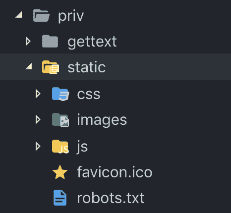
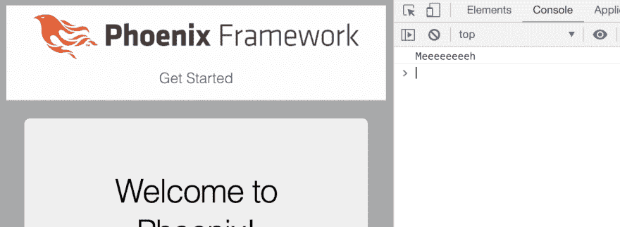

# 凤凰城:改变者德·邦德勒

> 原文:# t0]https://dev . to/jeansmaug/phoenix-change de bundler-4339

从 1.4 版开始，Phoenix 开始引入 Webpack 以捆绑不同的依赖项。我们会看到以[地块](https://parceljs.org)为例，很容易更换工具。
此工具的优点是无需配置即可运行。

## 初始化

创建一个新项目，不需要“ecto”，这样就不需要设置数据库。

```
mix phx.new app --no-ecto 
```

让我们启动凤凰城的服务器。

```
mix phx.server 
```

Phoenix 为我们运行 Webpack 并侦听文件更改，以便对我们进行热重装更改。

[](https://res.cloudinary.com/practicaldev/image/fetch/s--ulu-enA_--/c_limit%2Cf_auto%2Cfl_progressive%2Cq_auto%2Cw_880/https://thepracticaldev.s3.amazonaws.com/i/e5vss7cdew0xx0rzvtyo.png)

如果编辑文件`assets/css/app.css`更改正文的背景颜色，则无需重新加载页面即可看到更改。

```
/* This file is for your main application css. */

@import "./phoenix.css";

body {
  background: darkgray;
} 
```

[](https://res.cloudinary.com/practicaldev/image/fetch/s--Y0ibsU2u--/c_limit%2Cf_auto%2Cfl_progressive%2Cq_auto%2Cw_880/https://thepracticaldev.s3.amazonaws.com/i/m9gzbiqplq37po3bghfn.png)

因此，我们的目标是保持这种行为，这种行为提供了发展的便利，但使用了另一种工具。

Webpack 为“`priv/static`”构建我们的资产。Phoenix 需要将我们的静态文件构建到此文件夹中。[这仍然是可配置的](https://hexdocs.pm/plug/Plug.Static.html)

[](https://res.cloudinary.com/practicaldev/image/fetch/s--e3pZVJ52--/c_limit%2Cf_auto%2Cfl_progressive%2Cq_auto%2Cw_880/https://thepracticaldev.s3.amazonaws.com/i/rddnm8321om1epvab885.png)

在继续操作之前，请断开服务器电源，并删除 Webpack 生成的文件夹，以便在干净的基础上运行

```
rm -rf priv/static 
```

## 凤凰城内的地块配置

让我们安装部分插件和一个不在本文范围之内的魔法插件。

```
cd assets/ && npm install --save-dev parcel-bundler parcel-plugin-static-files-copy 
```

在文件
中应替换

```
config :app, AppWeb.Endpoint,
  http: [port: 4000],
  debug_errors: true,
  code_reloader: true,
  check_origin: false,
  watchers: [
    node: [
      "node_modules/webpack/bin/webpack.js",
      "--mode",
      "development",
      "--watch-stdin",
      cd: Path.expand("../assets", __DIR__)
    ]
  ] 
```

标准杆

```
config :app, AppWeb.Endpoint,
  http: [port: 4000],
  debug_errors: true,
  code_reloader: true,
  check_origin: false,
  watchers: [
    node: [
      "node_modules/.bin/parcel",
      "watch",
      "js/app.js",
      "-d",
      "../priv/static",
      cd: Path.expand("../assets", __DIR__)
    ]
  ] 
```

现在，当我们推出‘t0’时，我们可以看到凤凰现在推出了部分。

[](https://res.cloudinary.com/practicaldev/image/fetch/s--tf_wbqUk--/c_limit%2Cf_auto%2Cfl_progressive%2Cq_auto%2Cw_880/https://thepracticaldev.s3.amazonaws.com/i/vrnxkb0eqfiesej2yogc.png)

并且目的地文件夹是`priv/static`

[](https://res.cloudinary.com/practicaldev/image/fetch/s--ybeBVC9_--/c_limit%2Cf_auto%2Cfl_progressive%2Cq_auto%2Cw_880/https://thepracticaldev.s3.amazonaws.com/i/i9nujjx3va2vkbgdaus2.png)

但不幸的是，我们的 css 和 js 不再加载

[](https://res.cloudinary.com/practicaldev/image/fetch/s--Rhi0mOV_--/c_limit%2Cf_auto%2Cfl_progressive%2Cq_auto%2Cw_880/https://thepracticaldev.s3.amazonaws.com/i/xdg3nkxf08k5a93kg2e1.png)

Webpack 会生成一个文件夹“`css`”和一个文件夹“`js`”分别包含其软件包。“地块”将跳过中间文件夹。因此，必须更新导入到模板“`lib/app_web/templates/layout/app.html.eex`”中的文件的路径。

更换〔t0〕

```
<!DOCTYPE html>
<html lang="en">
  <head>
    <link rel="stylesheet" href="<%= Routes.static_path(@conn, "/css/app.css") %>"/>
  </head>
  <body>
    ###
    <script type="text/javascript" src="<%= Routes.static_path(@conn, "/js/app.js") %>"></script>
  </body>
</html> 
```

标准杆

```
<!DOCTYPE html>
<html lang="en">
  <head>
    <link rel="stylesheet" href="<%= Routes.static_path(@conn, "/app.css") %>"/>
  </head>
  <body>
    ###
    <script type="text/javascript" src="<%= Routes.static_path(@conn, "/app.js") %>"></script>
  </body>
</html> 
```

还有呢🎉这是行不通的😢。

这是因为 Phoenix 仅允许将符合特定模式的文件用作静态文件。这些图案可在文件“`lib/app_web/endpoint.ex`t1”中配置

```
 plug Plug.Static,
    at: "/",
    from: :app,
    gzip: false,
    only: ~w(css fonts images js favicon.ico robots.txt) 
```

这种配置意味着凤凰只允许使用位于`fonts` `images` `js`或`favicon.ico`和`robots.txt`文件夹中的文件。当然，这些档案必须存在于`priv/static`😉。

```
 plug Plug.Static,
    at: "/",
    from: :app,
    gzip: false,
    only: ~w(app.css fonts images app.js favicon.ico robots.txt) 
```

因为我们没有中间的档案`js`和`js`，所以我们会用`app.css`和`app.js`以部分产生的档案来取代它们。

现在应用程序工作正常。如果编辑文件`assets/js/app.js`以在其中添加`console.log`

```
import "phoenix_html"
import css from "../css/app.css"

console.log("Meeeeeeeeh") 
```

“meeeeeeeeh”出现在浏览器控制台中，无需重新加载页面🎉。

[](https://res.cloudinary.com/practicaldev/image/fetch/s--VBJTwU80--/c_limit%2Cf_auto%2Cfl_progressive%2Cq_auto%2Cw_880/https://thepracticaldev.s3.amazonaws.com/i/hfxw2yb5q9qzcrz0joxh.png)

## 清洁

现在我们添加了部分，只剩下清除 Webpack 的残馀物:

```
cd assets && npm uninstall babel-loader copy-webpack-plugin css-loader mini-css-extract-plugin optimize-css-assets-webpack-plugin uglifyjs-webpack-plugin webpack webpack-cli && rm webpack.config.js 
```

## 结论

无论您是否选择保留 Webpack、使用 Rollup、parcel…。如果您选择更改 bundler 的配置，请考虑:

*   正确配置其 bundler(易于使用 partial)
*   更改监视文件更改的脚本(dev.exs)
*   确保可以正确使用静态文件(endpoint.ex)
*   编辑模板中的路径(app.html.eex)

## 有用的链接

*   我灵感来自于这个 Github 存款。代码库采用旧版 Phoenix 的结构，不要像要更新一样使用它。
*   [我以前的文章](https://medium.com/@_MaximeBlanc/phoenix-changer-de-bundler-e53f00110740)
*   [端点配置文件](https://hexdocs.pm/phoenix/Phoenix.Endpoint.html#module-runtime-configuration)