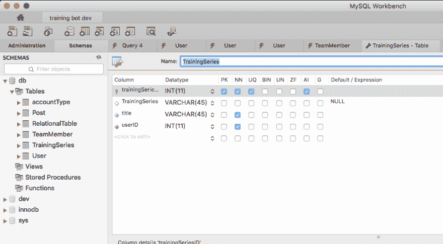
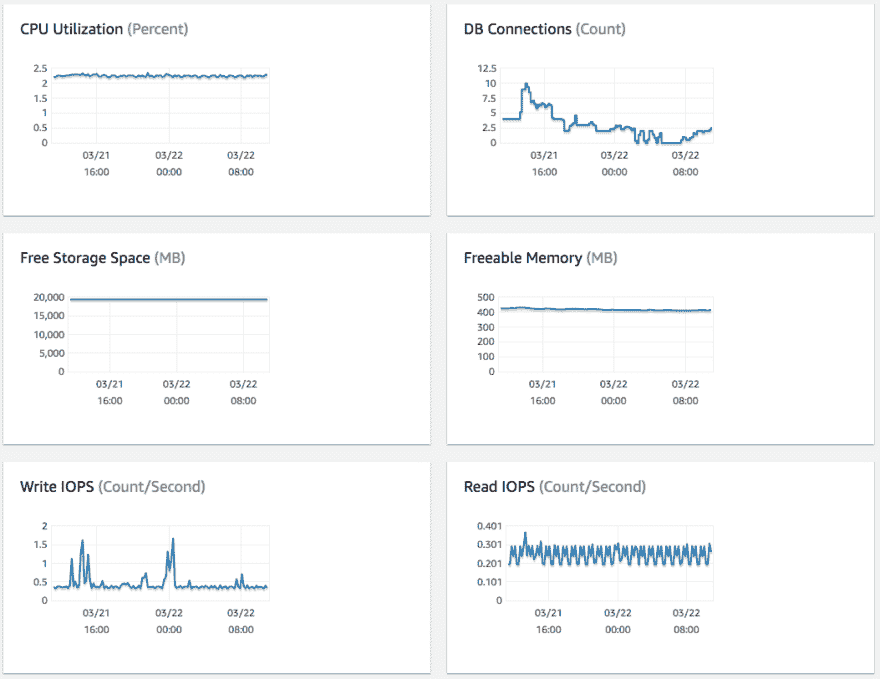

# 实验第一周:回顾

> 原文：<https://dev.to/mlanders/labs-week-1-a-review-3if>

当我们在 Lambda School 完成第一周的实验时，有很多事情需要反思。作为一个团队，我们在 product canvas 文档中规划了我们的项目，并启动和运行了前端和后端。

在第一周，我设置了一个 AWS 帐户，并创建了一个 MySQL 数据库。使用 MySQLWorkbench 构建所需的表以及所需的外键。虽然我确实花了大部分时间来解决 AWS 连接和表格问题，但我能够为前端做出贡献。一旦我们设置了 Auth0，我就增加了通过个人资料页面注销的功能。对于前端和后端，我设置了一些需要的环境变量，并在 Heroku 和 Netlify 上设置了必要的变量，以简化本地和 web 之间的部署。

* * *

我本周做得最多的工作是在 AWS 上设置数据库。从未使用过 AWS 或 MySQL，这是一次很棒的体验，我会再次使用它。下面是数据库 MySQLWorkbench 的简要视图。

我早期遇到的一些问题是，我可以访问数据库，但团队中的其他人不能通过工作台访问，我们不能通过代码库访问它。在对这个问题做了研究之后，我意识到这是一个关于什么 IP 被允许连接到数据库的权限问题。在挖掘了 AWS 的设置后，我可以打开它，让其他成员访问它和代码库。

一旦数据库打开，这就允许项目真正开始播种数据并写出组件以通过 API 端点显示数据。

* * *

我们的团队作为一个整体在研究和撰写项目规范方面做得很好。我个人帮助找到了一个竞争对手([https://www.cronote.com/](https://www.cronote.com/))，并协助撰写了史诗/特写以及与之相关的用户故事。最大的贡献是研究和调查我们最终将使用的数据库。从 Lambda 以前的项目中，我们知道如何使用 SQLite 和 Postgres。我个人希望走出舒适区，使用 AWS 这样的行业工具来构建我们的应用程序。

