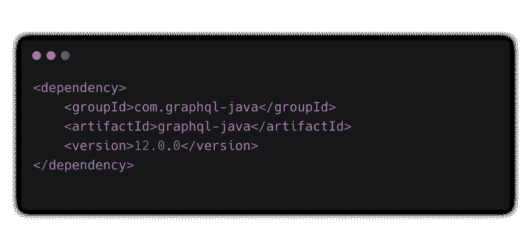
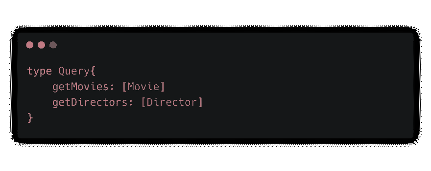
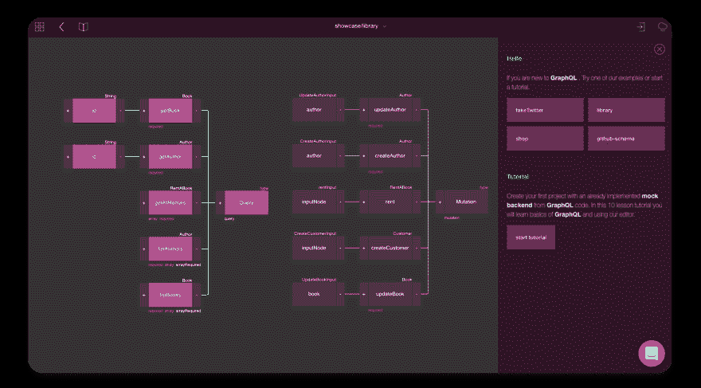
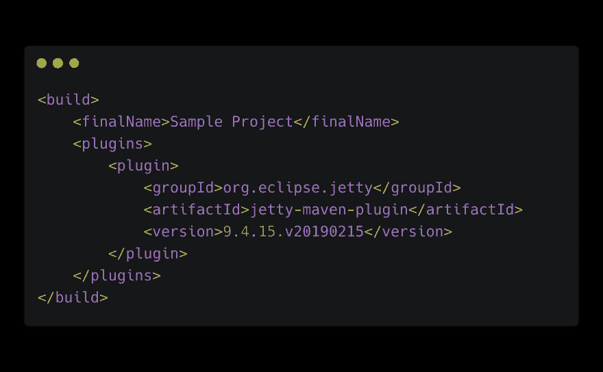

# GraphQL Java 入门

> 原文：<https://dev.to/graphqleditor/getting-started-with-graphql-java-13j1>

GraphQL 可以用任何语言实现。今天，我们来看看 GraphQL 的 Java 服务器实现。让我们使用 [Maven](https://maven.apache.org/) 并假设我们已经建立了项目结构。下一步是什么？

### 依赖关系

要在您的 Java 项目中运行 GraphQL，您只需要一个库，它是 GraphQL Java 的实现。然而，在使用 GraphQL Java 时，您可能会发现有几个库很有用:

*   [Spring Boot](https://github.com/graphql-java/graphql-java-spring)——GraphQL Java Spring 和 Spring Boot 集成，将处理任何与 HTTP 相关的任务，在应用的`/graphql`端点公开 GraphQL 服务，并接受包含 graph QL 有效负载的`POST`请求。
*   这个库允许你使用 GraphQL SDL 来构建你的 graphql-java 模式。
*   GraphQL Java Servlet 的实现，包括对 Relay.js、Apollo 等库的支持。并包装了 GraphQL Java 提供的 GraphQL 的 Java 实现。

所以添加依赖项需要项目对象模型文件(pom.xml):

### 定义模式

GraphQL 模式是任何 GraphQL 实现的核心，所以在进一步发展之前我们肯定需要一个。为了更容易理解服务器可以执行的操作，GraphQL 定义了一个通用模式语法，称为 [SDL(模式定义语言)](https://blog.graphqleditor.com/GraphQL-tutorial-dictionary/)。

SDL 定义了项目的元素，例如:

*   **`type`** (最基本的 GraphQL 模式组件):
*   **`query`** (向服务器索要数据)
*   **`mutation`** (操纵数据):定义你的模式最快的方法是使用 [GraphQL 编辑器](https://graphqleditor.com/)。它允许您以传统方式(代码)定义您的模式，或者从可视节点塑造它。 

### 服务器

有大量的 servlet 容器可供选择，既有开源的，也有商业的，所以只需选择你觉得舒服的一个。让我们以 Jetty 为例，通过一个 [Maven 插件](https://maven.apache.org/pom.html#Plugins) :
 来实现它

您就快成功了，接下来的步骤是:

*   添加一些更基本的服务器配置，如正确的 Java 版本或 servlet 规范
*   创建 **`GraphQLEndpoint`** 类来公开你的 API
*   定义解析器

如果你想阅读更多关于 GraphQL Java 实现的细节，可以看看 Bojan 关于在 https://www.howtographql.com/的[设置](https://www.howtographql.com/) [GraphQL Java](https://www.howtographql.com/graphql-java/1-getting-started/) 服务器的教程