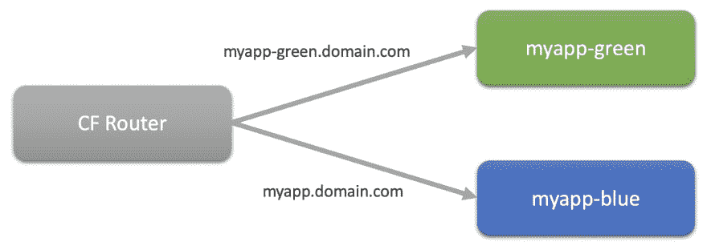

# 云铸造的蓝绿色部署

> 原文：<https://dev.to/flyingdot/blue-green-deployment-with-cloud-foundry-3mgf>

您有一个完全自动化的部署过程，它由您的提交自动触发。停机时间？没有，只有几秒钟，当你更换你的应用程序。但是，这几秒钟非常关键，让我们面对现实吧，如果部署时没有任何停机时间，那该有多好。

## 什么是蓝绿部署？

蓝绿色部署是一种无需停机即可实现部署的简单方法，尤其是在我们生活的这个复杂多变的时代。

[](https://res.cloudinary.com/practicaldev/image/fetch/s--zL_OLylJ--/c_limit%2Cf_auto%2Cfl_progressive%2Cq_auto%2Cw_880/https://thepracticaldev.s3.amazonaws.com/i/jgnkfmesucad1w05h9mz.png) 
在这个例子中，蓝色的实例现在是多产的。除了实际运行的应用程序实例之外，您还部署了新的应用程序实例(绿色),等待它启动并运行，对它执行一些自动化测试，如果一切正常，将路由切换到新实例，我们就完成了。

我强烈推荐 Martin Fowler 的这篇关于蓝绿部署的文章。

## 循序渐进

好，我们一步一步来。我们假设已经有一个应用程序实例在运行(蓝色的:-)。让我们向全世界推出我们新的花式更新:

```
cf login -a https://super.cloud -u me -p my-password
cf push myapp-green -p "myapp_publish" -u http --endpoint /healthcheck --hostname "myapp-green" 
```

Enter fullscreen mode Exit fullscreen mode

这里的重要部分是:

*   为蓝色/绿色容器实现一个有用的命名方案。不应该生成名称。它应该是一个可预测的名称，在 CI/CD 管道中使用它会容易得多。
*   通过`-u http --endpoint /healthcheck`,我们可以告诉 Cloud Foundry 如何检查我们的应用程序是否准备好了。健康检查端点是您的应用程序的一部分，因此您可以在其中定义您的逻辑(例如，检查一些初始工作是否完成)。实现健康检查有更多选项，请参见 [Cloud Foundry 文档](#)了解更多信息。因此，现在我们的应用程序是通过“myapp-green”路由(如 hostname-parameter 所定义的)推送并可到达的，但它还不具有生产力，因为您使用的是“green-route”。

现在，您可以对绿色容器执行一些验证:

*   在 UI 和 API 级别执行一些冒烟测试
*   衡量一些绩效 KPI

如果一切正常，就可以将绿色容器投入生产了。基本上，我们现在只是告诉 CF 路由器将生产路线映射到绿色容器。

```
# map the production route to the new green container
cf map-route myapp-green --hostname myapp
# unmap the green route from the green container
cf unmap-route myapp-green --hostname myapp-green
# unmap the production route from the original outdated container
cf unmap-route myapp --hostname myapp 
```

Enter fullscreen mode Exit fullscreen mode

最后但同样重要的是，我们正在做一些家务。我们重命名绿色容器，以匹配我们的生产命名约定，然后清除不再需要的所有内容。

```
cf rename myapp myapp-tmp
cf rename myapp-green myapp
cf delete myapp-tmp -r -f 
```

Enter fullscreen mode Exit fullscreen mode

就是这样。所描述的场景相对简单。当然，我们可以想到更复杂的方法，例如，我们可以并行运行(新的)绿色和旧的(蓝色)容器，并在生产中进行一些验证，如检查性能 KPI、监视日志事件等。

## 那么用户会话呢？

当然，您不能在这样的设置中使用 InProc-Sessions，因为您只会通过关闭生产容器来终止它们。您肯定应该使用分布式解决方案来存储用户会话，比如 Redis。