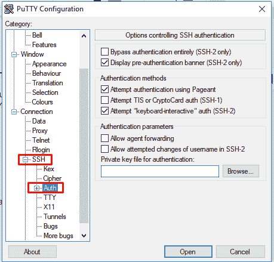
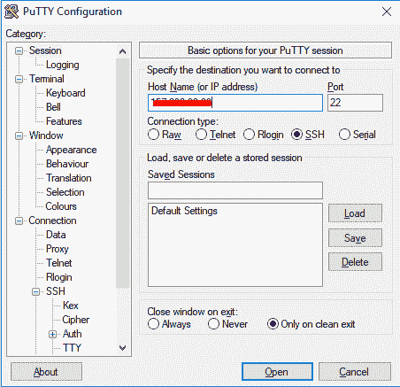
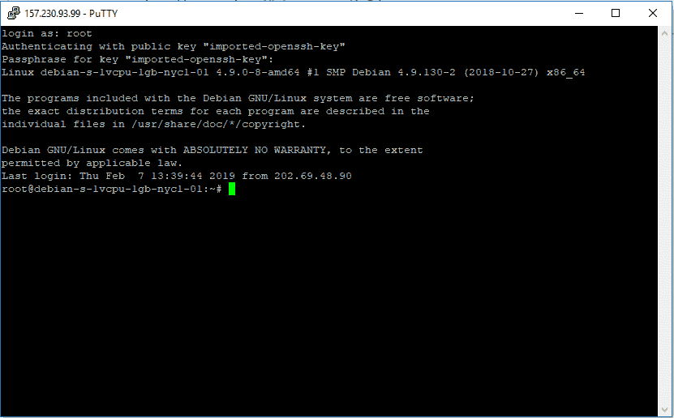
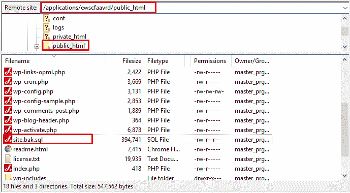
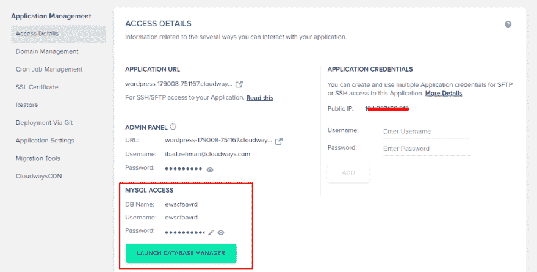
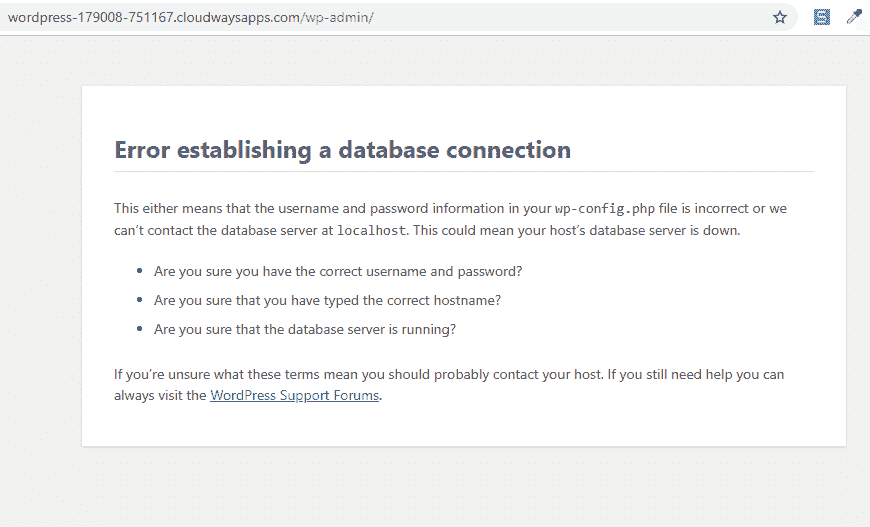
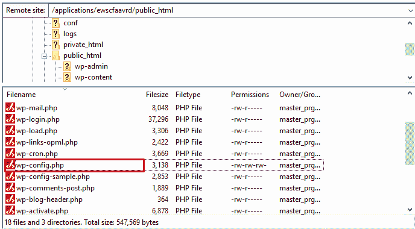
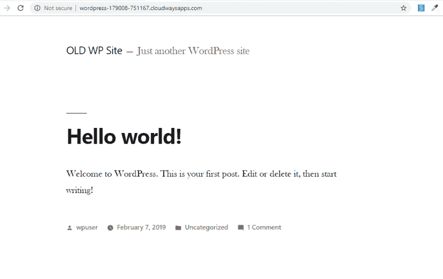

# 如何使用 WP-CLI 从任何服务器迁移 WordPress 网站

> 原文：<https://dev.to/_shahroznawaz/how-to-migrate-wordpress-website-from-any-server-using-wp-cli-1ni2>

迁移 WordPress 网站从未像现在这样简单。有了大量的插件和工具，任何人都可以将整个网站从一台服务器迁移到另一台服务器。话虽如此，有时您无法选择使用 cPanel 或文件管理器来控制迁移过程。你必须依赖命令行界面来与你的 WordPress 网站所在的服务器交互。

使用命令行对许多人来说可能不太方便，这是因为我们不习惯在日常工作中使用它。但是命令行提供的控制和性能是其他任何执行方式都无法比拟的。

我将在本文中讨论以下主题:

*   什么是 WP-CLI？
*   通过 WP-CLI 迁移 WordPress
*   备份 WordPress 文件
*   将 WordPress 文件导入新的服务器
*   进行数据库备份
*   测试和 WordPress 网站
*   搜索和替换 URL

## 什么是 WP-CLI？

WordPress 命令行或(简称 WP-CLI)是控制 WordPress 的专用命令行界面工具。这使得用户可以运行不同的命令，更新 WordPress 文件，安装主题，管理插件。这个工具也可以用于 WordPress 网站从一个服务器到另一个服务器的迁移。

让我们开始，看看使用 WP-CLI 进行 WordPress 迁移有多简单。

## 通过 WP-CLI 迁移 WordPress

WordPress 命令行是通过终端访问的，在本教程中，我将使用 SSH-client [PuTTY](https://www.putty.org/) 来访问命令行。您可以使用自己选择的任何 SSH 客户端。

要访问现有服务器，您需要具备以下条件:

1.  服务器 IP 地址
2.  用户名
3.  密码
4.  公开密钥

启动 PuTTY 桌面应用程序并导航到 SSH → Auth。

现在，浏览到存储服务器公钥的位置，并在 PuTTY 窗口中导航到 Session，输入服务器的 IP 地址。

单击“打开”按钮，使用您的凭据登录。(IMP:确保以根管理员身份登录，并提供正确的密码)。

在通过 SSH 终端成功访问服务器之后，让我们继续检查 WP-CLI 是否安装在我们的服务器上。为此，只需在下面键入 WP 命令:

`wp --info`

由于我没有安装 wp-cli，我会看到以下错误:

让我们通过安装 WP-CLI 来解决这个问题。在旧服务器的 SSH 终端中运行以下命令。cd 返回到 opt 文件夹，方法是一直返回到根位置。继续运行命令 cd../ command，直到您到达那里。

通过运行以下命令安装 wp-cli:

`curl -O https://raw.githubusercontent.com/wp-cli/builds/gh-pages/phar/wp-cli.phar`

这将安装 WP-CLI。接下来，键入 wp - info 命令来确认这一点。

现在，更改文件的权限，使其可执行。

`chmod +x wp-cli.phar
sudo mv wp-cli.phar /usr/local/bin/wp`

回到 WordPress 主文件夹，运行下面的命令，它会显示你的 WordPress 安装版本。

`wp core version --allow-root`

让我们继续使用 WP-CLI 备份我们的 WordPress 网站。

## 使用 WP-CLI 备份 WordPress 文件

使用 WP-CLI 进行备份很容易。导航到 www 文件夹或者包含你的 WordPress 网站的文件夹，通过运行下面的命令创建一个 zip 文件。

`zip -r wordpress.zip wordpress`

通过运行下面的命令，移动 WordPress 网站文件夹中的压缩文件夹。

其中 wordpress 是包含 wordpress 站点的文件夹的名称。

现在，通过运行 cd 命令导航到 wordpress 文件夹，你会找到 wordpress.zip 文件夹。

以下截图总结了整个过程。

我将压缩文件夹移到了主文件夹中，这样我就可以使用下面的命令轻松地从新服务器上下载它了:

http://[serverIP]/wordpress.zip 或 http://[wordpress 网站位置]/WordPress . zip，具体取决于您的结构。

这里，wordpress.zip 是文件夹名，因为它在我们的主文件夹中，所以它应该可以通过 URL 或者根据你的设置从这个位置访问。
将 WordPress 文件导入新服务器
如果你使用的是 Cloudways，那么启动它的集成 SSH 终端，否则，使用 PuTTY 连接你的新服务器。导航到你的新 WordPress 网站，在 public_html 文件夹中，输入下面的命令。

`wget http://[serverIP]/wordpress.zip`

这将通过 URL 从旧服务器上获取完整的压缩文件夹。传输完成后，通过运行以下命令解压缩文件夹的内容:

解压缩 wordpress.zip

并通过运行以下命令将所有内容移回父目录(public_html)。

`mv * ../`

这就对了。我已经成功地获取了压缩文件夹，并将 WordPress 网站移动到了新的主机上。

## 取数据库备份

我们的迁移过程已经进行了一半。在迁移的后半部分，我们需要备份我们的 MySQL 数据库，为此，回到您现有的服务器，在 SSH 终端中键入以下命令:

`mysqldump --add-drop-table -h localhost -u wpuser -p wordpress > site.bak.sql`

在上面的命令中，我提供了以下参数。请调整它们以匹配您的值。

-h localhost 将保持不变
-u 是你的 MySQL 数据库的用户名
wordpress 是数据库的名称。

运行此命令后提供密码。执行该命令后，您会注意到已经创建了一个新文件(名为“site.bak.sql”)。这包含了我们 WordPress 站点的完整数据库。

这将创建一个备份文件，可以使用集成的 SSH shell 轻松地导出到我们的新服务器。

让我们把。使用类似的 scp 命令将 sql 文件从旧服务器复制到托管在新服务器上的新 WordPress 网站的 public_html 文件夹。

注意:在这个例子中，我使用的是 Cloudways，这将用以前的数据库覆盖 Cloudways 上 WordPress 网站的现有数据库。

`scp /var/www/site.bak.sql master_prgaekpebs@104.237.158.292:/home/master/applications/ewscfaavrd/public_html`

现在，返回到 Cloudways SSH 终端窗口，运行下面的命令来导入数据库文件。

`mysql -u ewscfaavrd -p ewscfaavrd < site.bak.sql`

-u ewscfaavrd 这是 Cloudways 上 WordPress 网站的数据库用户名
-p ewscfaavrd 这是 Cloudways 上 WordPress 网站的数据库名

太好了！我已经成功地将 WordPress 网站文件和数据库转移到我的新服务器上。你也可以使用 SSH 命令行来迁移 WordPress 站点。让我们继续检查 WordPress 网站是否正常运行。

## 测试并运行 WordPress 网站

将 WordPress 网站转移到新的服务器后，我们测试并运行它是很重要的。为此，只要通过你的服务器 IP 访问你的 WordPress 网站的 URL，或者如果你已经将你现有的域名映射到你的新服务器，就可以从域名访问。

在浏览网站时，我遇到了错误页面，告诉我我的 WordPress 网站无法连接到它的数据库。

我们可以通过用新服务器(在我的例子中是 Cloudways)提供的新凭证替换 wp-config.php 文件中的旧数据库凭证来解决这个问题。

回到菲莱兹利亚，打开 wp-config.php。

在文件中，替换 DB_NAME、DB_USER 和 DB_PASSWORD，保存并关闭文件。

现在我回去重新加载页面，我可以看到我的 WordPress 网站运行良好。

正如你所看到的，我已经成功地使用 WP-CLI 将 WordPress 网站和它的数据库从我的旧服务器转移到了新的托管服务器上。

整个过程可能感觉有点冗长，但它更快、更安全。现在，如果您有一个小网站，使用任何流行的迁移插件进行无问题的迁移。

## 搜索并替换网址

最后，如果你要把你的 WordPress 网站迁移到一个新的域名，那么你也需要通过一个简单的过程来替换指向你旧域名的 URL。

在 SSH 终端中，运行以下命令:

`wp search-replace "http://old-url.com" "https://new-url.com"`

该命令将首先搜索所有的 URL，然后用该命令后面部分提供的新 URL 替换它们。请确保替换与您的 URL 相匹配的 URL。

## 包装完毕！

使用 WP-CLI 迁移 WordPress 可能听起来有点不寻常，但是如果你仔细阅读上面的文章，你会体验到最方便和无缝的迁移体验。更不用说，您还将学习如何使用命令行。