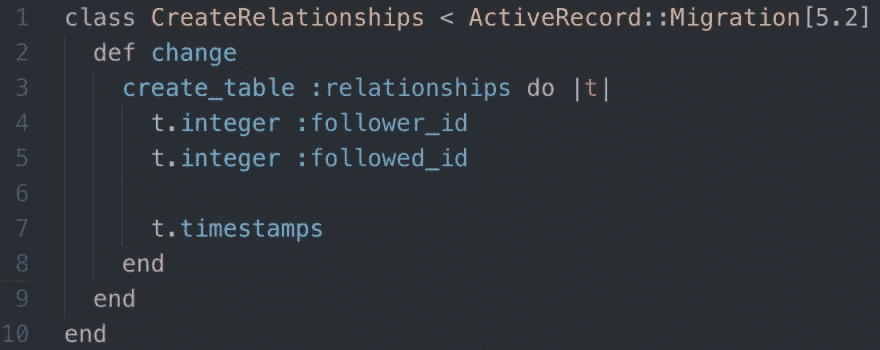
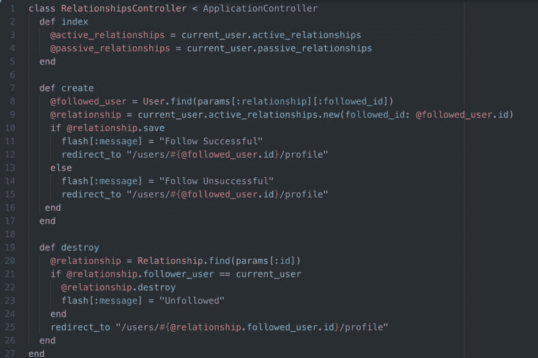

# Rails 速成班:建立追随者/跟随关系

> 原文：<https://dev.to/knheidorn/rails-crash-course-building-follower-following-relationship-4kjl>

像许多编程新手一样，我想拓展我新学到的 Rails 技能，并认为建立一个简单的旅游评论/社交媒体网站是最好的。为用户、评论和目的地建立基本的 MVC 是非常简单的。当我试图给用户提供关注和不关注他人的能力时，真正的麻烦开始了。我努力(比我愿意承认的时间更长)来构建这个特性，我认为我不是唯一的一个。我希望这个循序渐进的行会帮助其他人突破我所经历的同样的问题，并且在这个过程中，自私地帮助我巩固我所学到的东西。

### 第一步:制作一张关系表

关系表的基本设置非常简单:外键的两列标题分别为 *follower_id* 和*follower _ id*。自然，两列都包含整数。这些列的标签与您的项目相关，因为这些键实际上都是用户 id。然而，它们确实需要被标记为独特的东西，以避免冲突，因为它们将在整个项目中使用，特别是在用户模型的`has_many:`关系中。

### 步骤 2:修改用户模型

下一步集中在分别用 has_many、belongs_to 结构将用户模型与关系模型联系起来。用户将通过第一步中标记的外键( *follower_id* 和*followered _ id*)拥有许多关系。对于这个项目，我希望用户能够跟随另一个用户，而不是强迫一个共生跟随关系。此外，由于两个外键实际上是进入关系的相同类型的实体(用户-用户),我需要为这些关系提供一个惟一的标签，同时告诉用户模型这些是关系类的实例。Rails 提供了一种便捷的方式来查找数据库中记录之间的关系。在这个项目中，我将两个不同的实例标记为`:active_relationship`和`:passive_relationship`，其中`:active_relationship`与 *follower_id* 相关，而`:passive_relationship`与 *followed_id 匹配。*同样，这些标签是相对的，只要对你的项目最有意义，就可以称之为标签。如果你注意到了下面的代码，我在代码的末尾添加了`dependent: :destroy`。这确保了如果用户删除了他们的简档，关系表中的数据也会被删除。

### 第三步:建立关系模型

现在需要告诉关系模型哪个用户被关注，哪个用户被关注。为此，我们需要构建与 User 类的两个不同实例相关的两个`belongs_to:`语句。在这个项目中，我将这些*关注者 _ 用户*和*被关注者 _ 用户*命名为“关注者”,但是这些都是任意的。与 User `has_many:`语句一样，我需要确保关系模型知道哪个外键与不同的实例相关联。您可能已经猜到了， *follower_user* 与 *follower_id* 相关，而*follower _ user*与*follower _ id*相关。

### 步骤 4:再次修改用户模型

我现在需要添加通过关系模型找到这些*追随者用户*和*追随者用户*的功能。添加到用户模型中的代码与在关系模型中编写的代码几乎相同。主要区别在于用户通过*主动关系*或*被动关系*了解这些实例。

### 步骤 5:建立关系控制器

在我接触控制器部分之前，我想添加路线来绘制出我想要使用的动作。对于我的项目，关系控制器只需要`:create`、`:destroy`和`:index`。前两个非常直观，因为我希望有人使用我的网站能够关注和取消关注其他用户。`:index`是让我能够在他们的个人资料上列出用户的关系。同样，确保您添加的路线对您的整个项目有意义。

最后，我可以构建控制器。最直接的方法是*指数*。我的应用程序控制器中有一个助手方法，名为 *current_user* ，它查找使用`session[:user_id]`的用户。我不会在这里进行更详细的描述，但是网上有大量的文献概述了这种方法背后的基本结构。使用这个助手方法，我想为当前用户找到所有的 *active_relationships* 和 *passive_relationships* ，并将它们保存到变量中，这样我就可以在视图中访问它们了。

接下来，我添加了*摧毁*的方法，对我来说，这是另一个相当简单的方法。首先，我需要使用`:id`找到我想要删除的关系，并将其保存到一个变量中。为了给我的代码提供一些保护，我想确保*当前用户*匹配这个关系中的*跟随者用户*。一旦验证成功，我就从我的表中删除该实例，并给用户一条消息，说明操作成功。对于我的项目，这个操作将在 *followed_user* 配置文件上完成，我希望当前用户重新加载相同的页面，即 *redirect_to* 到相同的页面。

最后，我想构建一个允许用户跟踪某人的 *create* 方法。这一个，对我来说，是最具挑战性的逻辑明智的，但同样，是相当类似于我在我的项目中使用的其他*创建*方法。最初，我需要找到 *followed_user* ，并将其赋给一个变量。该变量将用于分配*跟踪 id* 和*重定向至*路径。接下来，我想从 *current_user* 构建 active_relationship，并再次将其分配给视图中使用的变量。同样，为了给用户反馈，如果可以保存关系，用户将会看到消息“Follow Successful”否则，用户将看到“关注不成功”

剩下唯一要做的就是将这些方法添加到我的视图中。由于我仍在改进这些单独页面的外观和感觉，我将在这里结束我的演练。同样，关于人们如何给不同的按钮或链接赋予使用这些方法的功能，网上还有其他文献。正如我所发现的，在 Rails 中有不止一种方法可以做事情。感谢您的阅读，我希望听到更多关于其他人如何建立自己的社交网站的想法或见解。干杯！