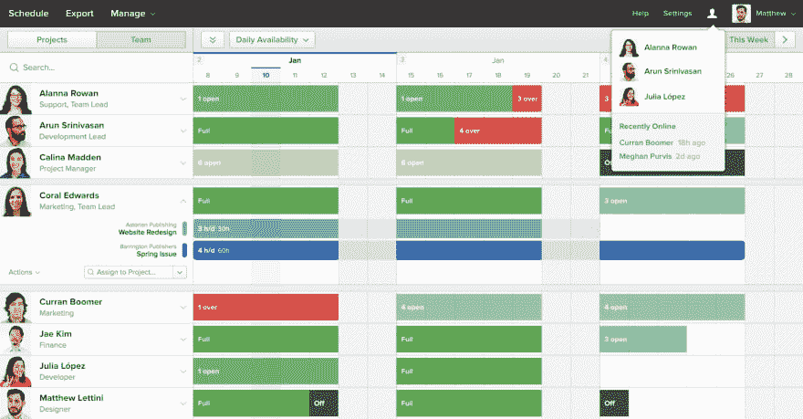
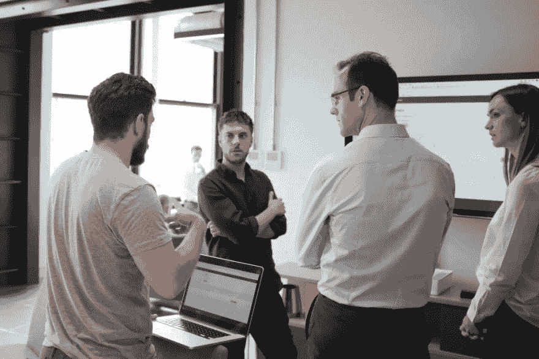

# 数字项目管理:我的七个原则

> 原文：<https://dev.to/browserlondon/digital-project-management-my-seven-principles-4j8a>

作为一名数字项目经理，我经常在任务和团队之间周旋；这是在网络开发机构工作的本质。项目的长度、复杂性各不相同，需要不同的员工，而且有大量的项目在进行中，同时管理它们有时会让你感觉像是在一边揉肚子一边拍脑袋。

面对这种情况，跟踪所有任务并管理您的资源和开发团队的最好方法是什么？(哦，别忘了，还要让你的客户和团队都开心？)

这里有一些简单的指导原则，是我在 Browser 担任数字项目经理时学到的。

## 尽可能使用最好的工具

作为项目经理，如果有一样东西我们不缺，那就是软件。从管理用户故事、跟踪时间、自动化部署到消息传递、文件共享和帮助标签，有大量的选项可供选择。花时间确保你和你的团队使用正确的系统和程序是至关重要的。

有太多的选项可能会让人望而生畏，但是，谢天谢地，还有一些很棒的文章可以帮助你挑选最好的工具。有这么多选择，不要害怕货比三家。

我们最近对我们的资源管理软件( [Float](https://www.float.com/) )进行了一次内部审查，并一致认为是时候做出改变了。浮动很好，但我经常发现自己在这和我们的时间跟踪软件 [Harvest](https://www.getharvest.com/) 之间加倍工作。经过一番研究后，我们决定改用[预测](https://www.getharvest.com/forecast)，它与 Harvest 整合得更好——它是由同一家公司制造的——因此创建新项目和查看时间表的任务被简化了。这意味着我可以更好地计划、组织和预测。

## 记录一切！

我喜欢用一个基本的电子表格来促进项目需求的管理，每个人都可以访问和贡献，或者理想情况下，直接进入我们的数字积压和看板。这有助于每个人随时了解项目的进展情况，并有望将过程中的意外降至最低。

更重要的是，有一个清晰的需求日志给你一个清晰的团队会议结构。没有人喜欢为了开会而开会，所以要让会议有价值，确保想法变成行动。

## 沟通，沟通，沟通

项目团队，[即使他们很小，](https://dev.to/browserlondon/why-small-teams-are-mighty-16oj)也应该一直交谈，这包括你的客户(交谈和倾听)。这从整个团队的项目启动开始(我们都有责任)，应该一直持续到结束。

对于需求澄清，我发现定期的视频电话很好，面对面的会议更好。我们喜欢定期站起来，和整个团队一起演示。如果我们需要发送模型或设计想法，那么像 [Basecamp](https://basecamp.com/) 这样的工具就可以很好地工作，使我们有一个每个人都可以使用的消息线程(而不是只有特定的电子邮件收件箱)。 [Slack](https://slack.com/) 也是一款聊天工具，我发现它很有用，尤其是当我的团队中有人远程工作的时候。

## 尽可能透明

这与上面关于沟通的观点一致，但是透明和开放是你的朋友。尽可能让团队了解你的计划，并尝试使用让观察变得容易的平台和服务。我总是发现，当一个平台或服务允许分享或协作，而收件人不需要帐户时，这是很有帮助的，因为这意味着我可以与客户分享元素，而不必要求他们通过一个烦人的注册过程。

如果你是开放的，当截止日期或计划不得不在最后一刻改变时，你的团队也可能会更加理解，因为他们可能会看到是什么使得改变成为必要。

## 保持灵活性，对变化持开放态度

我认为数字项目管理的一个关键要素是保持敏捷并愿意改变你的计划。我见过的同事们陷入的最危险的陷阱之一是严格坚持一个显然注定会失败的计划。要灵活。

事实上，在项目过程中，你的短期目标会随着项目概要、MVP 或总体方向的改变而改变，这是很常见的。我参与的许多项目最终都与我们在项目开始时的预期截然不同。

灵活性和变革意愿最重要的领域是截止日期。这并不是说你应该对错过最后期限感到放松，而是说对于一个给定的任务，保持诚实的最后期限是很重要的，这可以随着项目的进展而改变很多。

## 接受自己的建议

作为一名项目经理，我认为重要的是要按照你管理资源的原则来生活。如果你希望人们使用时间跟踪软件(这通常被认为是一件苦差事)，你也应该这样做。如果您要求您的团队根据他们的任务更新共享文档，请确保您的文档也得到更新。

这不仅表明你没有要求人们执行你不会执行的任务，而且也让我深入了解系统本身。它让我看到了他们的不足，以及他们可以如何比赛，也看到了他们的好处和改进的空间。

## 做好加入的准备

最后，记住你是团队的一员，团队的成功才是最重要的。这可能意味着你需要准备弄脏自己的手，参与进来，做一些严格来说不在你的工作描述中的事情，尤其是在困难或繁忙的时候。

在我与数字开发团队的合作中，我通常是最不专业的团队成员。这可能意味着我最终会清理那些没有明确归属的任务，比如测试或编写发布说明，这没什么，只要它们不干扰我的正常任务。我发现，在我力所能及的范围内乐于帮助团队是值得赞赏的，而且常常是推动项目成功的必要因素

所以，我们有它。我并不认为这七个要点是良好的数字项目管理的唯一途径；每个人都有自己的风格和技能。我要说的是，这些是迄今为止在我的职业生涯中对我帮助最大的原则。我希望你觉得它们有用。

* * *

帖子[数字项目管理:我的七条原则](https://www.browserlondon.com/blog/2019/03/28/digital-project-management-seven-principles/)首先出现在伦敦[浏览器](https://www.browserlondon.com)上。