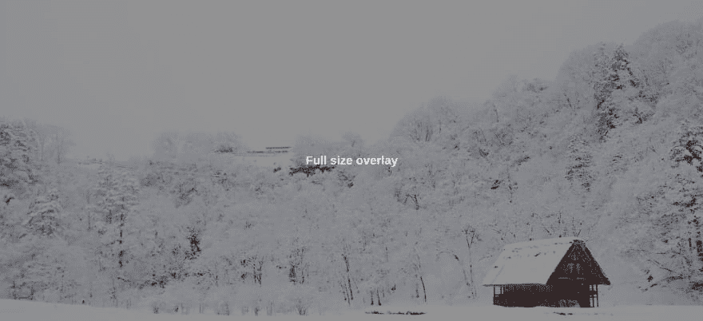
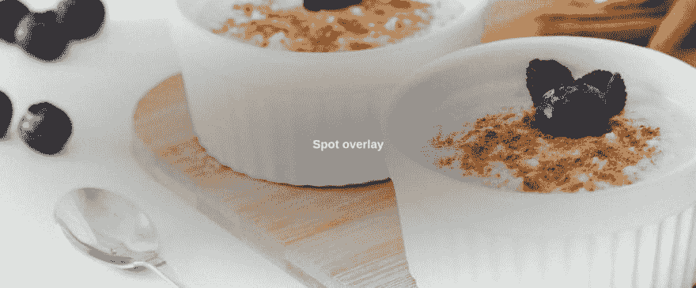
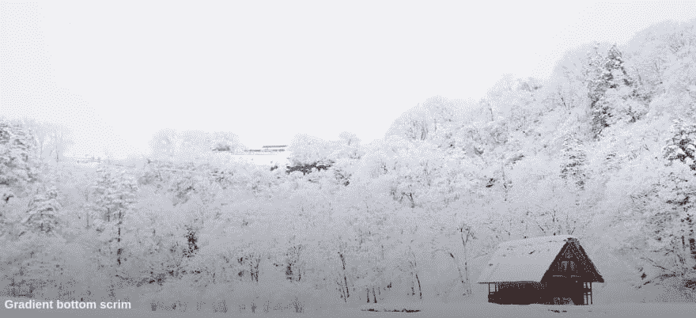
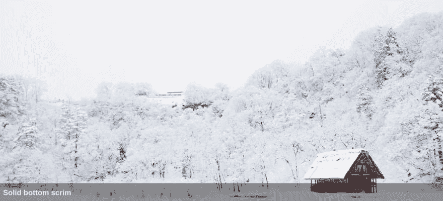

# 简单的样式技巧和如何 css 它们-图像叠加

> 原文：<https://dev.to/joruch/simple-styling-tricks-and-how-to-css-them-image-overlays-ioh>

我想写一篇文章已经有一段时间了，这将是我的第一篇，所以就不写了。

当我潜伏在 dev.to 网站上时，我看到许多人开始从事 web 开发，并希望建立个人投资组合。

关于如何设计一个页面，有很多好的设计指南，但是很少有人详细介绍如何实现这些设计。为了帮助解决这个问题，有很多设计框架可以帮助解决这个问题，但是这些框架也不是没有缺点。这个网站上甚至有很多文章反对使用这种样式框架。我在这里不是为了支持或反对样式框架——我确实认为它们有自己的目的——但是我确实觉得大多数人只是为了方便才使用这些框架，并且最终只使用了其中的一小部分。大多数基本的样式元素，比如卡片、按钮和粘性标题，自己制作并不困难，你也不需要一个完整的框架。

因此，我决定开始一个迷你系列，我喜欢称之为:*简单的造型技巧和如何 css 它们*。

# 文字叠加和保护

本系列的第一部分是关于图像叠加的。一个非常强大的样式工具是在图像上覆盖文本(或其他任何东西)。像谷歌和脸书这样的公司一直都在使用这个。在图像上叠加文本的主要挑战是保持对比度。当你对内容没有控制权时，例如当你让用户上传图片时，这尤其会成为一个问题。通过使用所谓的*文本保护 scrims* ，有一些简单的技巧来克服这个问题。

> 我做了一个[演示](http://tricks.jorislamers.nl/text_protect)，你可以看到所有的例子

## 基础知识

让我们首先从这个小教程的基本页面框架开始。下面给出的所有例子都使用这个基本框架。

```
<div id="banner">
    <div id="overlay">
        <div id="content">
            <h1>Overlay text</h1>
        </div>
    </div>
</div> 
```

Enter fullscreen mode Exit fullscreen mode

`#banner`元素保存实际的图像。我们将利用 css 背景属性来显示一个完整尺寸的封面图片。

元素用于遮盖下面的图像，并为上面的内容创建契约。通过使用 css 的`rgba`颜色属性，我们可以使覆盖图透明，如下图所示。

`#content`元素保存了我们想要覆盖在图像上的内容。该元素仅用于定位父容器中的文本。

> 这些例子使用 div。有很多关于使用语义 html 的讨论。然而，这些例子是非常通用的，可以应用于任何类型的 html 标签。为了说明，我使用了 div。

* * *

接下来的所有示例也将对 banner 元素使用相同的 css 样式。`height`、`width`和`margin`属性用于演示目的，应根据您的应用进行更改。

```
#banner {
    /* DEMO */
    height: 80%;
    width: 100%;
    margin-bottom: 8px;

    /* Functional */
    position: relative;
    background-image: url("../img/snow.jpg");
    background-size: cover;
    background-position: center;
} 
```

Enter fullscreen mode Exit fullscreen mode

* * *

## 全屏叠加

[](https://res.cloudinary.com/practicaldev/image/fetch/s--QNyQ3LqO--/c_limit%2Cf_auto%2Cfl_progressive%2Cq_auto%2Cw_880/https://thepracticaldev.s3.amazonaws.com/i/ic1k1octs2ym7lyew1jm.png)

第一种也是最直接的方法是用稀松布完全覆盖图像。当图像不是很重要，焦点应该在文本上时，这种技术很有用。

```
#overlay {
    position: absolute;
    top: 0;
    left: 0;
    height: 100%;
    width: 100%;

    background-color: rgba(0, 0, 0, 0.4);

}

#content {
    /* DEMO - Center text inside parent */
    position: absolute;
    top: 50%;
    left: 50%;
    -ms-transform: translate(-50%, -50%);
    transform: translate(-50%, -50%);
} 
```

Enter fullscreen mode Exit fullscreen mode

* * *

## 专色叠加

[](https://res.cloudinary.com/practicaldev/image/fetch/s--U3emv1OG--/c_limit%2Cf_auto%2Cfl_progressive%2Cq_auto%2Cw_880/https://thepracticaldev.s3.amazonaws.com/i/dk3hwndbuj3ue04v1vwq.png) 
由于背景图像的高亮度和低对比度，中间的稀松布略微可见。

专色叠加是一种更复杂的叠加，因为它不会遮挡整个图像。这样，图像不会完全变暗，原始图像的一部分仍然可见。然而，对于非常明亮的图像，稀松布可能是明显的。对于高对比度的图像，它会产生一个非常好的结果。

```
/* EXAMPLE 2 */

#overlay {
    position: absolute;
    top: 0;
    left: 0;
    height: 100%;
    width: 100%;

    /* Create radial gradient */
    background: radial-gradient(ellipse at center, rgba(0, 0, 0, 0.4) 0%, rgba(0, 0, 0, 0) 60%); /* W3C, IE10+, FF16+, Chrome26+, Opera12+, Safari7+ */
} 
```

Enter fullscreen mode Exit fullscreen mode

[](https://res.cloudinary.com/practicaldev/image/fetch/s--U3emv1OG--/c_limit%2Cf_auto%2Cfl_progressive%2Cq_auto%2Cw_880/https://thepracticaldev.s3.amazonaws.com/i/dk3hwndbuj3ue04v1vwq.png) 
由于背景图像的高亮度和低对比度，中间的稀松布略微可见。

[](https://res.cloudinary.com/practicaldev/image/fetch/s--1ylDUfwB--/c_limit%2Cf_auto%2Cfl_progressive%2Cq_auto%2Cw_880/https://thepracticaldev.s3.amazonaws.com/i/vc9zd9zn59bu9g924fdq.png) 
稀松布更少可见，同时很好地保持了图像亮度。

* * *

## 渐变底布

[](https://res.cloudinary.com/practicaldev/image/fetch/s--jal1NuIB--/c_limit%2Cf_auto%2Cfl_progressive%2Cq_auto%2Cw_880/https://thepracticaldev.s3.amazonaws.com/i/wi630ss00nytll9yiq74.png)

梯度 scrims 是非常有用的创造元素，如社会媒体职位和新闻供稿项目。它们是由第一次材料设计语言迭代推广的，例如仍然可以在谷歌 chromecast 背景和脸书的照片弹出窗口中看到。

```
#overlay {
    position: absolute;
    bottom: 0;
    left: 0;
    height: 50%; /* Overlay half of the image */
    width: 100%;

    /* Create linear gradient */
    background: linear-gradient(rgba(0, 0, 0, 0), rgba(0, 0, 0, 0.4));
}

#overlay h1 {
    position: absolute; 
    bottom: 0;
} 
```

Enter fullscreen mode Exit fullscreen mode

* * *

## 实心底布

[](https://res.cloudinary.com/practicaldev/image/fetch/s--sEKiZc5P--/c_limit%2Cf_auto%2Cfl_progressive%2Cq_auto%2Cw_880/https://thepracticaldev.s3.amazonaws.com/i/plr7efobx0na77mhjqdz.png)

奇怪的是，新“更新”的材料设计语言现在更喜欢固体纱布而不是梯度。这是前一个例子的一个小的改编，代替了线性渐变，我们只是使叠加的背景为纯色。

```
#overlay {
    position: absolute;
    bottom: 0;
    left: 0;
    width: 100%;

    background-color: rgba(0, 0, 0, 0.4);
} 
```

Enter fullscreen mode Exit fullscreen mode

* * *

像这样使用稀松布是非常灵活的。您可以尝试不同的颜色和位置的覆盖。而且只需要几行 css！

到目前为止，我的第一篇文章是关于图像叠加和文本保护的。如果你有其他造型技巧的要求，请告诉我！