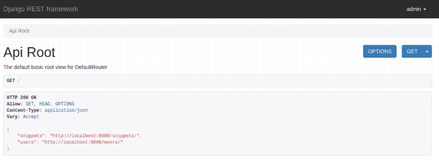

# Django Rest 框架内的 SwaggerUI

> 原文：<https://dev.to/matthewhegarty/swaggerui-inside-django-rest-framework-1c2p>

### 简介

API 模式提供了 API 细节的标准定义，可以在交互式网页中呈现，也可以用于生成客户端代码。

在这篇文章中，我描述了如何修改 Django Rest 框架(DRF)应用程序，以服务于使用 [Swagger UI](https://swagger.io/tools/swagger-ui/) 呈现的现有 OpenAPI(又名 Swagger)模式定义:

[](https://res.cloudinary.com/practicaldev/image/fetch/s--rWWerRLw--/c_limit%2Cf_auto%2Cfl_progressive%2Cq_auto%2Cw_880/https://thepracticaldev.s3.amazonaws.com/i/g8rvlt7uqaz48c2pad40.png)

此处提供了一个示例应用程序[。](https://github.com/matthewhegarty/rest-framework-tutorial/tree/swagger-ui)

### 为什么不用框架？

DRF 确实支持使用 OpenAPI 生成模式，但是对 OpenAPI 的支持只是在[3.9 版](https://www.django-rest-framework.org/community/3.9-announcement/#built-in-openapi-schema-support)中添加的，并且仍然处于早期阶段。检查 DRF 对 OpenAPI 的持续支持是值得的，因为这正在积极开发中。

如果您正在使用 Swagger (OpenAPI v2)，那么您可能会使用 [drf-yasg](https://github.com/axnsan12/drf-yasg/) 来生成和提供一个模式视图。drf-yasg 是 drf 的第三方插件。

然而，如果您正在使用 OpenAPI v3 (OpenAPI 是 Swagger 的新名称)，或者已经有了一个预先存在的模式定义文件，那么使用第三方框架可能是不可能的或者不切实际的，退而求其次的办法可能是呈现一个静态模式文件，正如我在这里所描述的。

在 DRF 还有其他不涉及 OpenAPI 的模式呈现选项(见 [DRF](https://www.django-rest-framework.org/api-guide/schemas/) 文档)，尽管 DRF 正朝着支持 OpenAPI 的方向发展。

### 我们需要做什么？

为了提供来自 DRF 的现有 API 模式文件，我们需要执行以下操作:

1.  定义模式定义文件。
2.  将 DRF 配置为服务于模式文件。
3.  将 Swagger UI 作为静态资源安装。
4.  创建一个 Django 模板来服务 UI。

这些步骤将在下面详细描述。

### 安装 DRF 教程

我用了一个 [DRF 教程](https://github.com/matthewhegarty/rest-framework-tutorial/tree/swagger-ui)的叉子来演示所需的步骤。
您可以克隆回购并在本地运行，看看它是如何组合在一起的。
分叉包括一个 [`schema.yaml`](https://github.com/matthewhegarty/rest-framework-tutorial/blob/swagger-ui/snippets/static/openapi/schema.yaml) 文件为教程项目。

您可以按如下方式安装克隆:

```
git clone git@github.com:matthewhegarty/rest-framework-tutorial.git
cd rest-framework-tutorial

# Create a virtualenv to isolate our package dependencies locally
virtualenv env
source env/bin/activate  
pip install -r requirements.txt

export DJANGO_SETTINGS_MODULE=tutorial.settings
python manage.py migrate

# when prompted, create a suitable password
python manage.py createsuperuser --email user@example.com --username admin 
```

现在您可以使用:
运行服务器

```
python manage.py runserver 
```

### 测试 API

如果教程安装正确，那么您应该能够浏览 [http://localhost:8000/](http://localhost:8000/) 并看到默认的 API 根。

[](https://res.cloudinary.com/practicaldev/image/fetch/s--02eloOmp--/c_limit%2Cf_auto%2Cfl_progressive%2Cq_auto%2Cw_880/https://thepracticaldev.s3.amazonaws.com/i/6ve4i0v9no0n3yhhg27c.png)

现在，您可以使用页面右上角的链接以管理员身份登录，并使用您之前创建的凭据登录。

### 定义模式

首先，我们需要服务于模式定义。OpenAPI 定义可以用 yaml 或 json 编写。在这个例子中，使用了 yaml。

从 DRF 3.9 开始，您可以用
生成一个模式

```
python manage.py generateschema > schema.yml 
```

然而，`generateschema`的输出只是你的 API 的一个存根，你可能需要以此为起点，并添加你的 API 的细节。

当您处理您的模式时，您可以通过将源定义复制到 [Swagger 编辑器工具](https://editor.swagger.io/)中来验证它。

我已经在这里为 rest-framework-tutorial 应用程序
[创建了一个模式。](https://github.com/matthewhegarty/rest-framework-tutorial/blob/swagger-ui/snippets/static/openapi/schema.yaml)

### 服务于图式

一旦模式准备好了，它就应该被签入到源代码控制中。现在它可以作为应用程序的一部分。

在应用程序根目录下创建一个“静态”目录，我们将在其中放置静态 web 内容以提供给客户端。例如:

```
mkdir -p snippets/static/openapi 
```

将您的`schema.yaml`移动到这个新目录中。

#### 更新网址

现在编辑 URL 文件(`tutorial/urls.py`)，并添加以下内容:

```
from django.conf.urls.static import static
from tutorial import settings

urlpatterns = [
# Leave the existing urls defined here
] + static(settings.STATIC_URL) 
```

这利用了 Django 的静态文件服务功能，您应该阅读 Django 关于这个主题的文档。

必要时重启服务器，现在点击端点应该下载模式文件，例如:

```
wget http://localhost:8000/static/openapi/schema.yaml 
```

### 安装 Swagger UI

下一步是将 Swagger UI 发行版安装到我们的静态文件中，以便它可以与应用程序一起提供服务。

在本地克隆 [Swagger UI repo](https://github.com/swagger-api/swagger-ui) 。

#### 为 Swagger UI 创建静态目录

在您的`static`根目录下创建另一个目录来服务 SwaggerUI 文件:

```
mkdir -p snippets/static/openapi/swagger-dist-ui 
```

现在将 SwaggerUI 的 [dist](https://github.com/swagger-api/swagger-ui/tree/master/dist) 目录的内容复制到你刚刚创建的`swagger-dist-ui`目录中，例如:

```
cp -av ../swagger-ui/dist/* snippets/static/openapi/swagger-dist-ui 
```

### 为 Swagger UI 创建 Django 模板

我们的最后一步是配置 Django 来服务 Swagger UI。为此，我们需要创建一个模板，Django 可以从中提供 SwaggerUI 文件。

为模板创建一个新目录:

```
mkdir -p snippets/templates 
```

现在把 index.html 移动到这个目录:

```
mv snippets/static/openapi/swagger-dist-ui/index.html snippets/templates/ 
```

#### 在 Config 中定义模板目录

完成上述步骤后，检查您的配置是否正确引用了模板目录。在`tutorial/settings.py`中，将“模板”目录添加到`DIRS`(其他配置保持不变):

```
# tutorial/settings.py
TEMPLATES = [
    {
        'BACKEND': 'django.template.backends.django.DjangoTemplates',
        'DIRS': ['templates'],
        ...
    },
] 
```

#### 配置模板

现在我们需要编辑`index.html`文件，以便它引用静态资源，比如 Swagger UI 的 js 和 css 文件。

编辑`index.html`:

1.  将``指令添加到文件的顶部。

2.  遍历文件并修改所有静态文件引用，以使用一个
    Django 模板指令。

例如，在[第 7 行](https://github.com/swagger-api/swagger-ui/blob/master/dist/index.html#L7)上，将`href`参考从`./swagger-ui.css`更改为``。

对`index.html`中的所有其他文件引用执行此操作。

1.  将`SwaggerUIBundle`中的 [url 引用](https://github.com/swagger-api/swagger-ui/blob/master/dist/index.html#L42)改为引用您的模式文件:`url: ""`

最终产品看起来应该类似于[这个](https://github.com/matthewhegarty/rest-framework-tutorial/blob/swagger-ui/snippets/templates/index.html)。

#### 添加一个 URL 引用

最后，我们需要在`urls.py`中添加一个对模板的引用，以便服务于`index.html`文件。

```
from django.views.generic import TemplateView

urlpatterns = [
    url('openapi/', TemplateView.as_view(template_name="index.html")),
    url(r'^', include(router.urls))
] 
```

### 测试 UI

现在，如果我们浏览到[http://localhost:8000/open API/](http://localhost:8000/openapi/),我们应该看到用 schema.yaml 呈现的 Swagger UI。

[](https://res.cloudinary.com/practicaldev/image/fetch/s--rWWerRLw--/c_limit%2Cf_auto%2Cfl_progressive%2Cq_auto%2Cw_880/https://thepracticaldev.s3.amazonaws.com/i/g8rvlt7uqaz48c2pad40.png)

### 结论

在这篇文章中，我介绍了如何在 Swagger UI 中呈现现有的模式文件，以及如何将 UI 作为 Django Rest 框架项目的一部分。

这种方法在开发中工作得很好，但是不适合生产使用。请参考 [Django 文档](https://docs.djangoproject.com/en/2.1/howto/static-files/deployment/)以获得关于在生产中提供静态文件的进一步指导。

Django Rest 框架计划进一步支持 OpenAPI / Swagger，因此这个过程可能会在未来的 DRF 版本中得到改进。遵循[发行说明](https://www.django-rest-framework.org/community/release-notes/)进行更新。