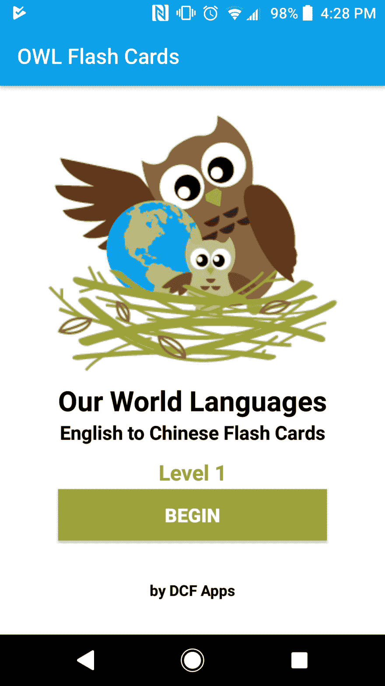
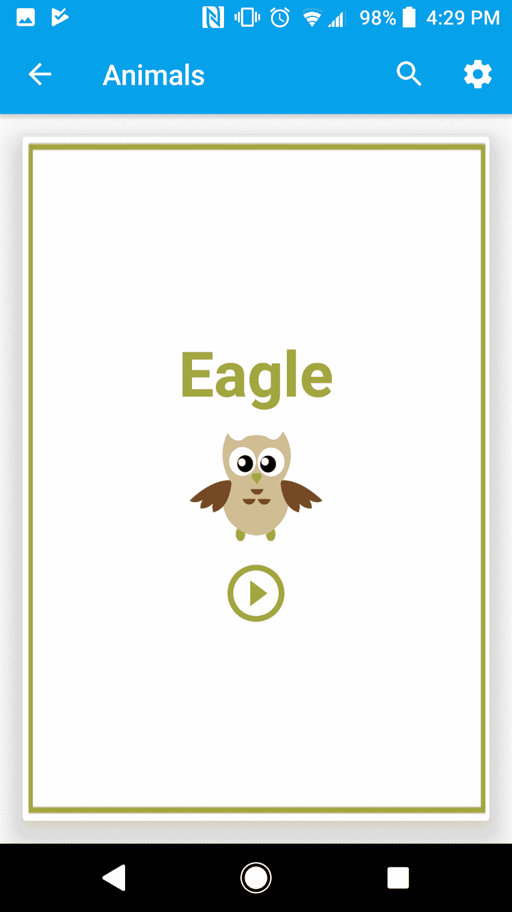

# 我第一个发布的应用程序(第 1 部分)

> 原文：<https://dev.to/davidcf/my-first-published-app-part-1-510k>

## [T1】简介](#intro)

大家好，
我刚刚将我的第一个应用发布到 Google Play 中。我决定写这篇文章来纪念这段经历，并给出一些关于构建和发布的提示。

这篇文章不应该跟在 t 后面。我最近才被认证为 Android 应用程序开发人员，有许多方法可以构建自己的专业应用程序。这篇文章是为那些想经历构建和发布过程，并想知道其他人的经历来帮助他们克服发布过程中的紧张情绪的人而写的。

## 关于

OWL 闪存卡 1 级 en-cn 。[代码回购](https://github.com/davidfitz314/OWLFlashCardsencnlevel1)、 [App](https://play.google.com/store/apps/details?id=com.dcfportfolio.owlflashcardsen_cnlevel1&pcampaignid=MKT-Other-global-all-co-prtnr-py-PartBadge-Mar2515-1)

使用 Android Studio 版创建。
要求最低 SDK 级别为 19。
为 SDK 级编译。

附加依赖:Firebase，Support，Arch。坚持。房间，拱门。生命周期和 Expresso 进行测试。

## 开始一个新项目

### 创造想法/概念。

首先，我不太会说中文，但是我娶了一个来自中国的女孩。所以在结婚后的一段时间里，我试图学习中文，我基本上讨厌大多数项目教你的方式。当我有空闲时间的时候，我想要一个快速学习一两个单词的方法，而最好的方法似乎是抽认卡。

对于创建你自己的应用程序的想法，最好的方法通常是，你想要什么，然后将其扩展到帮助其他人。这有助于志同道合的人很容易被你的应用程序创意所吸引。

### 创造一个寻找的想法。

很多人听说过抽认卡，可能也使用过，但是如何设计一个应用程序让它看起来像抽认卡呢？

首先，你可以尝试阅读设计者制作漂亮卡片动画的技巧和诀窍，但是如果你太早这样做，通常会遇到障碍。我发现的最好方法是从小处着手:

1.  创建单个应用程序页面并设计其布局。
    *   这可以通过在纸上画画或使用编辑器来完成。
    *   首先放置需要的项目，如标题栏、导航条等...
    *   不要过早地选择颜色，设计背景和元素可能很有趣，但是过早地选择颜色会导致混乱的代码和大量的后期清理工作。
    *   填写其余部分，但不要忘记为您自己的徽标和标题留出空间。
    *   Lorem ipsum 是放置填充文本的好方法，直到你更好地组织了你的布局。*记得为超过 1 个屏幕的应用程序绘制按钮，或者查看导航抽屉等其他选项。
2.  参考其他 app，你创建的页面看起来像主页、菜单、主要内容等吗...
    *   如果不是一个常用的设计，想办法通过参考别人来改进你自己的设计，或者试着向朋友解释如何使用你的设计。如果你不能亲自解释，现在几乎有办法让用户通过观看来理解它。
    *   你不需要和其他应用程序看起来一模一样，但是人们倾向于做草率的设计，除非设计是他们的职业。所以在可能的情况下使用其他 app 作为参考。
    *   这样做有助于确认你正在创建一个专业的应用程序。
3.  为超过 1 页的应用程序创建故事板。
    *   这样你所有的设计和页面都在一条线上，所以当你跳转到某个功能时，你会记得谁和谁有联系。

我连续一周亲自重画设计和故事板，直到我发现现在我只需要最简单的布局。

### Android Studio 首次构建

所以 Android studio 给了你一些基本的模板，现在如果你不需要任何额外的模板，你可以使用空的活动布局。但是请记住，不要把这个作为默认选项，看看你在设计你的应用时做了什么，你有没有按下所有的按钮来把屏幕变成导航抽屉，如果是这样，android 已经为你准备好了布局。

*   记得看看有什么可用的，这样你就不用以后重新创建轮子了。

## 构建 app 布局

终于我们可以开始编码了。这个应用程序的准备工作花了我相当多的时间，但是能够开始编码并看到我在手机屏幕上弹出的布局是非常值得的。

现在对于主屏幕和菜单屏幕来说，刚开始还是挺简单的。我只需要一个 LinearLayout 来保存我的视图，包括 Textviews、ImageViews 和 Buttons，但这是我的一个错误假设。

线性布局很好，但它们只是一个方向，所以如果你想在一行中有两个项目，你必须添加到另一个布局组中。如果添加第二个线性布局来容纳这两个项目，还需要考虑布局权重。布局权重非常重要，因为它们可以帮助组织多个屏幕尺寸的内容，但当嵌套在彼此内部时会导致性能问题。这是因为计算机必须多次调用 onmeasure 和 ondraw 才能正确处理每个项目的尺寸，这降低了所有其他资源的速度，通常会极大地困扰用户。

那么，我该怎么做才能保持不同屏幕尺寸的灵活性呢？
对于标题屏幕，我使用了一个约束布局作为父屏幕，并在其中放置了一个 scrollview。滚动视图包裹着我的线性布局，让我的应用程序超越了手机的界限...是的，我知道这对于标题屏幕来说是错误的，因为如果你标题的一部分，或者下面的内容超出了界限，用户会想，*“哦，我可以滚动到它，没关系”*。没有，那是谁。但是当我在多设备屏幕上测试时，我允许这个早期的错误，这样我就不必在那时建立一个水平方向。

我后来确实为我的页面设计了水平布局，但一开始我关注的是功能性，这没问题。如果你决定这样集中注意力，确保你实现了一个//待办事项提醒，这样你就不会忘记以后的事情。

#### 片段布局建筑

片段布局被**包含**到预先存在的布局中，所以记住你的视图层次，避免嵌套权重，忘记父元素已经有权重，会导致严重的性能问题。

我的应用程序目前使用 2 个片段，一个用于设置首选项片段，一个用于抽认卡本身。建立布局是半直接了当的，除了我花了一段时间来弄清楚，如何使卡片翻转过来，显示翻译的一面。但是在第二部中会有更多的介绍。