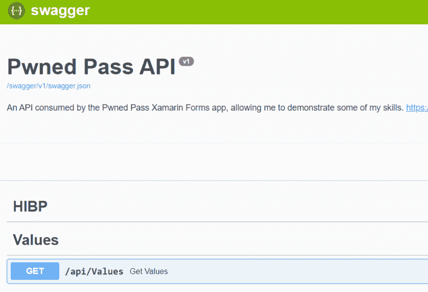
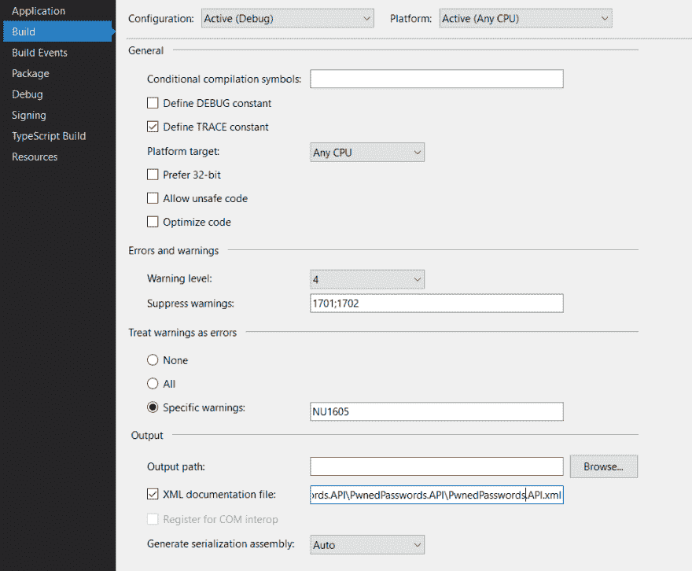
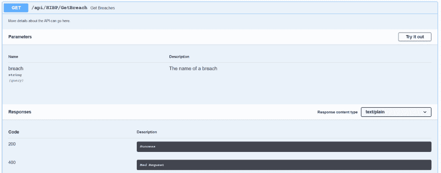

# 记录您的 API

> 原文：<https://dev.to/funkysi1701/documenting-your-api-4gcn>

所以你创造了一个超级 API，它做了一些令人惊奇的事情。你如何记录它以便人们使用它？

简单记录 API 的一种方法是安装 Swashbuckle 包。

```
Install-Package Swashbuckle.AspNetCore
Install-Package Swashbuckle.AspNetCore.Swagger 
```

Enter fullscreen mode Exit fullscreen mode

然后在 startup.cs 中添加下面几行

```
//In ConfigureServices

services.AddSwaggerGen(c =>
{
    c.SwaggerDoc("v1", new Info { Title = "API", Version = "v1", Description = "An API Description" });
    c.IncludeXmlComments(string.Format(@"{0}\API.xml", System.AppDomain.CurrentDomain.BaseDirectory));
});

//In Configure

app.UseSwagger();

app.UseSwaggerUI(c =>
{
        c.SwaggerEndpoint("/swagger/v1/swagger.json", "API V1");
        c.RoutePrefix = string.Empty;
}); 
```

Enter fullscreen mode Exit fullscreen mode

现在当你浏览你的 API 时，你会看到 swagger 文档系统。

[](https://res.cloudinary.com/practicaldev/image/fetch/s--Ap5fmvGA--/c_limit%2Cf_auto%2Cfl_progressive%2Cq_auto%2Cw_880/https://storageaccountblog9f5d.blob.core.windows.net/blazor/wp-content/uploads/2019/03/image-3.png%3Fw%3D662%26ssl%3D1)

RoutePrefix 设置控制 swagger 显示的路径。我把我的文档放在根目录下，但是你可能想把它们放在/docs 或者类似的路径下。

ConfigureServices 方法中的 IncludeXmlComments 设置允许您加载已添加到方法中的任何 XML 注释。要做到这一点，您需要为您的构建启用一个设置。

[](https://res.cloudinary.com/practicaldev/image/fetch/s--Lko6A8j_--/c_limit%2Cf_auto%2Cfl_progressive%2Cq_auto%2Cw_880/https://storageaccountblog9f5d.blob.core.windows.net/blazor/wp-content/uploads/2019/03/image-4.png%3Fw%3D662%26ssl%3D1)

XML 文档文件必须被选中并包含一个路径。每次构建时，都会生成一个 XML 文件，其中包含您添加到代码中的所有注释块。

[](https://res.cloudinary.com/practicaldev/image/fetch/s--yD3B6-rB--/c_limit%2Cf_auto%2Cfl_progressive%2Cq_auto%2Cw_880/https://storageaccountblog9f5d.blob.core.windows.net/blazor/wp-content/uploads/2019/03/image-5.png%3Fw%3D662%26ssl%3D1)

然后，Swagger 将使用这个 XML 文档文件生成漂亮的文档，而无需您做任何额外的工作。

[](https://res.cloudinary.com/practicaldev/image/fetch/s--Oy0UMUUI--/c_limit%2Cf_auto%2Cfl_progressive%2Cq_auto%2Cw_880/https://storageaccountblog9f5d.blob.core.windows.net/blazor/wp-content/uploads/2019/03/image-6.png%3Ffit%3D662%252C260%26ssl%3D1)