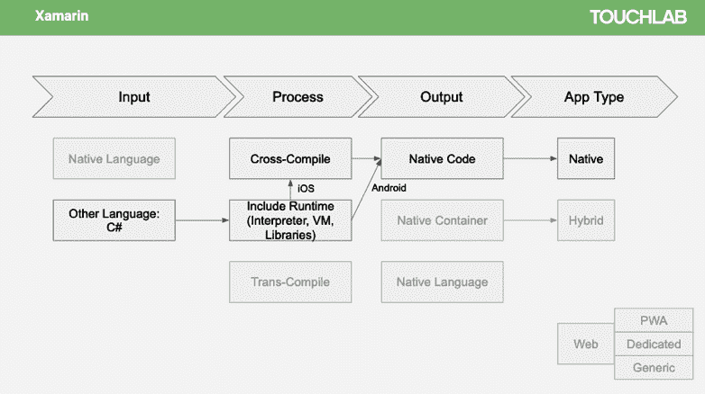
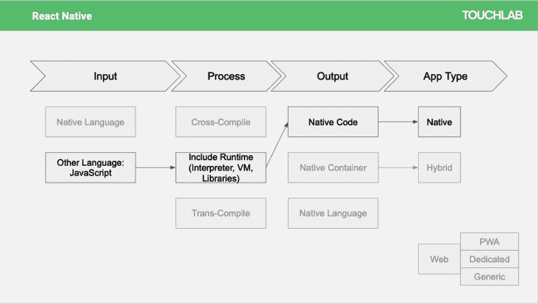
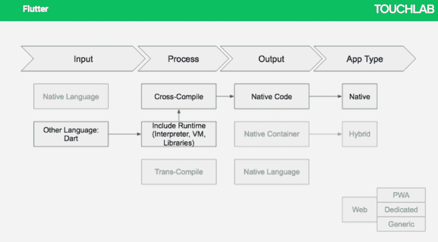
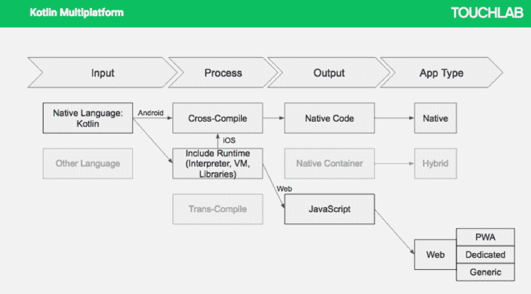

# 跨平台的未来是天生的

> 原文：<https://dev.to/touchlab/the-future-of-cross-platform-is-native-7cn>

# 跨站台行李

“跨平台”作为一个术语和一个开发工具，目前并不被高度重视，主要是因为那些声称提供跨平台支持的应用程序从未真正有效地完成工作。

在我们的文章《[跨平台？我们在这里不再这么说了](https://touchlab.co/we-dont-say-cross-platform-anymore/)。

尽管如此，我认为现在是我们考虑的时候了。支持跨平台开发的论点和以前一样(D.R.Y .，风险缓解和特性对等)

# 不要。重复一遍。你自己(D.R.Y .)

有理由通过简化开发过程来获得效率和成本节约。编程一次，创建可同时部署到 iOS 和 Android 的内聚代码。

# 风险缓解

还有关于如何开发 UI 的最小化风险的争论。最大的风险是用户界面在两个平台上都不能满足用户的期望。这是为什么开发团队选择彼此独立地开发应用程序的主要原因。与此同时，业务逻辑和后端开发受到更多关注，因为它们都决定了应用程序中所有功能的工作方式。理想情况下，在跨平台开发场景中，组织可以花时间关注后端和逻辑开发的细微差别，同时减轻 UI 开发的压力。

# 特性奇偶

另一种说法是为了功能的对等性和包容性，即功能上的差异更少，无论是 iOS 还是 Android。好处——你平等地对待所有用户，因为无论他们选择哪个平台，他们都在使用基本相同的程序。

# 原生多平台开发

然而,“跨平台”缺少的是原生多平台开发:原生 CPU、原生 UX 以及 iOS 和 Android 的原生开发者体验和工具。如果将重点转移到本地编码上，跨平台编程有可能蓬勃发展，这是一种跨平台和设备产生相同功能的更直接的方法。为了更好地理解这一点，让我们快速浏览一下最流行的跨平台解决方案及其固有的局限性。

## Xamarin

Xamarin 是第一批关注跨 iOS、Android 和 Windows 的原生编程方法的公司之一，从共享业务逻辑开始，一直到 Xamarin 表单的共享 UI。然而，它的原生元素是有限的，因为它生活在自己的生态系统中，并使用 C#(一种非 iOS 或 Android 开发原生的语言)和微软 Visual Studio，而不是 Android Studio 或 Xcode。

## 反应原生

React Native (RN)代表了开发人员在跨平台方面的一次飞跃，因为它使他们能够应用他们的 web 开发知识来构建原生 iOS 和 Android 应用程序。但是，像 Xamarin 一样，它也生活在自己的生态系统中，使用 Javascript 和非标准编辑器。和 Xamarin 一样，它需要从自己的互操作中包装本机控件和视图层次结构，这使得有必要用自己的语言构造 UI。

## 飘起

Flutter 是跨平台编程的新成员，它使用其语言 Dart 来创建 iOS 和 Android 应用程序。Flutter 还利用丰富的小部件在 Android 和 iOS 平台上提供卓越的原生体验——但这些小部件不是原生的。Flutter 还采用了一个共享的 UI 平台，该平台只能在移动设备上使用一种没有被广泛使用的语言(Dart)。

这些只是跨平台编程一直以来都是一个严峻挑战的几个例子。这是我认为我们应该远离术语“跨平台”的原因之一一个更恰当的术语是“多平台”，因为目标是您共享的任何代码都能最大化每个平台提供的功能。

# 科特林多平台

这就把我们带到了科特林多平台。它是多平台空间中的后起之秀，事实上，它比 Xamarin、RN 或 Flutter 更为原始。目前占主导地位的 Android 语言，Kotlin 在全球拥有强大而热情的开发人员基础，并因提供卓越的开发人员体验而受到社区的称赞。Kotlin Multiplatform 使开发人员能够编写一次，测试一次，然后在 iOS、Android 和 Web 应用程序中使用相同的代码。

虽然不是第一个分离业务逻辑和 UI 的多平台工具(例如，用于逻辑/库的 Xamarin 和用于 UI 的 Xamarin Forms)，但它比 Xamarin、RN 和 Flutter 更原生，因为它在 UI 层下使用共享逻辑和库，开发人员可以在原生开发环境中与之交互 iOS 的 Xcode、Swift 和 Objective-C；Android Studio 和用于 Android 的 Kotlin 面向网络的 JavaScript 它为每个平台输出本地代码。

作为一种语言，Kotlin 使开发人员能够更有凝聚力地开发应用程序。它是一种现代语言，与 Android、iOS、Java 和 web 上的本地平台相吻合，允许开发团队在已经编码的基础上进行构建。而且因为它本质上是 Java 的扩展，所以 Java 开发者入门相对容易。Kotlin 也没有太偏离 Swift，在 Touchlab，我们目前有 iOS 开发人员用 Kotlin 编码。

同样重要的是，Kotlin 是今天开发的面向未来的应用程序的一种方式。这是一项合理的技术投资，因为代码可以在所有平台上工作，而不会像 Xamarin 或 React Native 那样受到供应商的限制。因此，未来的主导平台是 web 还是 mobile 并不重要，因为代码可以移植到任何一种环境。

同时，开发团队不再需要孤立，而是可以作为一个有凝聚力的整体一起工作。不再需要有专门的 iOS 和 Android 团队。这种统一的移动方法在运营、技术、文化和财务上更有意义。

[科特林是不是最安全的赌注](http://touchlab.co/future-shared-code-kotlin-multiplatform/)？一切都表明，事实上，它是。在这个世界上，我们总是在寻找开发时间和成本的更大效率， [Kotlin 已经证明了自己是一个非常可行的玩家](http://touchlab.co/the-case-for-kotlin/)——它已经证明了自己是一个真正的多平台编程选项。

* * *

*这个帖子应该是在 [Kotlin 多平台做不到这一切](https://dev.to/piannaf/kotlin-multiplatform-can-t-do-it-all-which-is-exactly-why-you-should-try-it-1p85)之前但是我没有找到回溯的方法。*

另外，我写这篇文章是为我第一次登台做准备。我在之前的文章中写了这个过程。那些幻灯片中的图像比这里的更漂亮。

[https://www.youtube.com/embed/sA_JIqqj9js](https://www.youtube.com/embed/sA_JIqqj9js)