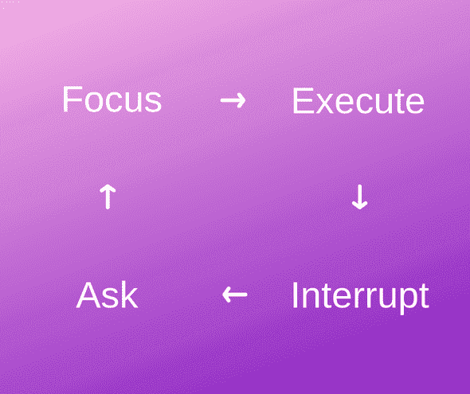

# 番茄工作法的失败如何让我成为两倍优秀的程序员

> 原文：<https://dev.to/rohovdmytro/how-failing-with-pomodoro-technique-made-me-2x-better-programmer-2p9f>

试图让番茄工作法为我工作是从挣扎开始的。但是那教会了我很多！并最终导致围绕编码、写日志、健康饮食等等建立良好的习惯。令人惊讶的是，Pomodoro 甚至让我肌肉发达！这些话题正是我在番茄系列中所涉及的。你可以[检查他们来窃取我的经验](https://blog.swingpulse.com/pomodoro)。

现在我要分享我跟随番茄工作法的第一次经验。开始的时候并不好。一点也不。

## 我与番茄大战的简短清单

### 挣扎停止

主要的问题是停下我正在做的任何事情。嘿，我正忙着呢！如果我想集中注意力，我究竟应该如何休息？。在做某事的过程中休息是不对的。突破是敌人。休息被认为是浪费时间。

### 艰难继续

我觉得我失去了动力。休息一会儿再收拾，既凌乱又足智多谋。

### 没有正面的肯定

25 分钟过去了，但我没有感觉到任何生产力。在我看来，我似乎是在遵守规则，但最终结果并不那么令人满意。准确地说，我没有感到更有成效和满足，反而感到更恼火。

我做错了什么？

## 为什么我对番茄红素不感冒

所以我对番茄工作法的实现是错误的。我们来调试一下吧！这是我开始的一个转折点:

> 我的编码过程对停顿太敏感了。

嗯，嗯，好吧。但是...为什么？快进几十个破番茄，这就是答案。

### 任务切换是问题

我专注于一个特定的任务，但仍然设法在微观任务之间跳来跳去，使过程变得混乱。所有这些微小的事情确实与主要目标有关，但在它们周围跳跃很难注意到。

> 任务转换，或称定势转换，是一种执行功能，包括无意识地将注意力从一项任务转移到另一项任务的能力。

危险的是，它是在不知不觉中发生的。

我可以从一件事情开始，然后切换到另一件事情(非常相关)，然后一次又一次地切换，但没有完成任何一件事情。但是在十次这样的转换之后，我最终得到了一个和最初任务几乎没有联系的东西。

多年来，我的这一特征没有被注意到。伤心！但是真的。

事实证明这是非常有价值的自我观察。现在我将分享我处理它的方法。

### 如何停止任务切换——我的小习惯大收益

当心——这听起来可能很傻！但是为了解决番茄红素中断的问题，我所要做的就是...打断我的开关！用更多的休息打破休息！

让我解开你。

> 不断地问自己，我到底在做什么，真的。并且实实在在的回答。

这个技巧帮助我抓住自己从一项任务转换到另一项任务的机会，迫使我清晰地表达当前的目标，让我更加专注。

基本上，我打破了任务转换的坏习惯。

## 结果

结果，我的编码过程变得更加贫乏。我可以休息一下，更清楚地了解我在这个过程中的位置。这种清晰不仅让我明白我在做什么，也让我明白我实际上做了什么。此外，在 Pomodoro 休息后，我可以更容易地恢复上下文并继续钉它。

胜利！

嘿！我只写了我想分享的内容的 5%!请[订阅我的博客](https://blog.swingpulse.com/pomodoro)，不要错过好东西。还有[在推特上关注我](https://twitter.com/rogovdm)！

你对番茄工作法的第一次体验是什么？