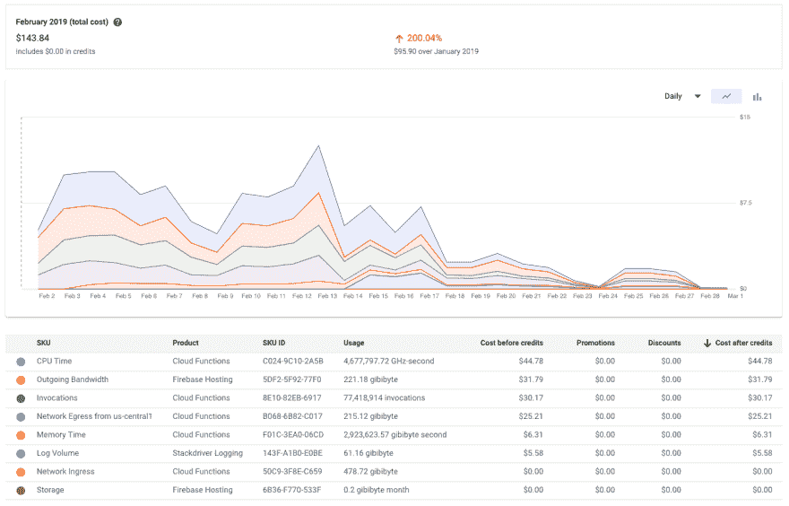
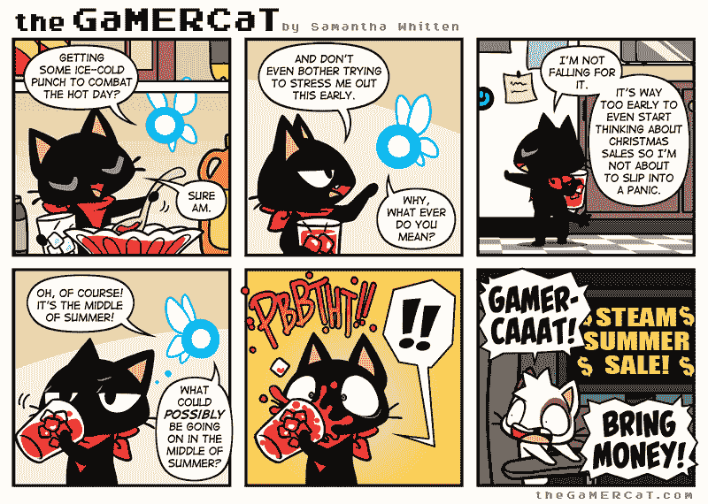
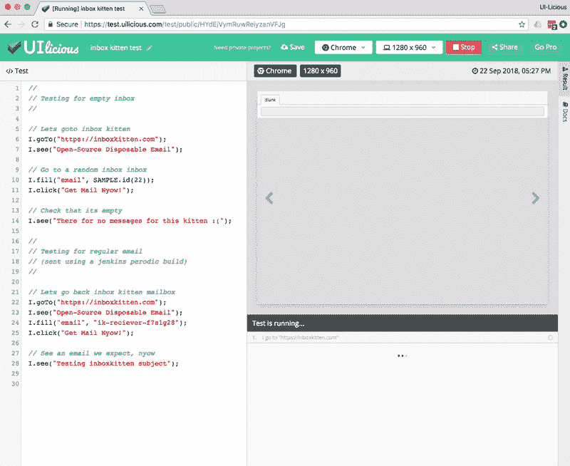

# 我们为什么迁移开源😼inbox kitten(7700 万个无服务器请求)来自🔥☁️Cloudflare 工人和🐑CommonsHost

> 原文：<https://dev.to/uilicious/why-we-migrated-serverless-inboxkitten-from-firebase-to-cloudflare-workers-and-commonshost-gd3>

# 获取邮件 Nyow！📩

自从我们最初推出[inboxkitten.com](https://inboxkitten.com/)以来，这是一个用于创建一次性电子邮件服务的免费开源无服务器项目...

[](/picocreator) [## 堆栈:在 14 小时内创建一个免费的开源一次性电子邮件服务(inboxkitten.com)😼

### 尤金 Cheah 9 月 22 日 184 分钟阅读

#opensource #serverless #javascript #vue](/uilicious/the-stack-making-a-free-open-source-disposable-email-service-prototype-inboxkittencom-in-14-hours-206g)

这🐈小猫越来越多，变得无法控制...

[](https://res.cloudinary.com/practicaldev/image/fetch/s--YatTWGkp--/c_limit%2Cf_auto%2Cfl_progressive%2Cq_auto%2Cw_880/https://thepracticaldev.s3.amazonaws.com/i/19yq01h80irshq8f8ici.png)

*   [产品搜寻第三名](https://www.producthunt.com/posts/inboxkitten)
*   2 月账单冲击:143 美元
    *   221 GB 静态网站数据(来自 cloudflare 缓存未命中)
    *   215 GB 的电子邮件数据
    *   7700 万次 API 请求
    *   2 万多独立访问者(根据 cloudflare)
    *   我蒸汽机车夏季销售资金的耗尽😭(那 143 美元总得有个来源)


<figure>[

<figcaption>鸣谢:萨曼莎·惠滕</figcaption>](http://www.thegamercat.com/comic/summer-strife/) </figure>


# 好了猫队，我们需要一个计划来保障夏季销售！💳

现有的 AWS lambda 或 GCP/Firebase 云功能的一个关键限制是，它在任何时间点都只能对一个应用程序实例发出一个请求。

虽然这很棒，但如果你在压缩图像，或者做复杂的事情。

Inboxkitten API 唯一的作用是使用 API 密钥向 mailgun 发出 HTTP 请求，mailgun 保存实际的电子邮件，并回显结果。

因此，我们的资源消耗远远低于 1%的 CPU，或者每个请求不到 10MB 的 ram。嗯，低于每个请求 128MB ram 和专用 CPU 的最小值。

因此，我们最初的计划是，一旦这些小猫在非常稳定的负载下成长，就将它扔到每月 5 美元的 Linode Nanode 1GB 实例上。

然而，缺点是它不能在高峰工作负载时自动“伸缩”,或者如果它每月有大量请求，这将超出一个实例。(并不是说我们需要支持这样的工作负载)

因此，为了保持无服务器娱乐的精神(这使得这个项目很受欢迎)，我们会把这个选项放在一边，问...

如果有一个无服务器的平台，有一个替代的计费模式。如果它只按请求计费，或者只按 CPU 和 ram 的使用量计费，那会怎么样呢？如果我们...

[](https://res.cloudinary.com/practicaldev/image/fetch/s--m_fn42CG--/c_limit%2Cf_auto%2Cfl_progressive%2Cq_auto%2Cw_880/https://thepracticaldev.s3.amazonaws.com/i/8smawr5r5iwj4hc4vgfn.jpg)

# 使用~~猫~~ Cloudflare 工人☁️

Cloudflare worker，它是“边缘”无服务器计算发展趋势的一部分。也恰好将无服务器计费简化为单一指标。

将之前令人费解、难以解读的 GCP 钞票...

<figure>

| 付费项目 | 使用 | 单位 | 总成本 | 平均价格(每百万次调用) |
| --- | --- | --- | --- | --- |
| 祈祷 | Seventy-seven million four hundred and eighteen thousand nine hundred and fourteen | 祈祷 | $30.17 | $0.390 |
| 中央处理机时间 | Four million six hundred and seventy-seven thousand seven hundred and ninety-seven | 千兆赫秒 | $44.78 | $0.578 |
| 逐渐消失 | Two hundred and fifteen point one two | 就像交换 | $25.21 | $0.326 |
| 存储时间 | Two million nine hundred and twenty-three thousand six hundred and twenty-three | 吉比字节秒 | $6.31 | $0.082 |
| 日志量 | Sixty-one point one six | 就像交换 | $5.58 | $0.072 |
|  |  | 总计: | $112.05 | $1.447 |

<figcaption>Like seriously, try to guess how much your API will cost for a million request in advance is kinda impossible on GCP / AWS, without historical data</figcaption>

</figure>

变成更容易理解的东西，而且每次请求的总体成本更低...

<figure>

| 付费项目 | 使用 | 单位 | 总成本 | 平均价格(每百万次调用) |
| --- | --- | --- | --- | --- |
| 祈祷 | Seventy-seven million four hundred and eighteen thousand nine hundred and fourteen | 祈祷 | $39 | $0.5 |
|  |  | 总计: | $39 | $0.5 |

<figcaption>Note that there is a minimum of $5/mth</figcaption>

</figure>

😸这足够在夏季促销期间再玩 7 个 9.99 美元的游戏了！

并且具有更低延迟边缘计算的额外优势！

[](https://res.cloudinary.com/practicaldev/image/fetch/s--xdLRgOjP--/c_limit%2Cf_auto%2Cfl_progressive%2Cq_auto%2Cw_880/https://thepracticaldev.s3.amazonaws.com/i/ft1eumft6gc15dnnhf7z.jpg)

# 但是，有渔获...

**1) < 5ms CPU 时间限制**

每个请求被限制在小于 5 毫秒的 CPU 时间内，这与请求时间(也称为挂钟时间)有很大的不同，因为它只计算 CPU 花费在函数本身上的时间，而忽略了所有的睡眠/等待时间。

这与 GCP 或 AWS 测量从功能开始到结束所用的时间(包括所有睡眠/等待时间)相反。

在这样的设置中，折叠 DNA 链或猫图像的无服务器功能消耗大量 CPU 或 RAM。会发现 Cloudflare 不可用。

然而，我们的无服务器函数花费 99.99%的时间等待 mailgun API 响应。使< 5 毫秒的限制完美。

此外，如果我们需要将它升级到可选插件。

<figure>

[](https://res.cloudinary.com/practicaldev/image/fetch/s--kzbyCz8X--/c_limit%2Cf_auto%2Cfl_progressive%2Cq_auto%2Cw_880/https://thepracticaldev.s3.amazonaws.com/i/1njj716mtavmvmf3fl9j.jpg)

<figcaption>This is your captain speaking: Jumping ship is a go!</figcaption>

</figure>

**2)与 express.js 不兼容(因为它使用 web workers 模式)**

另一件需要注意的事情是，Cloudflare workers 是基于 [web workers 模型](https://developer.mozilla.org/en-US/docs/Web/API/Web_Workers_API/Using_web_workers)的，它像拦截器函数一样与 Cloudflare 中的“fetch”事件挂钩。

因此，代替 express JS 中的以下内容(正如我们目前对 firebase 所做的)

```
const express = require('express')
const app = express()

app.get('/', (req, res) => res.send('Hello World!'))

const port = 3000
app.listen(port, () => console.log(`Example app listening on port ${port}!`)) 
```

在 Cloudflare 中，应该是下面的

```
addEventListener('fetch', event => {
  event.respondWith(fetchAndApply(event.request))
})

async function fetchAndApply(request) {
  return new Response('hello world')
} 
```

因为这是代码结构中的一个巨大的根本变化。对于较大的现有项目来说，这可能是一个主要的障碍，因为涉及到大量的重写工作。尽管极其相似。

> 也许有一天会有人想出 Cloudflare to express.js 适配器？

但对我们来说，由于项目的简单性，这只是一个简单的重写。你可以在 github 上比较 [express js 版本](https://github.com/uilicious/inboxkitten/tree/master/api/src/api)和[cloud flare 版本的代码差异。](https://github.com/uilicious/inboxkitten/tree/cloudflare-deployment/api/src/cloudflare-api)

虽然 workers 是一个开放标准，Cloudflare 是唯一的主要提供商，但它目前也是一种供应商锁定形式。

<figure>

[](https://res.cloudinary.com/practicaldev/image/fetch/s--BdpXGWJT--/c_limit%2Cf_auto%2Cfl_progressive%2Cq_auto%2Cw_880/https://thepracticaldev.s3.amazonaws.com/i/ve4sgz4qvwg4js6sa6f4.jpg)

<figcaption>I can't squeeze an express cat, into a cloudflare worker, out of the box</figcaption>

</figure>

**3)每个域一个脚本限制(除非您是企业用户)**

虽然对于 inboxkitten 来说，这不是一个大问题，但对于许多商业/生产工作负载来说，这可能是一个问题。

因为 Cloudflare 无服务器软件包不能被分解为单个子域和/或 URI 路由的更小的软件包。

这使事情变得非常复杂，在许多更复杂的设置中，不可能将测试和生产代码分离在一个域中。

然而在我们的用例中，因为这是一个爱好项目....没关系...

<figure>

[](https://res.cloudinary.com/practicaldev/image/fetch/s--vfbQOeQn--/c_limit%2Cf_auto%2Cfl_progressive%2Cq_auto%2Cw_880/https://thepracticaldev.s3.amazonaws.com/i/fntzva7cvbwn7k47s7zq.jpg)

<figcaption>Sadly we cant share multiple different cats across a single box domain easily</figcaption>

</figure>

# 对划痕进行总结...

1.  < 5 毫秒 CPU 时间限制
2.  与 express.js 不兼容
3.  每个域一个脚本限制

<figure>

[](https://res.cloudinary.com/practicaldev/image/fetch/s--fR0AaPmB--/c_limit%2Cf_auto%2Cfl_progressive%2Cq_auto%2Cw_880/https://thepracticaldev.s3.amazonaws.com/i/ahlh31u4se1xjo5100dk.png)

<figcaption>3 problems with cloudflares workers, and we do not care!</figcaption>

</figure>

所有这一切只需要由[@ jmtion](https://dev.to/jmtiong)用一天时间快速重写，我们就完成了。

* * *

# 太酷了，但为什么我还要再次用 Inboxkitten 一次性邮箱呢？

当前的一个关键用例，也是我们构建这个项目的原因，是执行电子邮件验证作为我们自动化测试脚本的一部分。比如下面的...

```
 // Lets goto inbox kitten
I.goTo("https://inboxkitten.com");
I.see("Open-Source Disposable Email");

// Go to a random inbox inbox 
I.fill("email", SAMPLE.id(22));
I.click("Get Mail Nyow!");

// Check that its empty
I.see("There for no messages for this kitten :(");

// Testing for regular email
// (sent using a jenkins perodic build)
I.goTo("https://inboxkitten.com");
I.see("Open-Source Disposable Email");
I.fill("email", "ik-reciever-f7s1g28");
I.click("Get Mail Nyow!");

// See an email we expect, nyow
I.see("Testing inboxkitten subject"); 
```

可共享的测试结果，例如


<figure>[](https://snippet.uilicious.com/test/public/7t74nVS828weKMtzGgJppF)</figure>

此外，它简单、酷、有趣。

* * *

<figure>

[](https://res.cloudinary.com/practicaldev/image/fetch/s--uEg-47k1--/c_limit%2Cf_auto%2Cfl_progressive%2Cq_auto%2Cw_880/https://thepracticaldev.s3.amazonaws.com/i/27n8q6oddminy2aqidmj.jpg)

<figcaption>cat and sheeps can be friends!</figcaption>

</figure>

# 嘿，31 美元的 firebase 静态文件托管怎么样？

最简单的免费解决方案是将整个网站放到 github 页面上

然而本着开源的精神...

我们要为我们的朋友们欢呼🐑[commonshost.com](https://commons.host/)，一个开源的静态站点托管平台，正在新加坡🇸🇬建造

[https://www.youtube.com/embed/1YcRmv2PtQg](https://www.youtube.com/embed/1YcRmv2PtQg)

并帮助他们在其全球网络中的 22 多台服务器上进行真实的生产工作负载测试，从而推动他们的网络。

至于为什么 commons 托管而不是 GitHub...因为这很酷，我想支持 CDN 世界的失败者，成为测试世界的失败者。

哎呀，我说超狗了吗？我是说内衣😼

# 接下来是什么？

由于该项目相当独特的简单性(快速重写)，及其沉重的生产负荷。我在考虑将其部署选项扩展到尽可能多的无服务器选项，甚至是基于 docker 的部署。

探索实际 24/7 生产负载的各种权衡。

**完成**

*   GCP/Firebase:功能和托管
*   云闪工人
*   普通主机托管

**待办事项**

*   码头集装箱部署
    *   ECS Fargate
    *   数字海洋立方
*   自动气象站λ
*   其他？？

让我们看看这艘猫船接下来将驶向何方...在那之前，我们会小睡一会儿

[](https://res.cloudinary.com/practicaldev/image/fetch/s--RN8MuqYx--/c_limit%2Cf_auto%2Cfl_progressive%2Cq_auto%2Cw_880/https://thepracticaldev.s3.amazonaws.com/i/8fmx06l7bnvogfxptd1f.jpg)

* * *

# 快乐航运🖖🏼🚀