# 与盖茨比和 Netlify 的 JAMstack

> 原文：<https://dev.to/jumpalottahigh/jamstack-with-gatsby-and-netlify-l3a>

这篇文章是基于我在芬兰前端 2019 年 3 月和[赫尔辛基 2019 年 3 月](https://twitter.com/helsinkijs)的演讲，名为:**“与盖茨比和 Netlify 的 jam stack”**。

 [<source type="image/webp">
<source type="image/jpeg">
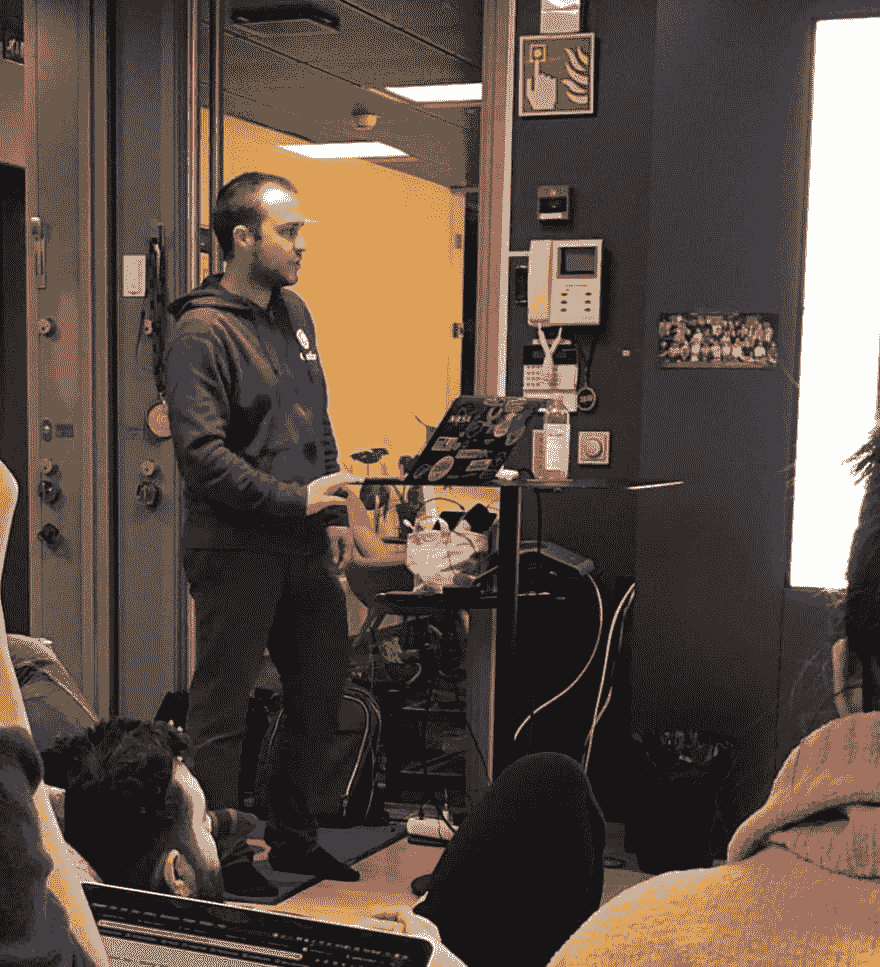](https://blog.georgi-yanev.com/static/1b72efd01e626d5a46bd72aedad21008/3da90/jamstack-with-gatsby-and-netlify-1.jpg) 

## 🕳简介及原因

我想分享一些关于 [JAMstack](https://jamstack.org) 的想法。特别是——有[盖茨比](https://www.gatsbyjs.org/)和 [Netlify](https://www.netlify.com/) 的 JAMstack。我是 F-Secure 的一名网络开发人员，我相信网络性能很重要。[网络刚刚度过了它的 30 岁生日](https://web30.web.cern.ch/)，我们的工作是建立表演和高质量的体验。

 [<source type="image/webp">
<source type="image/jpeg">
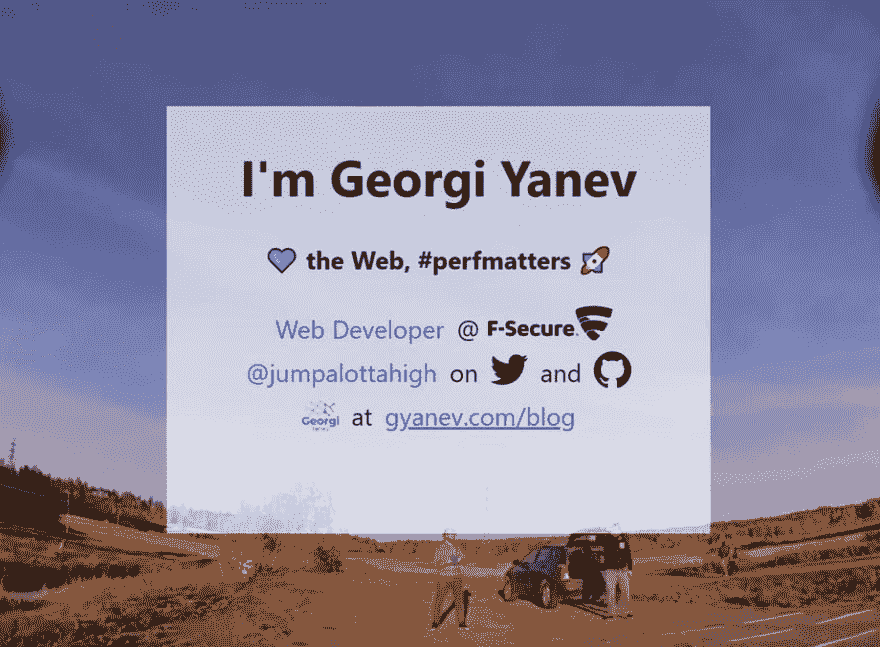](https://blog.georgi-yanev.com/static/17de2f600c6ccccc98312534a2dd6488/7821d/jamstack-with-gatsby-and-netlify-0.jpg) 

哦，是的，我喜欢驾驶 FPV 无人机。

所以，让我们开始吧。

## 🥞什么是 JAMstack？

 [<source type="image/webp">
<source type="image/jpeg">
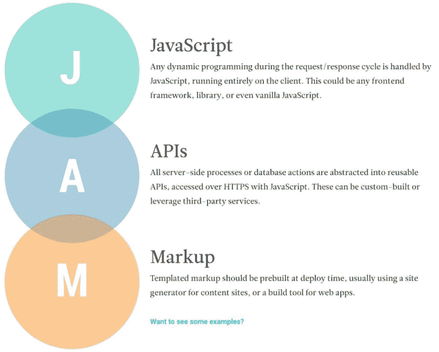](https://blog.georgi-yanev.com/static/f71b1b285c1d5cce3cf5c73514474711/61917/jamstack-with-gatsby-and-netlify-2.jpg) 

> *贷方:jamstack.org*

`JAM`首字母缩写代表`J` avascript、`A` PIs、`M` arkup。

这是 Netlify 的 Mathias Biilmann 创造的一个术语，在过去几年里一直在流传。让我们解构首字母缩写词。

#### `const { J } = JAM`

> “请求/响应周期中的任何动态编程都由 JavaScript 处理，完全在客户机上运行。这可以是任何前端框架、库，甚至是普通的 JavaScript。”
> 
> *jamstack.org*

我认为这里最重要的是**完全在客户端上运行**和**任何框架、库或 VanillaJS** 。酷，所以相当宽松的定义，这是伟大的。

#### `const { A } = JAM`

> “所有服务器端流程或数据库操作都被抽象成可重用的 API，通过 JavaScript 在 HTTPS 上访问。这些可以是定制的，也可以利用第三方服务。”
> 
> *jamstack.org*

我想在这里把你们的注意力吸引到通过 JavaScript 和**定制或第三方服务**在 HTTPS 上**可重用的 API 上。很好的定义，没有什么突破性的，非常简单。**

#### `const { M } = JAM`

> 模板化标记应该在部署时预先构建，通常使用内容站点的站点生成器或 web 应用程序的构建工具
> 
> *jamstack.org*

标记部分谈到了部署时的**预构建标记。需要一些工具，好酷。**

以下是 jamstack.org/examples 上的几个 jamstack 网站示例:

 [<source type="image/webp">
<source type="image/jpeg">
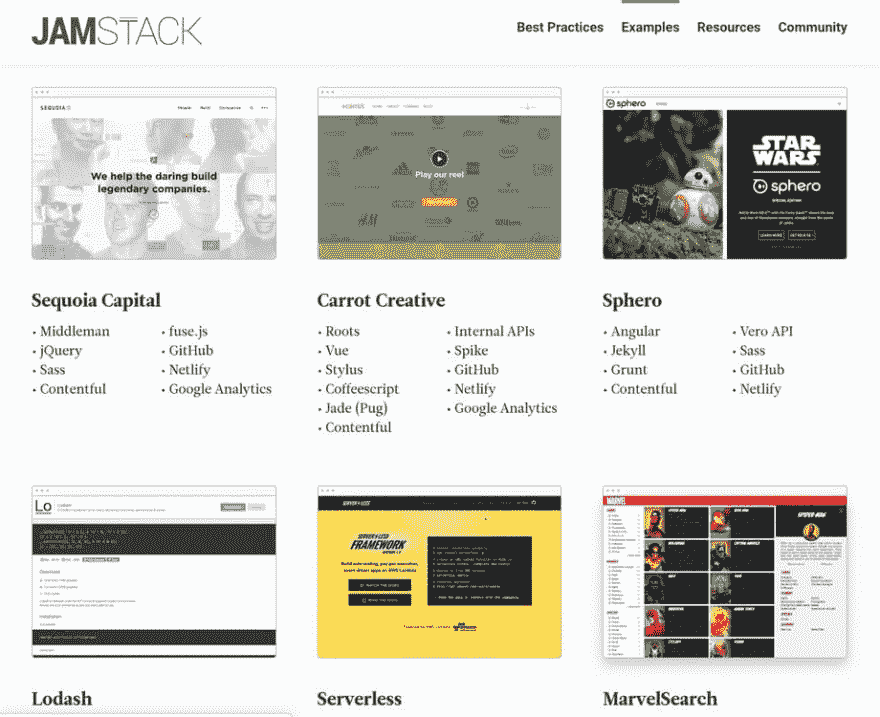](https://blog.georgi-yanev.com/static/2d09dcaf17d9367765bb75ca0ab9ea5b/7fa22/jamstack-with-gatsby-and-netlify-3.jpg) 

值得注意的有趣的事情是，你可以选择加入任何框架或库，并且仍然发布一个 JAMstack 站点。有趣的是，我们还注意到许多例子使用了 headless CMS 来获取内容。

这是我个人最喜欢 JAMstack 的部分。

 [<source type="image/webp">
<source type="image/png">
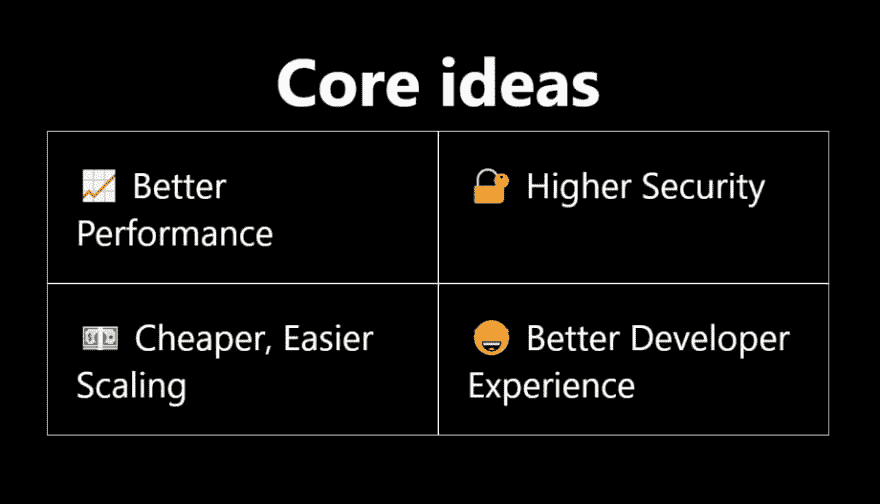](https://blog.georgi-yanev.com/static/33d1a3754974f5fd1990d9ce9c636b7a/06895/jamstack-with-gatsby-and-netlify-4.png) 

#### 📈更好的性能

JAMstack 方法的最大性能优势来自于我们从 CDN 边缘提供预构建的 HTML。

#### 🔐更高的安全性

更少的服务器端进程=更少的攻击面。

#### 💵更便宜、更容易扩展

根据经验，静态文件的扩展简单而高效，这也是我们最终要部署的。

#### 😍更好的开发者体验

使用 JAMstack 方法，需要维护的东西更少，部署起来通常更快，所以开发人员很高兴。

#### 免责声明

虽然在这里我的目标是更多地关注 JAMstack 的好处，但值得注意的是，JAMstack 方法不是灵丹妙药，也不是所有问题的答案。在工程中，考虑权衡并为您的项目选择正确的方法是一个好主意。

> **工程就是根据您的需求做出正确的权衡**

就在一个月前,[谷歌 Chrome 团队的杰森·米勒](https://twitter.com/_developit)和[阿迪·奥斯马尼](https://twitter.com/addyosmani)撰写了一篇关于何时使用 SSR 的[文章，并对许多不同的渲染策略进行了比较](https://developers.google.com/web/updates/2019/02/rendering-on-the-web)。

> 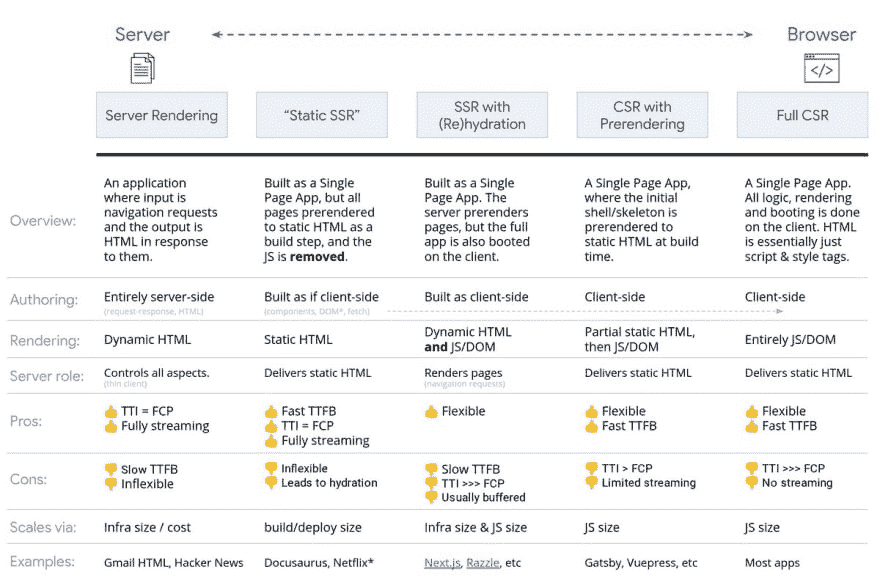杰森·米勒🦊⚛[@ _ develop it](https://dev.to/_developit)该不该用 SSR？补液呢？
> 
> 我们应该在应用程序的什么地方实现逻辑和渲染？
> 
> 答案:
> [developers.google.com/web/updates/20…](https://t.co/c3OwwgWVGc)2019 年 2 月 06 日下午 19:02[](https://twitter.com/intent/tweet?in_reply_to=1093223382223605762)[](https://twitter.com/intent/retweet?tweet_id=1093223382223605762)[](https://twitter.com/intent/like?tweet_id=1093223382223605762)

这篇文章读起来很有趣，尤其是这个表格值得花些时间来研究。

 [<source type="image/webp">
<source type="image/png">
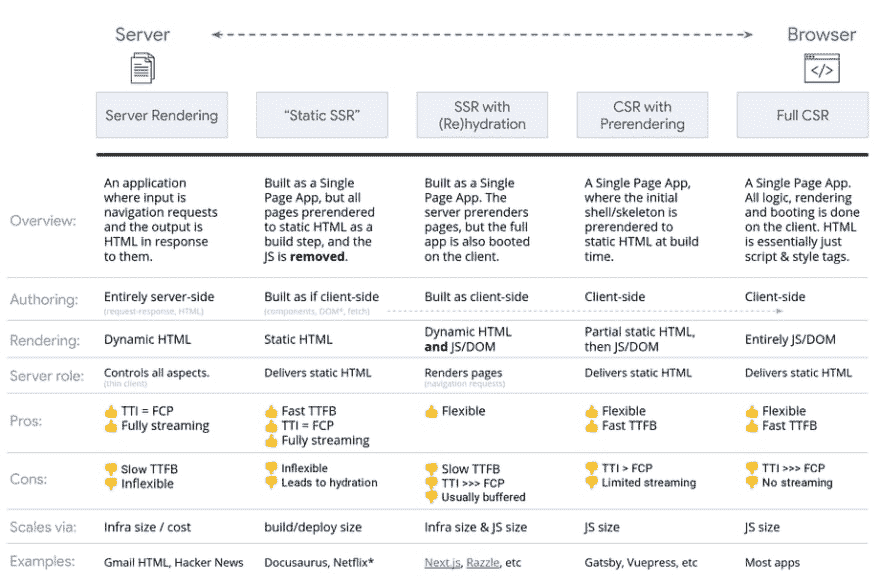](https://blog.georgi-yanev.com/static/6f592ffba7b652d4d8104eff9ec9e19a/7f95c/jamstack-with-gatsby-and-netlify-5.png) 

> *鸣谢:[https://developers . Google . com/web/updates/2019/02/rendering-on-the-web](https://developers.google.com/web/updates/2019/02/rendering-on-the-web)T3】*

最后，另一个值得一看的资源是谷歌 Chrome 开发者 YouTube 频道上的 JAMstack 视频，由[苏尔马](https://twitter.com/DasSurma)和[杰克·阿奇博尔德](https://twitter.com/jaffathecake)制作。

[](https://res.cloudinary.com/practicaldev/image/fetch/s--cso035GY--/c_limit%2Cf_auto%2Cfl_progressive%2Cq_auto%2Cw_880/https://blog.georgi-yanev.com/jamstack-with-gatsby-and-netlify-6-50b3f93d034be3b993615e298e9633dc.svg)

接下来关于不同网络生活特性的部分可能看起来有点像粉丝，这是因为它们在很大程度上是粉丝。我甚至不感到抱歉，因为我下面概述的一切都是我的个人经历，而且更好的是，一切都很出色。

#### 😍开发体验

如果你在 Twitter 上很活跃，并关注任何前端或完整堆栈的人，你可能会听到人们称赞 Netlify，这是理所当然的。事实上，我自己也经常这样做。是因为他们很牛逼，产品很棒，开发者体验分 9000 多。

#### 💵自由层

您可以在几秒钟内开始使用免费层，并且您可能不会很快超出它的范围。

#### 📦应用交付网络(ADN)

应用 CDN。Netlify 自带强大的 CDN，适用于有大量边缘节点的应用和静态站点。

#### 🔁持续部署

如果您的项目在 GitHub、GitLab 或 Bitbucket 中有一个存储库，只需点击几下就可以将该存储库链接到 Netlify。例如，这使您能够发布到存储库的`master`分支的合并或推送。非常容易设置，没有麻烦，非常强大的功能。

#### 📑SSL 证书

Netlify 利用开源的“让我们加密”项目，为您的项目提供免费的 SSL 证书。这很重要，因为在 2019 年，SSL 和 https 不仅被强烈推荐，而且几乎是一项要求。这为你的用户提供了更好的安全性，是 HTTP/2 和一些新的 TLD(如`.dev`)所需要的，并且对 SEO 有好处。最棒的是——Netlify 会自动为您更新证书，因此您无需做任何事情！

#### 📝自定义域

在这里，开发人员的体验再次放在第一位，因为为您的站点设置一个自定义域非常容易。只需点击几下，你就可以开始了。流动非常顺畅。您还可以重命名 Netlify 默认托管您的项目的默认子域，并将其重定向到您的自定义域。非常酷。

#### 🚀PRs 的自动预览

当您针对存储库的主分支打开一个拉请求时，Netlify 将自动构建该拉请求的预览。那超级牛逼！同样，除了将项目链接到 GitHub 存储库之外，不需要任何配置。在合并之前，总是能够快速检查 PR 的变化看起来如何，这是非常好的。

#### 网络功能

AWS lambdas 简化版。如果你需要用 Node.js 做更多的事情，这真的很好。如果你不想用它，你可以不使用它，但它的特性很好。

#### 🆔网络身份

提供身份验证。一种管理注册和登录的方法。对于像 Netlify CMS 这样的东西来说可能很酷，或者创建一些像仪表板、个人帐户页面等类似的门控内容。

#### 📅网络表单

只需在表单中添加一个`netlify`属性，就可以将表单中的数据直接导入 Netlify 应用程序。如果你不想设置更复杂的东西，而你现在需要发货，或者你正在做原型，这可能会非常酷，非常有用。

#### 🙌通过拖放来部署站点

[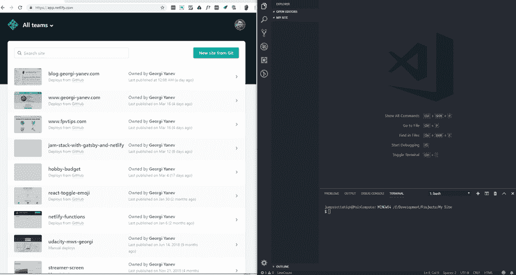](https://res.cloudinary.com/practicaldev/image/fetch/s--n9FAQCKI--/c_limit%2Cf_auto%2Cfl_progressive%2Cq_66%2Cw_880/https://blog.georgi-yanev.com/jamstack-with-gatsby-and-netlify-7-986cd0438c37f9bc938e113bf783a397.gif)

上面是一个 30 秒的部署演示，它让您的站点在互联网上有一个 netlify.com 子域(您可以重命名或设置自己的自定义域)和一个 SSL 证书。太疯狂了🤯。

#### 👍从存储库部署

但是正如我提到的，Netlify 的真正力量来自于直接连接到一个存储库，当你可以获得自动部署、部署预览和其他好东西的好处时。

[](https://res.cloudinary.com/practicaldev/image/fetch/s--4qC50w38--/c_limit%2Cf_auto%2Cfl_progressive%2Cq_auto%2Cw_880/https://blog.georgi-yanev.com/jamstack-with-gatsby-and-netlify-8-405dc67cbefba905fd9f2f6cd334d0d2.svg)

Gatsby 被多次介绍为基于 React 的静态站点生成器(的确如此),但它也没有做到公正，因为可能有些人忽略了这样一个事实，即 Gatsby 在运行时也可以再水合为一个成熟的 React 应用程序。

#### 🔥速度极快

最重要的一点是，盖茨比从一开始就是为表演而设计的。Gatsby 的默认项目设置从 Lighthouse 在性能、可访问性、最佳实践和 SEO 方面的 100 分开始，可以在几秒钟内配置为一个[渐进式 Web 应用](https://developers.google.com/web/progressive-web-apps/) (PWA)。

#### 🛠明面上

Gatsby 提供了为您配置和设置的所有现代工具。你可以得到 [Webpack](https://webpack.js.org/) 、 [Babel](https://babeljs.io/) 、 [ESLint](https://eslint.org/) 、[beautiful](https://prettier.io/)、 [GraphQL](https://graphql.org/) 等等。

#### 📀任何来源的数据

Gatsby 从任何来源创建 GraphQL 类型的数据，以便您可以在整个应用程序中以类似的方式查询它。数据可以来自 headless CMS、第三方 API、本地文件系统等等。一些值得一提和尝试的无头 CMS 选项有:[contentiful](https://www.contentful.com/)、 [Sanity](https://www.sanity.io/) 、 [DatoCMS](https://www.datocms.com/) 。

#### 📦随处部署

因为 Gatsby 将您的项目编译成静态文件(HTML、CSS、JS、JSON ),所以您可以将输出部署到任何可以部署静态资产的地方。比如: [Netlify](https://www.netlify.com/) ， [AWS S3](https://aws.amazon.com/s3/) ， [Now](https://zeit.co/now) ， [GitHub Pages](https://pages.github.com/) 等等。

#### 🅿W🅰

您可以通过运行:
在几秒钟内创建一个 PWA

```
$ npx gatsby new my-pwa 
```

Enter fullscreen mode Exit fullscreen mode

然后通过取消注释来启用`gatsby-config.js`中的`gatsby-plugin-offline`。

#### 👩‍💻高级的（deluxe 的简写）

开发人员的体验非常扎实。如果您在开发过程中出现任何问题，您的终端会显示许多有用的警告和错误消息，以及可操作的信息。

因为 Gatsby 在幕后使用 Webpack，所以您可以获得热模块替换(HMR ),并且只要您保存文件，就几乎可以在开发时立即预览更改。

除了在`localhost:8000`启动你的项目，Gatsby 还在`localhost:8000/___graphql`给了你一个 GraphiQL 实例，在这里你可以实时查询你的数据和原型 GraphiQL 查询，以及探索你的数据的形状。非常有用！

#### 🔄丰富的生态系统

有很多资源可以让你开始。超过 700 个插件和大量的启动器离我们很近。

#### 💜令人惊叹的社区

Gatsby 周围的社区由许多对项目的未来充满热情的人组成，他们愿意互相帮助。完整的书库上有很多文章，解决了一个特定的问题，或者只是使用了一个特定的数据源。这样，当你需要一个例子时，就很容易找到。

有一个 [Discord](https://gatsby.app/discord) 频道、 [Spectrum](https://spectrum.chat/gatsby-js) 社区，在 Twitter 上关注[Gatsby](https://twitter.com/gatsbyjs)可能是个好主意，因为主账号会发布和转发许多有用的资源。

事实上，有些人可能会如此热情，以至于声称一个盖茨比项目可以在 CDN edge 上用*烤面包机*运行时获得 70+的灯塔性能分数。

> 😁。静态站点盖茨比和 Netlify 的所有事情💜2019 年 1 月 12 日上午 08:09[](https://twitter.com/intent/tweet?in_reply_to=1083999310168162304)[](https://twitter.com/intent/retweet?tweet_id=1083999310168162304)[](https://twitter.com/intent/like?tweet_id=1083999310168162304)

为了便于说明，下面是默认的 Gatsby starter 的灯塔分数。

 [<source type="image/webp">
<source type="image/png">
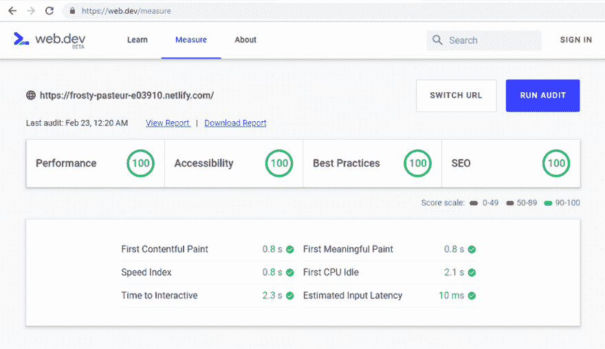](https://blog.georgi-yanev.com/static/c644ba05afac5ed217069133ce98f914/8ee63/jamstack-with-gatsby-and-netlify-9.png) 

### 🚀#性能问题

在这里，我对一个我非常关心的话题——web 性能——做了一个小小的偏离。

关注性能的原因有很多，但归根结底，是您的用户和您的业务处于危险之中。

性能、速度、用户满意度都可以转化为实实在在的金钱。截至 2018 年 7 月，快速网站也有 SEO 好处，因为页面速度现在是页面排名算法的一部分。

拥有一个快速、高效的网站是让你从竞争中脱颖而出的好方法。如今用户缺乏耐心，慢速网站导致跳出率增加。

最后，当我们欢迎下一个 10 亿互联网用户时，最好意识到他们可能来自带宽昂贵、连接不稳定的地方。

现在，网络已经过了 30 岁生日，让我们友好一点，打造优质体验吧！

#### 盖茨比对此能做些什么呢？

嗯，正如我已经提到的，盖茨比从一开始就是为表演而设计的。盖茨比做对了很多事情，为你管理了很多事情。从如何加载资源以针对[关键渲染路径(CRP)](https://developers.google.com/web/fundamentals/performance/critical-rendering-path/) 进行优化，到如何预取和预加载资源以用于用户接下来可能到达的路线。

但是我想谈谈`gatsby-image`部分。选择把它用在你的图片上，这是一个很好的方法来获得一些高影响力低成本的果实。

取决于你的应用程序是什么样的，图片可能会占你提供给用户的所有资源的很大一部分。在某些情况下，可能会超过 70%。现在，不可否认的是，字节对字节的 JavaScript 比图像的成本更高，因为它在下载后也要进行解析和执行，但 Gatsby 为您管理了这一点，正确处理图像仍然非常重要。

至少我建议你使用 [squoosh.app](https://squoosh.app/) 来调整和优化你的原始资产。

`gatsby-image`为你做的是，它为你提供了一个高度优化的延迟加载图像组件。页面加载期间不在视窗中的图像不会被下载。取而代之的是，您可以选择使用低质量的 base64 编码图像占位符，一旦用户在视口中滚动该资源，它就会替换为原始的高质量图像。Gatsby 为您提供了模糊效果或跟踪 SVG 效果，如果您选择如何处理低质量占位符的话。

`gatsby-image`组件还有一个`srcset`属性，根据视口宽度指定不同大小的图像，以避免向无法使用完整图像的设备提供过大的资产。

最后，该组件将`webp`图像提供给能够处理这些图像的浏览器。对于`jpeg`或`png`来说总是有退路的，但是提供`webp`会有很大帮助，因为文件大小通常要小得多，而且质量明显类似于`jpeg`或`png`。

### 第一次试用 React 和 GraphQL

无论你是经验丰富的老手，还是刚刚进入 [React](https://reactjs.org/) 和 [GraphQL](https://graphql.org/) 世界的新手，在使用 Gatsby 时，很容易就能掌握这些技术。我认为这是值得一提的，因为你不需要大量的先验知识来开始这里。现在，您可以使用 Gatsby 编写第一个 React 组件或 GraphQL 查询。

因为 Gatsby 在幕后使用 React，这意味着你可以从 [npm](https://www.npmjs.com/) 下载任何 React 包。这么🎉！

### 简而言之盖茨比是如何工作的？

 [<source type="image/webp">
<source type="image/png">
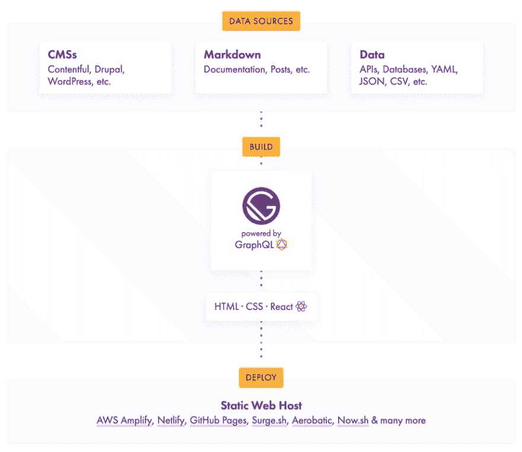](https://blog.georgi-yanev.com/static/8626cb70182f831275a076d68b18b807/85ea0/jamstack-with-gatsby-and-netlify-10.png) 

> *来自 gatsbyjs.org 的图片*

很简单。我们的数据源在顶部。这些可以是任何东西，从无头 CMS 到本地 JSON 或 YAML 文件，到第三方 API 等等。

Gatsby 获取这些信息，并为您生成可以查询的 GraphQL 类型。`localhost:8000/___graphql`当你想探索数据的时候是你的朋友。

然后，使用 GraphQL 查询将数据引入组件，这使得所述数据作为组件上的`data`道具可用。用它来构建您的组件。

当您运行`gatsby build`时，Gatsby 将在根目录下的`public`目录中创建一个生产版本。使用它将资产部署到任何静态 web 主机(Netlify、AWS、Now、GitHub pages 等)。

### 如何入门？

#### CLI

从命令行运行开始:

```
$ npx gatsby new my-site 
```

Enter fullscreen mode Exit fullscreen mode

这将为您设置默认的 Gatsby starter 项目。

#### [CodeSandbox.io](https://codesandbox.io/)

您可以在 CodeSandbox 中试用盖茨比。创建一个新的沙箱，并从服务器模板中选择 Gatsby。

 [<source type="image/webp">
<source type="image/png">
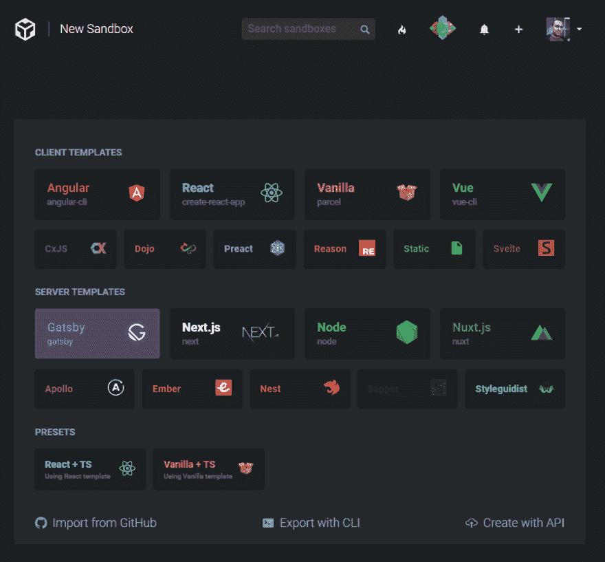](https://blog.georgi-yanev.com/static/90ce7e2919fd60ca99acda2e87cd532f/57193/jamstack-with-gatsby-and-netlify-11.png) 

#### 通过部署到 Netlify

使用绿色的 deploy to Netlify 按钮(许多初学者存储库中都有)可以立即将该项目的一个版本部署到 Netlify。

 [<source type="image/webp">
<source type="image/png">
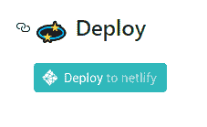](https://blog.georgi-yanev.com/static/5ca96315f909940022f12568c60eea2f/cffb5/jamstack-with-gatsby-and-netlify-12.png) 

或者，将 Gatsby starter 存储库传递给参数`repository`,如下所示:

`https://app.netlify.com/start/deploy?repository=https://github.com/gatsbyjs/gatsby-starter-default`

### 数据来源

Gatsby 的一个优点是，您可以从许多不同的数据源输入数据。

 [<source type="image/webp">
<source type="image/jpeg">
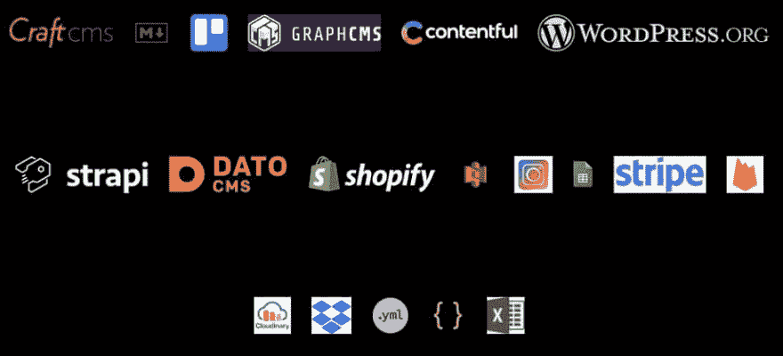](https://blog.georgi-yanev.com/static/116ec4717227e37c9e915a4162c0f1bb/6cf75/jamstack-with-gatsby-and-netlify-13.jpg) 

无论是源本地文件系统还是无头 CMS，都可以在 GraphiQL 中查询数据。现在就亲自尝试一下吧！

在这个示例项目中，我们有来自 JSON 文件的数据，如下图所示。

 [<source type="image/webp">
<source type="image/jpeg">
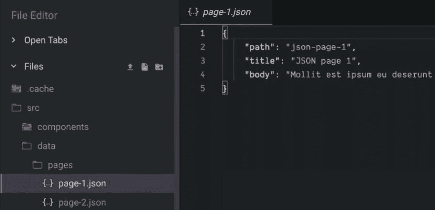](https://blog.georgi-yanev.com/static/288e4fd3aad3c6e97beb8ffa78dd83ac/d3555/jamstack-with-gatsby-and-netlify-14.jpg) 

现在，在下面的编辑器中输入:

```
{
  allPagesJson
} 
```

Enter fullscreen mode Exit fullscreen mode

并按下播放按钮来执行查询。GraphiQL 会为你填充一些额外的子字段，分别是`edges`、`node`和`id`。在右窗格中，您可以看到从查询中返回的数据。试试吧！

[https://codesandbox.io/embed/k3201jy9jo?initialpath=/___graphql](https://codesandbox.io/embed/k3201jy9jo?initialpath=/___graphql)

让我们将`path`、`title`和`body`分别添加到`id`下面的单独一行中。单击“播放”,看看这些字段的数据是如何返回的。厉害！祝贺您尝试了第一个 GraphQL 查询！

为了便于说明，下面是最后一个查询。

```
{
  allPagesJson {
    edges {
      node {
        id
        path
        title
        body
      }
    }
  }
} 
```

Enter fullscreen mode Exit fullscreen mode

记住，`CTRL` + `Space`是你在这里的朋友。它调用自动完成功能，这对于记住您想要获取的字段非常方便。

### 🔁生态系统

#### 插件

盖茨比有[700 多个插件](https://www.gatsbyjs.org/plugins/)(至少是官网上列出的)，很多了。这些插件是可重用的功能块，您可以通过在`gatsby-config.js`中安装和配置它们来将它们引入到您的项目中。我甚至不打算进入例子，只是搜索你的想法和机会是存在的。如果没有，那么也许这是一个你自己写一个插件并与社区分享的好机会。关于如何创建源代码插件的教程是一个很好的起点。

一些插件支持某种类型的功能，比如创建一个网站地图，RSS feed 或者给你的网站添加谷歌分析。其他的就是所谓的 **source** 插件，处理取数据。还有一种类型是**转换器**插件，嗯……转换数据。例如从本地文件系统中的 JSON 或 YAML 转换为可以在 Gatsby 中查询的类型。

同样值得一提的是，你也可以在你的项目中创建本地插件。这使您能够创建定制的私有插件，如果您有这样的用例的话(例如公司内部的 API)。

#### 首发

虽然插件更多的是在你需要的时候引入大量的功能，但是 [starters 是一个更全面的解决方案](https://www.gatsbyjs.org/starters/?v=2)。启动器是基于特定用例、功能或数据源的完整项目启动样板文件。

例如，如果你想很快开始，并且你知道你的项目将使用来自 [Contentful](https://www.contentful.com/) 的数据，并且将被部署到 [Netlify](https://www.netlify.com/) 上，你可以立即开始使用为此配置的启动器:

```
$ npx gatsby new https://github.com/ryanwiemer/gatsby-starter-gcn 
```

Enter fullscreen mode Exit fullscreen mode

有第一批[博客](https://www.gatsbyjs.org/starters/?c=Blog&v=2)，有 [SEO 重点](https://www.gatsbyjs.org/starters/?c=SEO&v=2)，有 [PWAs](https://www.gatsbyjs.org/starters/?c=PWA&v=2) ，取决于你选择的[造型解决方案](https://www.gatsbyjs.org/starters/?c=Styling%3ACSS-in-JS&v=2)等等。

总的来说，先发球员很棒。只有一个潜在的小缺点。现在，如果您想从您正在使用的 starter 中获取更新，因为它会随着时间的推移而改进，您实际上无法做到这一点，因为您的项目在初始设置后完全脱离了 starter。盖茨比团队正在开发一个可能会改变这种情况的功能- [主题](https://www.youtube.com/watch?v=PS2784YfPpw)。这可能非常强大。

#### 展柜

gatsbyjs.org 上的[展示页面有很多有趣的例子，如果你需要灵感和想法，可以去看看。或者为什么不](https://www.gatsbyjs.org/showcase/)[提交自己的项目与社区分享](https://www.gatsbyjs.org/contributing/site-showcase-submissions/)！

### 那么，你能和盖茨比建立什么呢？

**登陆页面**

 [<source type="image/webp">
<source type="image/png">
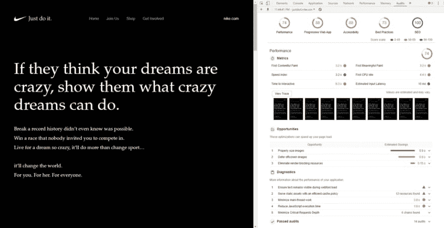](https://blog.georgi-yanev.com/static/89579ad7dbbba43f4ab9ee79e0672f06/c2d0e/jamstack-with-gatsby-and-netlify-15.png) 

> *justo tot . Nike . com*

**图像重地**

 [<source type="image/webp">
<source type="image/jpeg">
](https://blog.georgi-yanev.com/static/95cab71ad921451c635084846dab5cad/a2c09/jamstack-with-gatsby-and-netlify-16.jpg) 

> *kirstennoelle.com*

你可以用大量“沉重”的高质量图像来构建华丽的项目，并且仍然非常有性能。

**数据可视化重度应用**

 [<source type="image/webp">
<source type="image/jpeg">
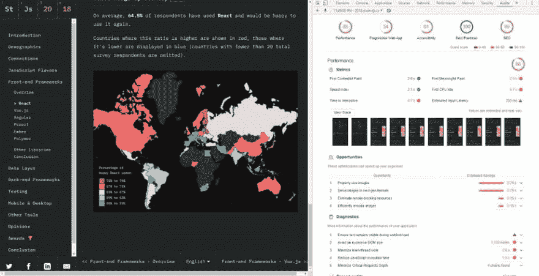](https://blog.georgi-yanev.com/static/2a97074c4a36428360e0546d0a6c8b93/a2c09/jamstack-with-gatsby-and-netlify-17.jpg) 

> *2018 年。stateofjs.com*

**电子商务**

 [<source type="image/webp">
<source type="image/jpeg">
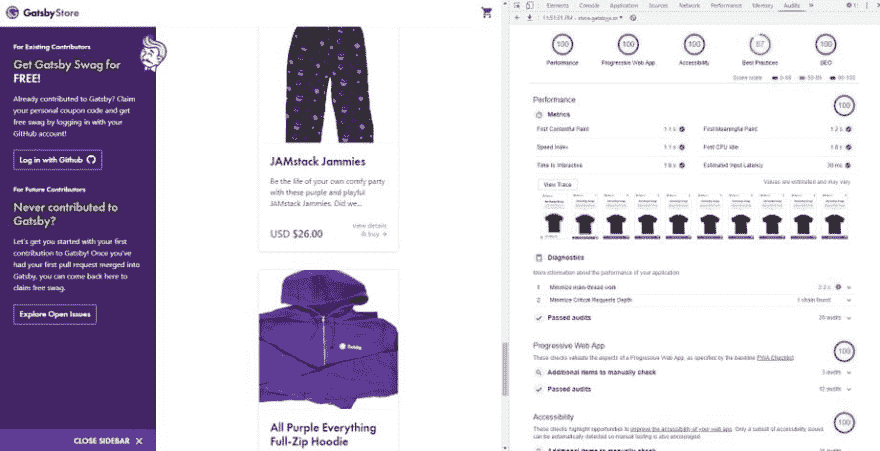](https://blog.georgi-yanev.com/static/5ee8d5e0a4ae3c58cd124807409d37f8/65025/jamstack-with-gatsby-and-netlify-18.jpg) 

> *store.gatsbyjs.org*

**博客**

 [<source type="image/webp">
<source type="image/jpeg">
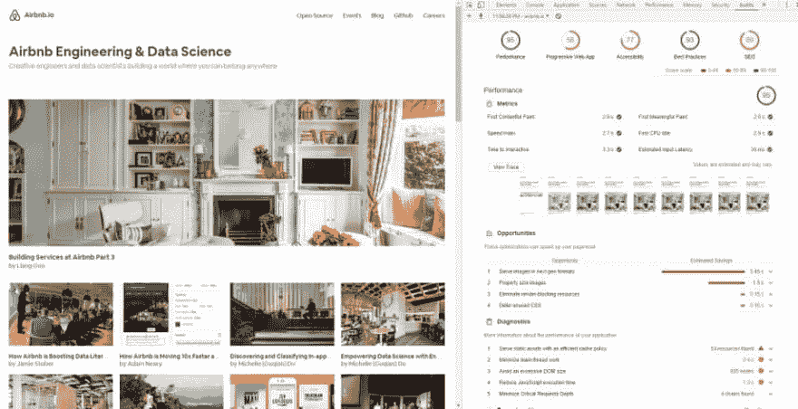](https://blog.georgi-yanev.com/static/3d05de4abac1e0801713309aadafd7f6/e3a52/jamstack-with-gatsby-and-netlify-19.jpg) 

> *airbnb.io*

**文档站点**

 [<source type="image/webp">
<source type="image/png">
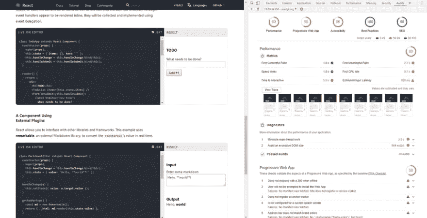](https://blog.georgi-yanev.com/static/e0475e7c8bea43f1138de25e388d44ae/0fbfa/jamstack-with-gatsby-and-netlify-20.png) 

> *reactjs.org*

### 我的项目

我和盖茨比一起建立的一些东西是:

**georgiyanev.dev**

 [<source type="image/webp">
<source type="image/jpeg">
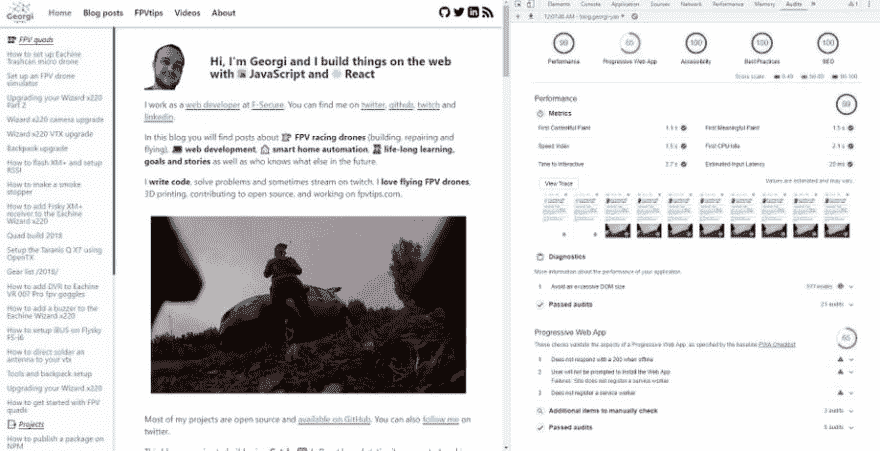](https://blog.georgi-yanev.com/static/e6a9708eb1dd639351e52783c210e7eb/6cf22/jamstack-with-gatsby-and-netlify-21.jpg) 

*Gatsby，Netlify，Markdown，风格化组件，网站地图，RSS feed*

**fpvtips.com**

 [<source type="image/webp">
<source type="image/jpeg">
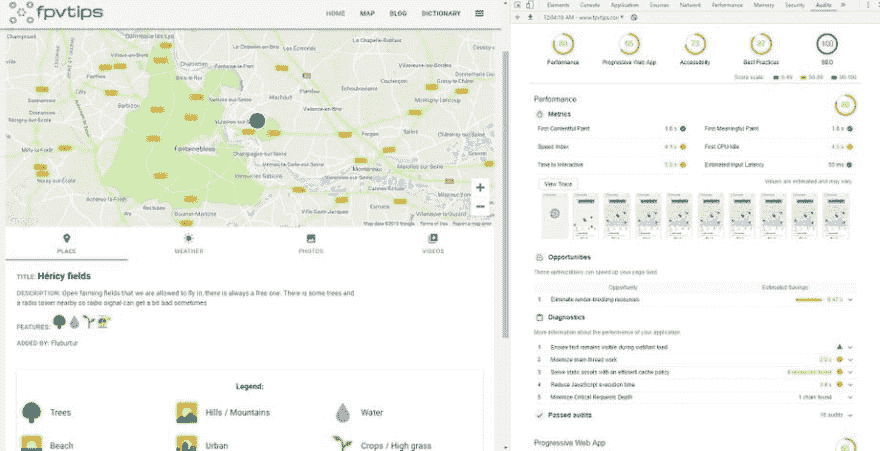](https://blog.georgi-yanev.com/static/96ff2075f09ed1119dc211f2cc9c4b6b/350c2/jamstack-with-gatsby-and-netlify-22.jpg) 

*盖茨比，Contentful，Netlify，谷歌地图，开放天气地图，素材 UI，Markdown，JSON*

**baehrbg.com**

 [<source type="image/webp">
<source type="image/jpeg">
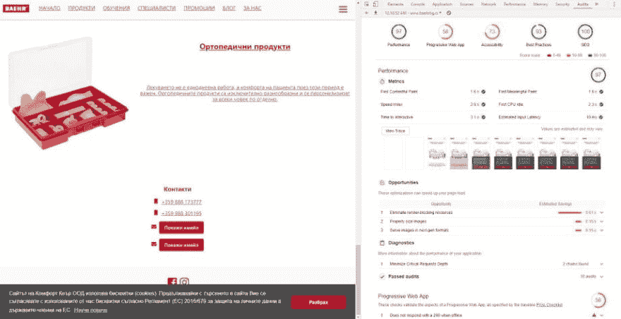](https://blog.georgi-yanev.com/static/1e2a8abc64764ebecf597c7631e26b50/6cf22/jamstack-with-gatsby-and-netlify-23.jpg) 

盖茨比，知足者，网络生活，反应揭示，反应图标

我从构建这些项目中获得了很多乐趣。事实上，它们是从 Netlify 部署的，这为我节省了大量时间。

> 事实上，我认为自从我开始使用 Netlify 以来所经历的时间与我部署和维护的项目数量之间有直接的关联。

前者也非常重要，因为有很多次我需要修复一个错别字，消灭一个 bug，而我所要做的就是将我的修复提交给存储库。Netlify 负责剩下的工作，自动部署我的站点！

我所有的项目都是开源的，可以在 https://github.com/jumpalottahigh 的 GitHub 上获得

 [<source type="image/webp">
<source type="image/png">
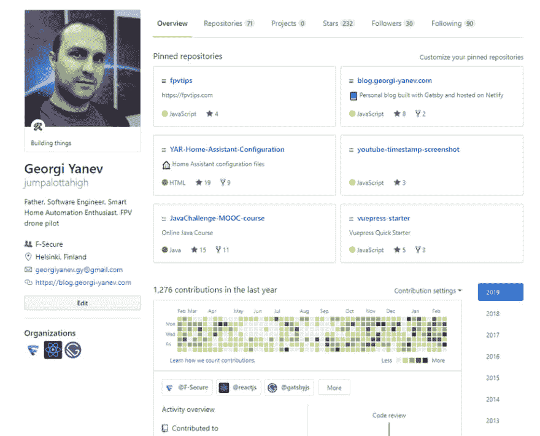](https://blog.georgi-yanev.com/static/bb0277c53e0c395327fb86b8a9f9b5f9/92f32/jamstack-with-gatsby-and-netlify-24.png) 

### 👩‍🎓如果你想了解更多…

根据什么对你有用，你可能更喜欢通过做、看视频或阅读来学习。不管是什么情况，我都推荐阅读官方的《盖茨比》教程，并在需要的时候浏览《T2》文档。此外，还有许多项目，包括许多 Gatsby 初学者，您可以通过示例来学习。

### 贡献并获得奖品

Gatsby 是开源的，因此很乐意接受你的贡献。这也是一个很好的学习方法，为什么不在学习的时候拿一些甜蜜的礼物呢？

 [<source type="image/webp">
<source type="image/png">
](https://blog.georgi-yanev.com/static/7c6894a382f46f5db1b6a2f4e3d5b9bb/1bee4/jamstack-with-gatsby-and-netlify-25.png) 

## 🔚结论

我希望我能让你兴奋起来，和盖茨比和 Netlify 一起做点什么。最后归结起来就是这样。我从中获得了很多乐趣，并且我觉得使用这些技术很有成效。他们真的帮我发货了。这就是为什么我想分享我的经验，并希望激励你今天也建立一些东西。

此外，我希望我能够理解**性能问题**这一点。今天，我们所有人都有责任为明天建设网络。我们如何做到这一点很重要，不应低估快速、高质量的体验。

去和盖茨比和 Netlify 一起玩积木吧！