# Vue 和 GraphQL 与 Hasura 视频课程

> 原文：<https://dev.to/hasurahq/vue-and-graphql-with-hasura-video-course-3mpp>

# Vue 和 GraphQL 与 Hasura 视频课程

大家好，欢迎来到视频课程系列，在这个系列中，我们将使用开源的 Hasura GraphQL 引擎用 GraphQL 创建 Vue 应用。

液体错误:内部

在本课程中，我们将一步一步地创建一个 Vue 博客 CMS，我们将涵盖执行 GraphQL 查询、变异和订阅的主要方面。

我们将在 Heroku 上免费学习如何设置和部署 Hasura。我们将看到 Hasura 如何在一个新的(或现有的)Postgres 数据库之上提供一个实时 GraphQL API，我们将使用它来构建我们的 Vue 应用程序。

看看下面的课程，享受学习的乐趣吧！

# [1。什么是 GraphQL](https://dev.to/hasurahq/what-is-graphql-1akh)

在这个视频中，我们将讨论 GraphQL 的基础知识，以及为什么它比 REST 更好。尽管这个视频将涵盖 GraphQL 的基本概念，但如果你想了解更多，我建议你查看我最近做的免费 GraphQL 训练营，以更深入地了解什么是 GraphQL 及其功能

液体错误:内部

# [2。用 Hasura 引擎创建自动生成的 CRUD API](https://dev.to/hasurahq/auto-generating-crud-graphql-api-using-hasura-47o2)

[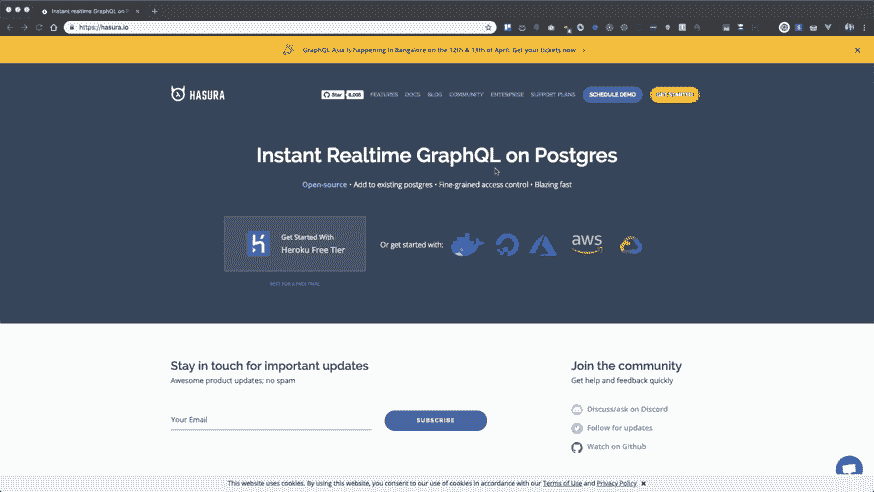](https://dev.to/hasurahq/auto-generating-crud-graphql-api-using-hasura-47o2)

在这个视频中，我们将介绍如何开始使用 Hasura engine，以及它将如何为您自动生成 GraphQL API。我们将在课程中为我们将要构建的博客 cms 应用程序定义数据的形式

# [3。用远程模式和事件触发器扩展 CRUD API](https://dev.to/hasurahq/extending-crud-api-with-remote-schemas-and-event-triggers-2dmd)

[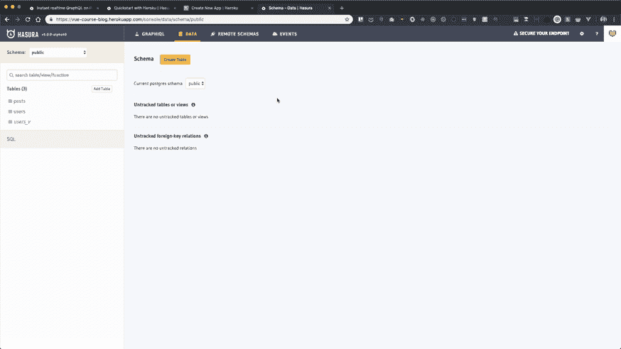](https://dev.to/hasurahq/extending-crud-api-with-remote-schemas-and-event-triggers-2dmd)

这个视频介绍了 Hasura 通过两种不同的方法向 CRUD API 添加业务逻辑的能力:远程模式和事件触发器。远程模式基本上可以让您将 Hasura 自动生成的 GraphQL 模式连接到您自己的服务器或外部 GraphQL API 的任何不同的 GraphQL 模式。另一种方法是使用 Hasura 事件系统添加由数据库事件触发的无服务器函数。这两种方法将在本课程的后续部分进行更详细的解释

# [4。使用管理机密保护 Hasura GraphQL 端点](https://dev.to/hasurahq/securing-hasura-graphql-endpoint-with-admin-secret-key-3nf8)

[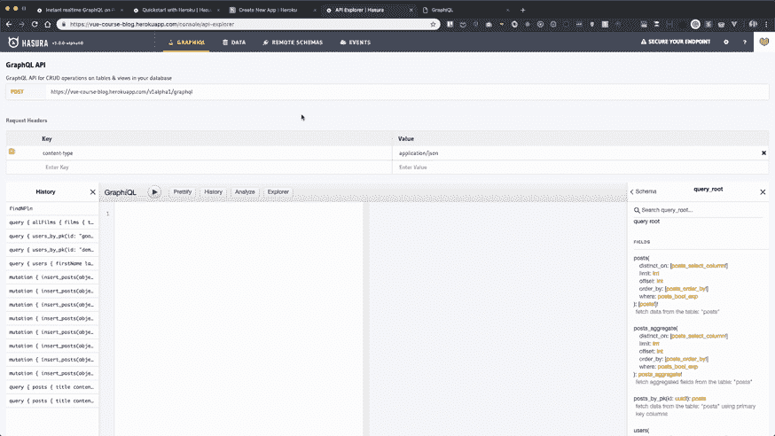](https://dev.to/hasurahq/securing-hasura-graphql-endpoint-with-admin-secret-key-3nf8)

让您的 GraphQL 端点不安全是一个坏主意，因此在本视频中，我们将介绍如何使用秘密密钥来保护您的 GraphQL 端点。

# [5。在现有数据库上本地运行 Hasura 引擎](https://dev.to/hasurahq/running-hasura-engine-locally-on-existing-database-56p1)

[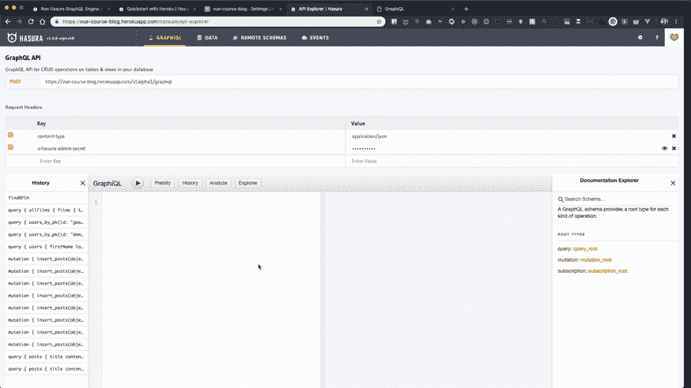](https://dev.to/hasurahq/running-hasura-engine-locally-on-existing-database-56p1)

在这个视频中，我们将从在 Heroku 中运行 Hasura 引擎转移到使用 Docker 在本地运行它，同时仍然连接到部署到 Heroku 的 Postgres 数据库。我们将看到，我们在前面步骤中定义的所有内容都保持不变，并将演示引擎如何在现有数据库以及新数据库上运行。从这一步你可以理解，只要你能在 Docker 容器中运行引擎，基本上你就能在任何支持 Docker 的云中的任何环境中运行它。

# [6。用 Apollo 客户端设置 Vue app 并查询数据](https://dev.to/hasurahq/setting-up-vue-app-with-apollo-client-and-querying-graphql-endpoint-for-data-2899)

[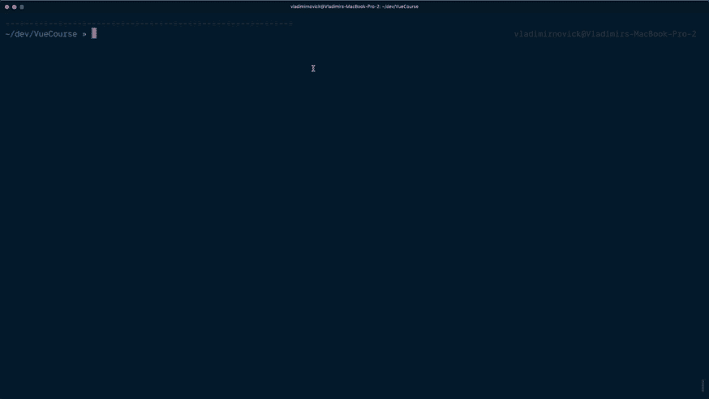](https://dev.to/hasurahq/setting-up-vue-app-with-apollo-client-and-querying-graphql-endpoint-for-data-2899)

在本视频中，我们将开始使用 Vue CLI 创建我们的 Vue 应用程序，并使用 Apollo 客户端进行设置。我们将把它连接到本地 docker 容器中运行的已经安全的 GraphQL 端点，并执行基本的 GraphQL 查询

# [7。执行 GraphQL 查询时的不同陷阱](https://dev.to/hasurahq/different-gotchas-when-executing-graphql-queries-242)

[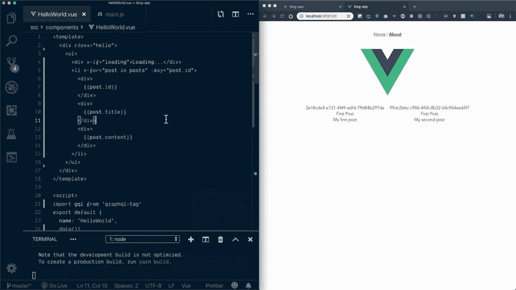](https://dev.to/hasurahq/different-gotchas-when-executing-graphql-queries-242)

在本视频中，我们将介绍不同的数据查询方式以及 apollo client 为我们提供的各种方法，这样我们就可以按照自己想要的方式操作数据。

# [8。在你的模板](https://dev.to/hasurahq/use-apolloquery-component-inside-your-template-8gp)中使用`ApolloQuery`组件

[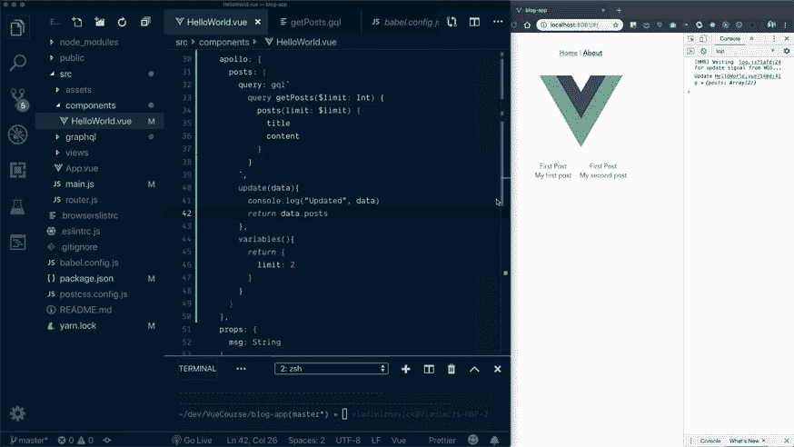](https://dev.to/hasurahq/use-apolloquery-component-inside-your-template-8gp)

Apollo Client 附带了一个 ApolloQuery helper 组件，它为您提供了一个将所有数据查询转移到 Vue 模板中的选项。在这节课中，我们将讨论如何使用它。除此之外，我们还将使用。gql 文件，所以我们所有的查询、变更和订阅都将驻留在文件系统中的一个地方，这将使它们更容易被找到

# [9。在我们的 Vue 应用中使用 GraphQL 突变来插入帖子的不同方式](https://dev.to/hasurahq/different-ways-of-using-graphql-mutations-in-our-vue-app-for-inserting-posts-36o1)

[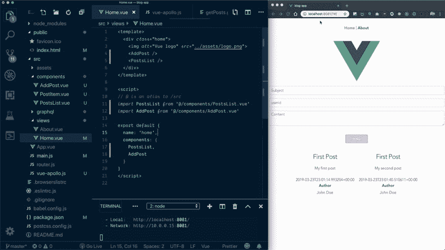](https://dev.to/hasurahq/different-ways-of-using-graphql-mutations-in-our-vue-app-for-inserting-posts-36o1)

现在，当我们可以通过不同的方式轻松查询数据时，是时候让我们的应用程序更具交互性了。在这一课中，我们将讲述如何在我们的 Vue 应用程序中执行突变，以及如何通过创建 AddPost 表单来插入新数据。

# [10。使用`delete_posts`突变](https://dev.to/hasurahq/delete-posts-conditionally-using-deleteposts-mutation-18m4)有条件删除帖子

[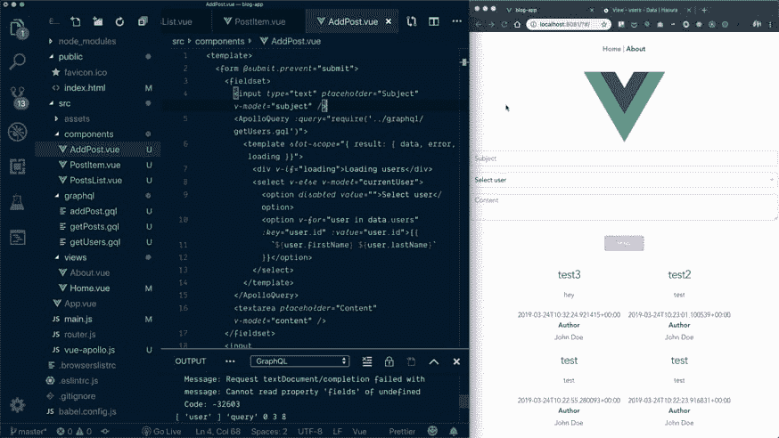](https://dev.to/hasurahq/delete-posts-conditionally-using-deleteposts-mutation-18m4)

Hasura auto 以特定的方式生成 GraphQL API。为了插入数据，我们使用了 insert_posts 突变。在这个视频中，我们将学习如何使用 delete_posts 突变，以及使用 Hasura 提供的 where 输入类型向我们的删除逻辑添加条件。

# [11。通过订阅在您的 Vue 应用中配置实时更新](https://dev.to/hasurahq/configure-real-time-updates-in-your-vue-app-with-subscriptions-2lnj)

[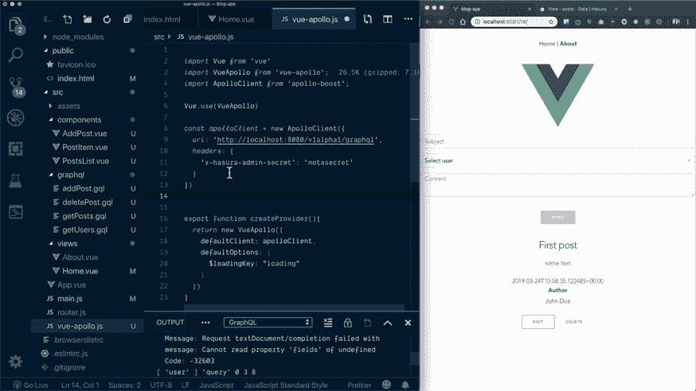](https://dev.to/hasurahq/configure-real-time-updates-in-your-vue-app-with-subscriptions-2lnj)

在这一课中，我们将通过添加由 Hasura engine 自动生成的 GraphQL 订阅来为我们的应用程序添加实时功能。我们将重新配置我们的 Apollo 客户端，从使用简单的解决方案 apollo-boost 到更复杂的订阅设置。我们将学习如何在我们的 apollo 提供程序中使用$subscribe，并将了解数据如何实时更新。

# [12。定义查询时使用`subscribeToMore`来获得部分更新](https://dev.to/hasurahq/using-subscribetomore-when-defining-a-query-to-get-partial-updates-1mp0)

[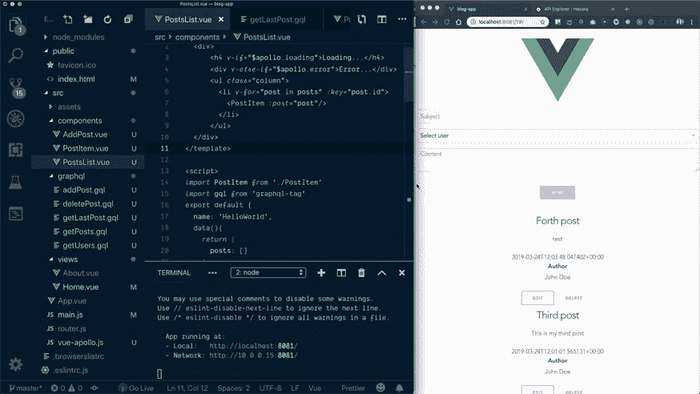](https://dev.to/hasurahq/using-subscribetomore-when-defining-a-query-to-get-partial-updates-1mp0)

在这一课中，我们将了解如何使用订阅来获取部分数据并补充我们定义的查询。这样，我们就不需要重新加载整个数据集，而只需要重新加载最新添加的数据

# [13。将`subscribeToMore`移动到模板](https://dev.to/hasurahq/move-subscribetomore-to-be-more-declarative-by-moving-it-to-the-template-4bd0)中，使其更具声明性

[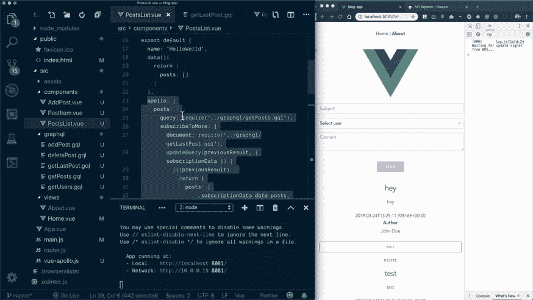](https://dev.to/hasurahq/move-subscribetomore-to-be-more-declarative-by-moving-it-to-the-template-4bd0)

在这一课中，我们将看到如何使用`ApolloSubscribeToMore`组件将我们所有的查询和订阅语法移动到更具声明性的模板中。

## 结论

正如你所看到的，完成这个视频课程后，你将有足够的信心使用 Hasura 用 GraphQL API 创建自己的 Vue 应用程序。如果你喜欢这些内容，在 twitter 上发推文提及[、@VladimirNovick](https://twitter.com/VladimirNovick) 和[、@HasuraHQ](https://twitter.com/HasuraHQ) ，并提出你希望在课程即将到来的更高级的部分听到的内容。该计划包括认证、权限管理、Vuex，将 Hasura 与您自己的 GraphQL 服务器相结合，使用无服务器功能添加业务逻辑。
请务必查看以下 youtube 频道，了解更多内容:

[弗拉基米尔·诺维克 Youtube 频道](https://www.youtube.com/channel/UCxiXx-gMssQnY0hTt5bStpw)
T3】哈苏拉 Youtube 频道

[课程库](https://github.com/vnovick/vue-course-blog-cms)

如有疑问，请联系[不和谐](https://discord.gg/hasura)