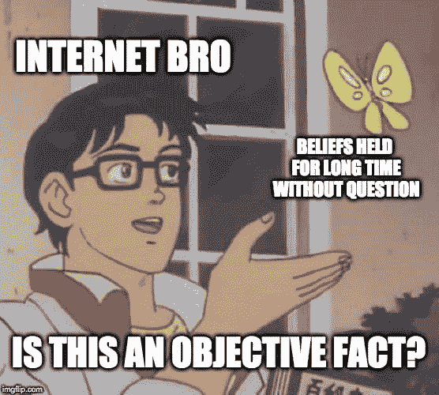
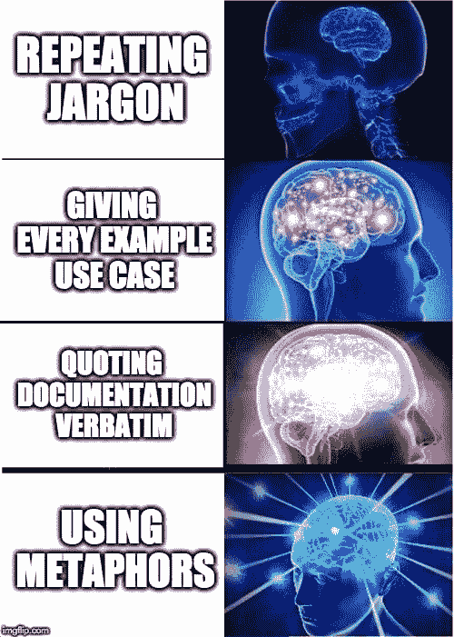
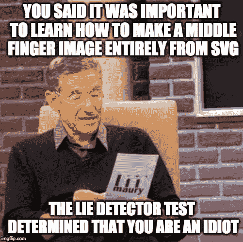

# 新闻专业的五堂编程课

> 原文：<https://dev.to/maxwell_dev/five-programming-lessons-from-a-journalism-major-190>

和很多程序员一样，在我找到编程之前，我有不同的职业目标。在我的案例中，我发现编程已经超过了获得报纸和在线新闻学士学位的一半。在过去的两年里，我在最后一堂编辑课上写了很多代码，教授们让我全职为这门课程编程，而其他人都在编辑文章。

这是一个强有力的信号，表明我的职业目标已经转移到了别的事情上，我的教授已经疯了，或者两者兼而有之。我从来没有在学校里发现任何装满狗粮的秘密掩体，不管我怎么找，所以这很可能是第一件事。

然而，我从这个专业学到了很多东西，我不想浪费掉！其中五个有用的经验是:

*   即使灯灭了，你仍然可以继续交谈
*   不要在工作时跳舞，即使你的工作正在舞池里或附近
*   避免在报社员工聚会上和你迷人的特写编辑玩啤酒乒乓
*   安·库尔特的安全细节令人毛骨悚然地盯着她的观众
*   把姓拼错会被处以死刑

现在这里有五个对程序员非常有用的教训！

## 1。做好恐慌的准备

就在我的第三次报道任务中，事情变得非常糟糕。这并没有导致紧急清理和抓十几只雪貂的错误，我从高中学到了很多。但还是很糟糕。

我被指派去报道一个诗歌活动，我以为是一周后。但后来从我的宿舍楼我发现这是可能的，并在 15 分钟内开始。因此，我在校园里跑了一英里，边跑边用手机搜索，在快要昏倒的时候进行了我的第一次面试。

意识到我的错误和事件结束之间的那段时间是我一生中最恐慌的时刻之一。但从那以后，我很少再感到如此恐慌，这种抵触情绪对我这个程序员帮助很大。最好的例子是当紧急的产品错误被报告时(尤其是我可能犯的错误)。更容易喘口气，找到解决方案，并打开一个拉请求，而不是在焦虑的愤怒中砸碎我的键盘。又来了。

不是每个程序员都可以通过报告来建立他们的抗恐慌能力，我不能建议人们给自己施加压力来做好准备。但是，如果保持头脑冷静很难，用你喜欢的活动创造虚假的“恐慌情境”可以帮助你做好准备。这可能很简单，就像给一个项目设定一个自己设定的最后期限，让自己习惯于在高墙关闭时的匆忙工作。

然而，暴露的是，从短跑到一个事件或采访陌生人或用 Twizzler 绳蹦极，当生产代码出错时，建立恐慌抵抗力是很好的。冷静的头脑可以更快、更好、更可靠地解决问题。一个不知所措、焦虑的程序员所做的修复可能会导致以后更糟糕的问题。

这些问题并不像那些雪貂发现了逃生出口和我高中没收的毒品那样糟糕，但仍然相当糟糕。

## 2。独立于“客观”

在我的第一堂新闻伦理课上，我们的老师描述了一篇文章，该文章描绘了一幅当地住房的可怕画面。它没有为事情变得如此糟糕辩护的观点，因为记者联系的每个人都拒绝置评。班上许多人认为这篇文章是片面的，不够客观。

我们的教授告诉我们，这篇文章完全是根据公共记录写的。第二次看的时候，我们发现这篇文章没有观点，只是一些她发现的事实，并给出了恰当的上下文。教授说这些都是独立的消息来源，与记者自己的观点无关，这使得它更加真实。这是清楚和片面的，但仍然反映了真相。

那堂课告诉我们，人类总是有无法完全认识和消除的偏见。将自己的观点建立在独立的来源上，与我们的信念分开，是避免这些偏见的更好的方法。独立比“客观”更重要，因为对人类来说客观并不真正存在。尤其是那些在网上胡说八道，声称自己比别人更“客观”的人。

这一课对我的重大编程决策帮助很大，比如公司的组件库。我最初选择[模式实验室](https://patternlab.io/)是因为它过去的成功，这使我使用它的“客观”决定产生了偏差。从独立的信息源来看，比如公司的代码需求和模式实验室的文档，它显然不是最合适的工具。这很难，但我后来减少了损失，转而使用更简单的风格指南。

我发现这是几乎所有技术决策的好方法，尤其是在工具方面。接受你总是会有偏见驱使你做出你可能都没有意识到的决定，而是把决定建立在独立信息的基础上。这些可以是项目需求、工具或框架文档，以及来自无关第三方的建议。无论你感觉如何，所有这些都可以清楚地描绘出某件事对这份工作来说是对是错。这种方法更难，但最终对一个人的团队更好。

## 3。用一个比喻解释一下

用隐喻来解释事情给我节省的时间比我在做报告的时候还多。最常见的情况是:

*   需要在字数有限的文章中解释一些复杂的东西
*   在面试问题中解释一些复杂的东西，这样我就可以了解这个人的想法
*   用新知识分散校园警察的注意力来掩盖我第一次吸食大麻的事实

隐喻对所有这些都很有用，因为它们将新知识附加到人们已经理解为“知识捷径”的东西上就像豪斯医生一样，隐喻成了我解释任何事情的退路。

这也导致了我理解新事物的经验法则- **如果我不能用一个比喻来解释它，那我对它还不够了解。**

你会用什么隐喻来描述 HTML 和 CSS 之间的关系？JavaScript 函数呢？我听过的好例子有:

*   网页中的 HTML 和 CSS 就像是一个穿着奇装异服的人。HTML 标记是基本的人体，CSS 造型是他们穿的衣服，甚至是他们如何摆姿势。
*   JavaScript 函数就像习惯。我们的大脑把常见的行为保存为“习惯”，所以我们可以不假思索地重复它们。JavaScript 函数就像一个程序的习惯，代码把它们保存起来以备后用，并且几乎不用思考就可以重复。

这也是为什么我在网上记下我学到的所有有用的东西的部分原因，即使一页主要是重述别人说过或写过的话。只要我能用自己的话写出一个像样的解释，它就给了我很好的例子或比喻来提醒自己，以防以后忘记。

我曾在家庭聚会上用这样的比喻来解释我所做的事情，以及这与他们在其他网站上看到的东西有什么关系。这很快让他们相信我是一个聪明、正常的成年人，可以谋生。任何人都有足够的理由学习有效的隐喻用法。

恰当地使用隐喻可以改善沟通，节省时间，并获得家人的广泛认可。新闻业告诉我，对所有职业的投资都是值得的，不仅仅是对它本身和编程。

## 4。不同意礼貌

2013 年的一周，纽约通过了一项枪支控制法，作为对桑迪胡克事件的回应，我想听听校园里民主党和共和党的观点。正如你所料，民主党认为这还不够，共和党认为这太多了。在这两次采访中，我都想表示不同意，就像我在与朋友的政治会谈中所做的那样。但作为一名记者，我不会这么做，因为我需要与这些团体保持良好关系。这是关于寻找新的视角，而不是改变它们。所以我点点头，听着，问我的问题，有时会憋在桌子底下，感谢他们的时间。

您可能想知道这如何适用于编程。还记得 Twitter 上那些关于 CSS、JavaScript 框架或其他任何东西的“讨论”吗？有几十次类似的情况，我听一位同事大谈设计或开发偏好，有人问我自己的看法，为了我们两个人的工作，我不得不回答，但不要引起争吵。

我发现的最重要的事情是提醒自己**这些对话的目标不是让某人“赢”作为一名记者，这是为了理解一个新的视角，并把我的感受留到以后，这也是我作为一名程序员所遵循的原则。**

除此之外，我还发现了一些在面试中对我有帮助的经验法则:

*   让他们推动对话。人们喜欢谈论自己。这是保持关系完整的小小代价。他们说得越多，你就越不可能说些引发争吵的话。
*   **保持平和的语气和中性的语言。**否则你会给人留下你不把他们的观点当回事的印象，不管你说什么。
*   用限定词引导所有观点，如“我自己对 X 的体验是”或“我发现的是”这清楚地表明你的观点来自不同的经历，你不会无意中否定他们自己的观点。
*   不要打岔。语言就像交通，所以不要在试图挤到他们前面的时候撞车。
*   如果在敏感话题上的巨大分歧是不可避免的，简单地说你可能不同意，这没关系。
*   任何异议都应该简单、中立且合乎逻辑。反驳越是基于情感，风险就越大。有疑问的时候，不要提。

如果我采访了校园里的白人民族主义者，他们相信女人只是家庭主妇，黑人是劣等人，我还能继续这样做吗？可能不会，因为有些话题很难做到“求同存异”。幸运的是，这永远不会出现在我或任何阅读这篇文章的人工作的地方。

只要没有人向我扔出“CSS 不是一种严肃的编程语言”的炸弹。

> 

## 5。对你的知识要有选择性

我写的很多文章都有很多我喜欢但不得不删掉的细节。故事中的每个细节都必须添加一些重要的东西。总有一些好的细节我不得不删除，为伟大的细节让路。随着时间的推移，我对文章中使用的内容变得更加挑剔，在空间允许的情况下，先从最重要的部分开始，然后再添加其他部分。

这慢慢变成了我的日常记忆习惯。很多人叫我忘记他们认为我会记得的愚蠢细节，比如他们的年龄或者他们的“名字”是什么。我已经变得如此习惯于接受信息，快速查看它在我生活中的潜在用途，然后保留或丢弃它。我把自己的想法看做一篇长篇文章:篇幅有限，我总是在删减我所包含的内容。

我并不是说程序员应该为了他们的生活而这样做，因为我自己、我的伙伴和许多我只知道脸而不知道名字的人都希望我不要这样做。但是有一个更好的例子来说明作为一个程序员所学到的东西。对学习一件事情说“是”意味着默认对许多其他事情说“不”。把你的编程知识想象成你职业道路上的一篇文章——这种语言或工具是否增加了足够的东西来证明保留它是正确的，还是应该被删除？

这就是我如何对待自己的学习，编辑出更深层次的 React 和 Ruby 知识，以换取基础和高级的 JavaScript，这将使我的职业生涯走得更远。我经常把我会很感兴趣的事情放在一边，去关注更重要的话题。

如果故事发生了变化，我最终编写了完全不同的东西，我会拿出我的精神编辑笔，引入新的基本知识来关注。知道该学什么和知道不该学什么一样重要。

### 总之

虽然我对自己的程序员生涯很满意(到目前为止)，但我仍然不后悔专注于新闻业。这些课程和工作帮助我发展了我第一个真正的职业技能，这些技能简单却非常有用——倾听、学习、写作、总结、保持冷静和最后时刻的极端有氧运动。即使是现在，我仍然怀念这份工作的某些部分——看到我的作品被别人阅读和引用，接触到许多不同的事件和享受这些事件的人，以及为明天的报纸撰稿后倒在床上的那种纯粹的快乐。

我努力坚持我的新闻教育，一方面帮助我现在的职业生涯，另一方面提醒自己，尽管我选择了这条路，但所有这些年(和学生贷款)并不是(绝对)浪费。我现在记得的所有课程都是这么做的，即使记住某篇文章意味着我再也不会在夜总会和陌生人跳舞。

扣除我的治疗费用，这是很小的代价。