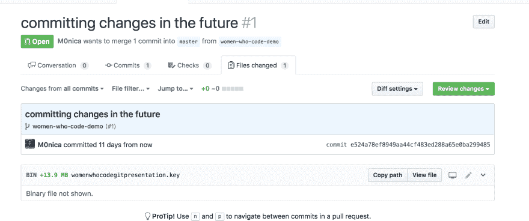

# git 很难，但是 git 中的时间旅行很容易。

> 原文：<https://dev.to/m0nica/git-is-hard-but-time-travel-in-git-is-easy-dhb>

本文将解释如何提交未来的代码。

我总是(错误地)认为 GitHub 是根据他们网站的服务器时间来确定提交时间的。我做这个假设是因为对于某些用户操作，GitHub 会使用他们的服务器时间，例如当一个拉请求被打开时。然而，有一天我在调试一个只在特定日期出现的日历问题。我能够通过更改我的计算机时间在本地重现并解决这个错误。然后，我将 git 分支和我的解决方案一起推到 GitHub 上的远程 git 存储库进行代码审查，并意识到 GitHub 提交反映了 git 存储库本地版本中设置的日期，这是由您的计算机的系统时间而不是他们的服务器决定的。

GitHub、GitLab 和 BitBucket 是 git 存储库托管服务，它们提供了一个集中的地方来托管 git 存储库的远程版本。这些网站在 git 的基础上建立了额外的功能，通过代码审查界面和其他功能使软件开发过程更加协作化，这些功能使它更像一个社交网络，而不仅仅是一个命令行界面。

如果你想在未来有意为之，你需要手动调整电脑的时间吗？不，您可以简单地传递 git 环境变量来设置日期和时间。

下面一行:

`GIT_AUTHOR_DATE="Wed Mar 27 15:12:30 2019 -0700” GIT_COMMITTER_DATE="Wed Mar 27 15:12:30 2019 -0700” git commit -m “future commit”`

将提交日期定为 2019 年 3 月 27 日，无论当前日期是在 3 月 27 日之前还是之后。如果你给一个项目发送了一个补丁，其中一个核心成员应用了这个补丁，那么你们两个都得到了荣誉——你是 GIT_AUTHOR，核心维护者是 GIT_COMMITTER。

您可以[重写您的 git 历史](https://git-scm.com/book/en/v2/Git-Tools-Rewriting-History)并将更改应用到任何过去的提交。

这篇文章基于我在 2019 年 3 月与纽约编码女性的一次闪电谈话。幻灯片可以在这里观看[。](http://aboutmonica.com/gitlightningtalk.pdf)