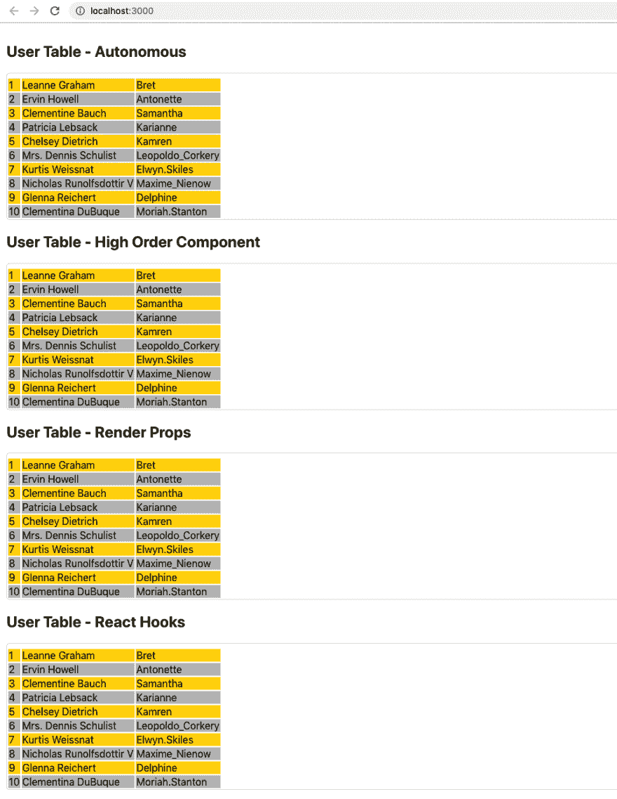
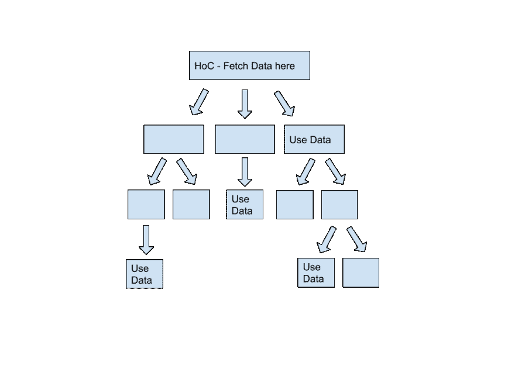

# React 中的数据获取模式

> 原文：<https://dev.to/bnevilleoneill/patterns-for-data-fetching-in-react-5a01>

[](https://res.cloudinary.com/practicaldev/image/fetch/s--fHXbt8Ap--/c_limit%2Cf_auto%2Cfl_progressive%2Cq_auto%2Cw_880/https://cdn-images-1.medium.com/max/1024/1%2AorWFEkEBGIK4xFXwF7BCMA.jpeg)

React 非常适合在分层组件视图中显示数据。但是您的组件如何获取数据呢？有许多方法可以解决这个问题，每种方法都有自己的优缺点。

在本文中，我将通过实际操作的例子，以及它们的各种替代方法，来涵盖所有主要的方法。当你读完之后，你会对数据获取有一个清晰的理解。您将能够决定哪种方法最适合您的应用程序，并且有一些代码示例可供构建。完整的源代码在这里可以找到[。](https://gitlab.com/the-gigi/react-data-patterns-demo)

### React 中的数据抓取策略

有相当多的数据获取策略，React 团队还在不断增加。在这一节中，我将讨论所有当前的方法，并提供一些关于它们何时合适的上下文。实际操作的例子是一个简单的 React 应用程序，它有一堆从 [JSONPlaceholder](https://jsonplaceholder.typicode.com/users) 获取用户的组件。

JSONPlaceholder API 非常适合于测试一些前端代码，而不用担心编写自己的服务器或选择一些公共 API，这可能需要进行身份验证或对您进行更改并破坏您的代码。[点击此处了解更多信息](https://github.com/typicode/jsonplaceholder)。

所有组件呈现相同的数据，看起来也一样。我在所有组件中使用 [React 引导表](http://allenfang.github.io/react-bootstrap-table/)进行实际渲染，但是组件在获取数据的方式上有很大不同。

它看起来是这样的:

[](https://res.cloudinary.com/practicaldev/image/fetch/s--LCD8XEwB--/c_limit%2Cf_auto%2Cfl_progressive%2Cq_auto%2Cw_880/https://cdn-images-1.medium.com/max/968/1%2APwO0TDnVfXCHm9snD_1aaQ.png)

主应用程序组件只是一个功能组件。它呈现了各种数据模式组件，说明了每种数据获取方法:

```
import React from ‘react’;
import ‘./App.css’;
import UserTableAutonomous from “./components/UserTableAutonomous”;
import UserTableHOC from “./components/UserTableHOC”;
import UserTableReactHooks from “./components/UserTableReactHooks”;
import UserTableRenderProps from “./components/UserTableRenderProps”;
import SimpleUserTable from “./components/SimpleUserTable”;
function App() {
 return (
   <div className=’App’>
     <h2> User Table — Autonomous</h2>
     <UserTableAutonomous/>
     <h2> User Table — High Order Component</h2>
     <UserTableHOC/>
     <h2> User Table — Render Props</h2>
     <UserTableRenderProps children={SimpleUserTable}/>
     <h2> User Table — React Hooks</h2>
     <UserTableReactHooks/>
   </div>
 );
}
export default App 
```

事不宜迟，我们开始吧。

[](https://logrocket.com/signup/)

#### 服务器提供的数据

这是为你的应用程序获取数据的传统方式。数据嵌入在从服务器发送的 HTML 中。如果需要新数据，需要手动刷新页面或定期刷新页面。还记得这个吗？

```
<meta http-equiv="refresh" content="30"> 
```

这与 React 应用程序并不特别相关，React 应用程序有更动态、更细粒度的方式来更新自身，但这仍然是从服务器向浏览器获取数据的合法方式。许多遗留的 web 应用程序仍然在使用它，如果 JavaScript 被禁用或者您必须处理古老的浏览器，它甚至可能是最好的方法。绝对是非常简单直白的。

#### 组件获取自己的数据

React 组件可以获取自己的数据。最大的问题是*何时*获取数据。有几个选项:

*   从没有数据开始，根据用户操作(如单击按钮)获取数据
*   加载一次数据
*   定期加载数据

由于组件是完全自治的，没有人(没有其他组件)可以告诉它是时候加载数据了。在本例中，我选择在 componentDidMount()中第一次加载数据，并设置了一个计时器，该计时器将每五秒钟读取一次数据。

让我们来看看 UserTableAutonmous 组件，并一点一点地剖析它。这是一个标准的基于类的 React 组件。它的状态包括两个字段:一个 Boolean isFetching，初始化为 false，因为它还没有获取，以及一个空的用户列表，这是它想要获取的数据。

```
class UserTableAutonomous extends Component {
    constructor(props) {
        super(props);
        this.state = {
            isFetching: false,
            users: []
        };
    } 
```

render()方法呈现 BootstrapTable 组件，将状态中的当前用户传递给它。如果正在获取，也会显示“获取用户…”消息。这是非常初级的进度报告。引导表将只显示每个用户的 id、名称和用户名字段，尽管还有几个其他字段。

```
render() {
        return (
            <div>
                <BootstrapTable data={this.state.users} 
                                trClassName={rowClassNameFormat}>
                    <TableHeaderColumn isKey dataField='id' />
                    <TableHeaderColumn dataField='name' />
                    <TableHeaderColumn dataField='username' />
                </BootstrapTable>
                <p>{this.state.isFetching ? 'Fetching users...' : ''}</p>
            </div>
        )
    } 
```

正如我前面所讨论的，实际的数据获取发生在 componentDidMount()中，这是在组件被挂载并准备就绪时调用的 React 生命周期方法。有些人可能会认为使用 componentWillMount()更好，当组件将要被挂载时调用它，并且更早地开始数据获取以节省时间。然而，有两个重要的理由反对它。

首先，[它已被弃用](https://reactjs.org/docs/react-component.html#mounting)，并将在 React 17 中消失。第二，当你在 componentWillMount()中使用 fetch API 或 axios 时，React 会在没有等待它完成的情况下进行渲染，这将导致第一次空渲染——所以你并没有真正节省任何时间。

注意 componentDidMount()在第一次渲染的之后被调用*，所以您仍然需要处理第一次空渲染。在我们的演示中，我使用了“获取用户…”消息。另一种选择是在构造函数中进行初始数据获取，但这会延迟组件的首次呈现。*

好了，就这么定了——我们将在 componentDidMount()中获取数据。该代码简单地调用 fetchUsers()方法并启动一个计时器，该计时器将每五秒钟调用一次 fetchUsers()。

```
componentDidMount() {
        this.fetchUsers();
        this.timer = setInterval(() => this.fetchUsers(), 5000);
    } 
```

当我们的组件离开时，componentWillUnmount()方法被调用，这是通过调用 clearInterval()并将其设置为 null 来停止计时器的好时机。

```
componentWillUnmount() {
        clearInterval(this.timer);
        this.timer = null;
    } 
```

我不会向您展示完整的 fetchUsers()方法，因为有几种实现它的替代方法——我们将在后面详细讨论。现在，只是为了吊你的胃口，这里有一个经过编辑的版本。

它将 isFetching 状态变量设置为 true，因此在获取新数据时，组件呈现“获取用户…”消息。然后，它通过一些“魔法”得到用户，set 又返回到 false。

```
fetchUsers() {
     this.setState({...this.state, isFetching: true});
        users = <REDACTED>
     this.setState({...this.state, isFetching: false});
        // error handling
        <REDACTED>
    } 
```

我不太喜欢自主组件；他们太像一个黑箱了。它们混合了数据获取和数据显示这两种非常不同的关注点，并且它们也更难测试。

#### hoc 获取数据并传播给子节点

高阶组件是复合组件，其中顶层组件负责获取数据并将其传播给子组件。高阶组件可以任意嵌套。

几个后代组件可能接收提取数据的不同部分，而层次结构中的其他组件可能根本不使用这些数据。这里有一个小图表来说明这一点:

[](https://res.cloudinary.com/practicaldev/image/fetch/s--k-tTtGpK--/c_limit%2Cf_auto%2Cfl_progressive%2Cq_auto%2Cw_880/https://cdn-images-1.medium.com/max/960/1%2AA90BqgoJOJLgdka2EnTTIQ.png)

基本思想是将获取和分发数据的考虑与实际处理数据的考虑分离开来。在多个组件需要不同方面的数据的情况下，这也更有效，因为您只需获取一次数据。让我们看看结果如何。

SimpleUserTable 组件对服务器、生命周期方法、数据获取或错误处理一无所知。它所做的只是在 props 中接收用户列表，并使用 BootstrapTable 组件呈现它们。它理解用户对象的属性，并期望一个 id、名称和用户名。

```
import React from 'react'
import {BootstrapTable, TableHeaderColumn} from 'react-bootstrap-table'
import '../css/Table.css'
import '../../node_modules/react-bootstrap-table/dist/react-bootstrap-table-all.min.css'
function rowClassNameFormat(row, rowIdx) {
    return rowIdx % 2 === 0 ? 'Gold-Row' : 'Silver-Row';
}
const SimpleUserTable = (props) => {
    return (
        <div>
            <BootstrapTable data={props.data} 
                            trClassName={rowClassNameFormat}>
                <TableHeaderColumn isKey dataField='id' />               
                <TableHeaderColumn dataField='name' />
                <TableHeaderColumn dataField='username' />
            </BootstrapTable>
            <p>{props.isFetching ? 'Fetching users...' : ''}</p>
        </div>
    )
};
export default SimpleUserTable 
```

有趣的是，关于用户对象的知识只是一个局部视图。从 JSONPlaceholder 返回的实际用户对象有更多的信息:

```
{
    "id": 1,
    "name": "Leanne Graham",
    "username": "Bret",
    "email": "[Sincere@april.biz](mailto:Sincere@april.biz)",
    "address": {
      "street": "Kulas Light",
      "suite": "Apt. 556",
      "city": "Gwenborough",
      "zipcode": "92998-3874",
      "geo": {
        "lat": "-37.3159",
        "lng": "81.1496"
      }
    },
    "phone": "1-770-736-8031 x56442",
    "website": "hildegard.org",
    "company": {
      "name": "Romaguera-Crona",
      "catchPhrase": "Multi-layered client-server neural-net",
      "bs": "harness real-time e-markets"
    }
  } 
```

SimpleUserTable 只关心 id、名称和用户名。如果后端服务器添加更多的信息或删除/重命名一些未使用的字段，这完全没问题。

那么，什么获取实际数据呢？这就是 UserTableHOC。它通过调用更新用户的 fetchUsers()方法在其 componentDidMount 中获取用户，isFetching 是状态。render()方法只是将状态传递给子 SimpleUserTable。

```
import React, {Component} from 'react'
import SimpleUserTable from "./SimpleUserTable";

const USER\_SERVICE\_URL = '[https://jsonplaceholder.typicode.com/users'](https://jsonplaceholder.typicode.com/users');

class UserTableHOC extends Component {
    constructor(props) {
        super(props);
        this.state = {
            isFetching: false,
            users: []
        };
    }

render = () => <SimpleUserTable data={this.state.users}
                                isFetching={this.state.isFetching}
    />;

componentDidMount() {
        this.fetchUsers();
    }

fetchUsers = <REDACTED>
}

export default UserTableHOC 
```

在实践中，我们将 UserTableAutonomous 分成两个嵌套的组件；代码基本相同，但是更简洁。更重要的是，我们已经做好了准备，以防我们需要多个组件以不同的方式显示用户数据。

例如，如果我们希望启用用户选择，然后在另一个组件中显示所选用户的完整信息(例如 FullUserInfo)，UserTableHOC 可以将相关的用户信息传递给 FullUserInfo 组件。

这听起来很棒，但是在这些情况下有很多工作要做，比如通知 HOC 关于子组件中的选择，以及通过深度嵌套的组件层次结构来传递提取的数据。

因此，HOC 不仅负责获取数据，还负责呈现层次结构中直接位于它下面的组件，并可能响应来自这些子组件的事件。

我们的下一个数据模式解决了这些问题，但是它也有自己的权衡。

#### 通用提取器组件

如果我们可以实现一个通用的数据提取器，它完全不知道应该如何处理数据，那会怎么样？事实证明这是一种常见的做法。诀窍是使用间接层。俗话说，“你可以用一个[附加的间接层](https://en.wikipedia.org/wiki/Indirection)来解决计算机科学中的任何问题……除了太多间接层的问题。”

反应模式通常被称为渲染道具。其思想是将一个属性传递给一个组件，该组件是一个函数，而不是一个静态值或对象。接收对象将执行这个 prop，它经常在 render()方法中使用——因此命名为 render prop。

这为您带来的是通过用您的函数替换部分逻辑来深度定制目标组件工作方式的能力。如果你熟悉面向对象的设计模式，它类似于策略模式或模板方法模式。

UserTableRenderProps 的代码与 UserTableHOC 非常相似。最大的区别在于 render()方法，该方法调用其 props.children()函数。这增加了抽象层次，因为组件不需要知道任何关于其子组件的信息。

```
import {Component} from 'react'
import axios from 'axios'

const USER\_SERVICE\_URL = '[https://jsonplaceholder.typicode.com/users'](https://jsonplaceholder.typicode.com/users');

class UserTableRenderProps extends Component {
    constructor(props) {
        super(props);
        this.state = {
            isFetching: false,
            data: []
        };
    }

render = () => this.props.children(this.state);

componentDidMount() {
        this.fetchUsers();
    }

fetchUsers = <REDACTED>
}

export default UserTableRenderProps 
```

这很酷，但这意味着无论传递什么，渲染支柱都需要知道内部结构。

什么时候使用渲染道具才有意义？一个很好的例子是在深层次结构中，数据获取组件可以共享一个缓存。在这种情况下，让多个数据提取器具有不同的子级是有意义的，这与 HOC 相反，HOC 的子级是固定的(在 HOC 组件的 render()方法中硬编码)。

让我们再来看看 App.js 中的 App()函数组件，它将子渲染属性传递给 UserTableRenderProps。如您所见，它需要知道 SimpleUserTable 并传递它。

```
function App() {
    return (
        <div className='App'>
            <h2> User Table - Autonomous</h2>
            <UserTableAutonomous/>
            <h2> User Table - High Order Component</h2>
            <UserTableHOC/>
            <h2> User Table - Render Props</h2>
            <UserTableRenderProps children={SimpleUserTable}/>
            <h2> User Table - React Hooks</h2>
            <UserTableReactHooks/>
        </div>
    );
} 
```

#### 用 React 钩子取数据

到目前为止，数据获取需要一个基于类的组件，具有状态和生命周期方法。但是 [React 16.8 带给我们的是钩子](https://reactjs.org/docs/hooks-intro.html)。

诸如高阶组件和渲染道具之类的模式要求您重新构建组件层次结构和/或通过层次结构传播大量状态(直接使用道具或者使用各种包装器、提供者和消费者)。此外，人们还纠结于类及其实现方式。

React Hooks 的思想是将状态管理分解成独立的功能，不需要将状态的圆栓放入类生命周期方法的方孔中。React 的所有特性都可以在功能组件中使用，并且不需要类。特别是，我们可以使用 React 钩子来获取数据。

让我们检查 UserTableReactHooks 功能组件的代码。首先，使用初始状态调用 useState()状态挂钩。这类似于构造函数。钩子返回两个值:当前状态和更新它的函数。请注意，您可以拥有多个状态挂钩，如果您需要独立更新状态的不同部分，这可能会很有用。

```
import React, {useEffect, useState} from 'react';
import axios from "axios";
import SimpleUserTable from "./SimpleUserTable";

const USER\_SERVICE\_URL = '[https://jsonplaceholder.typicode.com/users'](https://jsonplaceholder.typicode.com/users');

function UserTableReactHooks() {
    const [data, setData] = useState({users: [], isFetching: false}); 
```

到目前为止，一切顺利。为了执行像数据获取这样的副作用，我们将使用一个效果钩子。默认情况下，效果挂钩接受一个函数并在每次渲染后运行它。

在本例中，我希望它只运行一次，所以我传递了一个函数和一个空数组。数组参数告诉钩子只在数组中列出的状态变量改变时才应用效果(即运行函数)。因为我传递了一个空数组，所以不需要观察状态变量，效果只运行一次。

```
useEffect(() => {
        const fetchUsers = async () => {
            try {
                setData({users: data.users, isFetching: true});
                const response = await axios.get(USER\_SERVICE\_URL);
                setData({users: response.data, isFetching: false});
            } catch (e) {
                console.log(e);
                setData({users: data.users, isFetching: false});
            }
        };
        fetchUsers();
    }, []); 
```

您可以将效果视为基于类的组件的 componentDidMount()和 componentDidUpdate()的组合。

最后，它只是返回带有本地状态的 SimpleUserTable 进行呈现。

```
return <SimpleUserTable data={data.users}
                            isFetching={data.isFetching}
    />
}

export default UserTableReactHooks 
```

挂钩是一个很酷的和符合人体工程学的额外反应。我强烈建议你[熟悉他们](https://reactjs.org/docs/hooks-intro.html)。

#### 悬念数据抓取

悬念是一个相对较新的 React 特性，它允许组件在等待一些长时间运行的操作完成时显示一些东西作为后备。显然，数据获取是一个长时间运行的操作，您可能希望在获取数据时显示类似消息、进度条或微调器的内容。

不幸的是，在撰写本文时，[获取数据](https://reactjs.org/blog/2018/11/27/react-16-roadmap.html#react-16x-mid-2019-the-one-with-suspense-for-data-fetching)的悬念还没有发布——所以我不得不暂时让你保持悬念。(看到我在那里做了什么吗？)也就是说，有一个自定义 React 钩子的实现，用于与悬念兼容的数据获取。我自己没有试过，所以既不能肯定也不能否定它的功效。如果你有兴趣，[看看这里。](https://github.com/CharlesStover/fetch-suspense)

#### 混合方法

当然，您可以混合搭配不同的方法。如果您已经有了一些以某种方式获取数据的组件，以及使用另一种方法的其他组件，它们都可以愉快地生活在同一个应用程序中。但是如果你是从零开始，使用 React 钩子——以及不久的将来的悬念——可能是最好的方法。

### 数据抓取策略

是时候揭开神秘的 fetchUsers()函数了。我在不同的组件中使用了三种不同的实现。所有的实现都完成相同的任务。备选方案有:

*   内置的获取 API
*   阿克斯
*   异步/等待+ Axios

我同样可以使用带有 Fetch 的 async/await。我在不同的组件中任意使用了不同的实现；它们都是可以互换的。利弊更多的是人体工程学而非功能性。

#### 使用获取 API

我在 UserTableHOC 组件中使用了 Fetch。我实际上调用了 fetchUsersWithFetchAPI()函数，但是将它赋给了一个名为 fetchUsers 的变量，所以组件只调用 fetchUsers()。

该函数首先将 fetch 变量设置为 true，然后调用 fetch。Fetch 返回一个承诺，该承诺解析为一个响应。响应的 json()方法返回一个 JavaScript 对象。然后，它将用户设置为状态，并将 isFetching 重置为 false。如果出错，catch 处理程序会将错误记录到控制台，并在获取完成后重置 isFetching 变量。

```
fetchUsersWithFetchAPI = () => {
        this.setState({...this.state, isFetching: true});
        fetch(USER\_SERVICE\_URL)
            .then(response => response.json())
            .then(result => {
                this.setState({users: result, isFetching: false})
            })
            .catch(e => {
                console.log(e);
                this.setState({...this.state, isFetching: false});
            });
    };

fetchUsers = this.fetchUsersWithFetchAPI 
```

它非常冗长和麻烦，但是它是标准的，没有外部依赖性——这是 Fetch API 的卖点。话说回来，这是 JavaScript 许许多多的依赖是这片土地的法则。输入 Axios。

#### 使用 Axios

我将 Axios 用于 UserTableRenderProps 组件。Axios 也有一个类似于 Fetch 的基于 promise 的 API，但是 Axios 省去了 JSON 解析阶段，处理所有错误。例如，Fetch API 返回 404 作为正常响应，因此您需要在代码中检查响应，并在需要时自己抛出一个错误。

```
fetchUsersWithAxios = () => {
        this.setState({...this.state, isFetching: true});
        axios.get(USER\_SERVICE\_URL)
            .then(response => {
                this.setState({data: response.data, isFetching: false})
            })
            .catch(e => {
                console.log(e);
                this.setState({...this.state, isFetching: false});
            });
    };

fetchUsers = this.fetchUsersWithAxios 
```

代码几乎与 Fetch API 版本相同，只少了一个步骤和更健壮的错误处理。

#### 利用异步/等待

我在 UserTableAutonomous 组件中使用了 async/await 语法。这些承诺链是对旧的回调地狱的巨大改进，但它可以变得更好。看看用 async/await 编写的相同代码看起来有多好多自然:

```
async fetchUsersAsync() {
        try {
            this.setState({...this.state, isFetching: true});
            const response = await axios.get(USER\_SERVICE\_URL);
            this.setState({users: response.data, isFetching: false});
        } catch (e) {
            console.log(e);
            this.setState({...this.state, isFetching: false});
        }
    };

fetchUsers = this.fetchUsersAsync; 
```

毫无疑问，这是我最喜欢的变体。

#### REST 与 GraphQL 后端

用户 API 是一个 REST API。GraphQL 后端怎么样？GraphQL 服务器通常也通过 HTTP 返回 JSON。主要区别在于，只有一个查询端点来获取数据(这里忽略了突变和订阅)，请求和返回的实际数据遵循 GraphQL 模式。数据获取策略和战术并不区分 REST 和 GraphQL，它们在两者上都同样适用。

现在，WebSockets 或 gRPC 是一个不同的故事——我们将把它留到另一天。

### 结论

我们在这篇文章中涉及了很多内容。我们探讨了所有常见的 React 数据获取策略和战术。我们权衡了每种方法的利弊，并用代码演示了每种方法。此时，我会使用 async/await 语法使用 React 钩子和 Axios。在不久的将来，检验数据获取的悬念会很有趣。

* * *

### Plug: [LogRocket](https://logrocket.com/signup/) ，一款适用于网络应用的 DVR

[](https://logrocket.com/signup/)

<figcaption>[https://logrocket.com/signup/](https://logrocket.com/signup/)</figcaption>

LogRocket 是一个前端日志工具，可以让你回放问题，就像它们发生在你自己的浏览器中一样。LogRocket 不需要猜测错误发生的原因，也不需要向用户询问截图和日志转储，而是让您重放会话以快速了解哪里出错了。它可以与任何应用程序完美配合，不管是什么框架，并且有插件可以记录来自 Redux、Vuex 和@ngrx/store 的额外上下文。

除了记录 Redux 操作和状态，LogRocket 还记录控制台日志、JavaScript 错误、堆栈跟踪、带有头+正文的网络请求/响应、浏览器元数据和自定义日志。它还使用 DOM 来记录页面上的 HTML 和 CSS，甚至为最复杂的单页面应用程序重新创建像素级完美视频。

[免费试用](https://logrocket.com/signup/)。

* * *

在 React 中获取数据的模式的帖子[最早出现在](https://blog.logrocket.com/patterns-for-data-fetching-in-react-981ced7e5c56/)[的博客](https://blog.logrocket.com)上。