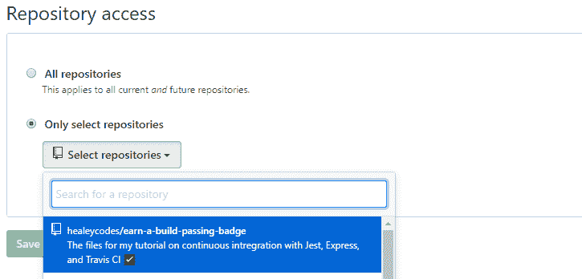
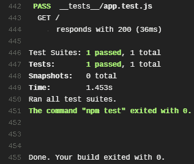

# 在 GitHub ✅上赢取构建通过徽章！使用 Travis CI 测试您的 Express 应用程序

> 原文：<https://dev.to/healeycodes/earn-a-build-passing-badge-on-github--testing-your-express-app-with-travis-ci-1m2f>

Travis CI 在 GitHub 上为开源项目提供免费的测试版本。不接受他们的提议，你就是个傻瓜。他们的电子邮件提醒已经多次保存了我的项目。

在本教程中，我们将为持续集成(CI)设置一个快速应用程序。每当我们提交到我们的`master`分支时，Travis CI 将克隆我们的存储库，构建一个 linux 的云版本，安装任何需要的依赖项，并运行我们的测试！希望他们通过！如果没有，我们会被警告的。

#### 安装

用`npm init -y`设置一个快速`package.json`文件。然后抓取 Express: `npm i express --save`以及 supertest 和 Jest，我们的开发依赖:`npm i supertest jest --save-dev`。

或者克隆[库](https://github.com/healeycodes/earn-a-build-passing-badge)，作为项目的一个实例！

#### 从 Express 中取出应用程序

带有 Express 的默认 hello world 应用程序如下所示:

```
// app.js

const express = require('express');
const app = express();
const port = 3000;

app.get('/', async (req, res) => res.status(200).send('Hello World!'));

app.listen(port, () => console.log(`Our app listening on port ${port}!`)); 
```

这适用于手动测试。我们可以运行这个应用程序并检查是否返回了正确的页面——但是如果我们有 50 个具有复杂逻辑的页面呢？我们希望自动化这一过程。第一步是导出我们的`app`对象。当我们运行测试时，我们不需要一个活动的 HTTP 服务器。

让我们修改一下 hello world 应用程序。

```
// app.js

const express = require('express');
const app = express();

app.get('/', async (req, res) => res.status(200).send('Hello World!'));

// Don't listen, just export
module.exports = app; // <-- 
```

太好了。但是我们现在如何启动我们的应用程序呢？我们将使用[关注点分离](https://en.wikipedia.org/wiki/Separation_of_concerns)，并将对`listen()`的调用放在另一个名为`server.js`的文件中(该文件也使用了`app`对象！)

```
// server.js

const app = require('./app');
const port = 3000;

app.listen(port, () => console.log(`Our app listening on port ${port}!`)) 
```

为了启动我们的应用程序，我们现在使用`node server.js`。让我们将它添加到我们的`package.json`中，这样人们就可以简单地使用`npm start`。默认情况下，Node.js 会寻找一个`server.js`文件，但是让我们明确一下。

```
"scripts":  {  "start":  "node server.js"  }, 
```

#### 测试

一种常见的模式是将您的测试放在根目录下一个名为`__tests__`的文件夹中。另一种模式是重复被测试文件的名称，在`.js`前插入`.test`。由此，`__tests__/app.test.js`。

我们将使用 Jest 作为测试工具。Jest 将在`__tests__`内部进行默认搜索，并运行找到的任何测试文件。您可以通过`--testMatch`使用自定义测试搜索。

> 默认情况下[Jest]会查找。js，。jsx，。ts 和。`__tests__`文件夹中的 tsx 文件，以及任何后缀为。测试或。规格(例如 Component.test.js 或 Component.spec.js)。它还会找到名为 test.js 或 spec.js 的文件。

在我们的测试中，supertest 将模拟对我们的`app`对象的请求。模拟请求比启动服务器和使用实时请求更快，也更容易预测。这也使得在需要时编写[安装和拆卸](https://jestjs.io/docs/en/setup-teardown)方法变得更加容易。

```
// __tests__/app.test.js

const app = require('../app');
const request = require('supertest');

// `describe` is used for test components
describe('GET /', () => {

    // `it` is for individual tests
    it('responds with 200', async () => {
        await request(app)
            .get('/')
            .expect(200); // If the status code is not 200, this test will fail
    });
}) 
```

让我们向我们的`package.json`添加另一行，这样我们的测试就可以用`npm test`来运行。我们使用`start`和`test`别名的原因是为了让我们的软件在开发者第一次使用它时是可预测的，也是为了让它和其他包一起玩得更好。

```
"scripts":  {  "start":  "node server.js",  "test":  "jest"  }, 
```

`npm test`产生以下输出。

```
 PASS  __tests__/app.test.js
  GET /
    √ responds with 200 (39ms)

Test Suites: 1 passed, 1 total
Tests:       1 passed, 1 total
Snapshots:   0 total
Time:        2.681s
Ran all test suites. 
```

#### 特拉维斯词

让我们[将这段代码放入 GitHub 上的一个库](https://help.github.com/en/articles/create-a-repo)，并安装 [Travis CI GitHub 应用](https://github.com/apps/travis-ci)。确保您测试的回购启用了 Travis CI。

[](https://res.cloudinary.com/practicaldev/image/fetch/s--WtDRlZzM--/c_limit%2Cf_auto%2Cfl_progressive%2Cq_auto%2Cw_880/https://thepracticaldev.s3.amazonaws.com/i/vwl9jlzk6rdojt802wls.png)

正如特拉维斯 CI [教程](https://docs.travis-ci.com/user/tutorial/)告诉我们的:

> 向存储库添加一个. travis.yml 文件，告诉 Travis CI 要做什么。

在我们的例子中，就是这么简单。除了我们希望测试构建使用哪个版本的 Node.js 之外，我们不需要指定任何额外的设置。Travis CI 将使用默认的测试别名`npm test`。

```
# .travis.yml

language: node_js
node_js:
 - lts/* # Long Term Support 
```

将这个文件提交并推送到 GitHub 将会立即对一个测试构建进行排队。您可以在`travis-ci.com/{your-username}/{your-repo}`观看构建的实时执行，并在以后查看它们，看看哪里出错了。使用此页面也可以获得 Travis CI 构建状态徽章的降价！

[](https://res.cloudinary.com/practicaldev/image/fetch/s--4HxXd8dn--/c_limit%2Cf_auto%2Cfl_progressive%2Cq_auto%2Cw_880/https://thepracticaldev.s3.amazonaws.com/i/2oolgrqq8wg2mkgd4gtu.png)

如果你遇到问题，发推文 [@healeycodes](https://twitter.com/healeycodes) 或者在[资源库](https://github.com/healeycodes/earn-a-build-passing-badge)中提出问题！

* * *

加入我的关于编程和个人成长的[时事通讯](https://buttondown.email/healeycodes)的 150 多人注册！

我发关于科技的微博。