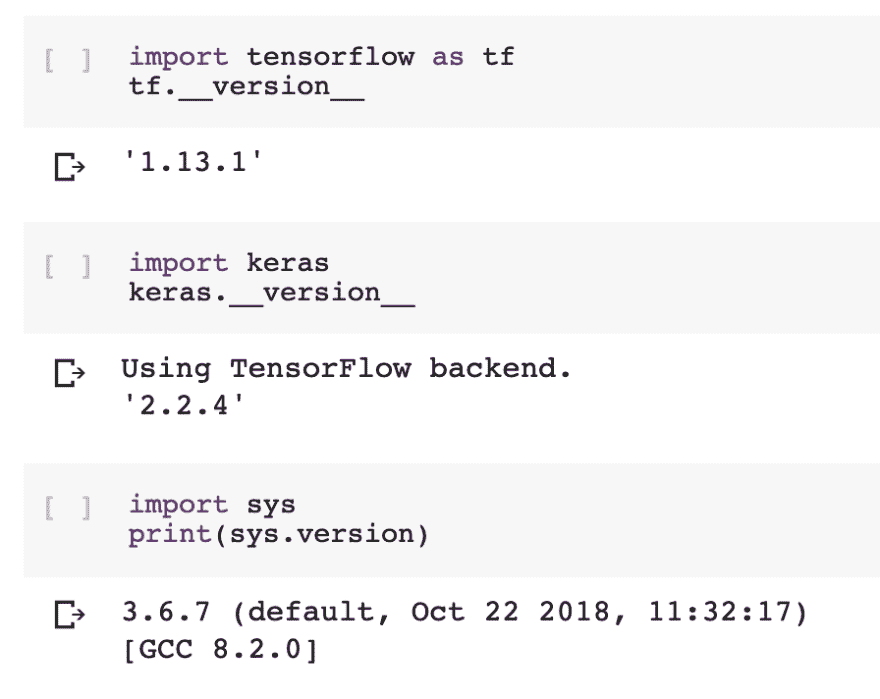
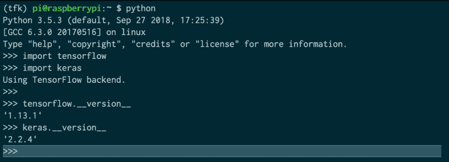

# 将您的 Raspberry Pi Model B 设置为 Google Colab(2019 年 2 月),以便与 Tensorflow、Keras 和 OpenCV 配合使用

> 原文：<https://dev.to/rodolfoferro/setup-your-raspberry-pi-model-b-as-google-colab-feb-19-to-work-with-tensorflow-keras-and-opencv-k6p>

*以更好的格式阅读这篇文章，访问[我的博客](https://rodolfoferro.xyz/Setup-your-Raspberry-Pi-as-Google-Colab/)。*

> **描述:**设置 OpenCV，Tensorflow 和 Keras 就像在 Google Colab 但是在你的 Raspberry Pi，LOL。

## 动机(奋斗是真实的！)

前几天，我正在愉快地使用 Google Colab 上的 Tensorflow 后端训练我与 Keras 一起构建的一些神经网络。在我完成 4 或 5 个不同的深度神经网络的训练后，我将训练好的模型下载到我的 Raspberry Pi 3 Model B 中，并意识到它无法编译这些模型中的任何一个...但是 Google Colab 能够编译它们...

一开始我觉得这很奇怪，但很快我发现这可能是由我使用的版本(Python、Tensorflow 和 Keras)引起的。我的 Raspberry Pi 运行的是 Python 3.4，Tensorflow 1.1.0(从头编译)和 Keras 2.1.0，同时 Google Colab 运行的是以下内容:

<center>

</center>

无论如何，在几天尝试了一些安装之后，在阅读了许多帖子和堆栈溢出答案之后，我最终解决了所有问题并写了这篇博客，我希望它对那些在自己的*raspi*上与这些安装斗争的人非常有帮助。

## 我们开始吧

在进行任何安装之前，请确保您正在进行 [Raspbian 拉伸](https://www.raspberrypi.org/downloads/raspbian/)。你可以从官方网站下载，并用[蚀刻机](https://etcher.io/)将操作系统镜像写入你的存储卡。*(是的，我完全打破了我的 Raspbian 杰西之前，注意到这将与 Raspbian 拉伸罚款和容易。)*

在你的 Raspberry Pi 上完成基本配置(连接到 Wi-Fi，启用`ssh`连接，以及其他一切)后，我们准备开始安装主包。

首先，我们需要安装`pip` :

```
wget https://bootstrap.pypa.io/get-pip.py
sudo python3 get-pip.py 
```

Enter fullscreen mode Exit fullscreen mode

## 创建虚拟环境

我们将在本地环境中工作，所以我们需要安装`virtualenv`和`virtualenvwrapper`。要使用`pip`安装它们，我们只需要在我们的终端中运行:

```
sudo pip install virtualenv virtualenvwrapper 
```

Enter fullscreen mode Exit fullscreen mode

我们需要在`~/.profile`中添加以下几行。让我们使用 nano 通过做`sudo nano ~/.profile`打开它，并将这些行附加到末尾:

```
# virtualenv and virtualenvwrapper
export WORKON_HOME=$HOME/.virtualenvs
export VIRTUALENVWRAPPER_PYTHON=/usr/bin/python3
source /usr/local/bin/virtualenvwrapper.sh 
```

Enter fullscreen mode Exit fullscreen mode

我们现在关闭文件并保存它(`CTRL+X`、`Y`、`Y`)，我们需要在我们的终端中“源化它:

```
source ~/.profile 
```

Enter fullscreen mode Exit fullscreen mode

现在我们有了虚拟环境设置，我们将创建一个名为`tfk`(代表 Tensorflow & Keras)的新虚拟环境。为此，我们只需运行:

```
mkvirtualenv tfk -p python3 
```

Enter fullscreen mode Exit fullscreen mode

这应该用我们的 Stretch 的默认 Python 3 版本(3.5.3)创建一个虚拟环境，并且它也应该被激活。在任何情况下，激活/停用虚拟环境:

```
# Activate environment after sourcing ~/.profile
workon tfk

# Deactivate environment
deactivate 
```

Enter fullscreen mode Exit fullscreen mode

## 安装 OpenCV

我们将为任何图像预处理安装 OpenCV，这将为我们的卷积神经网络提供信息(至少对我来说，它的结果非常有用)。

先安装一些 OpenCV 之前的依赖:

```
sudo apt-get install libcblas-dev libatlas-base-dev libjasper-dev 
sudo apt-get install libhdf5-dev libhdf5-serial-dev
sudo apt-get install libqtgui4 libqt4-test 
```

Enter fullscreen mode Exit fullscreen mode

安装完依赖项后，在虚拟环境中安装 OpenCV:

```
pip install opencv-contrib-python 
```

Enter fullscreen mode Exit fullscreen mode

这应该在虚拟环境中安装 OpenCV，我们应该能够测试它来验证安装:

<center>

</center>

## 安装 Tensorflow 和 Keras

为了在我们的 Raspberry Pi 中安装 Tensorflow，我们将使用`pip`并从 https://github.com/lhelontra/tensorflow-on-arm[的](https://github.com/lhelontra/tensorflow-on-arm/)文件中直接安装它。具体来说，我们将安装 [1.13.1](https://github.com/lhelontra/tensorflow-on-arm/releases/tag/v1.13.1) 版本。

要从这个源代码直接安装 Tensorflow，我们可以简单地运行:

```
pip install https://github.com/lhelontra/tensorflow-on-arm/releases/download/v1.13.1/tensorflow-1.13.1-cp35-none-linux_armv7l.whl 
```

Enter fullscreen mode Exit fullscreen mode

这应该会产生神奇的效果，至少对于 Tensorflow 来说是这样。

现在，为了继续 Keras，我们将安装一些(更多)依赖项和一个更新:

```
sudo apt-get install libblas-dev liblapack-dev gfortran
sudo apt-get install python3-dev python3-setuptools
sudo apt-get install python3-numpy python3-scipy python3-h5py

sudo apt-get update 
```

Enter fullscreen mode Exit fullscreen mode

最后，我们可以在虚拟环境中使用`pip`安装 Keras】

```
pip install keras 
```

Enter fullscreen mode Exit fullscreen mode

这应该已经完成了魔术，现在与 Keras。

让我们验证我们的安装:

<center>

</center>

## 其他包的结束和安装

到目前为止，我们已经在我们的虚拟环境中为 Python 3 安装了一些基本的包，就像 Google Colab 中使用的版本一样(可能虚拟环境更好的名字应该是`gcolab`或其他什么)...).这将允许我们在我们的 Raspberry Pi 中编译和运行模型，这些模型是使用 Google Colab 在云中训练的。

为了安装其他有用的包，我们可以在我们的虚拟环境中继续使用`pip`，例如:

```
# To install pandas, matplotlib, scikit-learn, flask, and requests
pip install pandas matplotlib scikit-learn flask requests 
```

Enter fullscreen mode Exit fullscreen mode

我希望这篇文章能有所帮助。