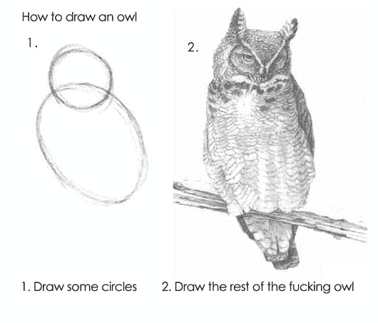

# 用点击游戏学习第 2 部分:CSS

> 原文：<https://dev.to/bastionthedev/learning-with-clicker-games-part-2-css-196i>

这是三部分系列的第二部分:
[第一部分，用 HTML 布局](https://dev.to/bastionthedev/learning-with-clicker-games-part-1-html-1i4b)
**第二部分，用 CSS 样式**
第三部分，与 JS 交互

在这一部分，我们将学习 CSS！在本系列的第一部分中，我们使用 HTML 构建了点击游戏的基本布局。现在，我们将采取这种布局，使它看起来更好！

* * *

当我最初进入 web 开发时，CSS 是最先真正吸引我的东西之一。能够真正操纵用户看到的和交互的内容...就像魔法一样！就像魔术一样，规则可能是复杂而神秘的。然而，它完成了工作！

幸运的话，在这篇文章的最后，我们的点击器游戏将会是这样的:

[https://codepen.io/BastionTheDev/embed/MxqXQM?height=600&default-tab=result&embed-version=2](https://codepen.io/BastionTheDev/embed/MxqXQM?height=600&default-tab=result&embed-version=2)

如果你已经熟悉 CSS，试着自己设计一下吧！你会看到我们也增加了一些内容，只是为了让游戏更加用户友好。一般的 HTML 和我们在第 1 部分中构建的是一样的。

### 什么是 CSS？

CSS 代表**级联样式表**。它本质上是一套规则，告诉浏览器*HTML 应该如何呈现。这个想法是 HTML 是内容，而 CSS 是表现。*

> 将表示和内容分开也是一种帮助我们的网站更容易被屏幕阅读器理解和访问的方式。他们可以从 HTML 中选择他们需要的东西，而忽略 CSS！

那么，它看起来像什么？通常是这样的:

```
body { // tag
  background-color: black;
  color: white;
}

.upgrade-button { // classname
  width: 200px;
  height: 50px;
}

#header { // id
  height: 50%;
} 
```

首先，您放置一个标识符，后跟`{}`，然后将规则应用到`{}`之间的标识符。这些标识符是什么？嗯，它们可以是像`<div>`或`<body>`这样的标签。它们也可以是所谓的**类名**或**id**。类和 id 是可以在 HTML 元素上定义的属性，这样就可以对它应用特定的样式。

```
<div class="container wide" id="main-container"></div> 
```

这些属性是用空格分隔的标识符列表。类可以在页面上出现多次，所以它们适合于重复出现的元素。然而，id 在一个页面上应该只出现一次。使用它来确保您只有一个元素。

在 CSS 中，我们用一个`.`来表示我们正在设计一个类，用一个`#`来表示我们正在设计一个 ID。因此，要设置上面 div 的样式，我们可以使用:

*   `div {}`基于标签的样式
*   `.container {}`或`.wide {}`来根据类别设置样式
*   `#main-container {}`以 ID 为基础的样式

### 层叠

您还可以组合标识符，使它们更加具体。例如，`div.container.wide {}`将只针对同时应用了容器和宽类的 div 标签。

如果多个样式应用于同一个标签，则更具体的样式将胜出。这就是术语**级联**的来源。如果你的样式表看起来像

```
div {
  background-color: black;
  width: 100px;
}

div.wide {
  width: 200px;
} 
```

那么任何 div 都将获得初始 div 样式。如果你给一个 div 添加了`wide`类，它仍然会得到`background-color: black`，但是`width: 200px`会覆盖仅适用于 div 标签的宽度。

另一种增加特异性的方法是在其他元素中选择元素。如果在选择器之间添加一个空格，就是告诉浏览器，“这个元素中匹配这个选择器的任何东西都应该获得这些样式。”

```
div.wide a { } 
```

这将针对`<div class="wide">`中的任何`<a>`标签并应用样式。如果你有另一个样式，只是针对`<a>`标签，它会覆盖它们。

关于 CSS 有很多规则需要记住，但是现在我们只关心最后一条。如果两个选择器匹配具有相同特征的内容，那么将应用样式表中的最后一个。

```
div.wide {
  width: 200px;
}

div.override {
  width: 150px;
} 
```

如果你有一个`<div class="override wide">`，那么覆盖样式将被应用，而不是宽样式。

这是足够的理论材料了。如果你想更深入地了解 CSS 特性，看看 Chris Coyier 关于这个主题的文章[！](https://css-tricks.com/specifics-on-css-specificity/)

## 整理好我们的班级

我们去大楼吧！

如果你看了我们的上一篇文章，你可能会看到类似这样的内容:

[https://codepen.io/BastionTheDev/embed/BbLKyj?height=600&default-tab=result&embed-version=2](https://codepen.io/BastionTheDev/embed/BbLKyj?height=600&default-tab=result&embed-version=2)

那么我们如何让它看起来更好一点呢？当设计样式时，我们应该做的第一件事是用清晰易懂的类来组织我们的 HTML。这样，当你回到你的代码时，很容易理解发生了什么。

让我们来看第一部分，实际的点击按钮。如果你看看帖子开头的笔(codepen 示例)，我们想让带有 clicker 按钮的部分更加突出。幸运的是，它已经在自己的 div 中了！我们只需要添加类名。

```
// Original
<div>
  Lines of Code: 0
  <div>
    <button> Write Code </button>
  </div>
</div>

// With classes
<div class="clicker">
  Lines of Code: 0
  <div class="clicker__button-area">
    <button class="clicker__button"> Write Code </button>
  </div>
</div> 
```

再次查看这支笔，您会发现我们确实对布局本身做了一些调整。让我们在这里调整我们的 HTML 来匹配新的布局。你很难在第一次尝试时就得到正确的布局，但是 web 开发的一个令人惊叹的地方就是反馈循环有多快！改东西，查浏览器，调整，查等。等等。

```
<div class="clicker">
  <div class="clicker__button-area">
    <div> 0 Lines of Code </div>
    <button class="clicker__button"></button>
  </div>
</div> 
```

完美！现在，接下来的两个“可购买的”部分几乎是相同的，所以我们将为它们使用相同的类。

```
// Original
<div>
  Number of Extra Hands: 0
  Price: 10
  <div>
    <button> Buy Hands </button>
  </div>
</div>

// With Classes
<div class="buyable">
  Number of Extra Hands: 0
  Price: 10
  <div class="buyable_button-area">
    <button class="buyable__button"> Buy Hands </button>
  </div>
</div> 
```

> 你可能会问自己为什么我要这样写类？这些类大致建立在 [BEM](http://getbem.com/introduction/) 或*块、元素、修饰符*规范的基础上。这是让你的课堂井然有序的好方法！

如果我们再看一下第一支笔，你会发现我们也对这一部分做了一些修改！所以，让我们更新布局来匹配。让我们将整个部分包装在一个新的 div 中，以区别于 clicker 部分。

```
<div class="buyables">
  <div class="buyable">
    <div class="buyable__amount"> 0 </div>
    <div class="buyable__text">
      <div class="buyable__title">
        <span class="buyable__title-text"> Extra Hands </span>
        <span class="buyable__title-price"> 10 Lines of Code </span>
      </div>
      <div class="buyable__description"> More hands on the keyboard = more typing </div>
      <div class="buyable__effect"> Adds 1 line of code per click </div>
    </div>
    <button class="buyable__button"> Buy </button>
  </div>
  ...
</div> 
```

我们应该能够使用这些相同的类来更新其他 buyable！去做吧。

## 实际编写 CSS

如果一切顺利，我们应该有这样的东西。

[https://codepen.io/BastionTheDev/embed/QoVxwr?height=600&default-tab=result&embed-version=2](https://codepen.io/BastionTheDev/embed/QoVxwr?height=600&default-tab=result&embed-version=2)

看起来还是有点丑，但我们现在只处理骨架。让我们继续前进，进入 CSS，使它变得漂亮！

首先，让我们在我们的`index.html`文件旁边添加一个`stylesheet.css`文件。这是我们将要写入所有 CSS 的文件。现在，我们需要告诉 HTML 从哪里获取样式。在 HTML 的`<head>`中，添加

```
<link rel="stylesheet" type="text/css" href="stylesheet.css" /> 
```

这告诉 HTML 样式表是什么以及它在哪里，所以它实际上将我们的样式加载到页面上。当我们添加链接的时候，让我们也用一个来引入 Google Open Sans 字体

```
<link rel="stylesheet" type="text/css" href="//fonts.googleapis.com/css?family=Open+Sans" /> 
```

在我们继续下一步之前，让我们检查一下，以确保工作正常。在你的 CSS 中，只需输入:

```
body {
  background: red;
} 
```

现在，如果你加载了这个页面，你应该会立即后悔这个决定，并被鲜红的内容轰炸。现在我们知道它们是链接在一起的，让我们去掉那条线，为每个部分添加一些更好的背景。

```
.clicker {
  background: #002b35;
}

.buyables {
  background: #fdf6e3;
} 
```

> 我们使用的颜色来自一个叫做[日晒](https://ethanschoonover.com/solarized/)的调色板，我一直在使用它。我觉得这很适合写代码的游戏。

我们走吧！我们完成了基本的颜色，但是比例都很奇怪。让我们解决这个问题。我们希望每个主要部分占据页面的一半，这可以通过使用`height`属性轻松实现；

```
.clicker {
  background: #002b35;
  height: 50%;
}

.buyables {
  background: #fdf6e3;
  height: 50%;
} 
```

现在页面周围还有一个奇怪的空白。原来，浏览器添加了一个默认的`margin`。`margin`属性定义了组件周围需要的额外空间量。我们稍后会更详细地讨论这个问题，但是现在，让我们先忽略它。

```
body {
  margin: 0;
} 
```

现在，让我们将字体系列更新到我们之前导入的开放 San！

```
body {
  font-family: "Open Sans";
  margin: 0;
} 
```

太好了，现在我们已经把画布写好了！下一步，让我们处理顶部。我们希望代码行和按钮内容居中。你有几个选择，但我们将使用大多数行业的趋势， [flex-box](https://css-tricks.com/snippets/css/a-guide-to-flexbox/) 。Flex box 有很多复杂之处，但是现在可以把它看作是一种可以预测内容行为的方式。

我们希望我们的主点击区域是一个 flex 框，并添加一些属性，使其水平和垂直居中。

```
.clicker {
  display: flex; // Makes this div a flexbox
  align-items: center; // This centers things vertically
  justify-content: center; // This centers things horizontally

  background: #002b35;
  height: 50%;
} 
```

这应该使我们的内容居中，现在让我们实际上样式的内容。这向您介绍了三个新概念:

*   分度的角的圆度。
*   `padding`div 内容与其边框之间的空间。对于间距，首先是填充、边框，然后是边距。
*   `opacity`div 有多透明

```
.clicker__button-area {
  background: #fdf6e3;
  border-radius: 8px;
  opacity: .8;
  padding: 30px;
} 
```

最后一点，让我们做一些文本格式化。我们可以使用字体大小和文本对齐来使我们的按钮看起来更加清晰和美观。

```
.clicker__button-area {
  font-size: 24px;
  text-align: center;

  background: #fdf6e3;
  border-radius: 8px;
  opacity: .8;
  padding: 30px;
} 
```

作为这一秒的最后一点，让我们把这个按钮做得像一个键盘！我刚刚从维基共享资源中取出[这张图片](https://upload.wikimedia.org/wikipedia/commons/e/e4/Keyboard-icon_Wikipedians.svg)用于我们的按钮。让我们在`index.html`旁边添加一个`public/`文件夹，并将它放在`public/keyboard.png`。

当设计按钮或下拉菜单这样的样式时，您必须覆盖浏览器的一些默认样式。在这种情况下，默认的背景、边框和轮廓。这里唯一的新东西是 outline，它基本上是一种向用户显示什么元素有焦点的方式。

```
.clicker__button {
  background-color: #fdf6e3;
  border: none;
  outline: none;
} 
```

现在，让我们在这里也引入背景图像的概念。有几个不同的方法来制作图像，但这将向我们展示如何操纵背景！这里最奇怪的是背景尺寸。我们使用`background-size: cover`，它将拉伸图像以填充整个容器。对于其他一些选项，请查看 [Mozilla 文档](https://developer.mozilla.org/en/docs/Web/CSS/background-size)。

```
.clicker__button {
  background-image: url("public/keyboard.png");
  background-size: cover;
  height: 150px;
  width: 250px;

  background-color: #fdf6e3;
  border: none;
  outline: none;
} 
```

很好，如果这里一切顺利，它应该是这样的:

[https://codepen.io/BastionTheDev/embed/ywxEeQ?height=600&default-tab=result&embed-version=2](https://codepen.io/BastionTheDev/embed/ywxEeQ?height=600&default-tab=result&embed-version=2)

除了`font-weight`和一些更高级的 flexbox 恶作剧，我们实际上已经使用了下一节需要的所有 CSS 属性。在继续阅读本页之前，请尝试自己设计应用程序的其余部分！

## 其余的猫头鹰

[](https://res.cloudinary.com/practicaldev/image/fetch/s--IrLK6lj6--/c_limit%2Cf_auto%2Cfl_progressive%2Cq_auto%2Cw_880/https://thepracticaldev.s3.amazonaws.com/i/ep7gw7j6luj70qyx44oq.png)

真正剩下的是屏幕上“可购买”的那一半。这是一切可买的东西生活的地方，因此得名。现在它只是额外的人手和代码猴子，但在未来我们可能会有更多的项目，甚至像这里的升级！

设计时，我喜欢从最大的容器到最小的容器。因为我们已经设计了`.buyables`区域，这意味着下一步是 buyable 本身。

因为我们在这里重用了类，如果我们正确地设计了一个卡的样式，那么其他的也应该是我们想要的样式！让我们从定义可购买卡的大小开始。

```
.buyable {
  width: 600px;
  height: 75px;
} 
```

为了简单起见，现在我们给每样东西固定的高度和宽度。这意味着我们实际上是在设计单一页面宽度。我们真正想要的是用户能够从任何设备访问我们的应用程序，这意味着任何屏幕宽度，而且看起来仍然很好。这个想法被称为[响应式设计](https://developers.google.com/web/fundamentals/design-and-ux/responsive/)，考虑它变得越来越重要。

话虽如此，我们还是留到下次再说吧！现在，让我们向您介绍 borders！

边框环绕我们的标签，位于填充和空白之间。它们有一些你可以定义的属性，比如已经介绍过的`border-radius`。其他几个是:

```
border-color: white | red | #123456;
border-width: thin | thick | 10px;
border-style: solid | dotted | dashed; 
```

大多数属性都是不言自明的，它们告诉浏览器你想要的颜色、大小和边框类型。不过，每次我们想要一个边框时，都要输入很多内容。幸运的是，我们可以使用一些速记！

```
border: 10px solid #123456; 
```

这让我们可以一次定义所有三个属性！利用这一点，现在让我们给我们的卡片加一个边框。

```
.buyable {
  border: 2px solid #002b36;
  border-radius: 8px;

  width: 600px;
  height: 75px;
} 
```

最后，让我们添加一些填充，给我们的内部标签一些喘息的空间，以及空白，给卡片本身一些空间。

```
.buyable {
  padding: 10px 20px;
  margin: 10px;

  border: 2px solid #002b36;
  border-radius: 8px;
  width: 600px;
  height: 75px;
} 
```

这向你介绍了一些新的速记！我们之前已经看到过`padding: 30px`作为一种增加间距的方法，但是当有两个值的时候它是什么意思呢？`padding`是类似于`border`的简写，除了它用于更明确的值:

```
padding-top
padding-right
padding-bottom
padding-left 
```

如果只有一个值，它将所有值都定义为那个值。如果有两个值，就相当于这个:

```
padding: 1 2;

padding-top: 1;
padding-right: 2;
padding-bottom: 1;
padding-right: 2; 
```

我记得哪个定义哪个的方法是第一个值总是定义顶部。您也可以定义所有四个，它们将从顶部开始按顺时针顺序进行。

```
padding: 1 2 3 4;

padding-top: 1;
padding-right: 2;
padding-bottom: 3;
padding-left: 4; 
```

最后一步，让我们将这些卡声明为一个 flexbox 容器，这样我们可以更容易地安排内部标签！

```
.buyable {
  display: flex;

  padding: 10px 20px;
  margin: 10px;
  border: 2px solid #002b36;
  border-radius: 8px;
  width: 600px;
  height: 75px;
} 
```

有了这个，我们应该有一点像这样的东西。

[https://codepen.io/BastionTheDev/embed/VRGdrp?height=600&default-tab=result&embed-version=2](https://codepen.io/BastionTheDev/embed/VRGdrp?height=600&default-tab=result&embed-version=2)

啊哦，我们两个部分之间的空白是怎么回事？原来有一种叫做[边距塌陷](https://css-tricks.com/what-you-should-know-about-collapsing-margins/)的东西可以让边距表现得出乎意料！为了解决这个问题，我们将向`.buyables` div 添加一个`overflow: auto`。`overflow`属性告诉标签，如果某些内容超出了它的盒子，该做什么，但是在我们的例子中，它解决了我们的折叠边距问题。

```
.buyables {
  overflow: auto;
  background-color: #fdf6e3;
  height: 50%;
} 
```

我们已经定义了卡片容器，现在剩下的就是内部了！让我们从最左边的数量开始。我们这里要介绍的第一个新的 flexbox 属性是`align-self`。这个属性告诉标签如何在 flexbox 中垂直对齐自己，类似于前面的`align-items`，所以我们可以更容易地将它居中。

```
.buyable__amount {
  align-self: center;
  font-size: 24px;
} 
```

让我们转到正文部分！我们在这里介绍的第二个 flexbox 概念是`flex-grow`。`flex-grow`是一种告诉浏览器我们希望它在 flexbox 中首先扩展哪些标签的方式。这比那要复杂一点，但是现在已经足够了。我们将使用它来使文本部分填满 amount 和 buy 按钮之间的所有空间，减去一个小的边距。

```
.buyable__text {
  flex-grow: 1;
  margin: 0 20px;
} 
```

完美！让我们深入课文部分，好吗？

我们有两个元素需要特别安排，所以我们将使用另一个 flexbox。

让我们再次向您介绍一个 flex box 属性，`justify-content`。该属性告诉 flex box 如何相对于彼此定位其中的元素。我们使用`space-between`来保持我们的元素尽可能远离彼此。

我们还将使用更具体的`margin-bottom`属性，类似于我们之前谈到的`padding-bottom`。

```
.buyable__title {
  display: flex;
  justify-content: space-between;
  margin-bottom: 5px;
} 
```

在这个标题部分，我们稍微改变了一下字体。我们希望标题突出，所以我们将使用`font-weight`加粗。有些字体可以让你更具体地了解它们的粗细，但是我们现在只需要粗体！

```
.buyable__title-text {
  font-weight: bold;
} 
```

只需添加一个较小的字体大小的效果，我们只有一件事了！

```
.buyable__effect {
  font-size: 12px;
} 
```

现在我们只有按钮了！你也许可以自己做这件事，去试试吧！如果你想让它像我们在页面顶部的代码笔一样像素完美，这里有 CSS。

```
.buyable__button {
  align-self: center;
  background: none;
  border: 2px solid #859900;
  border-radius: 8px;
  color: #859900;
  font-size: 20px;
  height: 30px;
  width: 80px;
} 
```

## 我们成功了！

成功！我们的最终产品！

[https://codepen.io/BastionTheDev/embed/MxqXQM?height=600&default-tab=result&embed-version=2](https://codepen.io/BastionTheDev/embed/MxqXQM?height=600&default-tab=result&embed-version=2)

我知道这很难接受。然而，这些正是我每天在工作中使用的东西。除了少数例外，我需要的所有 CSS 属性都包含在这篇文章中。

但是我真正想尝试和理解的是如何看待 CSS。从外面开始，一步步深入。开始浏览一个网站，了解你需要如何分解一些东西来正确地组织它们以进行样式设计。

试着用你在这里学到的东西，重建你在现实生活中看到的东西！一条推文，一个仪表板，甚至可能是这篇文章！尝试解决它，就像我们到目前为止在这个系列中所做的那样。分解你认为 HTML 应该是什么样的，构建框架，应用类，然后添加样式。

在这个越来越冗长的系列的下一篇文章中，我们将使用 Javascript 为我们的应用程序添加一些交互性！