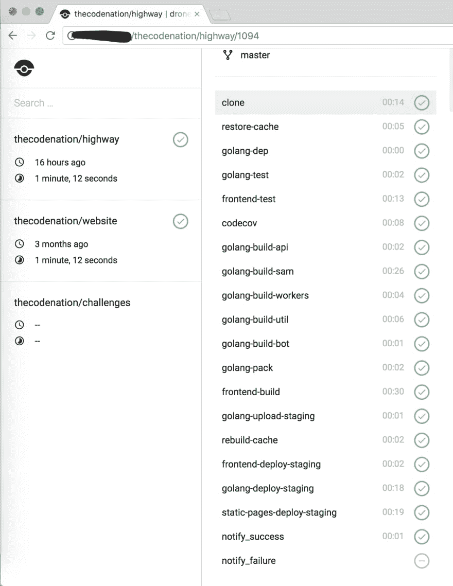
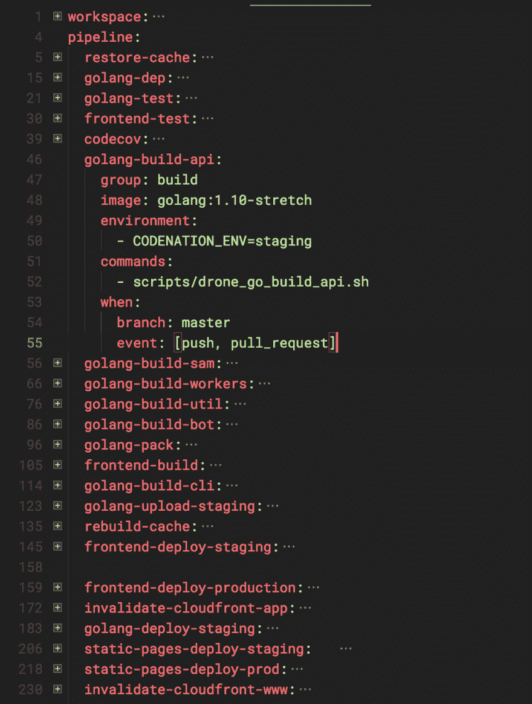

# 使用 monorepo 在项目中持续集成

> 原文：<https://dev.to/eminetto/continuous-integration-in-projects-using-monorepo-450n>

在每个项目的开始，我们必须承诺一些重要的决定。在我们在 [Codenation](https://www.codenation.dev/) 所做的正确决策中，我可以举出 Go 语言的使用，对 [Clean Architecture](https://dev.to/en/post/2018-03-05-clean-architecture-using-go/) 和 JAMStack 的采用，以及我们将代码存储在 Github 的 monorepo 中的选择。在这篇文章中，我将讨论后者，以及我们如何解决 monorepo 架构带来的一个常见挑战。

随着现代项目越来越复杂，微服务和独特的用户界面消耗资源，团队需要在将代码分成多个存储库或使用 monorepo 方法之间做出决定。像谷歌和数字海洋这样的一些公司采用了 monorepo，我们可以在下面的帖子中看到:

*   [为什么谷歌在一个存储库中存储了数十亿行代码](https://cacm.acm.org/magazines/2016/7/204032-why-google-stores-billions-of-lines-of-code-in-a-single-repository/fulltext)
*   [克苏鲁:在可伸缩的回购中组织 Go 代码](https://blog.digitalocean.com/cthulhu-organizing-go-code-in-a-scalable-repo/)

依我拙见，使用 monorepo 的主要原因是存储库管理的简单性和代码在整个团队中的重用。

但是这个选择给项目带来的挑战之一是自动化构建和部署的潜在复杂性。考虑到一个复杂项目的所有代码都存储在同一个存储库中，单个文件中的更改可能会触发持续几分钟(或者几小时)的构建。这对团队来说是一种真正的痛苦，会降低日常工作效率。在我之前引用的 DigitalOcean 的帖子中，他们开发了一个内部解决方案，称为 gta (Go Test Auto)，它不是开源的。为了解决这个问题，我们创建了一个类似的解决方案，但是使用了 Shell 脚本。

目前，这是我们项目的目录结构:

```
api = API and documentation 
chatbots = telegram, facebook and slack chatbots 
cli = codenation cli, used by developers to run the challenges 
cmd = utils and fixtures 
core = Go core packages, used by all the project 
docs = source code of internal docs (hosted at Github Pages) frontend = Vue.js project and templates used by Sam 
infra = configuration files used by staging and production servers lambda = lambda functions 
research = Python notebooks and other research assets 
sam = cli tool used by us to generate pages, include challenges and other admin tasks 
scripts = shell scrips used by CI/CD and other admin tasks 
web = ReactJS project (Signin, Signup, Forgot password) - IN PROCESS OF DEPRECATION 
workers = workers that consume SQS queues 
.drone.yml = CI/CD configuration file 
.goreleaser.yml = Goreleaser configuration file. Used to deploy the codenation-cli to Github, Homebrew 
docker-compose.yml = Docker configuration used by local and staging environments 
Gopkg.* = Go dependencies configuration files 
Makefile = build and admin tasks 
```

Enter fullscreen mode Exit fullscreen mode

我们使用 [Drone.io](http://drone.io/) 作为我们的 CI/CD 解决方案，这是我们做出的另一个好选择。下图中可以看到我们的构建管道:

[](img/posts/drone_pipeline.png)

这是我们的. drone.yml 配置文件的示例:

[](img/posts/drone_config.png)

可以看到，步骤 golang-build-api 执行脚本 **drone_go_build_api.sh** ，即:

```
#!/bin/bash -e
watch="api core"
. scripts/shouldIBuild.sh
shouldIBuild
if [[ $SHOULD_BUILD = 0 ]]; then
    exit 0
fi
make linux-binaries-api
BUILD_EXIT_STATUS=$?
exit $BUILD_EXIT_STATUS 
```

Enter fullscreen mode Exit fullscreen mode

在变量 watch 中，我们存储了需要监控的目录列表，以便管道决定是否需要运行构建。这个决定是由脚本 shouldIBuild.sh:
做出的

```
#!/bin/bash -e
SHOULD_BUILD=0
shouldIBuild() {
    if [[ "${DRONE_DEPLOY_TO}" ]]; then 
        SHOULD_BUILD=1
    else
        . scripts/detectChangedFolders.sh
        detect_changed_folders
        toW=($(echo "$watch" | tr ' ' '\n'))
        changed=($(echo "$changed_components"))
        for i in "${toW[@]}"
        do
            for j in "${changed[@]}"
            do
                if [[ $i = $j ]]; then
                SHOULD_BUILD=1 
                fi
            done
        done
    fi
} 
```

Enter fullscreen mode Exit fullscreen mode

在这个脚本中，首先测试的是变量 DRONE_DEPLOY_TO，它定义了当前的执行是部署还是构建。如果是这样，该步骤应该运行。否则，脚本将检查“watch”变量中列出的目录之一是否已被该提交更改。如果是这样，该步骤应该运行。detectChangedFolders.sh 的代码为:

```
#!/bin/bash -e
export IGNORE_FILES=$(ls -p | grep -v /)

detect_changed_folders() {
    if [[ "${DRONE_PULL_REQUEST}" ]]; then 
        folders=$(git --no-pager diff --name-only FETCH_HEAD FETCH_HEAD~1 | sort -u | awk 'BEGIN {FS="/"} {print $1}' | uniq); 
    else 
        folders=$(git --no-pager diff --name-only HEAD~1 | sort -u | awk 'BEGIN {FS="/"} {print $1}' | uniq); 
    fi
    export changed_components=$folders
} 
```

Enter fullscreen mode Exit fullscreen mode

Drone 使用的所有脚本中都存在相同的配置。这样，前端的变化不会触发 API 或聊天机器人部分代码的构建。使用这种方法，我们将构建时间从超过五分钟减少到几秒钟，这取决于在存储库中提交的变更。

我相信这种方法可以与其他不同于 Drone 的工具一起使用，我希望这可以帮助更多的团队满怀信心地坚持 monorepo 决策。