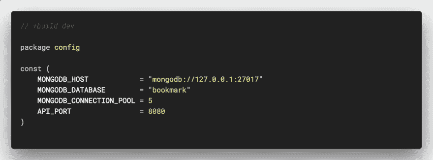

# Golang:使用构建标签存储配置

> 原文：<https://dev.to/eminetto/golang-using-build-tags-to-store-configurations-3bop>

用于构建软件即服务应用程序的方法的 [12 因素](http://12factor.net)之一是:

> 在环境中存储配置

这确实是一个很好的实践，但是要实现这一点，你需要控制你的应用程序运行的环境。虽然如果我们正在开发 API 或微服务，这很容易，但如果我们的应用程序是将在其他环境中运行的 CLI，就不一样了。

在这篇文章中，我将展示如何使用 build 标签来解决这个问题，build 标签是传递给 Go 编译器的条件。

因为第一步是创建一个名为 config:

[](img/posts/bt-1.png)

在每个文件中，我使用了与不同环境相关的构建标签，比如:

[](img/posts/bt-2.png)

最重要的部分是第一行，它设置了构建标记:

```
// +build dev 
```

Enter fullscreen mode Exit fullscreen mode

现在，我们可以在 go build 命令(或 go test、go run 等)中使用标签:

```
go build -tags dev -o ./bin/api api/main.go
go build -tags dev -o ./bin/search cmd/main.go 
```

Enter fullscreen mode Exit fullscreen mode

编译器忽略具有不同标签的文件，并将使用其他标签，因此我们不需要更改项目中的任何其他内容。

要使用配置，我们只需导入配置包并使用它:

[](img/posts/bt-3.png)

使用 build 标签，加上自动化工具，比如 make 和优秀的 [GoReleaser](https://goreleaser.com/) ，我们可以极大地简化构建和部署用 Go 编写的应用程序的过程。

如果你想阅读更多关于构建标签的内容，一个好的开始是官方文档。如果你想看完整的例子，代码在 [Github](https://github.com/eminetto/clean-architecture-go) 中。