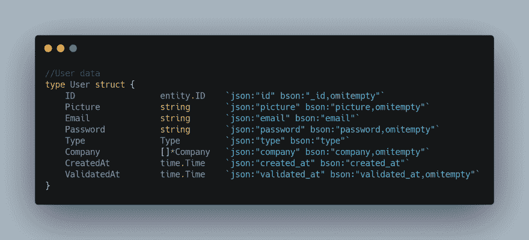
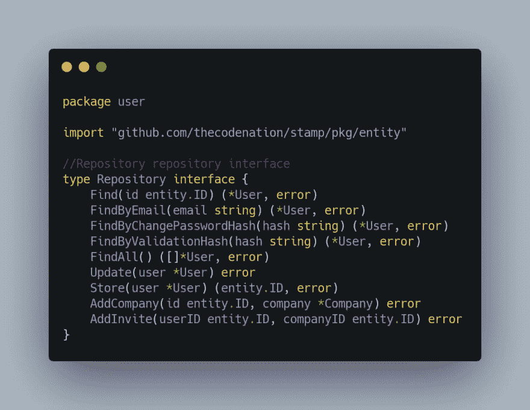
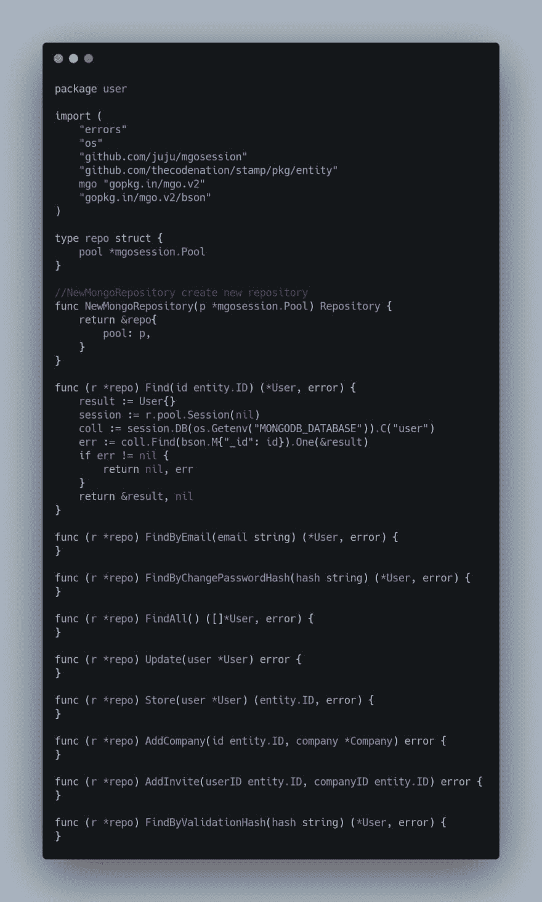
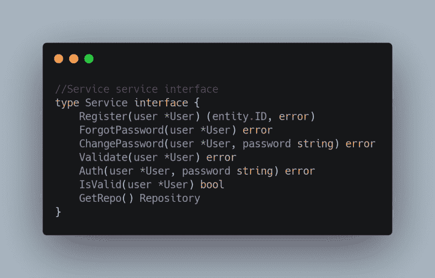
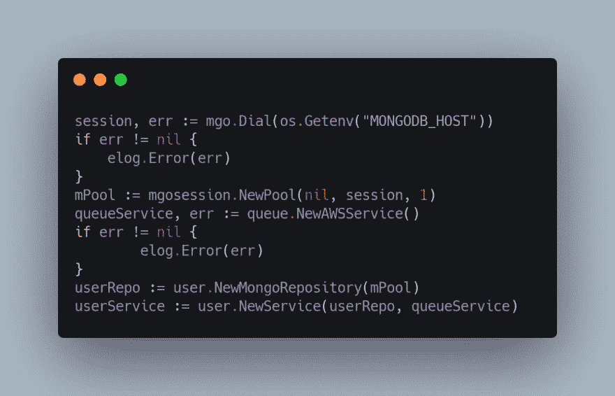
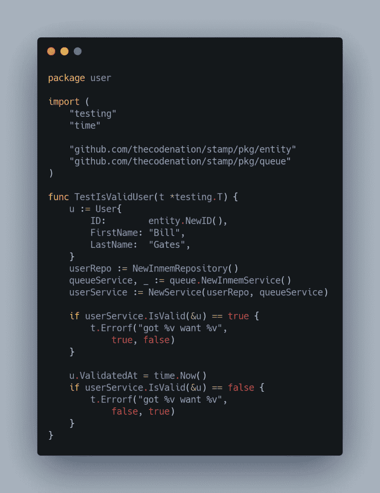

# 使用 Golang 清洁建筑

> 原文：<https://dev.to/eminetto/clean-architecture-using-golang-5791>

# 更新

我发表了这篇文章的更新版本。请访问:[清洁建筑，两年后](https://dev.to/eminetto/clean-architecture-2-years-later-4een)

## 什么是干净的架构？

著名作家 Robert“Bob 叔叔”Martin 在他的书“干净的架构:软件结构和设计的工匠指南”中提出了一种架构，其中有一些要点，如框架、数据库和接口的可测试性和独立性。

干净架构中的约束条件是:

*   独立于框架。该体系结构不依赖于某个加载功能的软件库的存在。这允许您将这样的框架用作工具，而不是将您的系统塞进它们有限的约束中。
*   可测试。可以在没有 UI、数据库、Web 服务器或任何其他外部元素的情况下测试业务规则。
*   独立于 UI。用户界面可以很容易地改变，而不需要改变系统的其他部分。例如，Web 用户界面可以用控制台用户界面代替，而不需要改变业务规则。
*   独立于数据库。您可以将 Oracle 或 SQL Server 换成 Mongo、BigTable、CouchDB 或其他。您的业务规则没有绑定到数据库。
*   独立于任何外部机构。事实上，你的业务规则根本不了解外部世界。

更多信息，请访问 https://8 thlight . com/blog/uncle-bob/2012/08/13/the-clean-architecture . html

因此，基于这种约束，每一层都必须是独立的和可测试的。

根据 Bob 叔叔的架构，我们可以将代码分为 4 层:

*   实体:封装企业范围的业务规则。Go 中的实体是一组数据结构和函数。
*   用例:这一层中的软件包含应用程序特定的业务规则。它封装并实现了系统的所有用例。
*   控制器:这一层中的软件是一组适配器，它们将数据从对用例及实体最方便的格式转换成对某些外部机构(如数据库或 Web)最方便的格式
*   框架和驱动:这一层通常由框架和工具组成，如数据库、Web 框架等。

## 戈朗的洁净建筑

让我们以软件包用户:
为例

```
ls -ln pkg/user
-rw-r — r — 1 501 20 5078 Feb 16 09:58 entity.go
-rw-r — r — 1 501 20 3747 Feb 16 10:03 mongodb.go
-rw-r — r — 1 501 20 509 Feb 16 09:59 repository.go
-rw-r — r — 1 501 20 2403 Feb 16 10:30 service.go 
```

Enter fullscreen mode Exit fullscreen mode

在文件 *entity.go* 中，我们有自己的实体:

[](img/posts/ca-1.png)

在文件 *repository.go* 中，我们有定义存储库的接口，实体将存储在该存储库中。在这种情况下，存储库意味着鲍勃大叔架构中的框架&驱动层。他的内容是:

[](img/posts/ca-2.png)

这个接口可以在任何类型的存储层中实现，比如 MongoDB、MySQL 等等。在我们的例子中，我们使用 MongoDB 实现，如 *mongodb.go* 所示:

[](img/posts/ca-3.png)

文件 *service.go* 表示用例层，如 Bob 叔叔所定义的。在文件中，我们有接口服务和他的实现。服务接口是:

[](img/posts/ca-4.png)

最后一层，我们架构中的控制器在 api 的内容中实现:

```
cd api ; tree
.
|____handler
| |____company.go
| |____user.go
| |____address.go
| |____skill.go
| |____invite.go
| |____position.go
|____rice-box.go
|____main.go 
```

Enter fullscreen mode Exit fullscreen mode

在下面的代码中，从 *api/main.go* ，我们可以看到如何使用这些服务:

[](img/posts/ca-5.png)

现在我们可以轻松地为我们的包创建测试，比如:

[](img/posts/ca-6.png)

例如，使用干净的架构，我们可以将数据库从 MongoDB 更改为 Neo4j，而不会破坏应用程序的其余部分。我们可以在不损失质量和速度的情况下发展我们的软件。

## 参考文献

[https://hacker noon . com/golang-clean-architecture-EFD 6d 7 c 43047](https://hackernoon.com/golang-clean-archithecture-efd6d7c43047)
[https://8 thlight . com/blog/uncle-bob/2012/08/13/the-clean-architecture . html](https://8thlight.com/blog/uncle-bob/2012/08/13/the-clean-architecture.html)
[https://github.com/eminetto/clean-architecture-go](https://github.com/eminetto/clean-architecture-go)