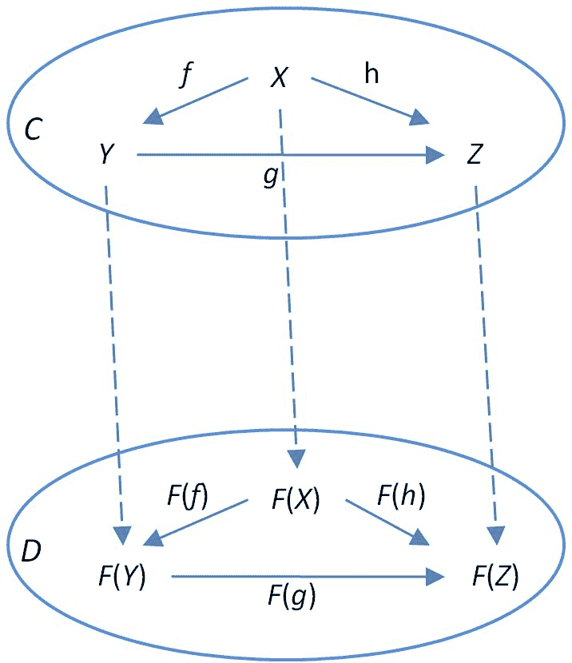

# fp-ts: Functor 入门

> 原文：<https://dev.to/gcanti/getting-started-with-fp-ts-functor-36ek>

在关于类别的[上一篇文章](https://dev.to/gcanti/getting-started-with-fp-ts-category-4c9a)中，我提出了 *TS* 类别(打字稿类别)和函数组合的中心问题

> 我们如何组合两个通用函数`f: (a: A) => B`和`g: (c: C) => D`？

为什么找到解决这个问题的方法如此重要？

因为如果类别可以用来建模编程语言，那么态射(即 *TS* 中的函数)可以用来建模**程序**。

因此，解决问题也意味着找到如何以一种通用的方式编写程序。而*这个*对于开发者来说是相当有趣的，不是吗？

# 功能为程序

我们称**纯程序**为具有以下签名的函数

```
(a: A) => B 
```

Enter fullscreen mode Exit fullscreen mode

这种签名模拟了一个程序，它接受类型为`A`的输入并产生类型为`B`的结果，而没有任何效果。

我们称**有效程序**为具有以下签名的函数

```
(a: A) => F<B> 
```

Enter fullscreen mode Exit fullscreen mode

这种签名模拟了一个程序，它接受类型为`A`的输入并产生类型为`B`的结果，以及一个**效果** `F`，其中`F`是某个类型构造器。

回想一下，[类型构造函数](https://en.wikipedia.org/wiki/Type_constructor)是一个`n`元类型操作符，接受零个或多个类型作为参数，并返回另一个类型。

**例子**

给定具体类型`string`,`Array`类型构造函数返回具体类型`Array<string>`

这里我们感兴趣的是带有`n >= 1`的`n`元类型构造函数，例如

| 类型构造函数 | 效果(解释) |
| --- | --- |
| `Array<A>` | 非确定性计算 |
| `Option<A>` | 可能失败的计算 |
| `Task<A>` | 异步计算 |

现在回到我们的主要问题

> 我们如何组合两个通用函数`f: (a: A) => B`和`g: (c: C) => D`？

由于一般问题是难以解决的，我们需要在`B`和`C`上加上一些*约束*。

我们已经知道，如果`B = C`那么解就是通常的函数组合

```
function compose<A, B, C>(g: (b: B) => C, f: (a: A) => B): (a: A) => C {
  return a => g(f(a))
} 
```

Enter fullscreen mode Exit fullscreen mode

其他的案子呢？

# 其中的约束`B = F<C>`引出函子

让我们考虑下面的约束:`B = F<C>`对于某个类型构造函数`F`，或者换句话说(在一些重命名之后)

*   是一个有效的程序
*   `g: (b: B) => C`是一个纯程序

为了组合`f`和`g`，我们可以找到一种方法将 `g`从一个函数`(b: B) => C`提升到一个函数`(fb: F<B>) => F<C>`，这样我们就可以使用通常的函数组合(T5 的输出类型将与提升的函数的输入类型相同)

于是我们把原问题变成了另一个问题:我们能找到这样一个`lift`函数吗？

让我们看一些例子

**举例** ( `F = Array` )

```
function lift<B, C>(g: (b: B) => C): (fb: Array<B>) => Array<C> {
  return fb => fb.map(g)
} 
```

Enter fullscreen mode Exit fullscreen mode

**举例** ( `F = Option` )

```
import { Option, isNone, none, some } from 'fp-ts/Option'

function lift<B, C>(g: (b: B) => C): (fb: Option<B>) => Option<C> {
  return fb => (isNone(fb) ? none : some(g(fb.value)))
} 
```

Enter fullscreen mode Exit fullscreen mode

**举例** ( `F = Task` )

```
import { Task } from 'fp-ts/Task'

function lift<B, C>(g: (b: B) => C): (fb: Task<B>) => Task<C> {
  return fb => () => fb().then(g)
} 
```

Enter fullscreen mode Exit fullscreen mode

所有这些功能看起来几乎都一样。这不是巧合，引擎盖下有一个功能模式。

事实上，所有这些类型构造函数(以及许多其他类型)都承认一个**仿函数实例**。

# 函子

函子是类别之间的**映射，其保持范畴结构，即保持同一性态射和复合。**

因为范畴是由两种东西(对象和态射)构成的，所以函子也由两种东西构成:

*   对象之间的**映射，将 *C* 中的每个对象`X`关联到 *D* 中的一个对象**
*   态射之间的一个**映射，它关联到 *C* 中的每个态射和 *D* 中的一个态射**

其中 *C* 和 *D* 是两个类别(又名两种编程语言)。

[](https://res.cloudinary.com/practicaldev/image/fetch/s--FHovMb4A--/c_limit%2Cf_auto%2Cfl_progressive%2Cq_auto%2Cw_880/https://ncatlab.org/nlab/files/functor.jpg)T3】

<center>(source: [functor on ncatlab.org](https://ncatlab.org/nlab/show/functor))</center>

即使两种不同编程语言之间的映射是一个有趣的想法，我们更感兴趣的是 *C* 和 *D* 重合(与 *TS* 重合)的映射。在这种情况下，我们讨论**endo functors**(“endo”的意思是“在”、“内部”)。

从现在开始，当我写“函子”时，我实际上是指 *TS* 中的内函子。

### 定义

函子是一对`(F, lift)`其中

*   `F`是一个`n`元类型构造函数(`n >= 1`)，它将每个类型`X`映射到类型`F<X>` ( **对象之间的映射**)
*   `lift`是具有以下签名的函数

```
lift: <A, B>(f: (a: A) => B) => ((fa: F<A>) => F<B>) 
```

Enter fullscreen mode Exit fullscreen mode

它将每个函数`f: (a: A) => B`映射到一个函数`lift(f): (fa: F<A>) => F<B>`(态射之间的**映射**)。

下列属性必须成立

*   `lift(identity`<sub>X</sub>T1】=`identity`T5】F(X)(**恒等式映射到恒等式**)
*   `lift(g ∘ f) = lift(g) ∘ lift(f)` ( **映射一个组合就是映射的组合**)

`lift`函数也通过一个名为`map`的变体为人所知，它基本上是`lift`，参数被重新排列为

```
lift: <A, B>(f: (a: A) => B) => ((fa: F<A>) => F<B>)
map:  <A, B>(fa: F<A>, f: (a: A) => B) => F<B> 
```

Enter fullscreen mode Exit fullscreen mode

注意`map`可以从`lift`派生而来(反之亦然)。

# 中的函子`fp-ts`

如何在`fp-ts`中定义一个仿函数实例？让我们来看一个实际的例子。

下面的声明定义了一个 API 调用
的响应模型

```
interface Response<A> {
  url: string
  status: number
  headers: Record<string, string>
  body: A
} 
```

Enter fullscreen mode Exit fullscreen mode

注意，`body`字段是参数化的，这使得`Response`成为仿函数实例的良好候选，因为`Response`是带有`n >= 1`的`n`数组类型构造函数(必要的前提条件)。

为了给`Response`定义一个仿函数实例，我们必须定义一个`map`函数(以及一些[技术细节【T2 需要的](https://gcanti.github.io/fp-ts/recipes/HKT.html))

```
// `Response.ts` module

import { Functor1 } from 'fp-ts/Functor'

export const URI = 'Response'

export type URI = typeof URI

declare module 'fp-ts/HKT' {
  interface URItoKind<A> {
    Response: Response<A>
  }
}

export interface Response<A> {
  url: string
  status: number
  headers: Record<string, string>
  body: A
}

function map<A, B>(fa: Response<A>, f: (a: A) => B): Response<B> {
  return { ...fa, body: f(fa.body) }
}

// functor instance for `Response`
export const functorResponse: Functor1<URI> = {
  URI,
  map
} 
```

Enter fullscreen mode Exit fullscreen mode

# 一般问题解决了吗？

一点也不。函子允许我们用一个纯程序`g`组成一个有效的程序`f`，但是`g`必须是**一元的**，也就是说它必须只接受一个参数作为输入。如果`g`接受两个参数怎么办？还是三个？

| 程序 | 程序 | 作文 |
| --- | --- | --- |
| 纯的 | 纯的 | `g ∘ f` |
| 有效的 | 纯(一元) | `lift(g) ∘ f` |
| 有效的 | pure ( `n` -ary, `n > 1` ) | ？ |

为了处理这样的情况，我们需要更多的东西:在下一篇[文章](https://dev.to/gcanti/getting-started-with-fp-ts-applicative-1kb3)中，我将谈论函数式编程的另一个显著的抽象:**应用函子**。

TLDR:函数式编程是关于组合的