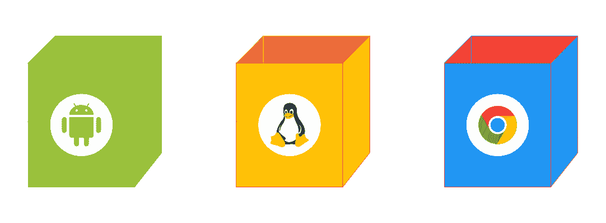

# Chromebook 编码启动

> 原文：<https://dev.to/terabytetiger/chromebook-coding-kickoff-4g72>

# [T1】简介](#intro)

一些 Chromebooks 从 2018 年 9 月开始在稳定频道上获得原生 Linux 支持(CrOS v. 69)。虽然仍处于测试阶段，一些功能已经完成，但 Linux 支持对于编程来说是相当稳定的，本指南适用于希望在 Chromebook 上尝试编码的初学者。

# 克罗斯蒂尼

当在 Chromebooks 上研究 Linux 时，它通常会以“Crostini”为标题，这是 Linux 支持的代号。Chromebooks 外面是一道意大利开胃菜，由烤面包和浇头组成。这意味着类似于[【面包丁】](https://www.reddit.com/r/Crouton)，这是一种在 Chromebook 上安装 Linux 的方式，类似于越狱 iPhone 或为 Android 安装 root。如果你想在这之后更深入地了解克罗斯蒂尼的世界，我推荐你去看看 subreddit，[r/克罗斯蒂尼](https://www.reddit.com/r/Crostini/)(如果你遇到问题，这也是一个很好的地方)。

# 容器

容器是系统代码运行的“桶”。你可以把它们想象成硬纸板盒子，Chromebook 上运行着你的每一个操作系统。Chromebooks 最多支持 3 种容器:

[](//images.ctfassets.net/2ou7t1spiiyz/5cRAppSk4MEatSG2hrVK0k/fbe60f316f23ea3037ed6b98fbea5e24/CrOS_Containers_Image.png)

与 Android 在 CrOS (Chrome OS)中的运行方式类似，Linux 在与 Android 和 CrOS 隔离的自己的容器中运行。

# 合格设备

如果你打算在你的设备上继续，你会想要从检查列表[这里](https://www.reddit.com/r/Crostini/wiki/getstarted/crostini-enabled-devices)开始，以确保你的设备有可用的 Linux 支持。# Enable Linux (Beta)现在我已经了解了背景细节，让我们通过在您的计算机上启用 Linux 容器来开始吧！

1.  打开您的设置
2.  打开侧面板
3.  单击“Linux(测试版)”
4.  单击“打开”
5.  点击完成向导(将有几分钟等待下载和安装)
6.  现在，您应该会在屏幕上看到一个黑框。这是你的终点站。它会成为你最好的朋友。

# 关于“须藤”的一个快速注释

告知终端以管理员身份运行命令。当您遇到权限错误时，通常可以通过使用`sudo {command}`来解决问题。

请小心这一点，因为它确实允许您运行的任何命令/程序以提升的用户身份执行。

建议在运行任何您可能不熟悉的 Linux 命令之前，查看它的文档，即使没有 sudo。通常快速搜索`Linux {Command} command`会让你详细了解一个命令的意图，以及当你运行它时会发生什么。

# 先做第一件事

您在终端中要做的第一件事是运行以下命令，它将下载预装程序的任何更新，然后安装它们。

```
Sudo apt update
Sudo apt upgrade -y 
```

Enter fullscreen mode Exit fullscreen mode

# 终端中的基本导航

以下命令将帮助您开始在终端中导航。

`pwd` -显示您当前所在的目录。
`ls`“当前工作目录”的缩写——列出当前目录的内容
`cd ..`——导航到您当前位置上方的目录
`cd {directory}`——导航到指定目录。这可以是绝对路径或相对路径。

这些命令都不会改变任何东西，所以请随意尝试它们并熟悉它们。你会经常用到它们。

# 安装 VS 代码

代码是我首选的文本编辑器，安装它很容易！首先，从 https://code.visualstudio.com/docs/setup/linux 的[下载代码。此时，它将位于上面的 Chrome 框内。打开`Files > Downloads`，把下载的文件拖到`Linux files`，就可以把它移到 Linux 盒子里了。](https://code.visualstudio.com/docs/setup/linux)

接下来回到你的终端运行

`sudo apt install -y ./{file}.deb`

> Pro 提示:输入后按`tab`自动补全文件名。上面命令中的/c！

一旦安装了代码，就可以运行命令`code .`来打开当前目录的 VS 代码。

> 注意:`.`代表当前目录

# 如果你认为自己把事情搞砸了，该怎么办

不要害怕！第一次使用 Linux 时，您可能会觉得一切都不太对劲。您可以通过以下方式将 Linux 容器重置为全新安装:

1.  **从您的 LINUX 文件夹中保存您需要的任何文件**
2.  设置> Linux(测试版)> Linux >删除 Chromebook 的 Linux 应用程序
3.  点击“删除”
4.  回到上面的“启用 Linux (Beta)”步骤。

# 接下来是什么？

现在您已经安装了 Linux，您可能想知道下一步该做什么。根据您的兴趣，我建议查看以下资源之一(Python 甚至默认安装在 Linux 容器中！):

[](/aspittel) [## 我最喜欢的新程序员免费资源

### 阿里·斯皮特尔 13 年 8 月 18 日 3 分钟阅读

#beginners #learntocode #javascript #python](/aspittel/my-favorite-free-resources-for-new-programmers-bia)[](/colinmtech) [## 学习 Web 开发？这些技能会让你脱颖而出

### 科林·摩根 5 月 2 日 188 分钟阅读

#webdev #beginners #learning](/colinmtech/learning-web-development-these-skills-will-make-you-stand-out-56fh)[](/jessicagarson) [## 学习 Python 的资源

### 杰西卡·加森 3 月 26 日 183 分钟阅读

#beginners #python #learning](/jessicagarson/resources-for-learning-python-hd6)

# 总结

```
Sudo apt update
Sudo apt upgrade -y 
```

Enter fullscreen mode Exit fullscreen mode

从[https://code.visualstudio.com/docs/setup/linux](https://code.visualstudio.com/docs/setup/linux)链接
下载 VS 代码

```
sudo apt install -y ./{file}.deb 
```

Enter fullscreen mode Exit fullscreen mode