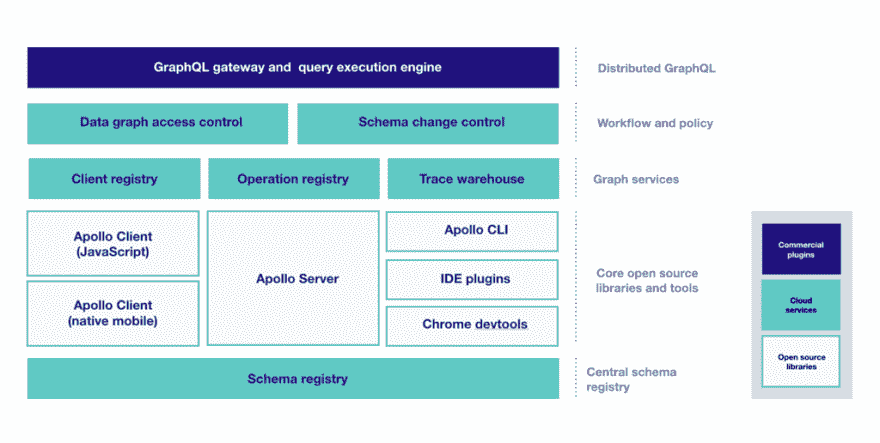
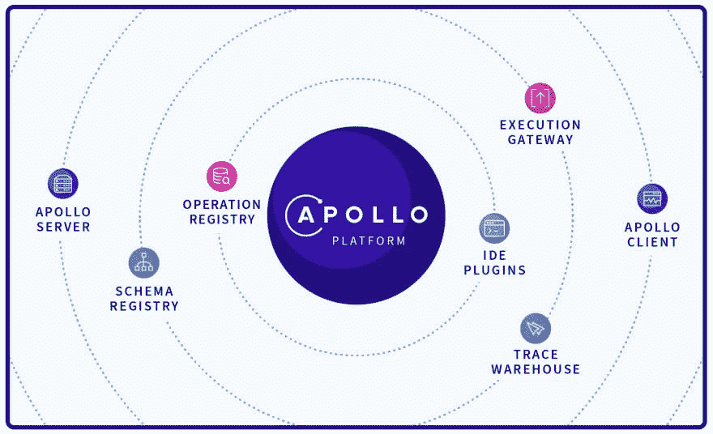
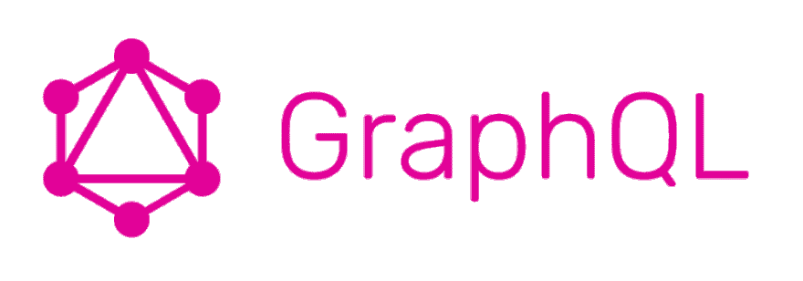

# Apollo GraphQL 平台概述

> 原文：<https://dev.to/graphqleditor/a-short-overview-of-apollo-graphql-platform-4pmg>

GraphQL 是一种用于 API 的查询语言，也是用现有数据完成这些查询的运行时。这项技术使客户请求他们真正需要的数据成为可能，仅此而已。GraphQL 查询不仅可以访问单个源的属性，还可以轻松地跟踪它们之间的引用。虽然典型的 REST APIs 需要从多个 URL 加载，但 GraphQL APIs 可以在一个请求中获得应用程序所需的所有数据，这使得使用 GraphQL 的应用程序速度大大加快，即使是在移动网络连接上。

你已经知道 [npm Inc.](https://www.npmjs.com/) 声称 [GraphQL 将在 2019 年](https://blog.graphqleditor.com/javascript-predictions-for-2019-by-npm/)成为一股技术力量。没有比使用最流行的客户端库 [Apollo GraphQL](https://www.apollographql.com/) 更好的方式来开始您的 GraphQL 之旅了。

## 阿波罗 GraphQL 是什么？

Apollo 是 GraphQL 的一个实现，旨在满足构建数据驱动应用程序的现代开发团队的特定需求。它采用了一种敏捷的、可伸缩的方法，特别注意不要修改现有的 API 和服务。该库强调工具和工作流。Apollo GraphQL 平台是一个开源组件、商业扩展和云服务的堆栈。

###### 来源:[阿波罗文件](https://www.apollographql.com/docs/)

## 大部分核心组件都是开源的

Apollo 是一家开源公司，专注于开发人员真正需要的东西，有一个明确的使命，那就是为每个人提供更好的 GraphQL 体验。在 Apollo 客户端、Apollo 服务器以及 Apollo 平台的其他组件上工作的数百名开发人员的协作，使其成为 GraphQL 实现的行业领先解决方案。

###### 来源:[阿波罗](https://www.apollographql.com/)

[Apollo Server](https://github.com/apollographql/apollo-server) 是一个 JavaScript GraphQL 服务器，用于定义一个模式和一组实现该模式每个部分的解析器。Apollo 服务器是可扩展的，这意味着插件可以挂接到请求管道的每个阶段。这是一个很棒的特性，它允许将自定义行为作为附加包来实现。Apollo Server 可与任何使用 GraphQL.js 构建的 GraphQL 模式、AWS Lambda 等无服务器环境一起工作，并且是开源的和由社区维护的。

[Apollo Client](https://github.com/apollographql/apollo-client) 是一个全功能的 GraphQL 客户端，管理应用程序中的数据和状态。它支持声明式编程风格，允许开发人员将查询定义为 UI 组件的一部分，而客户端管理所有查询绑定、一致性管理、缓存等等。Apollo Client 包括与 React、React Native 或 Vue 等最流行的视图律师的集成。

[Apollo iOS](https://github.com/apollographql/apollo-ios) 是用 Swift 编写的用于 iOS 的强类型 GraphQL 缓存客户端。它允许在 GraphQL 服务器上执行查询和变异，并将结果作为特定于查询的 Swift 类型返回。这意味着您不必处理 JSON 解析或让客户端手动将值转换为正确的类型。模型类型是从应用程序 UI 的 GraphQL 定义中生成的。

Apollo Android 是一个 GraphQL 客户端，用于从 GraphQL 查询中生成 Java 模型，为您提供一个类型安全的 API 来与您的 GraphQL 服务器一起工作。虽然它主要是为 Android 设计的，但你可以在任何 Java/Kotlin 应用程序中使用它。

[Apollo CLI](https://github.com/apollographql/apollo-tooling) 是一个简单的命令行客户端，它将您的 GraphQL 客户端和服务器与诸如验证您的 GraphQL 模式、确保您的服务器操作的兼容性或为客户端类型安全生成静态类型等功能合并在一起。

## 开发团队的解决方案

GraphQL 是关于更好的协作。在 GraphQL API 上紧密合作的开发团队会取得最好的结果。为此，Apollo 提供了一些有用的解决方案，例如:

*   **Schema Registry**——graph QL 模式的注册中心，作为一个模式的核心数据源，增加了额外的元数据，如字段级使用统计。

*   **客户端注册中心** —跟踪每个已知模式用户的注册中心，包括预注册用户和临时用户。

*   **操作注册表** —针对该模式的所有已知操作的注册表

*   **跟踪仓库** —一个数据管道，存储对您的模式执行的每个操作的详细日志。所有这些注册中心一起工作，让您的开发团队很好地理解 API。

*   **安全列表** -将您的 API 锁定到可信的预注册操作。Apollo CLI 从客户端代码库中提取所有查询，并将其存储在操作注册表中。另外，Apollo 服务器插件将预先注册的操作列表同步到服务器，然后服务器拒绝本地副本中不存在的查询。

*   **模式验证**——根据生产中观察到的一组已知操作测试提议的模式，为每个重大变更返回一个受影响的客户端列表。

*   GraphQL 网关(GraphQL Gateway)——Apollo 服务器的一种配置，以及一些作为 graph QL 网关的附加组件。网关将相互引用的单独部署的“微模式”组成一个主模式，这个主模式在客户端看来就像任何常规的 GraphQL 模式一样。为了回答查询，网关构建一个查询计划，从每个上游 GraphQL 服务获取数据，并将其全部组合成一个结果。

如果你正在寻找最好的 GraphQL 教程，请查看这个[帖子](https://blog.graphqleditor.com/top-graphql-tutorials-reviewed-2019)。

