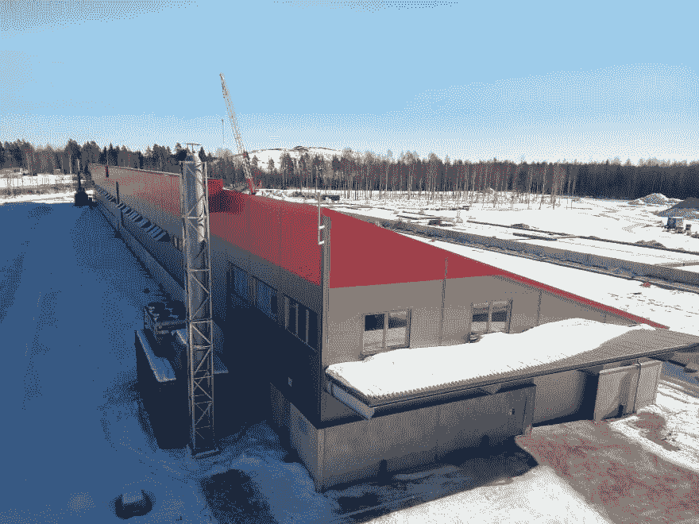

# 🤔解释冷热储存(如 S3 和冰川)

> 原文：<https://dev.to/uilicious/explain-distributed-storage---hot--cold-no0>

> 过去几天有这么多分布式系统被破坏。我认为把这个话题作为一个系列来展开是个好主意。
> 
> #感谢所有从事这些工作的#系统管理员。

[](/picocreator) [## 🤔解释分布式存储——以及它在 github / uilicious / cloud / etc 中的表现

### Eugene Cheah 10 月 23 日 1810 分钟阅读

#explainlikeimfive #webpef #cloud #beginners](/uilicious/explain-distributed-storage---and-how-it-goes-down-for-github--uilicious--cloud--etc-1mni)

* * *

# 背景语境

如果您参加有关分布式存储的讲座、会议或文章，您可能会经常听到以下两个术语:

*   **热**
*   **寒冷**

最令人困惑的是，这些术语在不同的技术平台上使用不一致。

由于完全没有一个官方定义:例如，固态硬盘可以被认为在一个“热”，在另一个“冷”。

在这一点上，即使是不熟悉术语的有经验的系统管理员也会这样做...

[](https://res.cloudinary.com/practicaldev/image/fetch/s--uYh6OlHc--/c_limit%2Cf_auto%2Cfl_progressive%2Cq_auto%2Cw_880/https://thepracticaldev.s3.amazonaws.com/i/l6rzlfb7a3dwdo5763dz.jpg)

* * *

# 那么到底什么是热&冷呢？？？

由于缺乏官方定义，我建议如下...

> 数据温度术语(热/温/冷)是用来描述数据或存储硬件的丰富多彩的术语，在同一平台(S3、Gluster 等)上，按照一组选定的性能标准(延迟、IOPS 和/或带宽)以**相互之间的相对术语**来描述。
> 
> 一般来说，温度越高，速度越快
> 
> ~尤金·切

重要注意事项:这些温度指标用作平台的**相对术语。红、热、冷、蓝五颜六色的类比是**不可跨技术平台互换****

下表用非常不准确的术语描述了特定平台技术的冷热程度。以及共同的关键标准(除了成本，因为这始终是一个标准)

| 平台 | “热” | “冷” | 通用关键标准 |
| --- | --- | --- | --- |
| 高速缓存(适用于 HPC 计算) | 计算机内存 | （同 solid-statedisk）固态（磁）盘 | 数据延迟(< 1 毫秒) |
| 文件服务器 | （同 solid-statedisk）固态（磁）盘 | 硬盘驱动器 | IOPS |
| 备份存档 | 硬盘驱动器 | 磁带 | 带宽 |

因此，由于术语和标准的相对差异。我再次强调，不要在不同的平台上混淆这些术语。

> 例如，一个非常令人困惑的怪人:[英特尔 optane 内存](https://en.wikipedia.org/wiki/3D_XPoint)，它是专门为高速低延迟数据传输而设计的，与 SSD 相比，总带宽较慢。
> 
> 这使它成为高容量缓存服务器的良好候选。但是“在大多数工作负载中”，不适合文件服务器，因为与 SSD 相比，它的带宽较低，每 GB 价格较高。
> 
> 如果你对 optane 感到困惑，没关系，继续——包括我在内的几乎每个人都是如此。

* * *

# 为什么不把所有东西都放进 RAM 或者 SSD？

> 毕竟，你不是“保持简单愚蠢”的超级支持者吗？

对于 1 TB 以下的数据集，为了简单起见，您可以并且可能应该选择单一存储介质并坚持使用它。正如在本系列的前一篇文章中提到的那样- [分布式系统确实有性能开销，只有在“规模化”(尤其是混合存储的系统)](https://dev.to/uilicious/explain-distributed-storage---and-how-it-goes-down-for-github--uilicious--cloud--etc-1mni)时才有价值。

然而，一旦你越过了那条线，冷热储存终究会慢慢成为一个严肃的考虑因素...

[](https://res.cloudinary.com/practicaldev/image/fetch/s--WFXL5OpU--/c_limit%2Cf_auto%2Cfl_progressive%2Cq_auto%2Cw_880/https://thepracticaldev.s3.amazonaws.com/i/i6qzkjwz4s1hq59jkevx.jpg)

总的来说，2019 年存储越快，越贵。下表显示了不包括所需开销(如主板、网络等)的存储组件的大致原材料成本

<figure>

| 技术 | 参考类型 | 每 GB 价格 | 每 TB 价格 | 每 PB 价格 |
| --- | --- | --- | --- | --- |
| ECC RAM | [16 GB DDR3](https://memory.net/store/?filter_form-factor=rdimm&filter_kit-qty=1x-16gb&filter_technology=ddr3-1066&filter_voltage=1-5v) | $2.625 | $2,625 | 260 万美元 |
| SATA SSD | [512 GB 固态硬盘](https://www.anandtech.com/show/9799/best-ssds) | $0.10 | $100 | $100,000 |
| 硬盘驱动器 | [4TB 5900RPM](https://www.backblaze.com/blog/hard-drive-cost-per-gigabyte/) | $0.025 | $25 | $25,000 |
| 带存储器 | [6TB 未压缩的 LTO 7](https://www.tapeandmedia.com/lto-7-tape-media-tapes.asp) | $0.01 | $10 | $10,000 |

<figcaption>"Reference Type" pricing for each technology is already intentionally chosen for lowest price per GB, during 2017-2018</figcaption>

</figure>

当涉及到太字节甚至太字节的数据时，仅 ram 棒的原始成本就将是每太字节 2.6k 美元，或者每太字节 260 万美元。

这甚至比任何所需设备(如主板)、基础设施、冗余和替换、电力以及云提供商提供的“即服务”的最终人力成本轻松高出 10 倍以上。

因为我既不是比尔也不是马克，这个价格对我来说太高了。或者说我们中的大多数人。

结果是:出于实际原因，一旦数据集达到一定规模，大多数分布式系统的系统管理员将使用一些“热”存储组合来满足所需的性能工作负载(这是非常具体的情况)。混合使用低温存储，以降低存储成本。

在这种设置中，需要高性能的最常用文件将位于快速热存储中。而最不活跃使用的文件将在缓慢廉价的冷存储中。

这种冷热存储的混合可以在单台服务器上进行，也可以(按照本系列)在多台服务器上进行，甚至可以在多个国家进行。在那里，人们可以利用德国或法兰克福便宜得多的服务器，那里的电力和冷却更便宜。

<figure>

[](https://res.cloudinary.com/practicaldev/image/fetch/s--CWsWlu2Q--/c_limit%2Cf_auto%2Cfl_progressive%2Cq_auto%2Cw_880/https://thepracticaldev.s3.amazonaws.com/i/wpbdhrdjfzz4ml2ictj3.jpg)

<figcaption>It is pretty cool, that uiliciosu cold storage is literally being cooled by snow</figcaption>

</figure>

* * *

# 那么数据是如何在快慢之间分割的呢？

数据分发可以由选择的存储技术本身来执行(如果支持的话)。比如 [GlusterFS](https://access.redhat.com/documentation/en-us/red_hat_gluster_storage/3.1/html/administration_guide/chap-managing_data_tiering-attach_volumes) ，或者 [ElasticSearch](https://www.elastic.co/blog/hot-warm-architecture-in-elasticsearch-5-x) 。其中它可以基于其预定义的配置自动完成。

云存储技术，如 S3，同样具有根据预定义的年龄规则自动将此类存储迁移到“较冷”状态的配置。

或者，也可以在应用程序中分配“冷/热”存储，而不是使用单一平台技术。这将使 it 部门能够根据预期的使用情形，非常精确地控制其存储工作负载从一个系统转移到另一个系统。

在这种情况下，术语“热或冷”指的是应用程序开发人员如何与他们的开发人员和系统管理员一起对此进行规划。一个常见的例子是将热数据存储在网络文件服务器甚至 SQL 数据库中，将冷数据存储在 S3 中，就像 blob 存储一样。

* * *

# 那为什么有些文章用数据年龄来定义呢(令人困惑)？

因为这将代表一个普遍的、过度一般化的用例。不多也不少。

从统计上来说，尤其是从长期趋势来看，你的用户更有可能读(或写)一个最近创建的文件。然后是一份 5 年以上的旧文件。

<figure>

[](https://res.cloudinary.com/practicaldev/image/fetch/s--uAyCYtS---/c_limit%2Cf_auto%2Cfl_progressive%2Cq_auto%2Cw_880/https://thepracticaldev.s3.amazonaws.com/i/aarlojnz5zi2lfturt71.png)

<figcaption>xkcd 1360 : Old Files</figcaption>

</figure>

如果你有一个非常好的互联网连接，你可以很容易地看到这一点。通过随机(很长时间以来第一次)跳转回 facebook 或 google，打开超过 5 年的图片。并将加载时间与即时新闻进行比较。

但是如果你运气不好，当每个人的“热”工作文件都在飞快地加载时，你会发现你一年前的“冷”文件很遗憾地消失了几个小时。

不幸的是，在最近谷歌宕机期间，我也遇到了这种情况...

<figure>

> pico creator[@ pico creator](https://dev.to/picocreator)那一刻:当我再次检查我今晚在谷歌演讲的幻灯片时...
> 
> 才意识到 google drive 有故障，吃了我的幻灯片😱
> 
> Meetup:【meetup.com/GCPUGSG/events…】
> [# Google down](https://twitter.com/hashtag/googledown)2019 年 3 月 13 日上午 05:31[](https://twitter.com/intent/tweet?in_reply_to=1105703004622094336)[](https://twitter.com/intent/retweet?tweet_id=1105703004622094336)0[](https://twitter.com/intent/like?tweet_id=1105703004622094336)1

<figcaption>Btw it has been long fixed - #hugops the hardworking google SRE's</figcaption>

</figure>

而像“如果超过 31 天，放入冷藏”这样的经验法则是方便的...

**不要相信简单的经验法则(对于分布式存储或任何技术)**

缺点是它完全忽略了一个人在用例中应该注意的许多细微差别。

例如您希望将冷数据迁移到热数据的情况。或者将它保存在热数据中的时间远远超过简单的 31 天。这是非常具体的工作负载。

当流量等大量“热”数据到达“冷”数据存储层时，如果没有正确理解和规划，微小的细微差别可能会导致服务变慢。或者更糟，对于云块存储，一个意想不到的巨额账单。

也许更严重的伤害发生在:**让新的学习者走上令人困惑的错误学习道路**。

> 我遇到过一些管理员，他们沉迷于完全按天配置他们的热/冷结构，而没有详细了解他们的工作负载。

* * *

# 好的，那么展示一些工作负载的例子怎么样？

例如，[uilicious.com](https://uilicious.com)最重的文件工作负载由测试脚本和结果组成，用户编写并运行 1000 个这样的测试脚本...

```
// Lets go to dev.to
I.goTo("https://dev.to")

// Fill up search
I.fill("Search", "uilicious")
I.pressEnter()

// I should see myself or my co-founder
I.see("Shi Ling")
I.see("Eugene Cheah") 
```

哪家公司生产出这样的[可共享的测试结果](https://snippet.uilicious.com/test/public/1cUHCW368zsHrByzHCkzLE)...

[](https://snippet.uilicious.com/test/public/1cUHCW368zsHrByzHCkzLE)

...然后在互联网上公开分享，或团队问题跟踪😎

* * *

最终产生的工作负载如下:

*   当一个测试结果只被查看一次时(当执行时)，它很可能永远不会被再次查看。
*   当一个测试结果在短时间内被分享和查看多次(> 10 次)，这意味着它正在公司内部甚至社交媒体上被“分享”。并且很快会收到几百个甚至几千个请求。在这种情况下，我们会希望立即升级到“热”数据存储。哪怕结果本来就是一个多月+旧。
*   当与我们的监控计划功能一起使用时。它自动执行脚本。大多数人只在最初的两周内查看这种“监控”测试结果。之后再也不会了。

因此，我们专门对 glusterfs(我们的分布式文件存储)进行了调整，以支持这样的工作负载。特别是将数据从热数据移动到冷数据的逻辑，反之亦然。

* * *

其他值得注意的工作负载示例有...

*   脸书喜欢“在这一天”，展示过去档案中的图像
*   年初对公司数据进行会计和审计，以获取上一年的数据
*   季节性促销内容(新年、圣诞节等)

因为到目前为止，我所见过的工作负载中有一半会从独特的配置中受益，而这些配置对其他工作负载来说毫无意义。甚至有时违背简单的经验法则。

我个人的建议是坚持冷热的概念，相应地做快数据或慢数据，让你更好地可视化自己的工作量。而不是日期创建时间，这将概念过于简化。

快速提醒一下我一直以来最喜欢的一句名言:

[ ](https://res.cloudinary.com/practicaldev/image/fetch/s--whQc_h_w--/c_limit%2Cf_auto%2Cfl_progressive%2Cq_auto%2Cw_880/https://thepracticaldev.s3.amazonaws.com/i/49d59ijgrk8rd0y0ctxi.jpg) 

<figcaption>[或者:没有银弹](https://en.wikipedia.org/wiki/No_Silver_Bullet)</figcaption>


最后，了解您的数据工作负载非常重要，尤其是当您扩展到 Pb 级时。

* * *

# 那么我们为什么不干脆称它们为快 N 慢呢

> 别让我开始说我有多讨厌“温暖”这个词😡

哦，该死，我真希望他们这样做。我们永远也不会需要这整篇文章。

然而，虽然我无法追溯这个术语的真实历史(这本身就是一个有趣的话题)

如果你回到固态硬盘时代之前，回到固态硬盘存储的前身 20 年代初。

<figure>

[](https://res.cloudinary.com/practicaldev/image/fetch/s--6_S_8jHI--/c_limit%2Cf_auto%2Cfl_progressive%2Cq_auto%2Cw_880/https://thepracticaldev.s3.amazonaws.com/i/nmkcdbbtwbnr6vd4uac3.jpg)

<figcaption>I present, one, hot HDD</figcaption>

</figure>

这些高速 15，000 RPM 硬盘非常热，当您将它们并排堆叠时，它们需要自己的专用风扇。

这些热驱动器会绕着转速为 5,400 RPM 的较慢的廉价驱动器运行多圈，这些驱动器充当冷存储。

热数据实际上是炽热的旋转的数据车轮。

<figure>

[](https://res.cloudinary.com/practicaldev/image/fetch/s--HWl-XzVR--/c_limit%2Cf_auto%2Cfl_progressive%2Cq_auto%2Cw_880/https://thepracticaldev.s3.amazonaws.com/i/tj5aqvopjp59ugx9o8cp.jpg)

<figcaption>btw: these collectables go for $2,000 each</figcaption>

</figure>

对于随机环境，当以 100 mp/h (160 km/h) 的速度行驶时，您的车轮转速约为[1400 RPM。想象一下 10 倍的速度，这是你不希望手指碰到的速度。](https://www.quora.com/How-many-RPMs-do-automobile-tires-typically-rotate-at)[(不是说你可以，你在网上看到的所有硬盘图像都是骗人的，这些东西都是带盖子的)](https://superuser.com/questions/829304/do-hard-drives-really-have-open-cases-now)

温度术语还用于描述不同级别的备份站点，企业将使用这些站点运行其服务器基础架构。有了热备份站点，每台机器都在运行，等待在主服务器出现故障时接管。冷备份站点，这些站点可能没有电源，甚至可能是空的空间，供以后放置服务器。

所以，可悲的是，这个术语流行起来是有原因的😂(尽管我很讨厌)

* * *

# 那么，对于 X 平台，我应该使用什么样的硬件来应对冷热环境呢？

查看平台指南，或者等待本系列的第 3 部分😝

与此同时:如果你无法做出决定，那就走出开发者的圈子，在思考的时候给自己放一首流行歌曲。

[https://www.youtube.com/embed/kTHNpusq654](https://www.youtube.com/embed/kTHNpusq654)

* * *

# 快乐航运🖖🏼🚀