# 设计模式-适配器

> 原文：<https://dev.to/carlillo/design-patterns---adapter-2pi3>

有 23 个经典的设计模式，在原著中有描述，
`Design Patterns: Elements of Reusable Object-Oriented Software`。这些模式
为特定的问题提供解决方案，经常在软件
开发中重复。

在本文中，我将描述如何使用**适配器模式；以及如何以及何时应用 T2。**

### 适配器模式:基本思想

> 一个 ***适配器*** 允许两个不兼容的接口一起工作。这是适配器的真实定义。接口可能不兼容，但是内部功能应该适合需要。适配器设计模式通过将一个类的接口转换成客户机期望的接口，允许原本不兼容的类协同工作。—维基百科
> 
> 将一个类的接口转换成客户期望的另一个接口。适配器允许类一起工作，否则由于不兼容的接口而无法工作。—设计模式:可重用面向对象软件的元素

这种模式的主要特点是重用一个与其他类相比具有不同接口的类，或者重用几个具有不同接口的类，以便它们可以协同工作。

这种模式有两种版本:

*   在运行时，`object adapter`通过委托给一个`adaptee`对象来实现`target`接口。
*   `class adapter`通过在编译时继承一个`adaptee`类来实现`target`接口。

因为包括 Java 在内的许多语言都不支持多重继承，而且
与许多问题相关，所以我们没有展示使用类适配器模式的实现。

总而言之，对象适配器(AKA adapter)包含它
包装的类的一个实例。这个模式的 UML 图如下所示:

[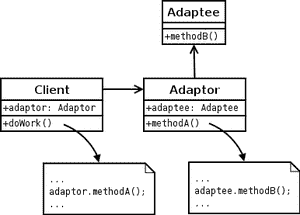](https://res.cloudinary.com/practicaldev/image/fetch/s--twUjlcQI--/c_limit%2Cf_auto%2Cfl_progressive%2Cq_auto%2Cw_880/https://cdn-images-1.medium.com/max/1000/0%2ATp5pwOgs7tytX9_w.png)

`Adaptor`类包含了`Adaptee`类。这意味着`Adaptee`级将被`Adaptor`使用。

# 适配器模式:何时使用

1.  有一个类的接口与您需要的不匹配。
2.  有几个子类，但是通过子类化每一个来适应它们的接口是不现实的。

适配器模式有几个优点，概括起来有以下几点:

*   代码更加**可重用和灵活**。
*   **干净的代码**因为客户端/上下文在每个具体的类中不使用不同的接口，并且可以使用多态性在不同的适配器之间交换。

# 适配器模式—示例 1:使用 JavaScript/TypeScript 的新 Android 到达城市示例

我现在将向您展示如何使用 JavaScript/TypeScript 实现这种模式。请记住，Javascript 既缺少接口也缺少抽象类。因此，理解这种模式的最佳方式是使用示例和 TypeScript。在我们的例子中，我虚构了一个问题，其中有一个名为`Warrior`的抽象类定义了一个战士。战士有一组与问题无关的属性和一个叫做`attack`的方法。有一个战士类型的分类，例如`Saiyan`和`Namekian`，它们定义了`attack`方法的具体实现，但是一个新的类到达了系统`Android`，它不满足战士的接口，但是在内部以不同的方式实现了该方法。下面的 UML 图显示了我刚刚描述的场景。

[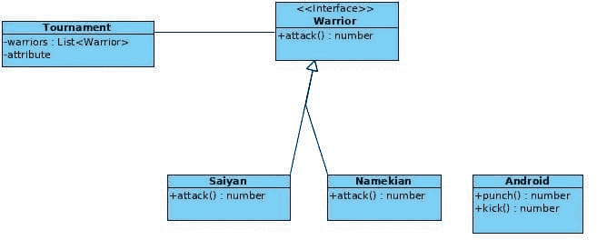](https://res.cloudinary.com/practicaldev/image/fetch/s--lmb0eRYs--/c_limit%2Cf_auto%2Cfl_progressive%2Cq_auto%2Cw_880/https://cdn-images-1.medium.com/max/1000/0%2AhlLfiB5WUH-XQSgJ.jpg)

解决方案是使用一个包含`Android`对象的类(`AndroidAdapter`)中的适配器模式，并使用它来与 warrior 的接口兼容。也就是说，使用适配器模式的新 UML 图如下所示:

[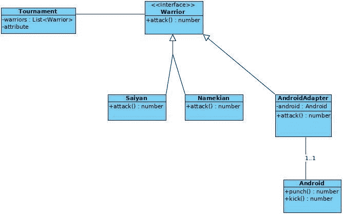](https://res.cloudinary.com/practicaldev/image/fetch/s--YM3Kmlu5--/c_limit%2Cf_auto%2Cfl_progressive%2Cq_auto%2Cw_880/https://cdn-images-1.medium.com/max/1000/0%2AFoVkL_di5-vrcEIt.jpg)

与模型和接口相关的代码如下:

[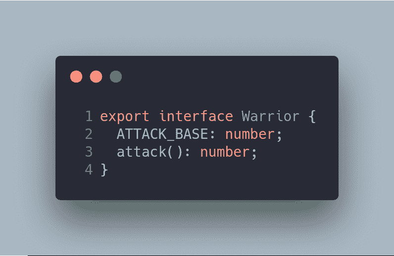](https://res.cloudinary.com/practicaldev/image/fetch/s--aiU2R35G--/c_limit%2Cf_auto%2Cfl_progressive%2Cq_auto%2Cw_880/https://cdn-images-1.medium.com/max/1000/1%2AmCMuxHJa67UydPY8bgCyFw.png)

[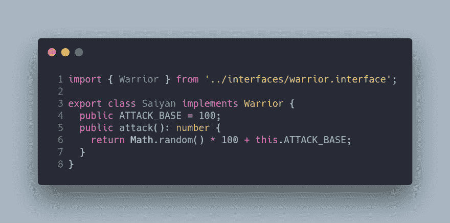](https://res.cloudinary.com/practicaldev/image/fetch/s--ZgSbaMqE--/c_limit%2Cf_auto%2Cfl_progressive%2Cq_auto%2Cw_880/https://cdn-images-1.medium.com/max/1000/1%2Az3A9L8BYn11ET69aHmBP4w.png)

[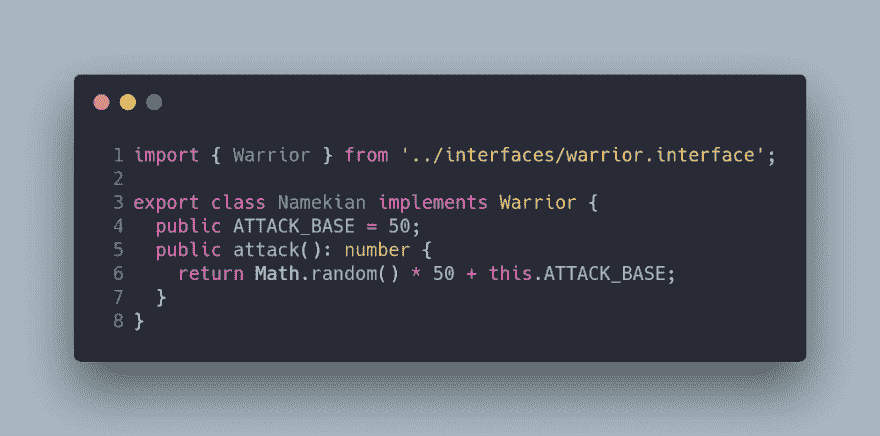](https://res.cloudinary.com/practicaldev/image/fetch/s--Or_pGta8--/c_limit%2Cf_auto%2Cfl_progressive%2Cq_auto%2Cw_880/https://cdn-images-1.medium.com/max/1000/1%2AsBskAkN0Di-xQjLWn9zlJA.png)

[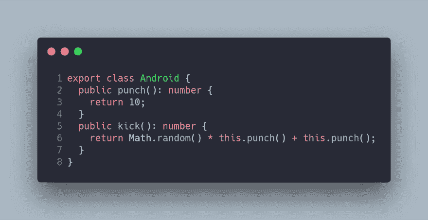](https://res.cloudinary.com/practicaldev/image/fetch/s--6uwkHKnf--/c_limit%2Cf_auto%2Cfl_progressive%2Cq_auto%2Cw_880/https://cdn-images-1.medium.com/max/1000/1%2AHf-HSxKcVZJdwVhxmTZpkw.png)

如你所见,`Android`类没有实现 warrior 的接口。
所以，这个类`AndroidAdapter`负责解决这个问题。

[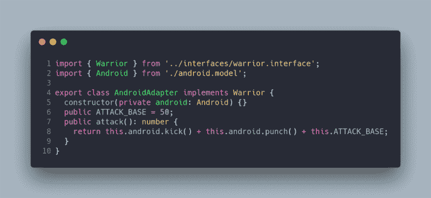](https://res.cloudinary.com/practicaldev/image/fetch/s--bw1sYBLT--/c_limit%2Cf_auto%2Cfl_progressive%2Cq_auto%2Cw_880/https://cdn-images-1.medium.com/max/1000/1%2Au7EpZSz3wkchHHoEiLP3xg.png)

最后，想要使用这三个类的客户端/上下文应该将`AndroidAdapter`类与`Saiyan`和`Namekian`一起使用，如下一段代码所示:

[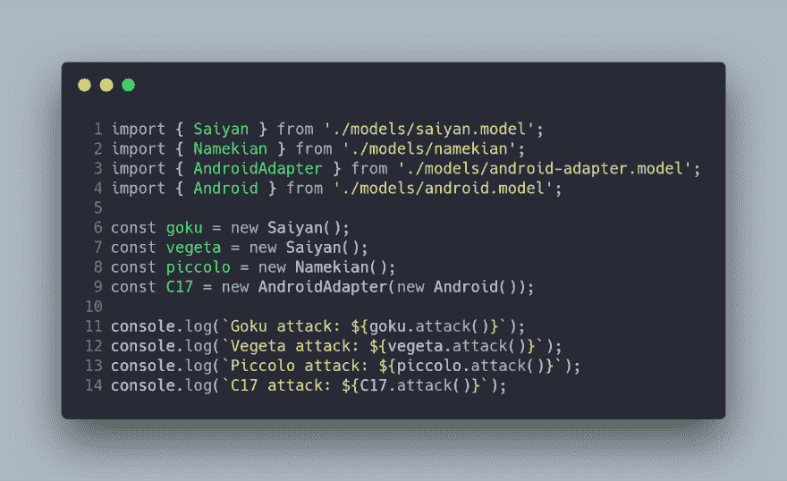](https://res.cloudinary.com/practicaldev/image/fetch/s--pVczJhMi--/c_limit%2Cf_auto%2Cfl_progressive%2Cq_auto%2Cw_880/https://cdn-images-1.medium.com/max/1000/1%2AsmmLU8HgQLNwJ1oOEh9wPw.png)

# 适配器模式—示例 2:几个种族想要一起工作(Genki-dama)

使用 JavaScript/TypeScript

使用适配器模式解决的另一个有趣的问题是，当有几个具有不同接口的类，但它们可以一起工作时。在下面的 UML 图中，您可以看到这种情况:

[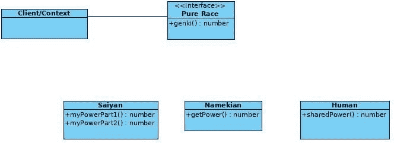](https://res.cloudinary.com/practicaldev/image/fetch/s--5oud2AMm--/c_limit%2Cf_auto%2Cfl_progressive%2Cq_auto%2Cw_880/https://cdn-images-1.medium.com/max/1000/0%2AYzs_32t1B02EgFAy.jpg)

在这种情况下，种族之间有不同的接口进行通信。具体来说，每个种族都有一种或几种分享权力的方法。例如，人类有`sharedPower`，纳米比亚人有`getPower`，甚至更复杂的是赛亚人，他们有两种方法分享它的力量(`myPowerPart1`和`myPowerPart2`)。

几个比赛一起工作的解决方案是使用适配器模式，正如你在下面的 UML 图中看到的。

[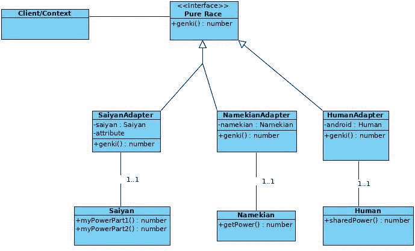](https://res.cloudinary.com/practicaldev/image/fetch/s--gyh_rzAZ--/c_limit%2Cf_auto%2Cfl_progressive%2Cq_auto%2Cw_880/https://cdn-images-1.medium.com/max/1000/0%2AQST114xpEdXyICNp.jpg)

每个类都使用一个新的适配器类，这个适配器类包含原始对象和实现接口的方法。这个例子的代码非常简单。

[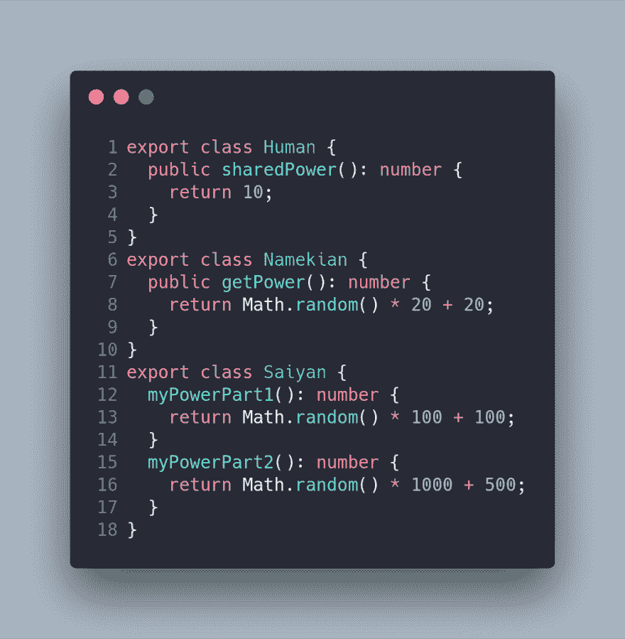](https://res.cloudinary.com/practicaldev/image/fetch/s--V0iC7iRf--/c_limit%2Cf_auto%2Cfl_progressive%2Cq_auto%2Cw_880/https://cdn-images-1.medium.com/max/1000/1%2AKIXT5M4Cu6jsSdFBBGihsg.png)

它们各自的适配器如下:

[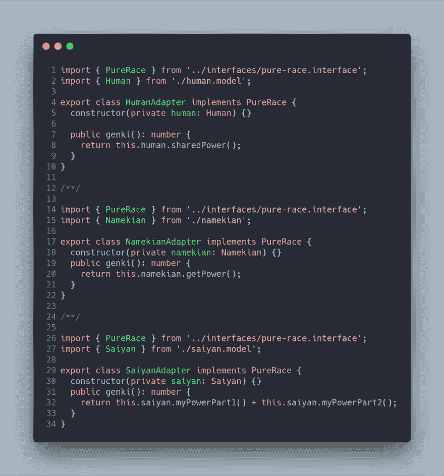](https://res.cloudinary.com/practicaldev/image/fetch/s--hdYdV8mI--/c_limit%2Cf_auto%2Cfl_progressive%2Cq_auto%2Cw_880/https://cdn-images-1.medium.com/max/1000/1%2AI_mshB6Pqzv8YnAVV3ahTQ.png)

最后，所有贡献能量的物体来对抗邪恶，成就伟大的力量。

[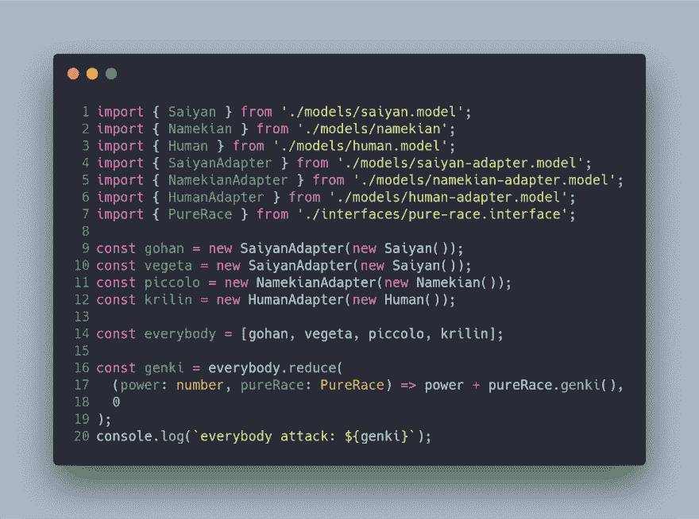](https://res.cloudinary.com/practicaldev/image/fetch/s--PAbpko1o--/c_limit%2Cf_auto%2Cfl_progressive%2Cq_auto%2Cw_880/https://cdn-images-1.medium.com/max/1000/1%2AqQzlE4TpVX9X4KC7SDWM8A.png)

我创建了两个 npm 脚本，在应用了适配器模式后，它们运行这里显示的两个示例。

`npm run example1`
T1】

# 结论

当有些类可以一起工作，但它们接口不兼容时，适配器模式可以避免项目中的重复代码。在这篇文章中，你可以看到一个使用 JavaScript/TypeScript 语言的简单实现。

最重要的不是实现我向你展示的模式，而是能够识别这个特定模式可以解决的问题，以及你何时可以或不可以实现所述模式。这一点至关重要，因为实现会因您使用的编程语言而异。

# 越多越多...

*   设计模式:可重用的面向对象软件的元素，伽马，赫尔姆，约翰逊，& Vlissides，艾迪森韦斯利，1995 。
*   [适配器模式—维基百科](https://en.wikipedia.org/wiki/Adapter_pattern)。
*   [https://www.dofactory.com/javascript/adapter-design-pattern](https://www.dofactory.com/javascript/adapter-design-pattern)
*   [https://github . com/sohamkamani/JavaScript-design-patterns-for-humans #-adapter](https://github.com/sohamkamani/javascript-design-patterns-for-humans#-adapter)

* * *

*   这个帖子的 **GitHub** 分支是[https://GitHub . com/Caballerog/blog/tree/master/adapter-pattern](https://github.com/Caballerog/blog/tree/master/adapter-pattern)

* * *

最初发布于 [www.carloscaballero.io](https://carloscaballero.io/design-patterns-adapter) 。