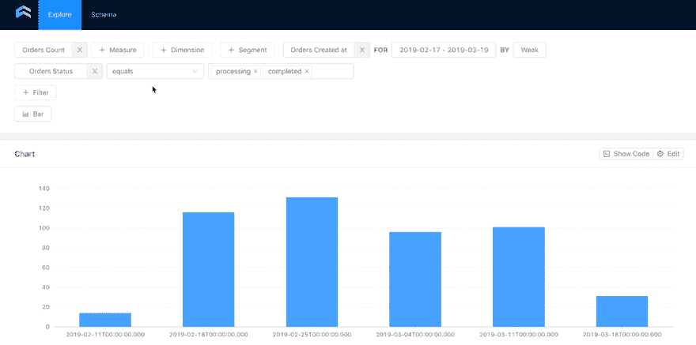

# 用 Cube.js 反应查询构建器

> 原文：<https://dev.to/cubejs/react-query-builder-with-cubejs-1dd4>

从 0.4 版本开始，React [Cube.js](https://github.com/cube-js/cube.js) 客户端附带了`<QueryBuilder />`组件。它旨在帮助开发人员构建交互式分析查询构建器。`<QueryBuilder />`将状态管理和 API 调用抽象到 Cube.js 后端。它使用[渲染道具](https://reactjs.org/docs/render-props.html)，本身不渲染任何东西，而是调用渲染函数。这种方式为用最少的 API 构建定制的 UI 提供了最大的灵活性。

下面的例子展示了使用 Ant Design UI 框架元素的`<QueryBuilder />`组件。

[](https://res.cloudinary.com/practicaldev/image/fetch/s--ctb56ySW--/c_limit%2Cf_auto%2Cfl_progressive%2Cq_auto%2Cw_880/https://media.graphcms.com/eYMdGbdXTOiApv9KwHTq)

上面的例子来自 Cube.js Playground。[你可以在 Github 上查看它的源代码。](https://github.com/statsbotco/cube.js/tree/master/packages/cubejs-playground)

本教程介绍了如何构建更简单版本的查询构建器。但是它涵盖了构建您自己的产品所需的所有基础知识。

## 设置一个演示后端

*如果您已经启动并运行了 Cube.js 后端，您可以跳过这一步*

首先，让我们安装 Cube.js CLI 并使用 Postgres 数据库创建一个新的应用程序。

```
$ npm install -g cubejs-cli
$ cubejs create -d postgres react-query-builder 
```

我们为教程托管了一个包含样本数据的转储。它是一个简单的“电子商务数据库”，包含订单、产品、产品类别和用户表。

```
$ curl http://cube.dev/downloads/ecom-dump.sql > ecom-dump.sql
$ createdb ecom
$ psql --dbname ecom -f ecom-dump.sql 
```

一旦数据库中有了数据，就将 Cube.js 目录中的`.env`文件的内容更改为以下内容。它设置了访问数据库的凭证，以及生成 auth 令牌的密码。

```
CUBEJS_DB_NAME=ecom
CUBEJS_DB_TYPE=postgres
CUBEJS_API_SECRET=SECRET 
```

现在我们已经配置好了一切，最后一步是基于我们的一些表生成一个 [Cube.js 模式](https://cube.dev/docs/getting-started-cubejs-schema)并启动 dev 服务器。

```
$ cubejs generate -t line_items
$ yarn dev 
```

如果您在浏览器中打开 [http://localhost:4000](http://localhost:4000) ，您将访问 Cube.js Playground。它是一个开发环境，可以生成 Cube.js 模式，为图表创建脚手架，等等。它有自己的查询生成器，可以让你用不同的图表库生成图表。

现在，让我们继续构建我们自己的查询构建。

## 构建查询生成器

组件`<QueryBuilder />`使用了[渲染道具](https://reactjs.org/docs/render-props.html)技术。它通过管理状态和 API 层充当数据提供者，调用`render` props 让开发者实现他们的渲染逻辑。

除了`render`，唯一需要的道具就是`cubejsApi`。它需要一个由`cubejs`方法返回的 cube.js API 客户端的实例。

[您可以在这里找到`<QueryBuilder />`组件的详细参考。](https://cube.dev/docs/@cubejs-client-react#query-builder)T3】

```
import cubejs from "@cubejs-client/core";
import { QueryBuilder } from "@cubejs-client/react";
const cubejsApi = cubejs("CUBEJS_TOKEN", { apiurl: "CUBEJS_BACKEND_URL" });

export default () => (
  <QueryBuilder
    cubejsApi={cubejsApi}
    render={queryBuilder => {
      // Render whatever you want based on the state of queryBuilder
    }}
  /> ); 
```

`queryBuilder`的属性可以根据它们所引用的元素进行分类。为了渲染和更新度量，您需要使用`measures`、`availableMeasures`和`updateMeasures`。

`measures`是已经选择的度量的数组。它通常在开始时是空的(除非你传递了一个默认的`query` prop)。`availableMeasures`是通过 API 从您的 Cube.js 数据模式加载的所有度量的数组。`measures`和`availableMeasures`都是带有`name`、`title`、`shortTitle`和`type`键的对象数组。`name`用作 ID。`title`可以用作人类可读的名称，而`shortTitle`只是度量的标题，没有多维数据集的标题。

```
// `measures` and `availableMeasures` are arrays with the following structure
[
  { name: "Orders.count", title: "Orders Count", shortTitle: "Count", type: "number" },
  { name: "Orders.number", title: "Orders Number", shortTitle: "Number", type: "number" }
] 
```

`updateMeasures`是一个具有三种功能的对象:`add`、`remove`和`update`。它用于控制与测量相关的查询构建器的状态。

现在，使用这些属性，我们可以呈现一个 UI 来管理度量并呈现一个简单的折线图，这将根据查询构建器的状态动态地改变内容。

```
import React from "react";
import ReactDOM from "react-dom";
import { Layout, Divider, Empty, Select } from "antd";
import { QueryBuilder } from "@cubejs-client/react";
import cubejs from "@cubejs-client/core";
import "antd/dist/antd.css";

import ChartRenderer from "./ChartRenderer";

const cubejsApi = cubejs(
"YOUR-CUBEJS-API-TOKEN",
 { apiUrl: "http://localhost:4000/cubejs-api/v1" }
);

const App = () => (
 <QueryBuilder
   query={{
     timeDimensions: [
       {
         dimension: "LineItems.createdAt",
         granularity: "month"
       }
     ]
   }}
   cubejsApi={cubejsApi}
   render={({ resultSet, measures, availableMeasures, updateMeasures }) => (
     <Layout.Content style={{ padding: "20px" }}>
       <Select
         mode="multiple"
         style={{ width: "100%" }}
         placeholder="Please select"
         onSelect={measure => updateMeasures.add(measure)}
         onDeselect={measure => updateMeasures.remove(measure)}
       >
         {availableMeasures.map(measure => (
           <Select.Option key={measure.name} value={measure}>
             {measure.title}
           </Select.Option>
         ))}
       </Select>
       <Divider />
       {measures.length > 0 ? (
         <ChartRenderer resultSet={resultSet} />
       ) : (
         <Empty description="Select a measure to get started" />
       )}
     </Layout.Content>
   )}
 />
);

const rootElement = document.getElementById("root");
ReactDOM.render(<App />, rootElement); 
```

上面的代码足以呈现一个带有度量选择的简单查询构建器。下面是它在 CodeSandbox 中的样子:

[https://codesandbox.io/embed/z6r7qj8wm](https://codesandbox.io/embed/z6r7qj8wm)

与`measures`、`availableMeasures`和`updateMeasures`类似，有一些属性用于呈现和管理维度、段、时间、过滤器和图表类型。[您可以在文档中找到属性的完整列表。](https://cube.dev/docs/@cubejs-client-react#query-builder)

此外，值得检查来自 Cube.js Playground 的更复杂的查询构建器的源代码。你可以在 Github 上找到它。