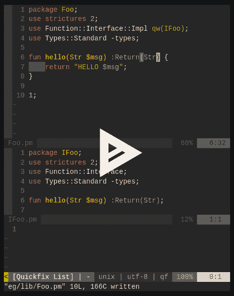

# 发布:函数::接口

> 原文：<https://dev.to/kfly8/release-functioninterface-2pp2>

我正在开发 [Function::Interface](https://github.com/kfly8/p5-Function-Interface) ，这个模块提供了一个类似 Java 接口的类型化接口。
**在编译期**，检查抽象函数是否实现。

您可以在下面的截图中看到演示:

[](https://asciinema.org/a/235220)

# 用法

声明类型化接口包 IFoo:

```
package IFoo {
    use Function::Interface;
    use Types::Standard -types;

    fun hello(Str $msg) :Return(Str);

    fun add(Int $a, Int $b) :Return(Int);
} 
```

实现接口包 IFoo:

```
package Foo {
    use Function::Interface::Impl qw(IFoo);
    use Types::Standard -types;

    fun hello(Str $msg) :Return(Str) {
        return "HELLO $msg";
    }

    fun add(Int $a, Int $b) :Return(Int) {
        return $a + $b;
    }
} 
```

不依赖实现就好:

```
package FooService {
    use Function::Interface::Types qw(ImplOf);
    use Function::Parameters;
    use Function::Return;
    use Mouse;

    use aliased 'IFoo';

    fun greet(ImplOf[IFoo] $foo) :Return() {
        print $foo->hello;
        return;
    }
} 
```

```
my $foo_service = FooService->new;
my $foo = Foo->new; # implements of IFoo

$foo_service->greet($foo); 
```

# 工作原理

简单解释一下

1.  声明抽象函数的关键字`fun`和`method`在[关键字:](https://metacpan.org/pod/Keyword%3A%3ASimple)和 [PPR](https://metacpan.org/pod/PPR) 中实现。 [B::Deparse](https://metacpan.org/pod/B%3A%3ADeparse) 显示它存储了抽象函数的元信息。

2.  为了检查接口是否被正确实现，将存储的接口元信息与使用[函数::参数](https://metacpan.org/pod/Function%3A%3AParameters)和[函数::返回](https://metacpan.org/pod/Function%3A%3AReturn)获得的实现元信息进行比较。

# 终于

你有没有经历过软件越做越大，维护越来越少的情况？在这样的情况下，我认为重要的是把代码划分好，让代码容易修改，让代码更容易阅读。

为了分代码，我觉得接口有用。请尝试一下！！

谢了。