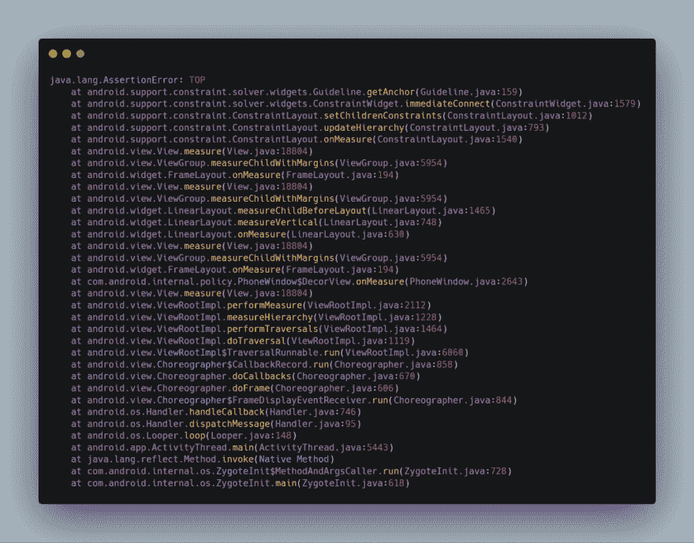
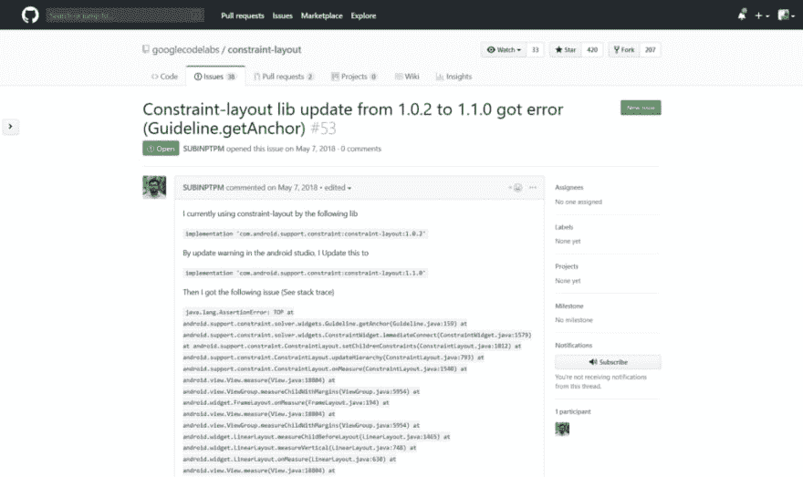
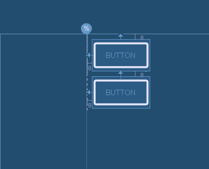
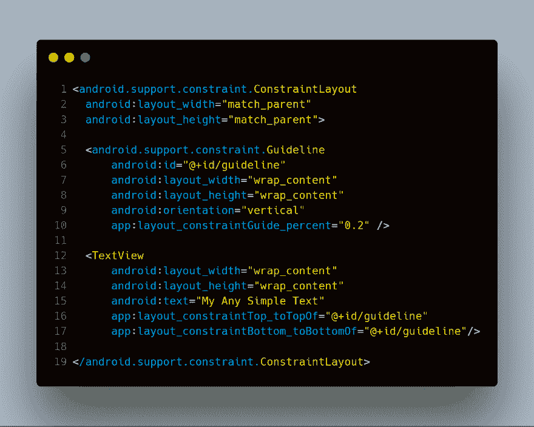
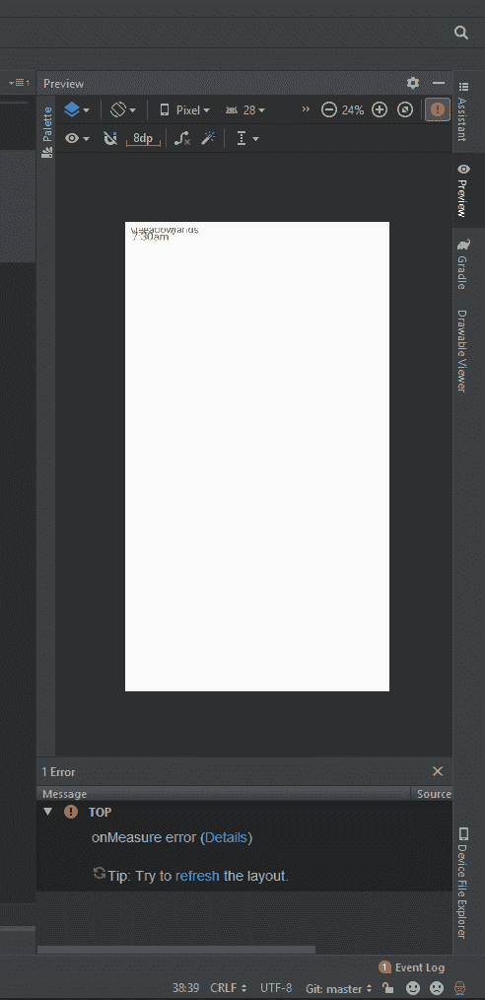
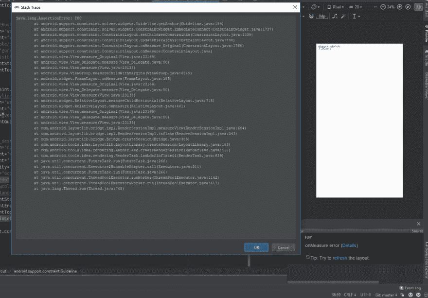

# Android 中的⚡Fixing 约束布局和准则声明错误异常

> 原文：<https://dev.to/wajahatkarim/fixing-constraintlayout-guideline-assertionerror-exception-in-android-24ap>

#### 将 ConstraintLayout 从 1.0.2 更新到更高版本时修复 AssertionError 异常的快速提示。

> 这篇文章是我今天学习的系列的[的一部分，最初发布在我的](https://medium.com/p/65c64e1dcb6) [TIL Github 库](https://github.com/wajahatkarim3/Today-I-Learned/)和我在 wajahatkarim.com[的网站](http://wajahatkarim.com)

* * *

这几天，我在做一个非常老的代码库的 android 应用程序。因此，在我添加新功能和修复错误的同时，我也在用最新的 API 改进代码库。因此，在这方面，我在大约 3 个月前添加了[约束布局](https://developer.android.com/training/constraint-layout)。当时最新版本是 1.0.2。这帮助我以简单的方式创建复杂的布局，并允许我利用平面视图层次结构来更好地执行任务。

大约昨天，我有一个任务，包括同时显示/隐藏多个视图。我尝试使用[组约束布局](https://developer.android.com/reference/android/support/constraint/Group)，所以更新到下一个稳定版本，1.1.3。

但当我启动这款应用时，一些带有 ConstraintLayout 的屏幕正常工作，而在一些情况下，应用崩溃了。我查看日志时，发现了这个。

日志根本没有任何意义。唯一明智的事情，可以帮助我解决这个问题，我从这个日志中得到的是第 2 行，它显示了关键字指南。所以，我有一种直觉，这在某种程度上是一个指导方针的问题。

* * *

做一个简单的谷歌搜索向我保证，有许多其他开发人员面临着同样的问题，没有人真正知道为什么会发生这种情况以及如何解决。

关于这个问题的[线程](https://stackoverflow.com/questions/51594162/constraint-layout-issue-java-lang-assertionerror-top)[stack overflow](https://stackoverflow.com/questions/50188620/constraint-layout-lib-update-from-1-0-2-to-1-1-0-got-error-guideline-getanchor)证实了一件事，这个问题与指导方针有关。甚至还有在 [Google Codelab 的约束布局库](https://github.com/googlecodelabs/constraint-layout)提交的问题，像[这个](https://github.com/googlecodelabs/constraint-layout/issues/51)和[这个](https://github.com/googlecodelabs/constraint-layout/issues/53)。不幸的是，这些问题仍然是开放的，还没有一个单一的评论，更不用说解决方案。开发人员只能靠自己来解决这个问题。

<figure> 

<figcaption>截图 [Issue # 53](https://github.com/googlecodelabs/constraint-layout/issues/53) from [约束布局于 Github](https://github.com/googlecodelabs/constraint-layout/)</figcaption>

</figure>

* * *

### 🔥Hot 和⌚️Quick 解决了这个令人沮丧的问题😃

这个问题没有具体的解决办法。但这是有原因的。因此，要解决这个问题，我们需要了解原因，然后我们可以轻松地解决这个问题。

[constraint layout](https://developer.android.com/reference/android/support/constraint/Guideline)中的一个指导方针是一个虚拟助手，它在设备上运行时不可见，但在视图中是可见的。不见了。这些仅用于布局和定位目的。

<figure> 

<figcaption>两个按钮相对于一条百分比垂直基准线</figcaption>

</figure>

定位

根据 Google 的文档，一个指南可以是水平的也可以是垂直的:

*   垂直指引线的宽度为零，其高度为其 [ConstraintLayout](https://developer.android.com/reference/android/support/constraint/ConstraintLayout.html) 父项的高度
*   水平指引线的高度为零，宽度为其 [ConstraintLayout](https://developer.android.com/reference/android/support/constraint/ConstraintLayout.html) 父级的宽度

这个 AssertionError 异常的主要原因就是这个。

> 您不能将任何其他视图垂直约束于任何垂直基准线，水平方向也是如此。

这意味着，如果我们有一个垂直的指导方针，那么我们不能像这样写代码:

检查第 16 和 17 行。我们已经将文本视图的顶部和底部设置为垂直基准线的顶部和底部。垂直基准线的高度是父项的高度，我们不能将任何视图约束到垂直基准线的顶部和底部。相反，我们应该约束到垂直方向的左边和右边，顶部/底部约束到水平方向。所以，如果我们写 app:layout _ constraint left _ toRightOf = " @+id/guideline "这样的东西，那么就不会有这个问题了。

* * *

### ✅最后的解决方案😃

我的项目有 15 个以上的布局文件，其中有 ConstraintLayout。日志消息帮助不大。因此，首先打开所有使用了指南的布局文件。

现在导致这个问题的布局将在预览窗格的右上角显示一个红色的错误圆圈，如下图所示。

当你点击它时，你会看到底部的信息面板，它会告诉你垂直方向的上/下和水平方向的左/右。当您单击“详细信息”按钮时，您将看到一个对话框，显示与下图完全相同的异常消息。

这个红色的错误圈和这个对话框是确认你在布局文件中，这是导致这个异常和崩溃的应用程序。因此，交叉检查基准线和其他视图的约束，并确保垂直基准线被约束为左右，水平基准线被约束为上下。这是解决这个烦人问题的唯一办法。

一旦你这样做了，这个红圈就会消失。现在，您可以运行您的应用程序，不会出现任何问题和崩溃。

* * *

**如果你喜欢这篇文章，你可以阅读我下面的新文章:**

*   ⚡，你的 Android 工作室总是很慢吗？🚀下面介绍一下如何立刻提速。

**Wajahat Karim** 毕业于[NUST](http://nust.edu.pk)，是一名经验丰富的移动开发人员，一名活跃的开源贡献者，也是两本书[学习 Android 意图](https://www.amazon.com/Learning-Android-Intents-Muhammad-Usama/dp/1783289635)和[用 Unity 掌握 Android 游戏开发](https://www.amazon.com/Mastering-Android-Game-Development-Unity/dp/1783550775/)的合著者。在业余时间，他喜欢和家人呆在一起，做编码实验，喜欢写很多东西(主要是在他的博客和媒体上),并且是开源的热情贡献者。2018 年 6 月，他的一个库在 [Github Trending](https://github.com/trending) 上成为第一名。[他的库](http://github.com/wajahatkarim3)在 Github 上有大约 3000 颗星星，并被全球各地的开发者用于各种应用。在 Twitter 和 [Medium](https://medium.com/@wajahatkarim3) 上关注他，获得更多关于他的写作、Android 和开源工作的更新。

* * *