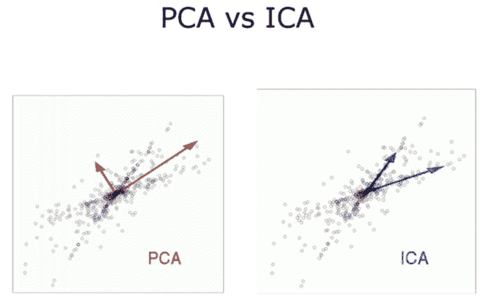
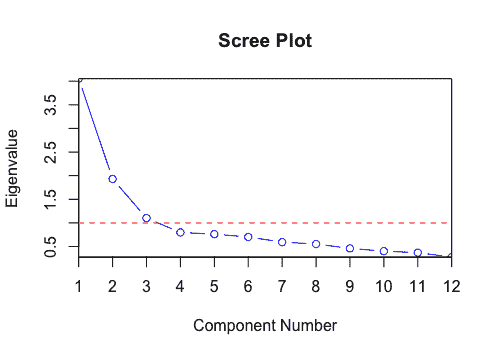

# 无监督学习:特征转换

> 原文：<https://dev.to/swyx/unsupervised-learning-feature-transformation-pcf>

*这是我参加[佐治亚理工学院/优达城机器学习课程](https://www.udacity.com/course/machine-learning--ud262)的一系列课堂笔记中的第 16 篇。课堂教材是汤姆·米切尔的[机器学习。](https://www.cs.ubbcluj.ro/~gabis/ml/ml-books/McGrawHill%20-%20Machine%20Learning%20-Tom%20Mitchell.pdf)*

## 特征变换

预处理一组特征以创建一个新的(更小/更紧凑的)特征集，同时保留尽可能多的(相关？有用吗？)信息。例如，在线性代数术语中，您可以创建现有要素的某种线性组合的新要素。

## 为什么要把特征转化作为一个独立的话题？

任何有大量误报和漏报的特征的问题都需要某种形式的特征变换。

一个例子:信息检索，或特别检索问题，就像 Google 需要根据给定的搜索条件查找文档。对于 google 来说，文档中的所有单词都是特征(进行一些清理)。那可是一大堆话，给我们带来了维度的诅咒。但是在这里最相关的是，单词也不是很好的指示器(因为多义性和同义性),这导致了许多假阳性和假阴性。做特征选择不会解决这个问题。

## [主成分分析](https://en.wikipedia.org/wiki/Principal_component_analysis)

这是一个本征问题的例子。PCA 找到相互正交的最大方差方向。您可以使用 PCA 完美地重建(或描述)您的数据，但最常见的是
如果您选择主成分的子集，您将最小化您选择的维度的 L2 误差。

**特征值和降维**

特征值表示每个 PC 的重要性，0 特征值表示维度无关紧要。PCA 通过对特征值进行排序并挑选顶部的`k`值来进行降维。你可以用[的碎石图](https://en.wikipedia.org/wiki/Scree_plot)来想象这一点

您使用 PCA 将特征转换到一个新的空间，您知道如何进行过滤。

## 独立成分分析

PCA 是通过最大化方差来寻找相关性。

ICA 试图最大化独立性。将一组特征 X 转换成新的特征 Y，在任何 Y 特征之间没有互信息，但是在 X 和 Y 之间有最大互信息(能够重构数据)。

这适用于盲源分离问题(也称为鸡尾酒会问题)，其中麦克风试图隔离单个人的声音，尽管拾取了额外的噪声。每个麦克风接收多个声源的某种线性组合，您可以使用 ICA 对其建模，并逆向创建各个声音的声音流。

与主成分分析相反，独立成分分析是局部的和无序的。它只关注独特的特征，这对于声音和自然图像来说是一个非常好的特性——它们检测图像中的边缘！当您将它应用于我们最初的文档问题时，ICA 会为您提供主题——为特定主题选择的单词集合。

## 替代品

**RCA:随机成分分析**它不是寻找方差最大的维度，而是选取随机维度。如果你做的下一件事是一种分类形式，它会工作得非常好，因为你仍然保留信息，但维度较低，所以你仍然可以获得一些相关性。它效率较低，但比 PCA 快。

**LDA:线性判别分析**找到一个基于标签进行判别的投影(类似监督学习)——基于标签进行分离。90 年代以后，潜在的狄利克雷分配成为了比较流行的 LDA。

## 我们系列的下一个

关于此主题的更多说明:

*   [独立成分分析](http://mlsp.cs.cmu.edu/courses/fall2012/lectures/ICA_Hyvarinen.pdf)
*   [关于 PCA 与 ICA 的一组很棒的幻灯片](http://compneurosci.com/wiimg/4/42/Intro_to_PCA_and_ICA.pdf)

希望这是对特性转换的一个好的介绍。我正在计划更多的初级读本，希望您能就以下方面提供反馈和问题:

*   [概述](https://dev.to/swyx/machine-learning-an-overview-216n)
*   监督学习
    *   [决策树](https://dev.to/swyx/machine-learning-classification-learning--decision-trees-1mbh)
    *   [回归](https://dev.to/swyx/supervised-learning-regression-4d17)
    *   [神经网络](https://dev.to/swyx/supervised-learning-neural-networks-mpo)
    *   [基于实例的学习(K 最近邻)](https://dev.to/swyx/supervised-learning-instance-based-learning-and-k-nearest-neighbors-kge)
    *   [集成学习(AdaBoost)](https://dev.to/swyx/supervised-learning-ensemble-learning-lim)
    *   [内核方法&支持向量机](https://dev.to/swyx/supervised-learning-support-vector-machines-3mgk)
    *   [计算学习理论](https://dev.to/swyx/supervised-learning-computational-learning-theory-160h)
    *   [VC 尺寸](https://dev.to/swyx/supervised-learning-vc-dimensions-10b)
    *   [贝叶斯学习](https://dev.to/swyx/supervised-learning-bayesian-learning-403l)
    *   [贝叶斯推理](https://dev.to/swyx/supervised-learning-bayesian-inference-4l72)
*   无监督学习
    *   [随机优化](https://dev.to/swyx/unsupervised-learning-randomized-optimization-4c1i)
    *   [信息论](https://dev.to/swyx/unsupervised-learning-information-theory-recap-4iem)
    *   [聚类](https://dev.to/swyx/unsupervised-learning-clustering-42mi)
    *   [功能选择](https://dev.to/swyx/unsupervised-learning-feature-selection-84f)
    *   [特征变换](https://dev.to/swyx/unsupervised-learning-feature-transformation-pcf)
*   强化学习
    *   马尔可夫决策过程-3 月 25 日的一周
    *   “真实”RL-4 月 1 日开始的一周
    *   博弈论-4 月 15 日的一周