# 使用 MongoDB 的数据库监控云 Java 微服务的响应时间

> 原文：<https://dev.to/ibmdeveloper/monitor-response-times-of-cloud-java-microservices-with-databases-for-mongodb-1ja8>

[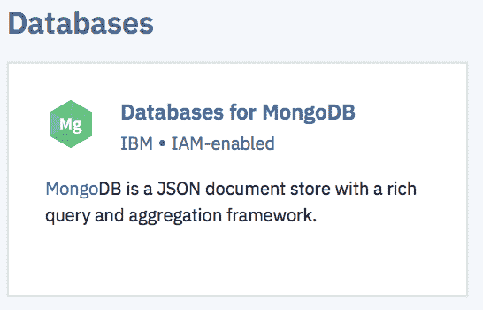](https://res.cloudinary.com/practicaldev/image/fetch/s--8LRzOMkE--/c_limit%2Cf_auto%2Cfl_progressive%2Cq_auto%2Cw_880/https://thepracticaldev.s3.amazonaws.com/i/28uox4fgbwb6lyxrnhc4.png)

我的一个客户让我用一个简单的仪表板概念来帮助他们，这个仪表板将显示 IBM 专用云上公开的各种数据服务的 CRUD(创建、读取、更新、删除)操作的一系列可用性和响应时间。巧合的是，它也成为了一个很好的例子，说明了如何对那些从本地机器上的 Java Open Liberty 服务器访问的数据服务使用 CRUD 操作，以及如何通过 VCAP 配置文件绑定到云中。

本教程指导您如何检查 IBM Cloud 上托管的服务的响应时间。这是一个简单的工具，它还可以向您展示如何在 Cloudant、IBM Message Hub、MongoDB、Elastic Search 等战略数据源上的 Java 应用程序/微服务中进行基本的 CRUD 操作。

这篇特别的 how-to 帖子是一个使用* *数据库的例子，该数据库由 IBM Cloud 托管和管理。这里显示的方法是生成一个 JSON 响应文件，其中包含访问 CRUD 操作的报告，并提供访问每个操作所需的时间，以及总的操作时间。您将尝试创建的响应文件的示例如下所示。*

{
"service": "mongodb "，
" operations ":[{
" type ":" create "，
"response_time": 30，
"response_code": 200，
" desc ":{
" visitor id ":" 594 ddeee 34a 639002645674d "
}
}，
{
"type": "read "，
"response "
【response _ code】:200，
【desc】:{
【删除的访问者 id】:" 594 ddeee 34a 639002645674d "
}
}
，
【response _ code】:200，
【desc】:"操作实现了 CRUD/CRUD"
}

## 学习目标

完成本教程后，读者将知道如何:

*跟踪服务响应时间
*在本地和云中运行 Java Open Liberty server
*将 Java Open Liberty server 连接到公开的服务

## 先决条件

开始之前，您需要在机器上安装以下软件:

* [Git](https://git-scm.com/)
* [云代工厂 CLI](https://docs.cloudfoundry.org/cf-cli/install-go-cli.html)*[Maven](https://maven.apache.org/install.html)

您还需要:

*一个 IBM Cloud-[cloud.ibm.com](https://ibm.biz/Bd2CUa)帐户(注意，我们将使用非精简层服务)
*一个 IDE。在这个例子中，我使用带有 IBM 云插件的 [Eclipse 将应用程序部署到云上。](https://marketplace.eclipse.org/content/ibm-eclipse-tools-ibm-cloud)

## 预计时间

对于第一次设置环境的人来说，完成整个实验大约需要 20 到 60 分钟。

## 步骤

### 第一步。克隆示例应用程序

1.  克隆[https://github.com/blumareks/BluemixTestDashboard](https://github.com/blumareks/BluemixTestDashboard)GitHub 库。

git clone[https://github . com/blumareks/blue mixtest ashboard](https://github.com/blumareks/BluemixTestDashboard)

1.  将目录更改为 MongoDB 示例应用程序所在的位置。为此，请使用以下说明:

CD bluemix test dashboard/GetStartedJavaMongoDb

目前这已经足够好了。接下来，我们将在 IBM Cloud 上提供一些资源，并回到克隆的 repo。

### 第二步。创建云服务

1.  登录 IBM[cloud.ibm.com](https://ibm.biz/Bd2CUa)控制台。

2.  在\** *目录* * *中搜索`**Databases for MongoDB**`和 **`Liberty for Java** `。

[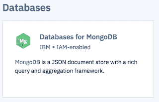](http://3.bp.blogspot.com/-IwbFQHzOnbk/XJLVuM0KTqI/AAAAAAAABa8/JS_nsmHlwg4rZ8NQta62TeQJbdtl5N9qACK4BGAYYCw/s1600/Screen%2BShot%2B2019-03-20%2Bat%2B1.56.51%2BPM.png)

[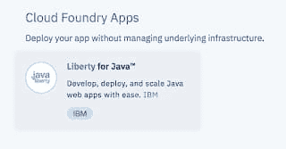](http://3.bp.blogspot.com/-An9OVQGk0MI/XJLYjMYuAII/AAAAAAAABbI/yQ3llvv8FRocQtpkDwpaX9Zwy3do0udigCK4BGAYYCw/s1600/java-1.png)

1.  创建`Liberty for Java`示例应用程序和`Databases for MongoDB`服务。

2.  一旦创建了这两个服务，就将 MongoDB 服务与 Liberty for Java 应用程序绑定在一起。

    1.  单击 Liberty for Java 服务的*连接*选项卡，然后单击*创建连接*按钮。

[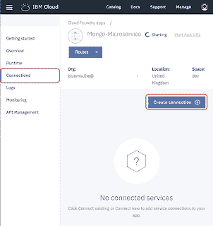](http://1.bp.blogspot.com/-yBMM6y8xpOw/XJLZUuNyvgI/AAAAAAAABbc/9d7gtGujQVkJC3YicPLVbcNd6zN-R4dnACK4BGAYYCw/s1600/monodb-2.png)

1.  为 MongoDB**服务选择**数据库。

[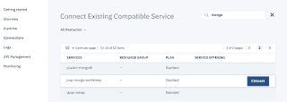](http://4.bp.blogspot.com/-uTvzbe7LsKk/XJLnGMRfnqI/AAAAAAAABcw/c7Tcj3hI2B8ht_kQ-lmktTh2721bpgsMQCK4BGAYYCw/s1600/mongo-23.png)

1.  单击*连接*按钮。

[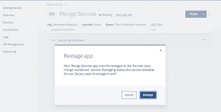](http://3.bp.blogspot.com/-YhdxiwZPiYk/XJLnJdKJZJI/AAAAAAAABc4/2AnoMAPXUiovCi292Kh-oXWpfK8RnYjVQCK4BGAYYCw/s1600/mongo-24.png)

此操作将启动 Liberty for Java 服务的重新启动过程。

### 第三步。将 TLS/SSL 的 JVM 系统属性连接到 MongoDB 的数据库

1.  进入

    `Databases for MongoDB`

    服务中的**服务凭证* *标签。

2.  从菜单中，选择**查看凭据* *。

    VCAP 文件中的连接凭据将如下所示:

    {
    "连接":{
    "cli": {
    "参数":[
    [
    "-u "，
    " IBM _ cloud _[已删除字符]"，
    "-p "，
    "[已删除字符]"，
    " - ssl "，
    " - sslCAFile "，
    " b 226140 c-3543-11e 9-837 a-ae06e 730 b 715 "，
    。

    " bin": "mongo "，
    " certificate ":{
    " certificate _ base64 ":"[已删除字符]"，
    " name ":"[已删除字符]"
    }，
    " composed ":[
    " mongo-u IBM _ cloud _[已删除字符]-p[已删除字符]-SSL-SSL cafile b 226140 c-3543-11e 9-837 a-ae06e 730 b 715-authenticationDatabase admin-host repl set/mauthSource=admin "，
    " MongoDB://IBM _ cloud _[characters removed]:[characters removed]@ 4 FFB 04 c b-473 b-4895-879 e-becf 8 FB 4 AC 40-1 . d 7 deeff 0d 58745 ABA 57 fa 5c 84685 D5 b 4 . databases . appdomain . cloud:31676/IBM clouddb？authSource=admin"
    ]，
    " hosts ":[
    {
    " hostname ":" 4 FFB 04 CB-473 b-4895-879 e-becf 8 FB 4 AC 40-0 . D7 deeff 0d 58745 ABA 57 fa 5c 84685 D5 b 4 . databases . appdomain . cloud "，
    "port": 31676，
    "protocol": "mongodb"
    。

3.  向下滚动，注意这个连接是支持 SSL 的。如果没有凭据文件，请使用默认值创建一个。复制整个 json。您将需要以下零件:

"证书":{
" certificate _ base64 ":"[已删除字符]"，
"名称":" b 226140 c-3543-11e 9-837 a-ae06e 730 b 715 "
}，

URL:来自" composed "的第一个链接:[
" composed ":[
" MongoDB://IBM _ cloud _[characters removed]:[characters removed]@ 4 FFB 04 c b-473 b-4895-879 e-becf 8 FB 4 AC 40-0 . d 7 deeff 0d 58745 ABA 57 fa 5c 84685 D5 b 4 . databases . appdomain . cloud:31676/IBM clouddb？authSource=admin "，
" MongoDB://IBM _ cloud _[已删除字符]:[已删除字符]@ 4 FFB 04 CB-473 b-4895-879 e-becf 8 FB 4 AC 40-1 . d 7 deeff 0d 58745 ABA 57 fa 5 c 84685d 5 b 4 . databases . appdomain . cloud:31676/IBM clouddb？authSource=admin"
]，

并且从同一个“composed”中可以取二级 URL(hosts 中的第二个)
“hosts”:[
{
“hostname”:“4 FFB 04 c b-473 b-4895-879 e-becf 8 FB 4 AC 40-0 . D7 deeff 0d 58745 ABA 57 fa 5c 84685 D5 b 4 . databases . appdomain . cloud”，
“port”:31676，
“protocol”:“MongoDB”

[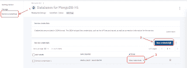](https://1.bp.blogspot.com/-VIDWhR9yn1M/XJLfcFcsP4I/AAAAAAAABbo/VhuBdKgMDhgUcYSE_tcf61zaR1dMTkoAACLcBGAs/s1600/mongo-5.png)

我们需要在应用程序中设置几个 JVM 系统属性，以确保客户机能够验证服务器提供的 TLS/SSL 证书:

```
 \* `javax.net.ssl.trustStore`: The path to a trust store containing the certificate of the signing authority.
  \* `javax.net.ssl.trustStorePassword`: The password to access this trust store. 
```

注意，信任存储通常是用作为 JDK 的一部分提供的`keytool`命令行程序创建的。例如:

keytool-import cert-trustcacerts-file-keystore-store pass

1.  返回到**Databases for MongoDB**控制台，在**Credentials**页面上获取 SSL 证书 encoded_64。你需要对它进行解码。我使用了 https://www.base64decode.org 的服务。当您解码复制的证书时，您可以在下一步中使用它。

2.  将 SSL 证书保存在文件中:

cat > mongodbcert . crt

内容应该是这样的:

-开始证书-
ls 0 TLS 1 crudjtibdrvjusuzjq 0 furs 0
[...拆下的耦合线...]
vsvelgsunbveutls 0 tlqo
-结束证书-

1.  使用`keytool`命令为您的系统创建 MongoDB 密钥库。请注意，您可能需要考虑将密码更改为更合适的值。

keytool-import cert-trustcacerts-file。/mongodbcert.crt -keystore。/mongo keystore-store pass after eight

1.  完成后，将`mongoKeyStore`放在您克隆的存储库的路径中:

GetStartedJavaMongoDb/src/main/resources/mongo keystore

1.  您可能希望注释 IBM Cloud connection 中的行，并通过取消注释从 github 克隆的文件`MongoDbVisitorStore.java`中的以下行，将其切换到本地存储:`BluemixTestDashboard/GetStartedJavaMongoDb/src/main/java/wasdev/sample/store`

[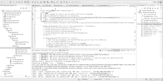](https://4.bp.blogspot.com/-MVijvWsfF4U/XJLgV4ti64I/AAAAAAAABbw/WgkEYfh2OwUBtu9kRY7aBVJJruvCM2g6wCLcBGAs/s1600/javauncomment.png)

此外，对于本地 Liberty 和 MongoDB 测试，您需要在本地文件中定义 MongoDB URL，如下所示:/bluemix test dashboard/GetStartedJavaMongoDb/src/main/resources/mongo . properties。为此，使用以前从 json 中捕获的元素:

*   统一资源定位器
*   host2 的一部分；
*   在 URL 的末尾添加`&ssl=true`。

它看起来应该是这样的:

mongo _ URL = MongoDB://IBM _ cloud _[已删除字符]:[已删除字符]@ 4 FFB 04 CB-473 b-4895-879 e-becf 8 FB 4 AC 40-0 . D7 dee ff 0d 58745 ABA 57 fa 5 c 84685 D5 b 4 . databases . appdomain . cloud:31676，4 FFB 04 c b-473 b-4895-879 e-becf 8 FB 4 AC 40-1 . D7 deeauthSource=admin&ssl=true

1.  从项目根目录，在终端中运行 Maven(确保通过运行`mvn --version`安装了它):

mvn 安装

`mvn install`之后的文档将被本地存储在以下位置:

/your-path-to-the-target/GetStartedJavaMongoDb/target/TestJavaMongo-1.0-SNAPSHOT/we b-INF/classes/mongo keystore

或者在 IBM Cloud 上(在一个`cf push`命令之后):

/home/vcap/app/WLP/usr/servers/default server/apps/myapp . war/we b-INF/classes/mongo keystore

典型的应用程序还需要设置几个 JVM 系统属性，以确保客户机向 MongoDB 服务器提供 TLS/SSL 证书:

* `javax.net.ssl.keyStore`:包含客户端 TLS/SSL 证书的密钥库的路径。
* `javax.net.ssl.keyStorePassword`:访问该密钥库的密码。

### 第四步。在 Open Liberty 上本地运行，在 IBM Cloud 上运行 MongoDB 的数据库

为了在本地测试和运行服务，您可能需要在本地服务器上安装 JAXRS-2.0 特性。为此，我使用了 Eclipse IDE。添加了 JAXRS-2.0 的服务器配置屏幕如下图所示:

[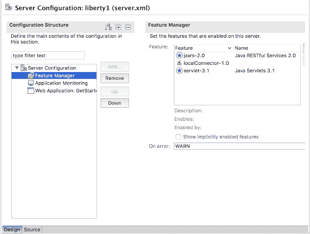](https://1.bp.blogspot.com/-PeEXwxeNOAw/XJLhIqPqHpI/AAAAAAAABb4/YkZOhGNCliA7yKorxL81YtSi1ZNK_K91QCLcBGAs/s1600/java-5.png)

由 Eclipse IDE 管理的本地 Liberty 服务器的源代码如下所示:

T9】！-启用功能->

local connector-1.0
servlet-3.1
jaxrs-2.0

使用`mvn install`命令构建项目后，您就可以在上面配置的本地服务器上运行它了。

[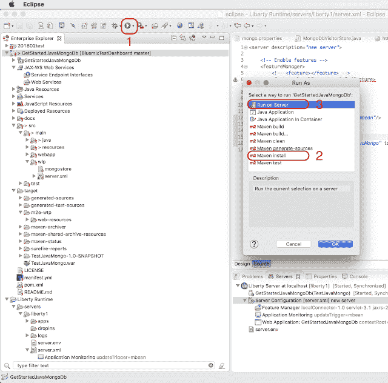](http://1.bp.blogspot.com/-ncWW1jjBATU/XJLhaRuTwwI/AAAAAAAABcE/6qwWC4rzVYEUTDStJZ0sKn6K67I9P1l2ACK4BGAYYCw/s1600/java-6.png)

下图显示了本地调用服务后的结果:

[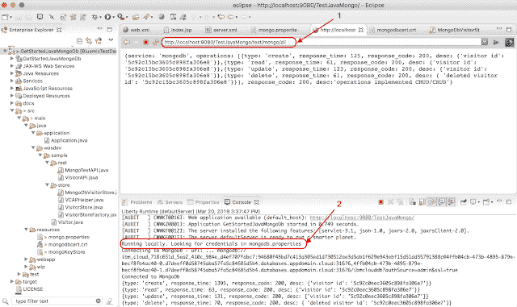](https://3.bp.blogspot.com/-U7W9Ugyhc08/XJLiMkVzFeI/AAAAAAAABcQ/3L4Y03bjUjsfz0_-05XDydnvxtKmAG6DwCLcBGAs/s1600/java-7.png)

第一次调用的往返时间大约为五秒钟(我们需要创建数据库并远程运行所有的东西)，这并不令人印象深刻。但是下一步将显示在 IBM Cloud 中运行相同的服务，响应时间将至少提高 10 倍。下面是我的结果，但请记住，下面的调用更快，因为我们的服务已经提供，并且连接已经建立。

{

```
"service": "mongodb",

"operations": [{

        "type": "create",

        "response\_time": 386,

        "response\_code": 200,

        "desc": {

            "visitor id": "5aec8faf17683ad076f4fc58"

        }

    },

    {

        "type": "read",

        "response\_time": 303,

        "response\_code": 200,

        "desc": {

            "visitor id": "5aec8faf17683ad076f4fc58"

        }

    },

    {

        "type": "update",

        "response\_time": 579,

        "response\_code": 200,

        "desc": {

            "visitor id": "5aec8faf17683ad076f4fc58"

        }

    },

    {

        "type": "delete",

        "response\_time": 164,

        "response\_code": 200,

        "desc": {

            "deleted visitor id": "5aec8faf17683ad076f4fc58"

        }

    }

],

"response\_code": 200,

"desc": "operations implemented CRUD/CRUD" 
```

}

### 第五步。在 IBM 云中为 MongoDB 运行 Open Liberty 数据库

至少有两种方法可以在云中部署和运行这项服务。您可以手动调整 Cloud Foundry 文件并使用 Cloud Foundry CLI 运行它，或者使用 IBM Cloud connector for Eclipse。在本教程中，我们使用 Cloud Foundry CLI。

1.  从 IBM Cloud 下载 CLI。

    1.  去自由服务中心。
    2.  选择**入门* *选项卡。
    3.  下载命令行界面:
2.  一旦安装了 CLI，您就可以运行 version 命令:

ibmcloud -版本
ibmcloud 版本 0 . 6 . 6+d4d 59 ab 5-2018-03-20t 07:49:59+00:00

1.  设置您的接入点。(请注意，API 访问点取决于美国、欧盟、澳大利亚等地的云位置。)

ibmcloud api [https://api](https://api) 。

1.  登录到该服务。(注意，如果您使用的是联邦登录，请使用`ibmcloud login -sso`。)

ibmcloud 登录-u

1.  登录后，您可以交互选择要使用的组织和空间。

ibmcloud 目标- cf

1.  现在编辑 Cloud Foundry 配置文件 manifest.yml。该文件应该包含应用程序(您的 Liberty 服务)的名称和 MongoDB 服务的绑定数据库。

在本例中，它看起来像这样:

应用:
-名称:
random-route: true
路径:target/TestJavaMongo.war
内存:256M
实例:1
名称:test-java-mongodb
主机:test-java-mongodb

1.  在 java 类文件中更新云中 MongoDB keystore 的位置:`MongoDbVisitorStore.java`

2.  现在，您可以使用 Maven 为云构建应用程序:

mvn 清洗
mvn 安装

在`mvn`命令正确无误地完成之后，您就可以将您的应用程序推送到 thr cloud 了。这需要几分钟——刚好够喝一杯咖啡。:-)

ibmcloud 应用推送

考虑在服务的仪表板上查看文档的日志(请参见**日志* *选项卡)，或在终端中使用 CLI:

ibmcloud 应用程序日志

但是看看这个——**IBM Cloud 中的 CRUD 操作比第一次调用快 100 倍**，比来自本地机器的远程调用快 10 倍。

{

```
"service": "mongodb",

"operations": [{

        "type": "create",

        "response\_time": 12,

        "response\_code": 200,

        "desc": {

            "visitor id": "5aecb5b0705978002421614a"

        }

    },

    {

        "type": "read",

        "response\_time": 18,

        "response\_code": 200,

        "desc": {

            "visitor id": "5aecb5b0705978002421614a"

        }

    },

    {

        "type": "update",

        "response\_time": 11,

        "response\_code": 200,

        "desc": {

            "visitor id": "5aecb5b0705978002421614a"

        }

    },

    {

        "type": "delete",

        "response\_time": 8,

        "response\_code": 200,

        "desc": {

            "deleted visitor id": "5aecb5b0705978002421614a"

        }

    }

],

"response\_code": 200,

"desc": "operations implemented CRUD/CRUD" 
```

}

## 总结

我希望你喜欢阅读这篇教程！我的下一个教程将是关于添加一个应用程序来读取、解析和存储结果。敬请关注，请在 Twitter [@blumareks](https://twitter.com/blumareks) 或 [Medium](https://medium.com/@blumareks/) 上关注我，了解更多更新！

这篇博文最初发布于[https://blumareks.blogspot.com/](https://blumareks.blogspot.com/2019/03/monitor-response-times-of-cloud-java.html)