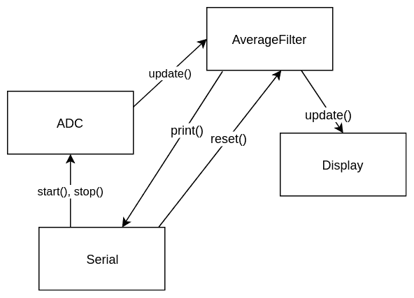
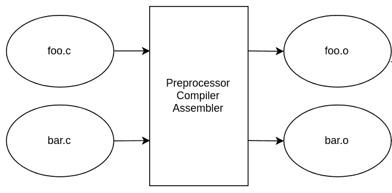
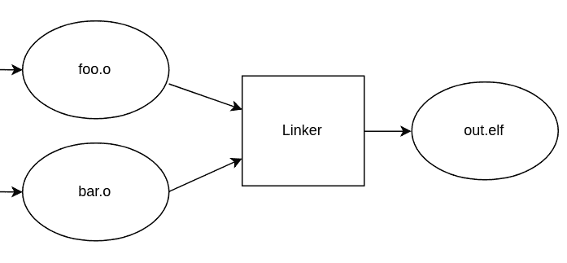
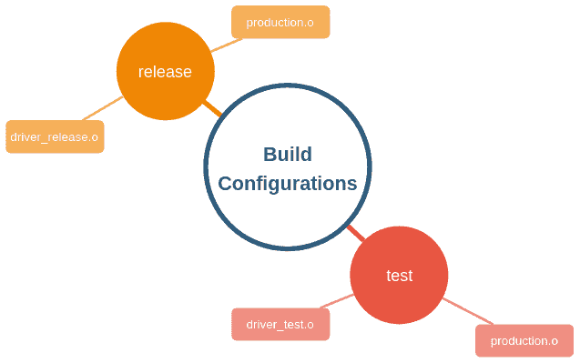
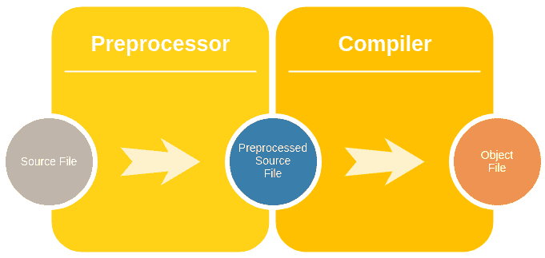
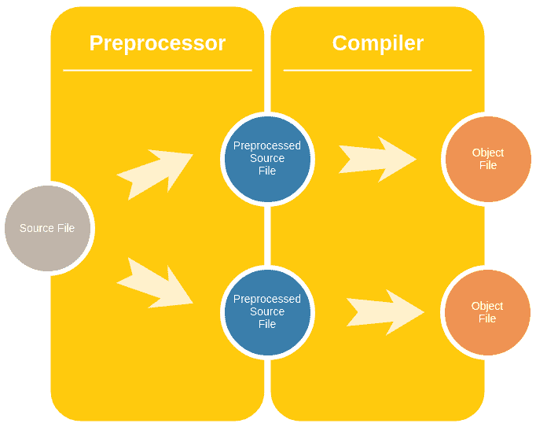

# 嵌入式编程:松耦合最佳实践

> 原文：<https://dev.to/ronalterde/embedded-programming-loose-coupling-best-practices-20n7>

当创建嵌入式软件时，随着生命周期增长的系统复杂性使得推理程序的某些行为变得越来越困难。在工程中，将一个大问题分成几个小问题会有助于最终解决问题。这就是这篇文章的全部内容。

注:这篇文章最初发表于[deardevices.com](https://deardevices.com)。

在他的书[有效地使用遗留代码](https://www.oreilly.com/library/view/working-effectively-with/0131177052/)中，Michael Feathers 介绍了一个**接缝**的概念:

> 一个不用编辑就可以改变程序行为的地方。

尽管最初的目的是作为一种测试遗留代码的方法，我们将首先使用这种思想作为设计软件的指南。这是[松耦合](https://en.wikipedia.org/wiki/Loose_coupling)的一个关键方面，毕竟:在不改变单元本身的情况下改变生产代码单元**的能力。**

在深入细节之前，先说一下*单位*。

# 单位及其依赖关系

假设您即将开始一个新的嵌入式项目。

你甚至可能根本不会考虑设计一个分成不同单元的系统——这也很好。当构建原型时，我们希望看到某些东西是否在工作，尤其是我们的软件是否与硬件配合得很好。

在项目的那个阶段，区分不同的单元可能并不重要。一切都可能*耦合得非常紧密*，甚至可能只是在一个单元或模块中(请原谅我在这里互换使用了术语*单元*和*模块*)。

随着项目的增长，它变得越来越复杂，我们通常想做些什么来让*保持控制*。我们能做的就是将代码拆分，放入不同的编译单元(即`.c` / `.cpp`文件)中，达到某种逻辑分离。

在本文的其余部分，我们将这些逻辑上分离的代码片段称为**单元**。

让我们想象一个项目:

*   使用 ADC 测量电压电平，
*   在一段时间内平均这个数字
*   在 LCD 上显示结果。

此外，通过串行端口，用户应该能够:

*   每隔几秒钟查看一次平均数
*   通过发出命令开始和停止采样过程。

根据这种描述，我们可以将系统分为四个单元:`ADC`、`AverageFilter`、`Display`和`Serial`。下图显示了这些单元之间的一些依赖关系，这些依赖关系基于它们可能如何相互通信。这有道理吗？

[](https://res.cloudinary.com/practicaldev/image/fetch/s--RWIoVz17--/c_limit%2Cf_auto%2Cfl_progressive%2Cq_auto%2Cw_880/https://deardevices.com/assets/Units.png)

从图中可以看出，所有这些单元都以某种方式耦合在一起。这里的箭头表示*依赖于*或*包含头文件*。`AverageFilter`依赖于`Serial`,因为它调用了自己的`print()`函数。

# 松开联轴器

在某些时候，我们可能希望用不同的实现替换一个或多个单元——而不会对系统的其余部分产生任何影响。
和*没有任何影响*在这里甚至是指:**没有改变任何对方单位的代码**。有各种各样的原因让你想这么做。例如:

*   根据用户配置，在运行时切换均值滤波器
*   根据构建参数，在 RS232 和 USB 之间交换串行接口
*   在测试构建中用一些存根替换显示单元

棘手的部分来了:你不能简单地删除或替换依赖关系指向的*单元。为了使这成为可能，我们需要**将**单元彼此分离。*

正如帖子标题所暗示的，在 C 和 C++中(至少)有三种方法可以实现这一点。我们将在下面的章节中逐一介绍。

# 最佳实践#1:对象级解耦

这种方法是最灵活的。在运行时，您将一个依赖项传递给一个单元。在 C++中，你可以创建一个接口(一个抽象基类)并让单元实现它。通过让单元依赖于一组函数指针，在 C 语言中可以做类似的事情。

下面的代码片段显示了一个 C++示例，用于打破`AverageFilter`到`ADC`单元的紧密耦合:

```
class FilterInterface {
public:
  virtual ~FilterInterface() {}
  virtual void reset() = 0;
  virtual void update(uint8_t) = 0;
};

class AverageFilter : public FilterInterface {
public:
  void reset() override {
  }

  void update(uint8_t) override {
  }
};

class ADC {
public:
  ADC(FilterInterface& interface) : interface(interface) {
    interface.reset();
  }

  void process(void) {
    interface.update(42);
  }

private:
  FilterInterface& interface;
};

[...]

int main(void) {
  AverageFilter filter;
  ADC adc(filter);

  while(1) {
    adc.process();
  }
} 
```

类`ADC`依赖于类型`FilterInterface`的接口，并存储对它的引用。因此，**不知道传入的具体实现**。

在 C 中，我们没有多态的概念(多态是一种机制，它使得通过基类指针透明地使用具体的实现成为可能)。不过，您总是可以使用函数指针来模拟它:

```
typedef struct {
  void (*reset)(void);
  void (*update)(uint8_t);
} FilterInterface;

static FilterInterface interface_;

void ADC_init(FilterInterface interface) {
  interface_ = interface;
  interface.reset();
}

void ADC_process(void) {
  interface_.update(42);
} 
```

这往往比 C++实现更不明确，也更容易出错。它可能仍然是值得的(人们确实这样做了: [systemd](https://en.wikipedia.org/wiki/Systemd) ， [Linux 驱动程序](https://www.kernel.org/))。

这个解决方案，不管是用 C 还是 C++实现，都有运行时成本，同时也给了你在运行时修改依赖关系的自由。

# 最佳实践#2:链路级解耦

下一步我们将探索另一种方法。这将基于软件构建过程的另一个阶段- *链接*。

让我们看看迈克尔·费哲对*链接*接缝有什么看法:

> 在许多语言系统中，编译不是构建过程的最后一步。编译器产生代码的中间表示，该表示包含对其他文件中代码的调用。链接器组合了这些表示。它们解析每个调用，这样你就可以在运行时拥有一个完整的程序。

## 链接概述

在这里，Feathers 很好地描述了链接是如何工作的。对于 C 和 C++来说，现在知道这些就够了。

你可以看到下面的流程图。每个`.c`文件单独编译为一个*编译单元*。这意味着编译器为它们中的每一个输出一个`.o`目标文件:

[](https://res.cloudinary.com/practicaldev/image/fetch/s--Emf2h1kN--/c_limit%2Cf_auto%2Cfl_progressive%2Cq_auto%2Cw_880/https://deardevices.com/img/Linking1.png)

然后所有的目标文件被传递给链接器，链接器的工作是把所有的东西放在一起——为了得到一个可执行的程序:

[](https://res.cloudinary.com/practicaldev/image/fetch/s--yapnZIqL--/c_limit%2Cf_auto%2Cfl_progressive%2Cq_auto%2Cw_880/https://deardevices.com/img/Linking2.png)

链接的一个重要部分是**寻找对象(例如函数名)需要的未解析符号**,并尝试满足那些使用其他对象导出的符号的需求。

## 利用链接过程

正如 Feathers 所描述的，基于我们的*构建配置*的样子，我们可以通过提供*不同的*组符号来利用这个过程。

让我们看一下这个 Makefile 代码片段来了解一下这个想法:

```
release.elf:
  gcc driver_release.o production.o -o release.elf

test.elf
  gcc driver_test.o production.o -o test.elf 
```

有两个不同的目标，一个针对我们希望维护的每个构建配置:

*   `release`:产生一个可发布的可执行文件。
*   `test`:包含用于测试的调试代码，这些代码不应该提供给客户。

如下图所示，为了构建两个 [ELF](https://en.wikipedia.org/wiki/Executable_and_Linkable_Format) 可执行文件中的每一个，我们将完全相同的目标文件`production.o`传递给链接器。
[T6】](https://res.cloudinary.com/practicaldev/image/fetch/s--yuVGfhbt--/c_limit%2Cf_auto%2Cfl_progressive%2Cq_auto%2Cw_880/https://deardevices.com/img/BuildConfigs.png)

链接器现在努力寻找`production.o`所要求的符号的匹配。为此，它乐意考虑提供给它的任何对象文件。假设`driver_release.o`和`driver_test.o`遵循相同的 API 约定，链接器看不出区别，为我们构建了两种不同的配置。

事实上，我们能够根据构建配置来切换实现，这表明在上面的例子中使用的单元之间存在某种程度的解耦。

这种解耦方法根本没有运行时成本，与以前的方法相比，这是以降低灵活性为代价的。要切换到不同的配置，您至少需要重新运行链接器。不过你不需要重新编译你的对象——这可能会显著提高构建时间，这取决于你的项目的大小。

谈到运行时成本:这个解决方案可能有某种间接的运行时成本。因为函数是在不同的编译单元中实现的，所以编译器没有对优化有用的大图。不过，这可以通过[链路时间优化(LTO)](https://gcc.gnu.org/wiki/LinkTimeOptimization) 来补偿。

# 最佳实践#3:预处理级别的解耦

在讨论了链接器级别的解耦单元之后，这一节将讨论实现相同的目标，但是是在构建过程的**预处理阶段**。在文章的最后，你会发现这三种方法的比较。

让我们从迈克尔·费哲的另一段话开始。在[有效处理遗留代码](https://www.oreilly.com/library/view/working-effectively-with/0131177052/)中，他告诉了我们另一种类型的接缝:

> 只有几种语言在编译前有编译阶段。C 和 C++是其中最常见的。[...]我其实很庆幸 C 和 C++有预处理器，因为预处理器给了我们更多的缝。

编译前的那个阶段，即**预处理**，是我们在本文过程中感兴趣的。

## 如何从`.c`到`.o`

因此，在将源代码传递给编译器之前，C 和 C++采用了一个预处理阶段。在这个阶段，预处理器完成一些基本任务——其输出仍然是有效的 C 或 C++代码。根据 GNU 项目的[预处理文档](https://gcc.gnu.org/onlinedocs/cpp/)，这个输出被称为*预处理源代码*。

下图显示了将 C 源文件转换为目标文件的两个步骤:预处理和编译。

[](https://res.cloudinary.com/practicaldev/image/fetch/s--0CUkwIFF--/c_limit%2Cf_auto%2Cfl_progressive%2Cq_auto%2Cw_880/https://deardevices.com/img/PreprocessorChain.png)

提示:要检查预处理后的源文件，可以使用`gcc -E foo.c`。这将跳过编译步骤，并将预处理结果直接打印到终端。

## 预处理器产生单位

对于解耦单元的问题，我们可以利用预处理的源文件。

事实上，还有另一种方式来看待它:预处理器为我们希望拥有的每个配置生成相同源文件的不同*实例*，然后将它们传递给编译器:

[](https://res.cloudinary.com/practicaldev/image/fetch/s--dyP2p-lV--/c_limit%2Cf_auto%2Cfl_progressive%2Cq_auto%2Cw_880/https://deardevices.com/img/PreprocessorChain2.png)

拥有几个实例已经是很大的成就了。为了使每个实例有些独特，我们现在将引入参数。用面向对象的术语来说，我们甚至可以把**源文件看作是**类。
然后，每个预处理文件可以被建模为该类的一个实例，即一个对象。

假设我们定义了一个具有`config`属性的类`SourceFile`。然后，预处理文件可以被建模为该类型的对象，由`config`属性的特定值参数化:

| **对象** | **类型** | **值`config`|**|
|预处理生产文件|源文件|生产|
|预处理测试文件|源文件|测试

## 实际例子

实际上，当然没有这样的课程。因此，让我们看看如何在 Makefile 中实现这一点:

```
CONFIG_PRODUCTION = 0
CONFIG_TEST = 1

driver.o: driver.c driver.h
  gcc -c driver.c -o driver.o

foo_production: foo.c driver.o
  gcc -DCONFIG=$(CONFIG_PRODUCTION) foo.c driver.o -o foo_production

foo_test: foo.c driver.o
  gcc -DCONFIG=$(CONFIG_TEST) foo.c driver.o -o foo_test 
```

首先建造的是`driver`。这两种配置是相同的。对于每个构建配置，都有一个相应的`foo_`目标。你会注意到这两个文件使用了同一个源文件(`foo.c`)。这是有意的，因为我们
希望预处理器在编译之前修改它们。

这里，`config`属性(现在是`CONFIG`宏)的值由传递给编译器的`-D`标志决定。然后，您可以在代码中加入一些额外的预处理语句:

```
// foo.c

#include "driver.h"

#define CONFIG_PRODUCTION 0
#define CONFIG_TEST 1

int main(void) {
#if CONFIG == CONFIG_PRODUCTION
  driver_doA();
#elif CONFIG == CONFIG_TEST
  driver_doB();
#else
#error "Invalid CONFIG!"
#endif
} 
```

这样，预处理器可以根据 Makefile 调用它的方式，在两个代码块之间有效地切换。

提示:检查预处理文件，观察代码实际上是如何交换的！

为了实现我们的目标，这可能就是我们所需要的:软件单元，使用预处理器将它们彼此分离。

这种方法有一个明显的缺点，那就是你的代码会被`ifdef`弄得杂乱无章。不过，与链接时间解耦相比，编译器可能在优化方面做得更好，因为你不需要将代码分成不同的编译单元(c 文件)来完成这项工作。

# 工具支持

根据我的经验，工具对链接和预处理器方法的支持比对象级的解耦要好一些。跳转到函数定义以及调试器中的单步执行无缝工作，无需通过函数指针进行间接操作。此外，ide 通常会相应地突出显示被预处理宏禁用的代码段。

现在我正在考虑这个问题:*你知道有一个 IDE 支持你想要的函数指针吗？*请随时通过 Twitter 与我联系！

# 无需重新构建

在比较这三种方法之前，我想强调一下我认为链接级方法非常重要的一个方面:
这是唯一一种允许你不改动目标文件的方法。仔细想想，这确实是一个很棒的特性:从`testing`切换到`production`时，不需要重新编译任何东西。内部调试代码和将与实际产品一起发布的代码有着非常清晰的分离。

# 总结

总结一下，这里有一张所有利弊的表，一目了然。

|  | 目标 | 环 | 预处理程序 |
| --- | --- | --- | --- |
| 运行时性能 | - - | - | + |
| 刀架 | - | ++ | ++ |
| 运行时灵活性 | + | - | - |
| UML 建模 | ++ | + | - |
| 易测性 | ++ | ++ | ++ |
| 编译时检查 | + | ++ | ++ |
| 可读性 | + | ++ | - |

当然，这些大多是主观的衡量标准。这取决于您的项目需求，哪种方法最适合您——甚至可能是这三种方法的组合。

# 参考文献

*   [GNU 链接器手册](https://sourceware.org/binutils/docs/ld/)