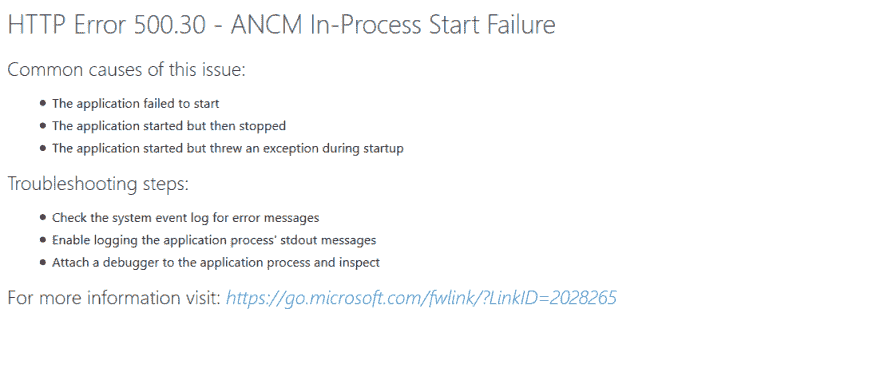
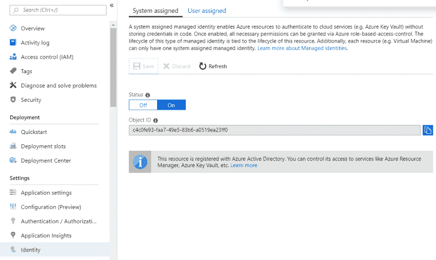
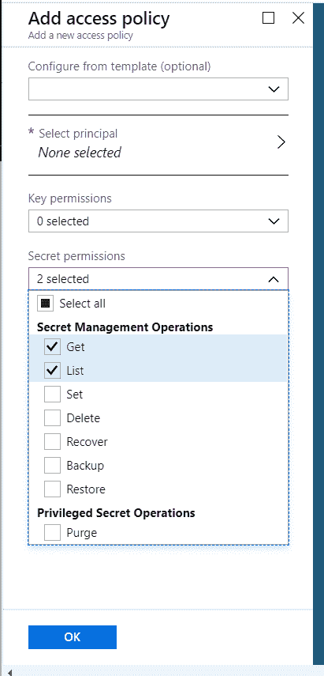

# 蓝色钥匙保险库

> 原文：<https://dev.to/funkysi1701/azure-key-vault-53ld>

Azure Key Vault 是存储您的密钥、证书和机密的安全方式，因此您的应用程序可以访问它需要的一切，但您不会将它们不安全地存储在任何地方，例如源代码控制中。

我一直想尝试一下 Azure Key Vault，因为它可以利用 Azure Active Directory 给你的 web 应用程序一个身份，这样它就可以在 Key Vault 中验证自己以访问机密。相当聪明，但有很多活动部件有点复杂。

对于我的例子，我只需连接到我的密钥库，获取一个秘密，并将其显示在某个网页上。这当然不是你想做的，因为秘密是秘密，不应该显示只是用来验证什么，但这是一个简单的方法来证明我正在连接到密钥库，一切都在工作。

让我们看一些代码。我有一个. net 核心应用程序，首先让我们安装三个 nuget 包。

```
Microsoft.Azure.KeyVault
Microsoft.Azure.Services.AppAuthentication
Microsoft.Extensions.Configuration.AzureKeyVault 
```

Enter fullscreen mode Exit fullscreen mode

我没有包括版本号，因为这些毫无疑问会随着时间的推移而更新，但希望它仍然可以工作。

现在，在您的 Program.cs 中添加以下代码，用您的密钥库的名称替换[KeyVaultName]。

```
 public class Program
    {
        public static void Main(string[] args)
        {
            CreateWebHostBuilder(args).Build().Run();
        }

        public static IWebHostBuilder CreateWebHostBuilder(string[] args) =>
            WebHost.CreateDefaultBuilder(args)
                .ConfigureAppConfiguration((context, config) =>
            {
                    var builtConfig = config.Build();

                    var azureServiceTokenProvider = new AzureServiceTokenProvider();
                    var keyVaultClient = new KeyVaultClient(
                        new KeyVaultClient.AuthenticationCallback(
                            azureServiceTokenProvider.KeyVaultTokenCallback));

                    config.AddAzureKeyVault(
                        $"https://[KeyVaultName].vault.azure.net/",
                        keyVaultClient,
                        new DefaultKeyVaultSecretManager());
            })
            .UseApplicationInsights()
            .UseStartup<Startup>();
    } 
```

Enter fullscreen mode Exit fullscreen mode

现在你需要做的就是查看你的配置，从你的 Azure Key Vault 中找出秘密。如果您有一个名为 AppSecret 的秘密，那么您可以使用下面的代码片段来检索它的值，假设 _configuration 是 Microsoft . extensions . configuration . I configuration 的一个实现

```
_configuration["AppSecret"]; 
```

Enter fullscreen mode Exit fullscreen mode

现在，如果你做了所有这些，并从 Azure Web 应用程序或本地运行，它将无法从密钥库中提取任何内容。您需要为您的 web 应用提供一个身份，并配置您的密钥库以允许通过该身份进行访问。

一旦我的代码被部署到 Azure Web 应用程序，我会得到以下错误。

[](https://res.cloudinary.com/practicaldev/image/fetch/s--cm1JzLeh--/c_limit%2Cf_auto%2Cfl_progressive%2Cq_auto%2Cw_880/https://storageaccountblog9f5d.blob.core.windows.net/blazor/wp-content/uploads/2019/03/image.png%3Ffit%3D662%252C292%26ssl%3D1)

让我们看看如何解决这个问题，首先让我们给我的网络应用一个身份。打开 Azure 门户，找到你的 web 应用的身份部分，打开设置。

[](https://res.cloudinary.com/practicaldev/image/fetch/s--rlAszpbn--/c_limit%2Cf_auto%2Cfl_progressive%2Cq_auto%2Cw_880/https://storageaccountblog9f5d.blob.core.windows.net/blazor/wp-content/uploads/2019/03/image-1.png%3Ffit%3D662%252C396%26ssl%3D1)

现在，您需要授予该身份对您的密钥库的权限。在门户中，打开密钥库中的访问策略，然后单击添加策略，在主体框中选择您的 web 应用程序的身份，并选择以下设置以授予对您的密码的访问权限。

[](https://res.cloudinary.com/practicaldev/image/fetch/s--C9DKzJCm--/c_limit%2Cf_auto%2Cfl_progressive%2Cq_auto%2Cw_880/https://storageaccountblog9f5d.blob.core.windows.net/blazor/wp-content/uploads/2019/03/image-2.png%3Fresize%3D206%252C428%26ssl%3D1)

现在你有了一个网站，可以从密钥库中提取秘密，但只能是唯一的身份。任何有权访问您的源代码的人都无法访问您的秘密，即使他们将您的代码推送到不同的 Azure Web 应用程序。