# 十年后再看 Scratch

> 原文：<https://dev.to/natreid/looking-into-scratch-a-decade-later-1205>

# Scratch，面向孩子的编程语言！

[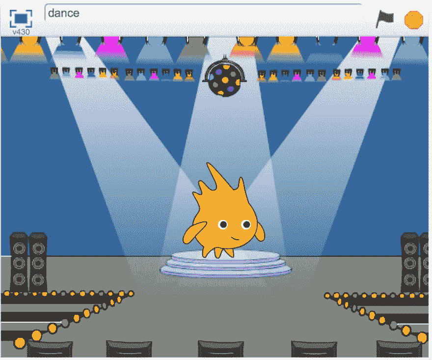](https://res.cloudinary.com/practicaldev/image/fetch/s--xAdxICU0--/c_limit%2Cf_auto%2Cfl_progressive%2Cq_auto%2Cw_880/http://www.ictinpractice.com/wp-content/uploads/2015/01/Screen-Shot-2015-01-16-at-18.38.22.png)

作为一个从 2009 年开始在孩提时代使用 scratch 的人，这是我对计算机编程的入门，也是我接触它将近四年的时间。我对它早期的大部分记忆是关于制作愚蠢的视频游戏和感人的故事。十多年后的今天，在我有望成为代码职业的开端，我决定沿着记忆之路走一趟，看看 scratch 教会了我什么，以及它到底是一种什么样的语言。

让 Scratch 作为一个孩子来使用如此棒的是，所有的编程都是围绕小精灵来组织的，小精灵是具有可视化表示的自包含对象。一旦你理解了运行一个程序的基本原理，你可以通过拖动“移动”块中的一个，立即看到你写的代码在你的屏幕上产生的效果。这种具体的客观性立即揭开了计算机工作的神秘面纱。

既然我已经回忆完了，让我们来看看 scratch IDE，在这里，你不用写文本，而是拖动彼此相连的文字代码“块”。

在 scratch 中，精灵既是所有代码的主题(编写代码的地方),也是显示代码行为的对象。精灵可以在开发阶段被创建和删除，但是在运行时是永久的，作为它们自己的作用域。

[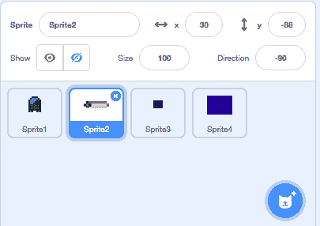](https://res.cloudinary.com/practicaldev/image/fetch/s--25ruwvYh--/c_limit%2Cf_auto%2Cfl_progressive%2Cq_auto%2Cw_880/https://thepracticaldev.s3.amazonaws.com/i/8tj4wh04etga6gahtybc.png)

当我在 1.3 和 1.4 中使用 scratch 时，sprites 充当单实例类。他们所有的代码都被限制在他们自己身上，而且他们不能被复制。这导致了大量艰苦的复制精灵和稍微调整他们的代码或“服装”(他们的视觉表现)。但是当 scratch 2.0 出现时，“创建克隆”块出现了，使得精灵现在本质上是可以实例化新精灵的类。这样，scratch 完全是面向对象的。从抽象的角度来说，它可能是最面向对象的语言，它的对象几乎是完全独立的，与你在计算机上实际看到和听到的对象相对应。

在 scratch code 中，块有 9 种类型(在引入块类型之前是 8 种):运动、外观、声音、事件、控制、传感、操作符、变量和块。

[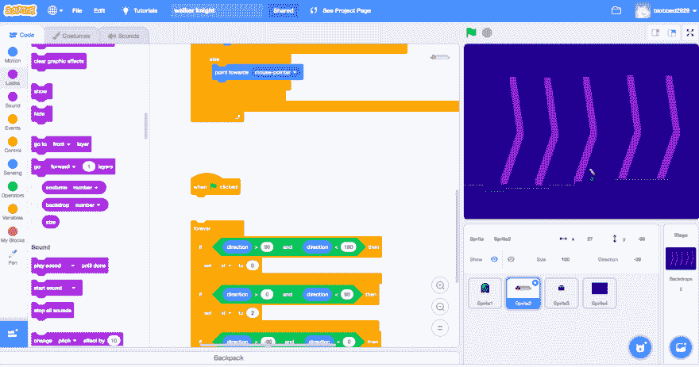](https://res.cloudinary.com/practicaldev/image/fetch/s--tdfA0cFv--/c_limit%2Cf_auto%2Cfl_progressive%2Cq_auto%2Cw_880/https://thepracticaldev.s3.amazonaws.com/i/01da98d1pa0r3c6tr0l2.png)

这些块中最基本的是事件。这些是决定一段代码何时开始的因素。在我使用它的大部分时间里，我们只使用“当标志被点击时”按钮，它告诉一大块代码从执行中运行(通过点击标志发生)。

[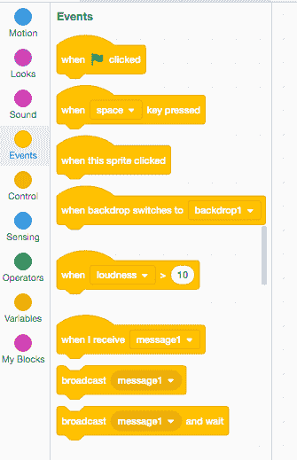](https://res.cloudinary.com/practicaldev/image/fetch/s--QkZQVCSW--/c_limit%2Cf_auto%2Cfl_progressive%2Cq_auto%2Cw_880/https://thepracticaldev.s3.amazonaws.com/i/32735zsz9fpkmdyzctka.png)

下一个最基本也是最重要的模块是控制器。这些是控制程序工作流程的逻辑表达式:带有 repeat 和 forever 的循环，带有 if 和 if-else 的条件，等待，以及带有克隆逻辑的实例化！

[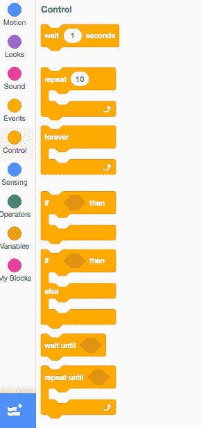](https://res.cloudinary.com/practicaldev/image/fetch/s--XbM0mmHW--/c_limit%2Cf_auto%2Cfl_progressive%2Cq_auto%2Cw_880/https://thepracticaldev.s3.amazonaws.com/i/ccd4xifqi035p3gmdfhq.png)

现在你可能已经注意到积木有不同的形状。这些形状定义了积木的功能。到目前为止，我们看到的三个是起始块，可以在下面建造，但不能在上面建造；逻辑控制器，可以在上面、下面和内部编码；和通用动作块，这些动作块可以根据您给它们的输入产生行为或修改环境。

仔细观察控制器，您可能会注意到条件中有菱形块的空间，循环控制器中有圆形块的空间。这两个形状是临时数据，最好用“操作符”组来描述:

[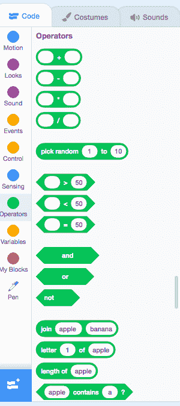](https://res.cloudinary.com/practicaldev/image/fetch/s--CSkhELO7--/c_limit%2Cf_auto%2Cfl_progressive%2Cq_auto%2Cw_880/https://thepracticaldev.s3.amazonaws.com/i/xi2i1uby27itwukmwdda.png)

在运算符中，圆形块对其他数据执行运算以输出新数据。只要有圆形空间，数据就被传递到动作块和循环块中，以确定块的行为。暂存中的数据可以是数字或字符串，动作块本身负责解析这些数据。

有许多不同的数据块可用，其中大多数输出子画面的当前状态。

[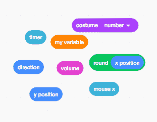](https://res.cloudinary.com/practicaldev/image/fetch/s--xDrOGB5K--/c_limit%2Cf_auto%2Cfl_progressive%2Cq_auto%2Cw_880/https://thepracticaldev.s3.amazonaws.com/i/t39akapbstdke0x7ohnb.png)

条件句带的菱形块是……你猜对了:布尔！这些块产生真或假，有时基于输入，如操作员组，有时基于程序状态，如传感器组:

[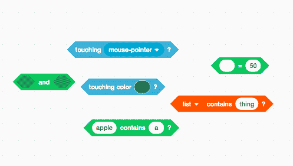](https://res.cloudinary.com/practicaldev/image/fetch/s--jD1W4Kvs--/c_limit%2Cf_auto%2Cfl_progressive%2Cq_auto%2Cw_880/https://thepracticaldev.s3.amazonaws.com/i/5bx9cxigxz6matgo8on4.png)

这些代码块的设计令人难以置信的是，直到现在，十多年后，我才意识到这些菱形块是条件语句。作为一个孩子，每个使用 scratch 的人都直觉地知道菱形块在条件句的菱形空间中，并且当它们为真时，条件句做事情。我们甚至从未被告知‘if’是一个条件，它控制着我们程序的‘工作流程’。或者“布尔”具有两个值，true 和 false，条件用来确定所述工作流。这都是直觉。

这个设计从第一天起就伴随着 scratch，是对麻省理工学院媒体实验室和 Mitch Resnick(scratch 的创造者)惊人天赋的证明。他们能够把像逻辑和计算这样令人恐惧和困惑的东西变得如此直观，以至于小学生可以在不了解任何计算机知识的情况下学习它。

关于 scratch 需要注意的一点是，它不能像我们在大多数现代语言中所了解和喜爱的那样是“真”或“假”:条件只能对布尔值求值，正因为如此，有专门为严格为布尔值的条件设计的特定块。

到目前为止，我们已经讨论了事件、控制器、操作员和传感器。接下来要看的是变量，变量可以是只有单个值的变量，也可以是有索引的数组(从 1 开始)。可用的块只是 getters 和 setters，分别是数据块和动作块。

[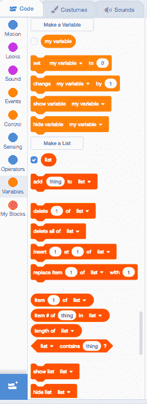](https://res.cloudinary.com/practicaldev/image/fetch/s--Y6nOpZgD--/c_limit%2Cf_auto%2Cfl_progressive%2Cq_auto%2Cw_880/https://thepracticaldev.s3.amazonaws.com/i/xco80qfjr6lpjlq0do8p.png)

最后一组块实际上是四组:动作、外观、声音和可修改的绿色块(可以画东西、播放音乐、与硬件输入交互等(在我的时代这只是被称为笔，它可以画东西))。这些模块驱动精灵最常见的行为，也是 scratch 成为教育工具的原因。大多数孩子，包括我在内，立刻被这些积木吸引，因为它们实际上改变了你的精灵在屏幕上的行为和你听到的内容。这些是你的程序的实际行为，这也是为什么 scratch 既是一个代码又是一个面向儿童的艺术平台，因为你可以创建 scratch 项目，而没有任何逻辑，看起来仍然非常酷和令人惊叹。

[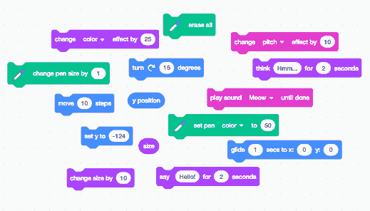](https://res.cloudinary.com/practicaldev/image/fetch/s--0puNG0nS--/c_limit%2Cf_auto%2Cfl_progressive%2Cq_auto%2Cw_880/https://thepracticaldev.s3.amazonaws.com/i/jmtbfxhbuwv63p75zh61.png)

概括地说，scratch 中有五种积木形状:

*   开始块，有一个弯曲的顶部和一个钩子在底部执行下面的东西
*   控制器块可以放在程序块执行过程中的任何地方，并且可以计算其中的代码(注意，forever 循环可以在它下面添加代码，因为它会一直计算，直到代码停止)
*   引起行为的动作块，例如“做事情”或改变子画面/程序的状态
*   据我所知，数据块只能是字符串或数字，它们被传递给循环和动作块以修改它们的行为。
*   和布尔块，它们严格地为真或假，并且存在以评估条件(注意这些也可以在需要数据的地方被传递，并且我相信它们将只评估字符串‘真’或‘假’)

[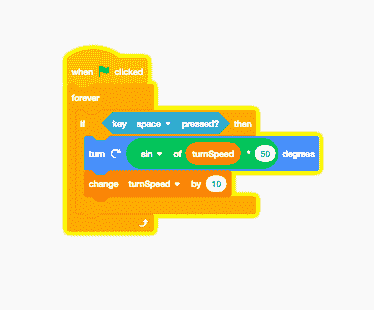](https://res.cloudinary.com/practicaldev/image/fetch/s--Tjfw29dL--/c_limit%2Cf_auto%2Cfl_progressive%2Cq_auto%2Cw_880/https://thepracticaldev.s3.amazonaws.com/i/75zrwtyzykrmnkdjhjmg.png)

**(现在也有用于创建您自己的块的定义块。这些类似于方法)

这篇文章对我来说主要是一次回忆之旅，而不是一个正确的指南。但是我希望它能从开发者的角度阐明 scratch 的功能。

事实上，Scratch 对于成年开发人员来说并不是一个非常有用的语言——它只有两个作用域(精灵的克隆体彼此共享变量，即没有实例变量),它只是最近收到的函数，这些函数[不支持递归](https://scratch.mit.edu/projects/294893989/),拖动代码比仅仅编写代码要困难得多。但是，这些模块直观地组合在一起的方式，以及它与孩子互动的程度，使它成为各种教育资源中最好的一种。

所以，如果你有孩子，或者认识孩子，把他们介绍给 scratch——毫无疑问，这就是我今天成为一名开发人员的原因。