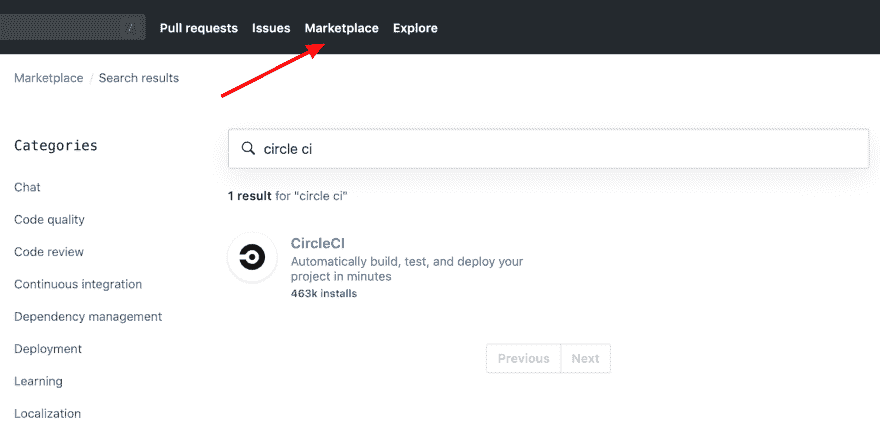
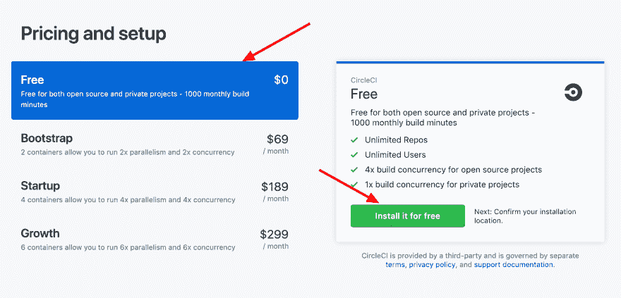
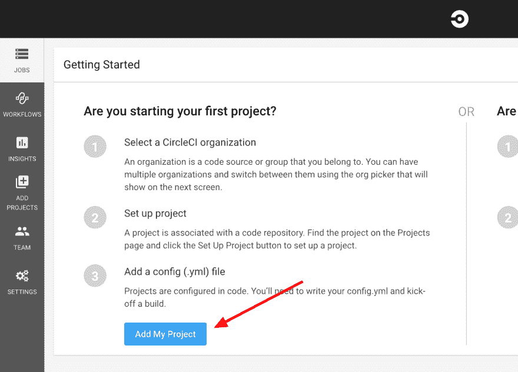
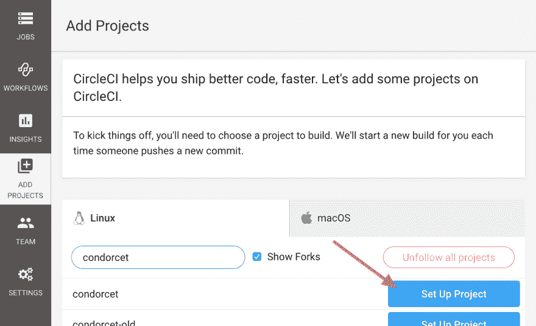
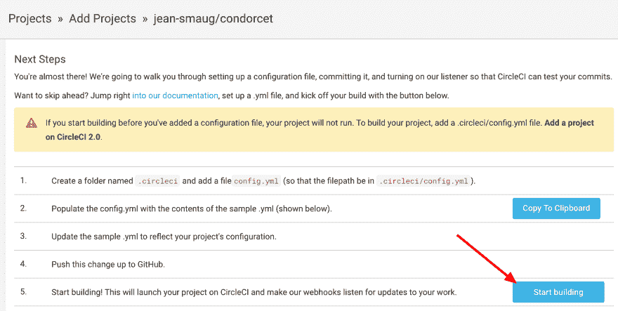
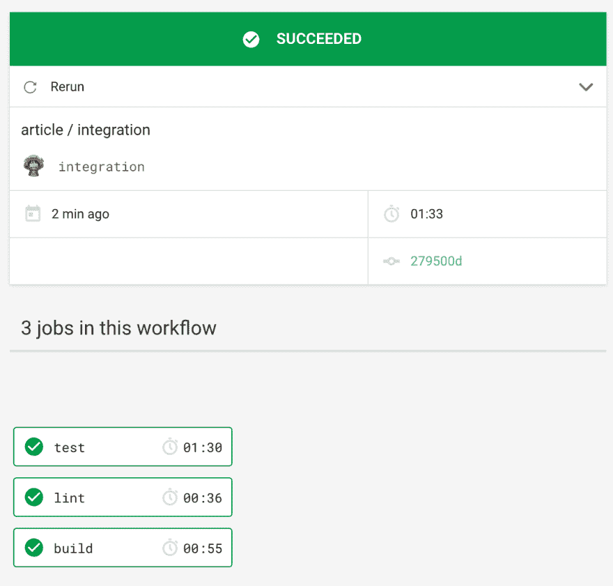
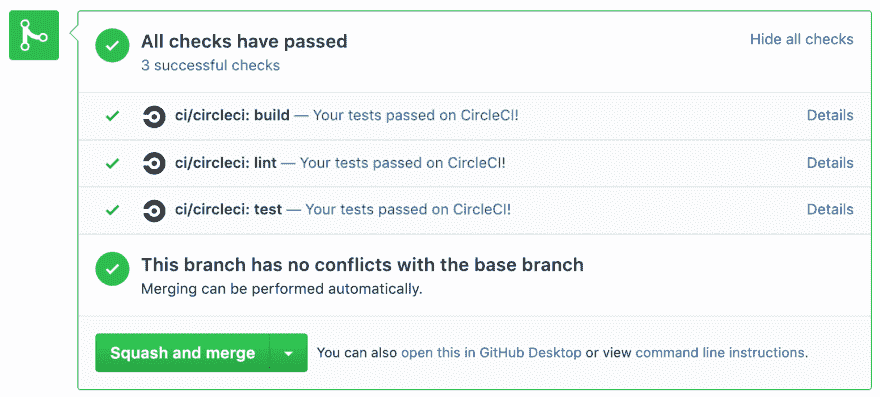
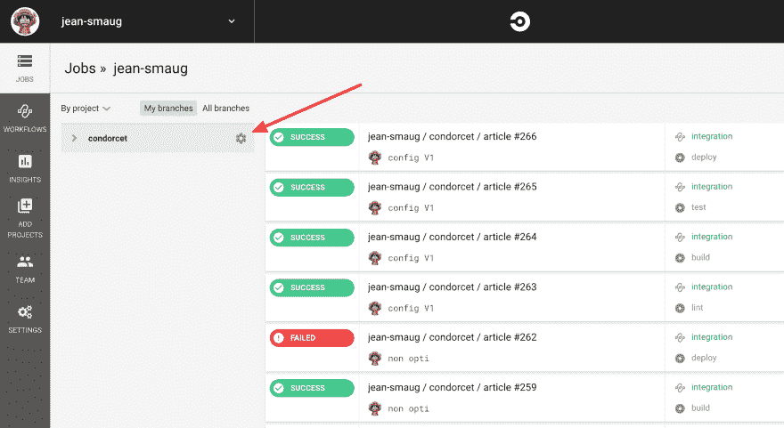
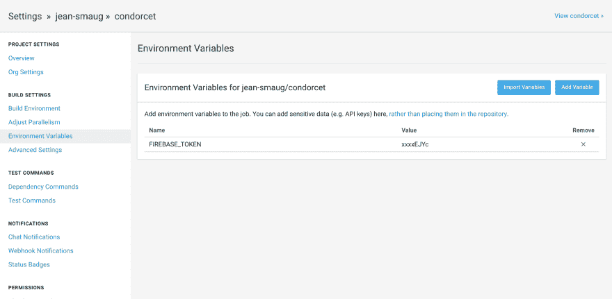
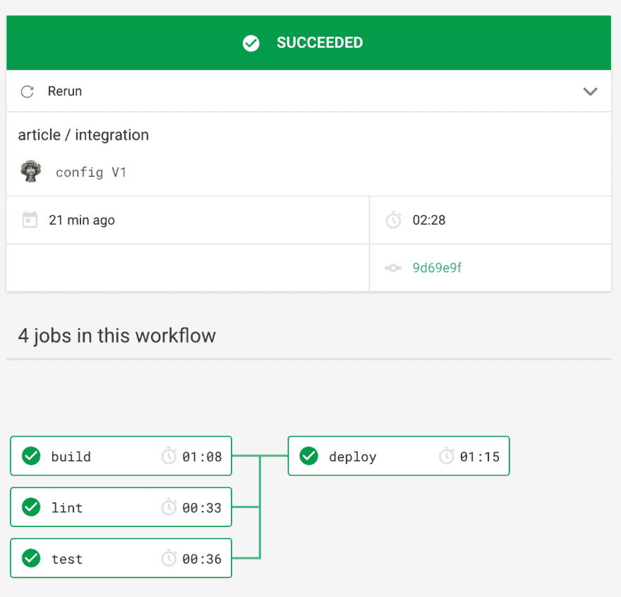

# 循环连续部署-第 1 部分

> 原文:# t0]https://dev . to/jeansmaug/dploizione-continu-with-circus-part-1-208n

我建议您以 [Condorcet](https://github.com/jean-smaug/condorcet) 为例，进行持续部署。
目的是通过具体案例介绍循环中固有的不同概念。
在第一部分将建立功能解决方案，在第二部分进行优化。

## L '应用

该应用程序采用[view . js](https://vuejs.org/)进行，使用 [Firebase](https://firebase.google.com/) 进行用户管理和数据存储。我们还将使用 Firebase 托管应用程序。

. json 包脚本:

```
"scripts":  {  "serve":  "vue-cli-service serve",  "build":  "vue-cli-service build",  "lint":  "vue-cli-service lint",  "test:unit":  "vue-cli-service test:unit"  } 
```

*   `serve`启动开发服务器
*   `build`构建生产的静态应用程序
*   `lint`检查代码是否符合 eslint 定义的规则
*   `test:unit`启动单元测试

在这些脚本中，我希望每当我试图将代码集成到`master`中时，就启动`lint`、`test:unit`。因为`master`必须始终保持稳定🥐。

为了避免手工制作，我会用循环。每次向 Github 提交时，此工具都会启动脚本。

## 在其项目中加入圆形

要向仓库添加循环，必须前往 Github 的市场:

[](https://res.cloudinary.com/practicaldev/image/fetch/s--nJ9adedm--/c_limit%2Cf_auto%2Cfl_progressive%2Cq_auto%2Cw_880/https://thepracticaldev.s3.amazonaws.com/i/vuibgph281o3zyk5kg4c.png)

对于开放源代码项目，除非您要提取支票，否则必须选择“免费”选项:

[](https://res.cloudinary.com/practicaldev/image/fetch/s--FCQtbkew--/c_limit%2Cf_auto%2Cfl_progressive%2Cq_auto%2Cw_880/https://thepracticaldev.s3.amazonaws.com/i/idopy09l6hqs8i3e1n0q.png)

在验证了 circus 安装之后，可以添加一个关键 Github 项目:

[](https://res.cloudinary.com/practicaldev/image/fetch/s--eCupbO_1--/c_limit%2Cf_auto%2Cfl_progressive%2Cq_auto%2Cw_880/https://thepracticaldev.s3.amazonaws.com/i/kf29upwnecfsfgr8p6wn.png)

我们进入项目页面:

[](https://res.cloudinary.com/practicaldev/image/fetch/s--RVZ2e1fF--/c_limit%2Cf_auto%2Cfl_progressive%2Cq_auto%2Cw_880/https://thepracticaldev.s3.amazonaws.com/i/vp91njjd817wexwx166q.png)

在此页面上，您可以选择要在其中执行测试的环境:

[](https://res.cloudinary.com/practicaldev/image/fetch/s--h_b5vVfX--/c_limit%2Cf_auto%2Cfl_progressive%2Cq_auto%2Cw_880/https://thepracticaldev.s3.amazonaws.com/i/ov3z7i2ku0bwja0eyqnl.png)

第一步验证，我们继续配置。

## 作业的定义

循环作业是一系列指令。
对于开源项目，我们最多可以同时运行 4 个作业。
实际上，三个脚本中的每一个脚本都有一个专用的作业，这样我们就可以同时启动 3 个作业，每个脚本一个。这样，每个脚本都将在不影响其他脚本的孤立环境中启动。

以下示例显示了作业定义的外观:

```
build:
  docker:
    - image: circleci/node:11.10.1
  steps:
    - checkout
    - run: yarn install
    - run: yarn build 
```

*   `build`:作业的名称
*   `docker`:我们工作将在其中运行的环境，这里停靠
    *   `image`:dock 要使用的图像，这里是 Node.js
*   `steps`我们的指示清单
    *   `checkout`用于定位到 circleci 创建的项目文件夹
    *   `run: yarn install`安装依赖项
    *   `run: yarn build`构建用于生产的静态应用程序

注意:shell 命令前必须有一个“`run:`”

对每个脚本重复上述步骤，得到以下三个作业的配置:

```
version: 2.1
jobs:
  build:
    docker:
      - image: circleci/node:11.10.1
    steps:
      - checkout
      - run: yarn install
      - run: yarn build

  lint:
    docker:
      - image: circleci/node:11.10.1
    steps:
      - checkout
      - run: yarn install
      - run: yarn lint

  test:
    docker:
      - image: circleci/node:11.10.1
    steps:
      - checkout
      - run: yarn install
      - run: yarn test:unit

workflows:
  version: 2
  integration:
    jobs:
      - build
      - lint
      - test 
```

*   `version`配置文件版本，当前为 2.1
*   `jobs`我们不同工作的清单
*   `workflows`不同作业的执行情景
    *   `version`工作流程版本，目前为 2
    *   `integration`:工作流的名称
    *   `jobs`要执行的工作清单。在这里，我们的三个作业将并行运行

现在，当我们在 Github 上输入代码时，我们可以看到我们测试的状态：

[](https://res.cloudinary.com/practicaldev/image/fetch/s--X9Iqg1lV--/c_limit%2Cf_auto%2Cfl_progressive%2Cq_auto%2Cw_880/https://thepracticaldev.s3.amazonaws.com/i/zkn88tdbxnhjm5pewjtz.png)

从 Github 上的 Pull Request 中也可以直接看到这一点:

[](https://res.cloudinary.com/practicaldev/image/fetch/s--hi4WmCPP--/c_limit%2Cf_auto%2Cfl_progressive%2Cq_auto%2Cw_880/https://thepracticaldev.s3.amazonaws.com/i/5182d3gq4avt7dx1ck9e.png)

## 部署

现在集成工作正常，当分支“`master`”上出现新提交时，自动部署我们的代码将是一个很好的选择。无论是通过拉式请求还是推式(力🙄）

我在 Firebase 做了一个小公寓但谁知道呢也许有些人会感兴趣🤷‍♂️.

要通过 CI 将静态文件部署到 Firebase 托管服务，需要:

*   使用`yarn global add firebase-tools`在本地安装 firbase 工具。
*   发射一个`firebase login:ci`得到一个令牌

此令牌将用于授权 CI 部署到 Firebase。

要添加标记，请转至设置:

[](https://res.cloudinary.com/practicaldev/image/fetch/s--YwiF0-j9--/c_limit%2Cf_auto%2Cfl_progressive%2Cq_auto%2Cw_880/https://thepracticaldev.s3.amazonaws.com/i/76v95hce6smpwnb2219s.png)

并添加令牌作为环境变量，在此处将其命名为`FIREBASE_TOKEN`:

[](https://res.cloudinary.com/practicaldev/image/fetch/s--oX6JkwCk--/c_limit%2Cf_auto%2Cfl_progressive%2Cq_auto%2Cw_880/https://thepracticaldev.s3.amazonaws.com/i/tu1krp4pn7bnrlae2yqr.png)

然后可以在我们的配置文件中重复使用环境变量:

```
version: 2
jobs:
  ## les autres jobs...

  deploy:
    docker:
      - image: circleci/node:11.10.1
    steps:
      - checkout
      - run: yarn install
      - run: yarn build
      - run: yarn firebase deploy --token "$FIREBASE_TOKEN" --only hosting

workflows:
  version: 2
  integration:
    jobs:
      - build
      - lint
      - test
    - deploy:
          requires:
            - build
            - lint
            - test
          filters:
            branches:
              only: master 
```

在新工作:`deploy`中，使用了刚才创建的变量`$FIREBASE_TOKEN`。
接下来只要将这项工作加入我们的工作流程，为其添加选项即可:

*   `requires`:运行此作业前必须完成的作业
*   `filters`用于指定哪些分支、标记-我...。此工作必须执行。就我们而言，只限于`master`分支

[](https://res.cloudinary.com/practicaldev/image/fetch/s--Fedkd6BI--/c_limit%2Cf_auto%2Cfl_progressive%2Cq_auto%2Cw_880/https://thepracticaldev.s3.amazonaws.com/i/51jtjfpnwys57lyv3f7e.png)

## 摘要

作业是一系列指令。
工作流定义了各种作业的运行方式。我们的作业只能在某些分支上按顺序并行运行-我...。
您可以透过 UI 加入包含机密资讯的环境变数，并在组态中使用这些变数之前加上`$`。

## 下一步

我们的配置是可行的，但我们可以做得更好。
在[下面的文章](https://maximeblanc.fr/deploiement-continu-avec-circleci-partie-2)中，我们将改进配置以节省生病时间。😎

## 有用的链接

*   [组态档案参考文件](https://circleci.com/docs/2.0/configuration-reference)
*   [配置压轴](https://github.com/jean-smaug/condorcet/blob/4046a6723fc2c4b6470c79b309683d9f7af9844a/.circleci/config.yml)