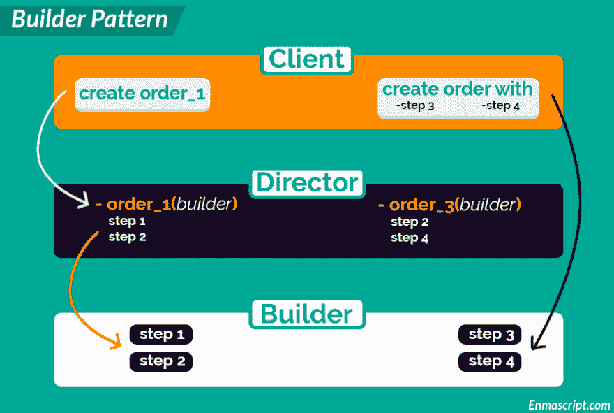

# 用 javascript 中的构建器模式逐步构建对象

> 原文：<https://dev.to/duranenmanuel/building-objects-progressively-with-the-builder-pattern-in-javascript-4k>

*原载于[EnmaScript.com](https://enmascript.com/articles/2019/03/18/building-objects-progressively-with-the-builder-pattern-in-javascript)T3】*

在使用 javascript 时，经常发生的事情之一是构造复杂的对象，这些对象会随着时间的推移而发展或变化，无论是在应用程序增长时还是在执行某些过程时。创建复杂对象有多种方法，在这篇文章中，我将解释一种非常好的设计模式，并将它与广泛使用的其他方法进行比较。

## 问题

假设我们有一个应用程序，用户可以根据以下属性个性化他们的个人资料页面:

*   **菜单位置**(上/下/左/右)
*   **边框**(柔和/正常)
*   **主题**(暗/亮)
*   **coverImage** (字符串 URL)

我们需要让用户能够以一种可行的方式个性化他们的配置文件，同时允许我们的应用程序进行扩展，通过查看这个问题，我们可以使用两种流行的方法来解决它(不包括构建器模式),让我们快速了解一下:

### 1。为每个可能的配置文件变体添加子类

创建一个包含默认对象属性的`Profile`类，然后让一些子类继承它。这并不坏，但花一分钟想想，这意味着为了涵盖所有的情况，子类的数量应该等于所有可能的变化，这将导致子类数量的增加，**不好**。

### 2。向配置文件类构造函数添加所有变体

正如标题中所指出的，另一种方法可能涉及拥有相同的`Profile`类，并将所需的属性作为参数传递给构造函数，这将消除对子类的依赖:

```
class Profile {
    constructor(
        menuLocation = 'top',
        borders = 'soft',
        theme = 'dark',
        coverImag = 'default.jpg'
    ) {
        this.menuLocation = menuLocation;
        this.borders = borders;
        this.theme = theme;
        this.coverImage = coverImage;
    }
} 
```

这完全可行，如果我们**确定**不会增长，那么我们可以继续使用这种方法，如果需求简短，就没有必要让事情过于复杂。另一方面，如果`Profile`类需要灵活性并且有增长的潜力，那么以这种方式扩展它会变得很成问题。想象一下，公司突然想要添加多个新功能来个性化配置文件，例如 **backgroundColor** 、 **menuColor** 和 **profileFont** ，通过添加这 3 个属性，我们将开始在实例化它时遇到设置和识别构造函数参数的问题，这个问题也被称为*伸缩构造函数问题*，它被认为是一个反模式，如果您不知道我的意思，那么请看下面的示例:

让我们添加新的属性:

```
class Profile {
    constructor(
        menuLocation = 'top',
        borders = 'soft',
        theme = 'dark',
        coverImage = 'default.jpg',
        backgroundColor= 'blue',
        menuColor= 'white',
        profileFont= 'roboto'
    ) {
        this.menuLocation = menuLocation;
        this.borders = borders;
        this.theme = theme;
        this.coverImage = coverImage;
        this.backgroundColor = backgroundColor;
        this.menuColor = menuColor;
        this.profileFont = profileFont;
    }
} 
```

现在看看实例化该类时会发生什么:

```
new Profile(null, 'soft', 'dark', null, null, 'red'); 
```

就像你最终在构造函数中有大量的参数，这在原则上是一个*代码气味*，而且大多数传递的参数将是 **null** ，因为大多数时候我们不需要定义所有的参数，而是使用默认值，这现在留给我们一个非常复杂的构造函数，在其中很难识别什么值对应于什么参数。

## 使用构建器模式逐步构建您的应用程序

[](https://res.cloudinary.com/practicaldev/image/fetch/s--ovlgK4m_--/c_limit%2Cf_auto%2Cfl_progressive%2Cq_auto%2Cw_880/https://enmascript.cimg/2019-03-18-builder-pattern-cover.png)

构建器模式一步一步地促进复杂对象*的创建，它指定了以下内容:*

1.  **我们有一个包含业务逻辑**的基类，它也接收创建的对象来设置值(在我们的例子中是`Profile`类)。
2.  我们应该将负责对象创建的代码分离成不同的对象/类，称为*构建器*。每个建造者将负责定义建造复杂物体的步骤
3.  有一个可选类叫做 *Director* ，它用于定义以特定顺序执行步骤的方法，以构建常用的创建对象(我们将在本文后面看到更多)。

因此，让我们根据上面定义的列表开始实现构建器模式。

### 1。我们有一个包含业务逻辑的基类

下面是`Profile`类，它将只包含业务逻辑并设置来自所创建对象的值:

**Profile.js**

```
class Profile {

    /* Receives the builder and assigns the values */
    constructor(builder) {
        this.menulocation = builder.menuLocation;
        this.borders = builder.borders;
        this.theme = builder.theme;
        this.coverimage = builder.coverImage;
        this.backgroundcolor = builder.backgroundColor;
        this.menucolor = builder.menuColor;
        this.profilefont = builder.profileFont;
    }

    /* Some Business logic and abstract/generic methods here */
} 
```

### 2。我们应该将负责对象创建的代码隔离到一个名为 Builder 的类中

我们将创建文件**(builders/profile builder . js)**，它将包含一个负责定义逐步创建我们的复杂对象的步骤的类，它还将实现一个`build`或`get`方法，该方法将在完成后返回对象:

```
import Profile from './Profile';

class ProfileBuilder {
    constructor(){ }

    /* Define all the steps needed to create a profile */

    setMenu(position) {
        this.menuLocation = position;
        return this;
    }

    setBorders(style) {
        this.borders = style;
        return this;
    }

    setTheme(style) {
        this.theme = style;
        return this;
    }

    setCoverImage(url) {
        this.coverImage = url;
        return this;
    }

    setBackgroundColor(color) {
        this.backgroundColor = color;
        return this;
    }

    setMenuColor(color) {
        this.menuColor = color;
        return this;
    }

    setProfileFont(fontFamily) {
        this.profileFont = fontFamily;
        return this;
    }

    /* Could also be called getProfile() */
    build() {
        return new Profile(this);
    }
}

export default ProfileBuilder; 
```

请注意每个函数是如何负责设置对象的属性的，这意味着我们可以在需要时在其中添加验证，我们也可以为配置文件页面的不同部分设置多个生成器(如果我们认为这样便于扩展应用程序)，例如，我们可以有类`MenuBuilder`、`CoverBuilder`和`ThemeBuilder`，然后我们可以在其中抽象所有相关步骤，这是为了有潜在增长空间的情况。对你的代码*进行合理的*划分总是一个好主意(是的，我们会有一些额外的类，但是它们不会像*子类*方法那么多，甚至不会接近)。

现在，当我们需要创建新的自定义配置文件时，我们可以在我们的 **main.js** 中这样做:

```
import ProfileBuilder from './builders/ProfileBuilder';

function main() {
    return new ProfileBuilder()
        .setMenu('top')
        .setBorders('soft')
        .setTheme('dark')
        .setCoverImage('url.jpg')
        .setBackgroundColor('red')
        .setMenuColor('white')
        .setProfileFont('Arial')
        .build();
}

main(); 
```

这里我们直接将值作为字符串传递，但是这些值可以由用户通过发送表单或任何动态结构来设置。

### 3。导演

随着您的应用程序的增长，您将看到更有可能创建某些类型的配置文件，您将希望有一个已经定义的“流行的配置文件”模板，以便用户不必手动完成所有工作。假设一个流行的简档被认为具有:

*   **菜单位置**:左侧
*   **边框**:柔和
*   主题:光
*   **封面图片**:rain.jpg
*   **背景色**:黑色
*   **菜单颜色**:蓝色
*   **profileFont** : Ubuntu

*Director* 负责在有意义的情况下执行自动创建对象的步骤(通常是当有一些可以预定义的公共结构时，比如本例中的流行概要)。现在我们知道了如何构建这种类型的档案，我们可以让主管为我们做这项工作:

**ProfileDirector.js**

```
class ProfileDirector {
    /* The director receives the builder */
    constructor(builder) {
        this.builder = builder;
    }

    /* Implements a method to automatically generate a popular profile */
    createPopularProfile() {
        return this.builder
            .setMenu('top')
            .setBorders('soft')
            .setTheme('light')
            .setCoverImage('rain.jpg')
            .setBackgroundColor('black')
            .setMenuColor('blue')
            .setProfileFont('Ubuntu')
            .build();
    }
} 
```

只要合乎逻辑，你可以不断地向控制器添加方法，**不要添加所有可能的变化，因为我们会陷入子类方法**中遇到的同样的问题。需要注意的一个重要事实是**导演并不总是必需的**，客户应该能够一步一步地按需创建对象，导演只是避免常见重复的一个好方法。在实现了 director 之后，我们可以在我们的 **main.js** 中使用它:

```
import ProfileBuilder from './builders/ProfileBuilder';
import ProfileDirector from './ProfileDirector.js';

function main() {
    const profileBuilder = new ProfileBuilder();
    const director = new ProfileDirector(profileBuilder);
    return director.createPopularProfile();
}

main(); 
```

下面是构建器模式的简单直观表示:

[](https://res.cloudinary.com/practicaldev/image/fetch/s--FHhUYVfD--/c_limit%2Cf_auto%2Cfl_progressive%2Cq_auto%2Cw_880/https://enmascript.cimg/2019-03-18-builder-pattern-flow.png)

## 文件夹结构

实现构建器模式后，这可能是我们应用程序的潜在结构:

```
├── main.js
├── Profile.js
├── ProfileDirector.js
└── builders/
    ├── ProfileBuilder.js
    └── ... 
```

随着应用程序的增长，您将有更多的构建器，并且您将需要更多的控制器，如果发生这种情况，将控制器放在与他们需要的构建器相同的文件夹中是可以的，推荐的结构可以是下面的结构，但是您可以随意实现对您和您的团队有意义的文件夹结构:

```
├── main.js
├── Profile.js
└── builders/
    ├── Profile/
    │   ├── ProfileBuilder.js
    │   └── ProfileDirector.js
    └── Menu/
        ├── MenuBuilder.js
        └── MenuDirector.js 
```

这是为未来的开发者准备的文章，我希望你喜欢，如果你喜欢，你可能会喜欢阅读关于工厂模式和 T2 观察者模式的文章，如果你想问我一些问题，你可以在推特上问我。

下一集再见！