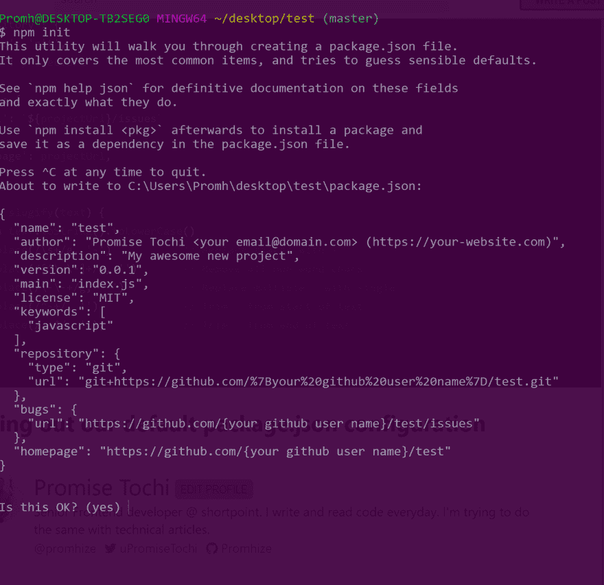

# 一个 package.json 来管理它们

> 原文：<https://dev.to/promhize/one-packagejson-to-rule-them-all-35gn>

> 我将以一个免责声明开始这篇文章:这个标题是一个点击诱饵，也可能不是——取决于你如何看待它。

既然已经解决了这个问题，那就让我们来看看问题的实质:创建一个有用的默认包。

### **(WYNTK)**

如果你浏览过[官方 npm 文档](https://docs.npmjs.com/)，你可能知道你可以创建一个默认的 package.json 配置；从而跳过无论何时运行`npm init`命令都会出现的 CLI 问卷。
事实上，你可以通过以下方式跳过 CLI 问卷:立即在你的 PC 上打开一个终端；正在运行`npm init -y`；如果您的主目录中没有`.npm-init.js`文件，npm 将在您的终端指向的文件夹中创建一个 package.json，创建的 package.json 文件将包含以下默认内容:

```
{  "name":  "",  "version":  ""  } 
```

这些是 npm 软件包的唯一必需属性。然而，npm 的深思熟虑的家伙允许我们，开发人员，改变默认配置或 CLI 问卷。以下是方法。

正如您可能已经猜到的，要创建默认的 package.json 配置，您需要在 PC 的主目录中创建一个`.npm-init.js`文件。

### **创建`.npm-init.js`文件**

在 PC 上的任何地方打开一个终端(最好是 windows 上的 git-bash ),运行`cd ~`这将把终端指向您的主目录。
接下来，运行`echo "const path = require('path')" >.npm-init.js`。这将在主目录中创建一个`.npm-init.js`文件。
在同一个终端窗口中，键入`start ".npm-init.js"`并按回车键。这将在用于打开 Javascript 文件的默认应用程序中打开 npm-init 文件。

> *请注意，其中一些命令可能无法在 Windows 10 之前的版本上运行*

### **配置`.npm-init.js`**

为了配置 npm 的默认 package.json 配置，我们需要从您的主目录中的`.npm-init.js`文件向`module.exports`公开一个对象。目前，我们的 npm-init 文件包含以下内容:

```
const path = require('path') 
```

编辑它，使它看起来像这样:

```
const path = require('path')

module.exports = {
} 
```

#### 添加一个默认的`author`属性

电子邮件和网站详细信息在作者属性中是可选的。

```
const path = require('path')

module.exports = {
  'author': 'Promise Tochi <your email@domain.com> (https://your-website.com)',
} 
```

#### 添加一个默认的`version`属性

```
const path = require('path')

module.exports = {
  'author': 'Promise Tochi <your email@domain.com> (https://your-website.com)',
  'version': '0.0.1'
} 
```

#### 添加一个默认的`description`属性

```
const path = require('path')

module.exports = {
  'author': 'Promise Tochi <your email@domain.com> (https://your-website.com)',
  'version': '0.0.1',
  'description': 'My awesome new project'
} 
```

#### 添加一个默认的`license`属性

```
const path = require('path')

module.exports = {
  'author': 'Promise Tochi <your email@domain.com> (https://your-website.com)',
  'version': '0.0.1',
  'description': 'My awesome new project',
  'license': 'MIT'
} 
```

#### 添加一个默认的`name`属性

```
const path = require('path')

module.exports = {
  'name': 'my_new_project',
  'author': 'Promise Tochi <your email@domain.com> (https://your-website.com)',
  'version': '0.0.1',
  'description': 'My awesome new project',
  'license': 'MIT'
} 
```

您可能会想，为什么我们必须经历所有这些麻烦，并以一个静态默认名称结束；“你为什么浪费我的时间，伙计？!"

好的一面是，我们可以通过使用运行`npm init`的文件夹的名称来改进这一点。我们可以将 npm-init 文件的内容更改为:

```
const path = require('path')

module.exports = {
  'name': path.basename(process.cwd()),
  'author': 'Promise Tochi <your email@domain.com> (https://your-website.com)',
  'version': '0.0.1',
  'description': 'My awesome new project',
  'license': 'MIT'
} 
```

如果您想知道:

> process.cwd()方法返回 Node.js 进程当前工作目录的路径
> 
> path.basename()方法返回路径的最后部分

我们可以对此稍加改进，因为 npm 要求包名是 URL 友好的，也就是说，它们不应该包含空格或任何特殊字符。因此，让我们将`.npm-init.js`改为:

```
const path = require('path')
const projectName = slugify(path.basename(process.cwd()))

module.exports = {
  'name': projectName,
  'author': 'Promise Tochi <your email@domain.com> (https://your-website.com)',
  'version': '0.0.1',
  'description': 'My awesome new project',
  'license': 'MIT'
}

function slugify(text) {
  return text.toString().toLowerCase()
    .replace(/\s+/g, '-')           // Replace spaces with -
    .replace(/[^\w\-]+/g, '')       // Remove all non-word chars
    .replace(/\-\-+/g, '-')         // Replace multiple - with single -
    .replace(/^-+/, '')             // Trim - from start of text
    .replace(/-+$/, '')             // Trim - from end of text
} 
```

#### 增加一些更多的属性

接下来，我们将添加默认的`repository`、`bugs`和`homepage`属性。

这里，我假设您使用 git 和 github 进行版本控制。如果是，您可以保证您的项目存储库将处于`https://github.com/{user or organization name}/{project name}`。这让我们想到:

```
const path = require('path')
const projectName = slugify(path.basename(process.cwd()))
const projectUrl = `https://github.com/{your github user name}/${projectName}`

module.exports = {
  'name': projectName,
  'author': 'Promise Tochi <your email@domain.com> (https://your-website.com)',
  'version': '0.0.1',
  'description': 'My awesome new project',
  'license': 'MIT',
  'repository': {
    'type': 'git',
    'url': projectUrl
  },
  'bugs': {
    'url': `${projectUrl}/issues`
  },
  'homepage': projectUrl,
}

function slugify(text) {
  return text.toString().toLowerCase()
    .replace(/\s+/g, '-')           // Replace spaces with -
    .replace(/[^\w\-]+/g, '')       // Remove all non-word chars
    .replace(/\-\-+/g, '-')         // Replace multiple - with single -
    .replace(/^-+/, '')             // Trim - from start of text
    .replace(/-+$/, '')             // Trim - from end of text
} 
```

### **试用我们默认的 package.json 配置**

在您的 PC 上创建一个新文件夹，并将您的终端指向该文件夹。在终端中，运行`npm init`，您应该会得到类似如下的 CLI 提示符:

[](https://res.cloudinary.com/practicaldev/image/fetch/s--cPQTekMB--/c_limit%2Cf_auto%2Cfl_progressive%2Cq_auto%2Cw_880/https://thepracticaldev.s3.amazonaws.com/i/4ubkplklbtnmg7avtstl.png)

要使用默认配置，在终端中键入`yes`并按下`Enter`键。

希望这能在你将来创建一个新的 npm 包时节省你几分钟的时间，如果没有，我希望你能学到一些新的东西。感谢一路阅读，编码快乐。

> 这是我 2019 年的第一篇文章，我希望能写得更多。
> 
> 威廉·克劳斯在 Unsplash
> [上的封面照片](https://unsplash.com/@williamk?utm_medium=referral&utm_campaign=photographer-credit&utm_content=creditBadge "Download free do whatever you want high-resolution photos from William Krause")