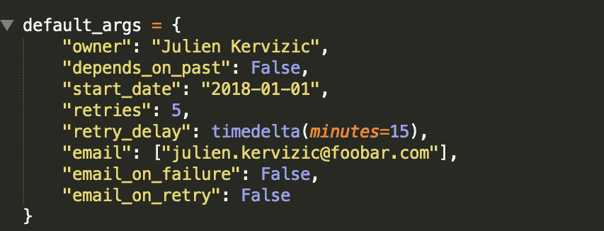
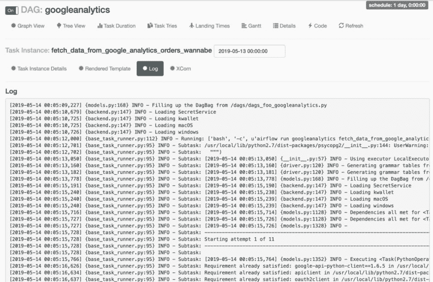

# 使用气流的 10 大好处

> 原文：<https://dev.to/julienkervizic/10-benefits-to-using-airflow-14dn>

作为一系列帖子的延续，我已经解释了气流的[基础知识以及如何在 azure](https://medium.com/analytics-and-data/airflow-the-easy-way-f1c26859ee21) 上设置[气流，以及使用气流](https://medium.com/analytics-and-data/setting-up-airflow-on-azure-connecting-to-ms-sql-server-8c06784a7e2b?source=your_stories_page---------------------------)时需要考虑的[事项，我想详细介绍是什么让气流成为用于数据处理的伟大工具。](https://dev.to/julienkervizic/5-considerations-to-have-when-using-airflow-5c81-temp-slug-8477774)

#### **1。第三天:**

Dag 是设置工作流的一种方式，它们可以设置一系列操作，这些操作可以在失败时单独重试，并在操作失败时重新启动。Dag 为一系列操作提供了一个很好的抽象。

#### 2。程序化工作流管理:

气流提供了一种设置编程工作流的方式，例如，任务可以在 dag 内的 [fly 上生成。而 Sub-DAGs 和](https://www.data-essential.com/create-dynamic-workflow-in-apache-airflow/) [XCom](https://airflow.apache.org/concepts.html?highlight=xcom) ，允许创建复杂的动态工作流。

例如，可以基于在[气流 UI](https://www.astronomer.io/guides/dynamically-generating-dags/) 中定义的变量或连接来设置动态 Dag。

#### 3。自动化您的查询，Python 代码或 Jupyter 笔记本

Airflow 有很多运行代码的操作符。Airflow 有用于大多数数据库操作符，且在 python 中设置，它有一个 python 操作符，允许将 python 代码快速移植到产品中。

Papermilll 是 jupyter notebook 的扩展，允许笔记本的参数化和执行，它通过 airflow PapermillOperator 支持。值得注意的是，网飞建议将气流和[造纸厂](https://papermill.readthedocs.io/en/latest/)结合起来，在生产中自动化和部署笔记本电脑；

[第二部分:在网飞安排笔记本](https://medium.com/netflix-techblog/scheduling-notebooks-348e6c14cfd6)

#### **4。任务依赖管理:**

它非常善于管理不同种类的依赖关系，无论是任务完成，dag 运行状态，文件或分区通过特定的传感器存在。Airflow 还处理任务依赖性概念，如[分支](http://airflow.apache.org/concepts.html?highlight=branch#branching)。

[使用 Apache Airflow 的条件任务](https://medium.com/@guillaume_payen/use-conditional-tasks-with-apache-airflow-98bab35f1846)

#### **5。可扩展型号:**

通过定制传感器、挂钩和操作器的开发，它是完全可扩展的。气流明显受益于大量[社区贡献的运营商](https://github.com/apache/airflow/tree/master/airflow/contrib/operators)。

不同编程语言中的运算符，如 R[【air flow-2193】](https://github.com/apache/airflow/pull/3115)都是使用 python 包装器构建的，将来也可以创建其他编程语言，如 Javascript，它们也有 [python 包装器(pyv8)](https://code.google.com/archive/p/pyv8/) 。

#### **6。监控管理界面:**

Airflow 提供了一个监控和管理界面，可以快速查看不同任务的状态，还可以触发和清除任务或 DAGs 运行。

#### 7。内置重试策略:

它具有内置的自动重试策略，可通过以下方式进行配置:

*   **重试次数:**任务失败前的重试次数
*   **重试延迟:(**时间增量)重试之间的延迟
*   **retry _ exponential _ back off:(**Boolean)设置重试之间的指数回退
*   **最大重试延迟:**两次重试之间的最大延迟(时间增量)

这些参数可以通过上下文传递给任何运算符，因为它们受 BaseOperator 类的支持。

#### **8。与日志交互的简单界面:**

Airflow 通过其 web-ui 提供了对每个不同任务运行日志的轻松访问，使在生产中调试任务变得容易。

#### **9。Rest API:**

[Airflow 的 API](https://airflow.apache.org/api.html) 允许从外部来源创建工作流，并成为其基础上的数据产品:

[在 Google 云平台上使用气流实验 Rest API:Cloud Composer 和 IAP](https://medium.com/google-cloud/using-airflow-experimental-rest-api-on-google-cloud-platform-cloud-composer-and-iap-9bd0260f095a)

rest API 允许使用与构建管道相同的范例来创建异步工作流，例如[自定义机器学习训练操作](https://medium.com/adobetech/adobe-experience-platform-orchestration-service-with-apache-airflow-952203723c0b)。

#### **10。警报系统:**

它提供了关于失败任务的默认警报系统，默认为电子邮件，但是可以使用回调和 slack 操作符来设置通过 slack 的警报:

[在气流中整合松弛警报](https://medium.com/datareply/integrating-slack-alerts-in-airflow-c9dcd155105)

更多来自我的[黑客分析](https://medium.com/analytics-and-data):

*   [一个数据工程的演变](https://medium.com/analytics-and-data/on-the-evolution-of-data-engineering-c5e56d273e37)
*   [大数据工程中的效率概念概述](https://medium.com/analytics-and-data/overview-of-efficiency-concepts-in-big-data-engineering-418995f5f992)
*   [在 Azure 上设置气流&连接到 MS SQL 服务器](https://medium.com/analytics-and-data/setting-up-airflow-on-azure-connecting-to-ms-sql-server-8c06784a7e2b?source=friends_link&sk=c9c7c39100e7eaef45c7793caaa265b7)
*   [气流，最简单的方法](https://medium.com/analytics-and-data/airflow-the-easy-way-f1c26859ee21)

* * *