# 面向初学者的 10 门最佳数据科学和机器学习课程

> 原文：<https://dev.to/javinpaul/10-data-science-and-machine-learning-courses-for-programmers-looking-to-switch-career-57kd>

*披露:这篇文章包括附属链接；如果您从本文提供的不同链接购买产品或服务，我可能会收到报酬。*

[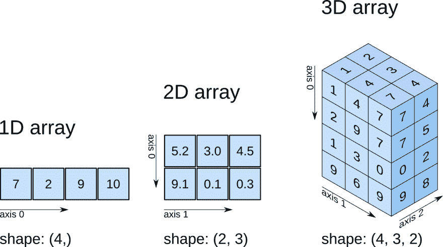](https://coursera.pxf.io/c/3294490/1164545/14726?u=https%3A%2F%2Fwww.coursera.org%2Flearn%2Fmachine-learning)

数据科学、机器学习、深度学习和人工智能目前非常热门，为程序员提供了高薪和令人兴奋的工作。

对于那些愿意学习这些新技能和提升自己，并希望解决一些最有趣的现实世界问题的程序员来说，这是一个很好的机会。

从工作的角度来看，这也很重要，因为由于这些技术，机器人和机器人正变得一天比一天聪明，并且很可能会取代今天许多程序员做的一些工作。

因此，对于软件工程师和开发人员来说，用这些技能提升自己是很重要的。随着数据科学正在彻底改变我们周围的世界，拥有这些技能的程序员也获得了高得多的薪水。

你可能已经知道[机器学习专家](https://javarevisited.blogspot.com/2018/02/top-10-highest-paying-technical-jobs-programmers-software-developers.html#axzz58Gi5STbU)是世界上薪酬最高的技术工作之一。然而，大多数开发人员和 IT 专业人员还没有学会这些有价值的技能。

对于那些不知道什么是[数据科学](http://www.java67.com/2018/10/top-10-data-science-and-machine-learning-courses.html)、[机器学习](https://javarevisited.blogspot.com/2018/10/data-science-and-machine-learning-courses-using-python-and-R-programming.html)或[深度学习](http://www.java67.com/2019/01/5-free-courses-to-learn-machine-and-deep-learning-in-2019.html)的人来说，它们是非常相关的术语，都指向机器做迄今为止只有人类才能做的工作，并分析现代应用程序收集的大量数据。

特别是数据科学，是机器学习、可视化、数据挖掘、编程、数据抢劫等概念的结合。

如果你有一些编程经验，那么你可以学习 [Python](http://javarevisited.blogspot.sg/2018/03/top-5-courses-to-learn-python-in-2018.html) 或 [R](http://www.java67.com/2018/09/top-5-free-R-programming-courses-for-Data-Science-Machine-Learning-Programmers.html) 让你的职业生涯成为一名数据科学家。

有很多流行的科学 Python 库，如 Numpy、Scipy、 [Scikit-learn](https://javarevisited.blogspot.com/2018/10/top-8-python-libraries-for-data-science-machine-learning.html) 、 [Pandas](https://becominghuman.ai/5-best-courses-to-learn-pythons-pandas-libary-for-data-analysis-and-data-science-34b62abb0e96) 、 [TensorFlow](https://becominghuman.ai/top-10-courses-to-learn-tensorflow-for-machine-learning-in-2020-39a31e7cd84b) 、 [PyTorch](https://www.java67.com/2020/06/top-5-courses-to-learn-pytorch-and-keras.html) 等，供数据科学家用来分析数据。

老实说，我对数据科学和机器学习世界也很陌生，但我从去年开始就花了一些时间来了解这个领域，并在学习机器学习、数据科学等的最佳资源方面做了一些研究。

我在一系列像这样的博客文章中分享所有这些资源。之前我已经分享了一些学习 [**TensorFlow**](https://javarevisited.blogspot.com/2018/08/top-5-tensorflow-and-machine-learning-courses-online-programmers.html) 的课程，这是最流行的机器学习库之一，今天我将分享更多一些学习这些技术的课程。

[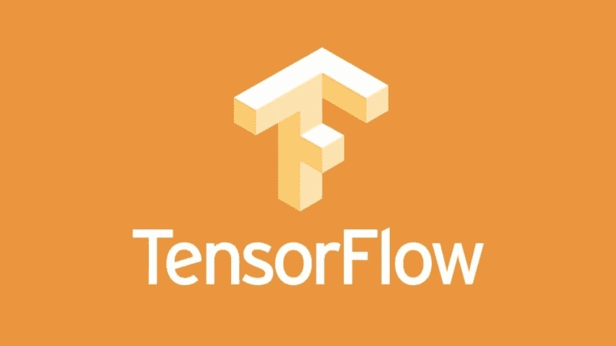](https://www.java67.com/2018/10/top-10-data-science-and-machine-learning-courses.html)

这些资源结合了免费资源和付费资源，将帮助你理解关键的数据科学概念，成为一名数据科学家。顺便说一句，如果你碰巧买了不是免费的课程，我会得到报酬。

## 初学者学习机器学习和数据科学的 10 门最佳课程

下面是我列出的一些使用 [Python](https://medium.com/javarevisited/my-favorite-books-to-learn-python-in-depth-77465633b46e) 和 [R 编程语言](https://becominghuman.ai/top-5-free-courses-to-learn-r-programming-for-data-science-and-statistics-in-2020-305bf1c6f24e)学习数据科学、机器学习和深度学习的最佳课程。正如我所说的，数据科学和机器学习紧密合作，因此其中一些课程也涵盖了机器学习。

如果你对于选择 Python 还是 R 进行机器学习仍然犹豫不决，让我告诉你，Python 和 T2 都是很好的数据分析语言，都有很好的 API 和库，因此我在 Python 和 R 中都包含了课程，你可以选择你喜欢的。

我个人喜欢 Python，因为它用途广泛，在我的语言列表中，它是仅次于 Java 的第二好语言。我已经在用它来写脚本和其他网页内容，所以对我来说这是一个简单的选择。它也有一些优秀的库，如 [Sci-kit Learn](https://javarevisited.blogspot.com/2018/10/top-8-python-libraries-for-data-science-machine-learning.html) 和 [TensorFlow](https://hackernoon.com/top-5-tensorflow-and-ml-courses-for-programmers-8b30111cad2c) 。

数据科学也是许多技能的结合，如[数据可视化](https://javarevisited.blogspot.com/2020/08/top-10-coursera-certifications-to-learn-Data-Science-Visualization-and-Data-Analysis.html)、数据清理、数据挖掘、[数据分析](https://javarevisited.blogspot.com/2019/10/top-5-courses-to-learn-pandas-for-data-analysis-python.html)等，这些课程很好地概述了所有这些概念，并提供了许多在现实世界中可以帮助你的有用工具。

### [机器学习专业化由吴恩达](https://coursera.pxf.io/c/3294490/1164545/14726?u=https%3A%2F%2Fwww.coursera.org%2Flearn%2Fmachine-learning)

这可能是斯坦福大学和 Coursera 提供的最受欢迎的学习机器学习的在线课程，Coursera 现在也提供认证。

您将在本课程中学习的每一个主题上接受测试，根据完成情况和您获得的最终分数，您还将获得证书。

这门课程是免费的，但如果你想获得证书，你需要付费。尽管如此，它确实为作为开发者的你提供了价值，并让你很好地理解了你提出的所有机器学习算法背后的数学。

我真的很喜欢这门课。吴恩达用 Octave 带你完成这个课程，Octave 是一个很好的工具，可以在你的项目中使用它之前测试你的算法。

[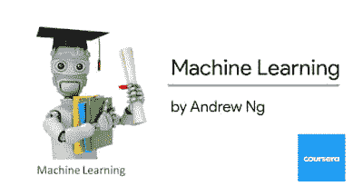](https://coursera.pxf.io/c/3294490/1164545/14726?u=https%3A%2F%2Fwww.coursera.org%2Flearn%2Fmachine-learning)

顺便说一下，如果你计划参加多个 Coursera 课程或专业，那么考虑参加 [**Coursera Plus**](https://coursera.pxf.io/c/3294490/1164545/14726?u=https%3A%2F%2Fwww.coursera.org%2Fcourseraplus) 订阅，它为你提供无限制的 700+课程、专业、专业证书和指导项目。

现在，让我们来看看你今天可以参加的学习数据科学和机器学习的 10 门最佳在线课程:

### 1。 [**机器学习 A-Z:动手 Python 和 R - In 数据科学**](https://click.linksynergy.com/fs-bin/click?id=JVFxdTr9V80&subid=0&offerid=323058.1&type=10&tmpid=14538&RD_PARM1=https%3A%2F%2Fwww.udemy.com%2Fmachinelearning%2F)

这可能是最好的在线数据科学和机器学习实践课程。在本课程中，您将从两位数据科学专家那里学习用 Python 和 R 创建机器学习算法。

对于想要在数据科学领域发展的学生和程序员以及想要提升机器学习水平的数据分析师来说，这是一门很棒的课程。

它也适用于任何中级程序员，他们知道机器学习的基础知识，包括线性回归或逻辑回归等经典算法，但希望了解更多信息，并探索机器学习的所有不同领域。

* * *

### 2。 [**数据科学用 R by 复数 sight**](https://pluralsight.pxf.io/c/1193463/424552/7490?u=https%3A%2F%2Fwww.pluralsight.com%2Fcourses%2Fr-data-science)

数据科学是将数据转化为知识的实践，R 是数据科学家使用的最流行的编程语言之一。

在本[课程](https://pluralsight.pxf.io/c/1193463/424552/7490?u=https%3A%2F%2Fwww.pluralsight.com%2Fcourses%2Fr-data-science)中，您将首先了解数据科学的实践、R 编程语言，以及如何使用它们将数据转化为可操作的洞察力。

接下来，您将学习如何转换和清理数据，创建和解释描述性统计数据、数据可视化和统计模型。

最后，您将学习如何处理[大数据](http://www.java67.com/2018/05/top-5-free-big-data-courses-to-learn-Hadoop-Apache-Spark.html)，使用机器学习算法进行预测，并将 R 部署到生产中。

[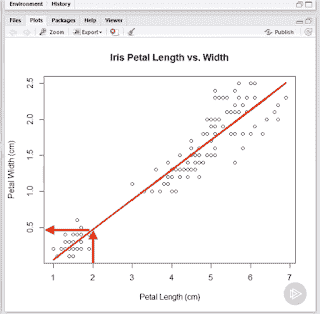](https://pluralsight.pxf.io/c/1193463/424552/7490?u=https%3A%2F%2Fwww.pluralsight.com%2Fcourses%2Fr-data-science)

顺便说一句，你需要一个 Pluralsight 会员才能进入这门课程，但是如果你没有会员，你仍然可以通过参加他们的 [**10 天免费通行证**](http://pluralsight.pxf.io/c/1193463/424552/7490?u=https%3A%2F%2Fwww.pluralsight.com%2Flearn) 来查看这门课程，它提供了 200 分钟免费进入他们所有课程的机会。

* * *

### [**3。哈佛数据科学课程**T5】](http://www.kdnuggets.com/2013/11/harvard-cs109-data-science-course-resources-free-online.html)

该课程结合了各种数据科学概念，如机器学习、可视化、数据挖掘、编程、数据抢劫等。

在整个课程中，你将会用到流行的科学 Python 库，如 [Numpy](https://javarevisited.blogspot.com/2018/10/top-8-python-libraries-for-data-science-machine-learning.html) ，Scipy， [Scikit-learn](https://javarevisited.blogspot.com/2018/10/top-8-python-libraries-for-data-science-machine-learning.html) ，Pandas。

我建议你在参加本课程之前先完成 course 上的机器学习课程，因为 PCA(维数约减)、 [k-means](https://www.java67.com/2020/07/top-5-machine-learning-algorithms-for-beginners.html) 和 logistic 回归等机器学习概念并没有深入涉及。

但是请记住，你必须投入大量的时间来完成这门课程，尤其是家庭作业练习非常具有挑战性

简而言之，如果你正在寻找一门数据科学的在线课程(使用 [Python](https://javarevisited.blogspot.com/2018/05/10-reasons-to-learn-python-programming.html) ，没有比[哈佛的 CS 109](http://www.kdnuggets.com/2013/11/harvard-cs109-data-science-course-resources-free-online.html) 更好的课程了。你需要一些编程背景和统计学知识来完成这门课程。

* * *

### 4。[*Udemy 上的数据科学入门？* *](https://click.linksynergy.com/deeplink?id=JVFxdTr9V80&mid=39197&murl=https%3A%2F%2Fwww.udemy.com%2Fcourse%2Fan-introduction-to-data-science%2F) (免费)

这是一门很棒的入门课程，介绍了数据科学家的工作以及如何成为数据科学专业人士。它也是免费的，你可以在 [Udemy](http://javarevisited.blogspot.sg/2018/01/top-10-udemy-courses-for-java-and-web-developers.html) 获得。

如果你刚刚听说过[数据科学](http://www.java67.com/2018/10/top-10-data-science-and-machine-learning-courses.html)并对此感到兴奋，但不知道它真正的含义，那么这是你应该首先参加的课程。

这是一个小型的[免费数据科学课程](https://medium.com/javarevisited/10-free-data-science-online-courses-for-beginners-a5fe78c2cb7b)，但是内容丰富。你会明白什么是数据科学？欣赏数据科学家的日常工作，区分数据科学中的各种角色以及履行这些角色所需的技能。

您还将了解数据科学家面临的挑战。简而言之，这门课程将为你提供所有的知识，让你决定数据科学是否适合你。

[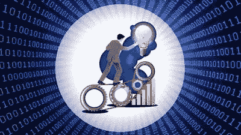](https://click.linksynergy.com/deeplink?id=JVFxdTr9V80&mid=39197&murl=https%3A%2F%2Fwww.udemy.com%2Fcourse%2Fan-introduction-to-data-science%2F)

* * *

### 5。 [**乌达城**数据科学导论](https://imp.i115008.net/c/1193463/786224/11298?u=https%3A%2F%2Fwww.udacity.com%2Fcourse%2Fintro-to-data-science--ud359)

这是另一个很好的数据科学入门课程，可以在另一个流行的在线课程网站 Udacity 上免费获得。

在本[课程](https://www.udacity.com/course/intro-to-data-science--ud359)中，您将学习基本的数据科学概念，例如数据操作、[数据分析与统计](https://medium.com/javarevisited/5-best-mathematics-and-statistics-courses-for-data-science-and-machine-learning-programmers-bf4c4f34e288)和机器学习、数据通信与信息可视化，以及使用[大数据](https://javarevisited.blogspot.com/2017/12/top-5-courses-to-learn-big-data-and.html)时的规模化数据。

这是一门免费课程，也是 Udacity 提供的数据分析师 Nanodegree 计划迈向新职业的第一步。

[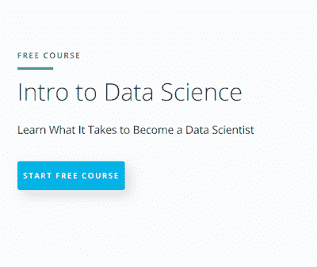](https://imp.i115008.net/c/1193463/786224/11298?u=https%3A%2F%2Fwww.udacity.com%2Fcourse%2Fintro-to-data-science--ud359)

* * *

### 6。 [**数据科学认证培训- R 编程**](http://www.anrdoezrs.net/links/8536219/type/dlg/sid/12/https://www.simplilearn.com/big-data-and-analytics/data-scientist-certification-sas-r-excel-training) \

是用 R 学习数据科学的另一门好课程。在这门课程中，您不仅将学习 R 编程语言，还将获得一些统计建模技术的实践经验。

[课程](http://www.anrdoezrs.net/links/8536219/type/dlg/sid/12/https://www.simplilearn.com/big-data-and-analytics/data-scientist-certification-sas-r-excel-training)有真实世界的例子，说明分析如何被用来显著改善业务或行业。

如果你有兴趣学习一些不需要大量数学背景就能理解的实用分析方法，这是适合你的课程。

[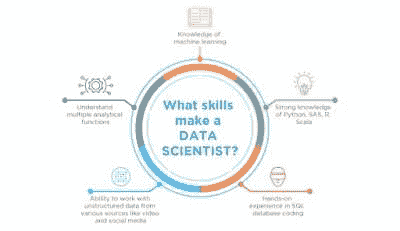](http://www.anrdoezrs.net/links/8536219/type/dlg/sid/12/https://www.simplilearn.com/big-data-and-analytics/data-scientist-certification-sas-r-excel-training)

* * *

### 7。[**Coursera**数据科学课程简介](https://coursera.pxf.io/c/3294490/1164545/14726?u=https%3A%2F%2Fwww.coursera.org%2Fspecializations%2Fintroduction-data-science)

本课程广泛介绍了数据科学的各种概念。第一个编程练习“Python 中的 Twitter 情绪分析”既有趣又具有挑战性，在这个练习中，你要分析大量的 Twitter 消息来找出情绪，例如负面的、正面的等等。

[课程](https://coursera.pxf.io/c/3294490/1164545/14726?u=https%3A%2F%2Fwww.coursera.org%2Fspecializations%2Fintroduction-data-science)假设你懂统计学、 [Python](http://javarevisited.blogspot.sg/2013/11/java-vs-python-which-programming-laungage-to-learn-first.html#axzz55UE6mabh) 和 [SQL](https://javarevisited.blogspot.com/2018/05/top-5-sql-and-database-courses-to-learn-online.html) 。

顺便说一句，这对初学者来说不太好，尤其是如果你不知道 [Python](https://javarevisited.blogspot.com/2019/09/5-websites-to-learn-python-for-free.html) 和 [SQL](https://medium.com/hackernoon/top-5-sql-and-database-courses-to-learn-online-48424533ac61) ，但是如果你知道并且对数据科学有基本的了解，那么这是一门很棒的课程。

[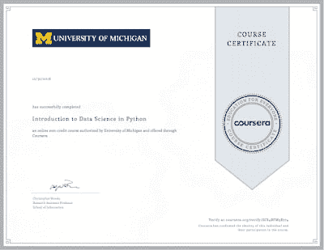](https://coursera.pxf.io/c/3294490/1164545/14726?u=https%3A%2F%2Fwww.coursera.org%2Fspecializations%2Fintroduction-data-science)

* * *

### 8。 [**Python 数据科学与机器学习训练营**](https://click.linksynergy.com/fs-bin/click?id=JVFxdTr9V80&subid=0&offerid=323058.1&type=10&tmpid=14538&RD_PARM1=https%3A%2F%2Fwww.udemy.com%2Fpython-for-data-science-and-machine-learning-bootcamp%2F) \

毫无疑问，除了用于数据分析的 R 语言之外，Python 可能是最好的语言，这就是为什么它在数据科学家中非常受欢迎。

这个[课程](https://click.linksynergy.com/fs-bin/click?id=JVFxdTr9V80&subid=0&offerid=323058.1&type=10&tmpid=14538&RD_PARM1=https%3A%2F%2Fwww.udemy.com%2Fpython-for-data-science-and-machine-learning-bootcamp%2F)将教你如何使用所有重要的 Python 科学和机器学习库 [TensorFlow](https://becominghuman.ai/top-10-courses-to-learn-tensorflow-for-machine-learning-in-2020-39a31e7cd84b) 、 [NumPy](https://medium.com/javarevisited/6-best-online-courses-to-learn-numpy-for-beginners-60120f611e06) 、 [Pandas](https://medium.com/javarevisited/5-best-free-pandas-courses-for-beginners-in-2022-d7dbe017b90c) 、Seaborn、 [Matplotlib](https://javarevisited.blogspot.com/2022/03/top-5-courses-to-learn-matplotlib-for.html) 、Plotly、Scikit-Learn、machine learning，以及更多我之前在我的[有用的机器学习库](https://javarevisited.blogspot.com/2018/10/top-8-python-libraries-for-data-science-machine-learning.html)列表中解释过的库。

这是一个非常全面的课程，你将如何使用 Python 的力量来分析数据，创建美丽的可视化，并使用强大的机器学习算法！

[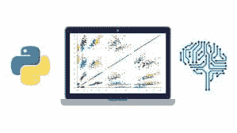](https://click.linksynergy.com/fs-bin/click?id=JVFxdTr9V80&subid=0&offerid=323058.1&type=10&tmpid=14538&RD_PARM1=https%3A%2F%2Fwww.udemy.com%2Fpython-for-data-science-and-machine-learning-bootcamp%2F)

### 9。 [**数据科学 A-Z:真实数据科学练习包括**](https://click.linksynergy.com/fs-bin/click?id=JVFxdTr9V80&subid=0&offerid=323058.1&type=10&tmpid=14538&RD_PARM1=https%3A%2F%2Fwww.udemy.com%2Fdatascience%2F) \

这是 Udemy 提供的另一个很好的数据科学实践课程。它承诺通过真实的分析示例一步一步地教你数据科学。数据挖掘、建模、 [Tableau 可视化](https://javarevisited.blogspot.com/2019/07/top-5-tableau-online-courses-and-certifications-for-data-science-engineers.html#axzz6ggCCT42g)等等。

这门[课程](https://click.linksynergy.com/fs-bin/click?id=JVFxdTr9V80&subid=0&offerid=323058.1&type=10&tmpid=14538&RD_PARM1=https%3A%2F%2Fwww.udemy.com%2Fdatascience%2F)将会给你很多实践练习，当你完成这门课程时，现实世界将会变得轻而易举。

作业练习也很发人深省，很有挑战性。简而言之，如果你喜欢做事，那么这是一门适合你的课程。

[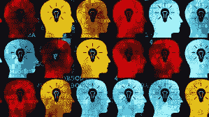](https://click.linksynergy.com/fs-bin/click?id=JVFxdTr9V80&subid=0&offerid=323058.1&type=10&tmpid=14538&RD_PARM1=https%3A%2F%2Fwww.udemy.com%2Fdatascience%2F)

* * *

### 10。 [**数据科学，深度学习和机器学习用 Python**](https://click.linksynergy.com/fs-bin/click?id=JVFxdTr9V80&subid=0&offerid=323058.1&type=10&tmpid=14538&RD_PARM1=https%3A%2F%2Fwww.udemy.com%2Fdata-science-and-machine-learning-with-python-hands-on%2F) \

如果你有一些编程或脚本编写经验，这门课程将教你科技行业中真正的数据科学家和机器学习实践者使用的技术，并帮助你成为一名数据科学家。

本课程中的主题来自对最大的科技雇主的数据科学家工作清单中的实际需求的分析，这使得它更加特殊和有用。

[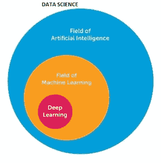](https://click.linksynergy.com/fs-bin/click?id=JVFxdTr9V80&subid=0&offerid=323058.1&type=10&tmpid=14538&RD_PARM1=https%3A%2F%2Fwww.udemy.com%2Fdata-science-and-machine-learning-with-python-hands-on%2F)

以上就是学习数据科学的一些**热门课程。正如我所说的，对良好的数据分析有很多需求，但没有多少开发人员能够满足这种需求。**

对于程序员来说，这是一个很好的机会，特别是那些拥有良好的数学和统计学知识的人，可以在机器学习和数据分析领域发展。你将获得令人兴奋的工作和难以置信的报酬。

其他有用的**数据科学和机器学习**资源
[前 8 名 Python 机器学习库](https://javarevisited.blogspot.com/2018/10/top-8-python-libraries-for-data-science-machine-learning.html)
[5 门免费课程学习面向机器学习的 R 编程](http://www.java67.com/2018/09/top-5-free-R-programming-courses-for-Data-Science-Machine-Learning-Programmers.html)
[5 门免费课程学习面向初学者的 Python](http://www.java67.com/2018/02/5-free-python-online-courses-for-beginners.html)
[前 5 名数据科学和机器学习课程](https://hackernoon.com/top-5-data-science-and-machine-learning-course-for-programmers-e724cfb9940a)
[前 5 名 TensorFlow 和机器学习课程](https://hackernoon.com/top-5-tensorflow-and-ml-courses-for-programmers-8b30111cad2c)
[10 门技术程序员今天可以学习的前 5 门课程](http://www.java67.com/2018/01/top-10-web-mobile-and-big-data-framework-libraries-technologies-programmers-should-learn-in-2018.html)

#### 期末备注

谢谢，你坚持到了文章的结尾...祝你的数据科学和机器学习之旅好运！这当然不会很容易，但通过学习这些课程，你离成为你一直想成为的机器学习专家又近了一步。

如果你喜欢这篇文章，那么请分享给你的朋友和同事，别忘了在 Twitter 上关注 [javinpaul](https://twitter.com/javinpaul) ！

**p . s .**——如果你需要一些免费的资源来入手，可以看看这个免费的课程 [***学习机器学习算法、软件、深度学习***](http://bit.ly/2DNKMdZ) 来开始你的准备。