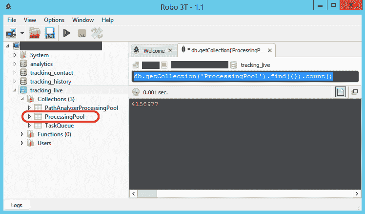

# Ooops…看起来 WFfM 打破了分析…

> 原文：<https://dev.to/jermdavis/ooops-looks-like-wffm-broke-analytics-3h0j>

最近，我得到了一张有趣的支持票，是关于 Sitecore v8.1 的一个客户的，他的分析处理停止了。他们需要汇总的大量原始分析数据正在缓慢增长，一些依赖于最新分析数据的功能已经停止工作。试图解决这个问题让我想到了两个问题，这两个问题与营销人员的网络表单数据在分析中的处理方式有关——这些问题似乎是其他支持工作的人可能需要的信息……

## 首先，你怎么知道分析队列正在增长？

好问题！队列位于 MongoDB 的“Tracking Live”数据库的“处理池”集合中。因此，您可以启动您最喜欢的 Mongo 分析工具，并计算该表中的行数。作为一名 [Robo 3T / RoboMongo](https://robomongo.org/) 用户，我运行查询`db.getCollection('ProcessingPool').count()`并查看结果:

[](https://jermdavis.files.wordpress.com/2019/03/processingpool.png)

您可以随着时间的推移观察这个数字，看看您的队列发生了什么…

当我这么做的时候，我意识到能够以一种更加自动化的方式获得这些数据会很有帮助，所以我想出了如何在 PowerShell 中进行同样的查询:

```
Add-Type  -Path  'C:\inetpub\wwwroot\yourWebsiteFolder\Website\bin\MongoDB.Driver.dll'  $client  =  New-Object  -TypeName  MongoDB.Driver.MongoClient  -ArgumentList  "mongodb://yourMongoServer:yourPort"  $server  =  $client.GetServer()  $database  =  $server.GetDatabase("tracking_live")  $val  =  $database.GetCollection('ProcessingPool').count()  write-host  "----"  write-host  "At: $(Get-Date  -Format  'dd/MM/yyyy HH:mm')"
write-host "Count:  $val" 
```

Enter fullscreen mode Exit fullscreen mode

请注意，Sitecore 对这些数据进行批处理，因此您会发现该表中的数字会有所攀升，直到处理引擎开始处理一批数据。因此需要花几分钟时间来观察它的趋势。

在我看到的服务器上，这个队列相当大 [](https://res.cloudinary.com/practicaldev/image/fetch/s--fumfYCPq--/c_limit%2Cf_auto%2Cfl_progressive%2Cq_auto%2Cw_880/https://s0.wp.com/wp-content/mu-plugins/wpcom-smileys/twemoji/2/72x72/1f609.png)

那么我看到了什么问题呢？

## 问题一:

我在日志中发现的第一大堆错误是这样的:

```
4544 13:07:23 ERROR Exception when storing an aggregation result into reporting database. Item will be postponed and retried later.
Exception: System.Data.SqlClient.SqlException
Message: Failed to insert or update rows in the [Fact_FormSummary] table.
Failed to insert or update rows in the [Fact_FormSummary] table.
Failed to insert or update rows in the [Fact_FormSummary] table.
Failed to insert or update rows in the [Fact_FormSummary] table.
Failed to insert or update rows in the [Fact_FormSummary] table.
Failed to insert or update rows in the [Fact_FormSummary] table.
Source: .Net SqlClient Data Provider
   at System.Data.SqlClient.SqlConnection.OnError(SqlException exception, Boolean breakConnection, Action`1 wrapCloseInAction)
   at System.Data.SqlClient.TdsParser.ThrowExceptionAndWarning(TdsParserStateObject stateObj, Boolean callerHasConnectionLock, Boolean asyncClose)
   at System.Data.SqlClient.TdsParser.TryRun(RunBehavior runBehavior, SqlCommand cmdHandler, SqlDataReader dataStream, BulkCopySimpleResultSet bulkCopyHandler, TdsParserStateObject stateObj, Boolean& dataReady)
   at System.Data.SqlClient.SqlCommand.FinishExecuteReader(SqlDataReader ds, RunBehavior runBehavior, String resetOptionsString)
   at System.Data.SqlClient.SqlCommand.RunExecuteReaderTds(CommandBehavior cmdBehavior, RunBehavior runBehavior, Boolean returnStream, Boolean async, Int32 timeout, Task& task, Boolean asyncWrite, SqlDataReader ds, Boolean describeParameterEncryptionRequest)
   at System.Data.SqlClient.SqlCommand.RunExecuteReader(CommandBehavior cmdBehavior, RunBehavior runBehavior, Boolean returnStream, String method, TaskCompletionSource`1 completion, Int32 timeout, Task& task, Boolean asyncWrite)
   at System.Data.SqlClient.SqlCommand.InternalExecuteNonQuery(TaskCompletionSource`1 completion, String methodName, Boolean sendToPipe, Int32 timeout, Boolean asyncWrite)
   at System.Data.SqlClient.SqlCommand.ExecuteNonQuery()
   at Sitecore.Analytics.Aggregation.SqlReportingStorageProvider.Commit(SqlDataApi api, IReportingStorageItemBatch batch, Func`2 filter)
   at Sitecore.Analytics.Aggregation.SqlReportingStorageProvider.<>c__DisplayClass6.<StoreBatch>b__1()
   at Sitecore.Data.DataProviders.NullRetryer.ExecuteNoResult(Action action, Action recover)
   at Sitecore.Analytics.Aggregation.SqlReportingStorageProvider.StoreBatch(IReportingStorageItemBatch batch)
   at Sitecore.Analytics.Aggregation.SqlReportingStorageProvider.Store(IReportingStorageItemBatch batch) 
```

Enter fullscreen mode Exit fullscreen mode

对我来说幸运的是，谷歌很快解决了这个问题，因为 Dmytro Shevchenko 已经就这个问题做了一个非常有用的帖子。

应用他的补丁消除了这些日志错误，处理队列又开始下降了…

## 一期两期:

…但是在愉快的处理了一天左右之后，一个新的错误出现了:

```
6680 10:27:47 ERROR Exception when storing an aggregation result into reporting database. Item will be postponed and retried later.
Exception: System.Data.SqlClient.SqlException
Message: Column, parameter, or variable @p59\. : Cannot find data type Fact_FormSummary_Type.
Source: .Net SqlClient Data Provider
   at System.Data.SqlClient.SqlConnection.OnError(SqlException exception, Boolean breakConnection, Action`1 wrapCloseInAction)
   at System.Data.SqlClient.TdsParser.ThrowExceptionAndWarning(TdsParserStateObject stateObj, Boolean callerHasConnectionLock, Boolean asyncClose)
   at System.Data.SqlClient.TdsParser.TryRun(RunBehavior runBehavior, SqlCommand cmdHandler, SqlDataReader dataStream, BulkCopySimpleResultSet bulkCopyHandler, TdsParserStateObject stateObj, Boolean& dataReady)
   at System.Data.SqlClient.SqlCommand.FinishExecuteReader(SqlDataReader ds, RunBehavior runBehavior, String resetOptionsString)
   at System.Data.SqlClient.SqlCommand.RunExecuteReaderTds(CommandBehavior cmdBehavior, RunBehavior runBehavior, Boolean returnStream, Boolean async, Int32 timeout, Task& task, Boolean asyncWrite, SqlDataReader ds, Boolean describeParameterEncryptionRequest)
   at System.Data.SqlClient.SqlCommand.RunExecuteReader(CommandBehavior cmdBehavior, RunBehavior runBehavior, Boolean returnStream, String method, TaskCompletionSource`1 completion, Int32 timeout, Task& task, Boolean asyncWrite)
   at System.Data.SqlClient.SqlCommand.InternalExecuteNonQuery(TaskCompletionSource`1 completion, String methodName, Boolean sendToPipe, Int32 timeout, Boolean asyncWrite)
   at System.Data.SqlClient.SqlCommand.ExecuteNonQuery()
   at Sitecore.Analytics.Aggregation.SqlReportingStorageProvider.Commit(SqlDataApi api, IReportingStorageItemBatch batch, Func`2 filter)
   at Sitecore.Analytics.Aggregation.SqlReportingStorageProvider.<>c__DisplayClass6.<StoreBatch>b__1()
   at Sitecore.Data.DataProviders.NullRetryer.ExecuteNoResult(Action action, Action recover)
   at Sitecore.Analytics.Aggregation.SqlReportingStorageProvider.StoreBatch(IReportingStorageItemBatch batch)
   at Sitecore.Analytics.Aggregation.SqlReportingStorageProvider.Store(IReportingStorageItemBatch batch) 
```

Enter fullscreen mode Exit fullscreen mode

看了一下数据库，在 Sys 里找不到任何叫“Fact_FormSummary_Type”的东西。Objects 表，所以这个错误可能是准确的，即使它不是很有帮助。

可悲的是，谷歌在这里没有帮我，因为我得到的唯一参考是社区论坛上关于另一条消息的帖子。对它的修复涉及到数据库的权限问题，所以我还是检查了一下——但是我工作的站点似乎有一个连接字符串用户拥有这些权限。

在做了更多的调查却毫无进展之后，我试着和 Sitecore 支持人员交流。他们很快指出这是一个已知的 bug。虽然遗憾的是，这是一个缺乏记录的问题——因此有了这篇文章。

他们说 WFfM v8.2 Update 6 中包含了该修复程序，因此他们建议如果可能的话，至少将您的 Sitecore / WFfM 实例更新到该版本。但是如果你做不到这一点，那么就告诉支持人员关于 Bug #120569 的问题，以获得他们的补丁。

将该补丁应用到我正在查看的 Sitecore 实例后，我的日志中不再出现这个错误，并且我的处理队列又开始下降了。

希望这是我在服务器清空队列之前需要解决的最后一个问题…