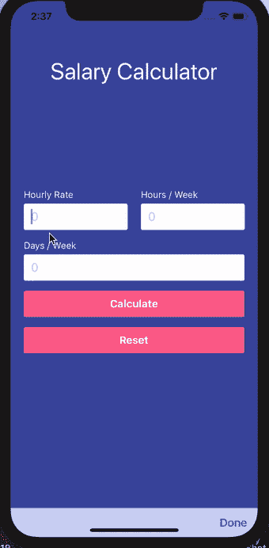

# 在 React Native 中创建一个 FormBuilder 组件(第 4 部分)

> 原文：<https://dev.to/dev_nope/create-a-formbuilder-component-in-react-native-part-4-5gc3>

本系列内容:

*   [第 1 部分:创建新的 React 原生应用](https://dev.to/dev_nope/create-a-formbuilder-component-in-react-native-intro--part-1-1m84)
*   [第 2 部分:创建一个简单的工资计算器表单](https://dev.to/dev_nope/create-a-formbuilder-component-in-react-native-part-2-2dec)
*   [第 3 部分:创建自定义表单输入和按钮组件](https://dev.to/dev_nope/create-a-formbuilder-component-in-react-native-part-3-1aib)
*   第 4 部分:处理`FormBuilder`组件(当前)
*   [第 5 部分:即时启用/禁用表单按钮](https://dev.to/dev_nope/create-a-formbuilder-component-in-react-native-part-5-535h)
*   [第 6 部分:创建注册表单](https://dev.to/dev_nope/create-a-formbuilder-component-in-react-native-part-6-2ohd)
*   第 7 部分:增加对布尔字段类型的支持

# 第 4 部分:处理`FormBuilder`组件

我们已经达到了拥有一个完整功能形式的地步。现在，让我们尝试构建一个单独的组件来呈现表单。我们只需要指示它呈现哪些字段，以及它应该如何处理表单提交。

### 定义表单的配置

让我们从生成一个 JavaScript 数组开始，它将是我们`FormBuilder`的组件`configuration`。在我们的`App.js`文件中，我们将把一个类属性定义为一个箭头函数，它返回我们想要的配置，如下所示:

```
getFormFields = () => {
    const inputProps = {
        placeholder: '0',
        autoCapitalize: 'none',
        autoCorrect: false,
        keyboardType: 'numeric',
        returnKeyType: 'done',
    };

    const formFields = [
        [
            {
                name: 'hourlyRate',
                label: 'Hourly Rate',
                type: 'text',
                inputProps,
            },
            {
                name: 'hoursPerWeek',
                label: 'Hours / Week',
                type: 'text',
                inputProps,
            },
        ],
        [
            {
                name: 'daysPerWeek',
                label: 'Days / Week',
                type: 'text',
                inputProps,
            },
        ],
    ];

    return formFields;
}; 
```

基本上，我们的配置是*一个包含对象的行列表，这些对象描述了要呈现的每个表单字段*。为什么我们需要那些*行*？只是为了让我们控制表单的布局。一行中的每个表单域都将以内联方式呈现，然后新的一行将从新的一行开始。在我们的示例中，`hourlyRate`和`hoursPerWeek`将被内联呈现，但是`daysPerWeek`将被呈现在新的一行中，并且将占据该行的整个宽度。

### 修改我们的`handleSubmit`类属性

我们将对处理表单提交的函数做一些修改，如下所示:

*   不再使用`App.js`组件的状态。因为我们的`FormBuilder`组件将负责从表单字段中收集数据，所以在我们的`App.js`组件中不再需要本地州。相反，我们将在我们的`FormBuilder`组件中有一个本地状态，该状态将被传递给我们的`handleSubmit`函数；
*   删除必填字段的验证。我们也将把这项工作委托给我们的`FormBuilder`组件；
*   添加对我们新的`daysPerWeek`表单域的支持(在我们之前的博客文章中没有使用)；
*   将`weeklyIncome`作为结果的一部分。

修改后的版本应该如下所示:

```
handleSubmit = (state) => {
    // using Javascript object destructuring to
    // get user's input data from the state.
    const { hourlyRate, hoursPerWeek, daysPerWeek } = state;

    const weeksPerYear = 52;
    const hoursPerDay = Math.ceil(parseFloat(hoursPerWeek) / parseFloat(daysPerWeek));
    const weeklyIncome = Math.abs(
        parseFloat(hourlyRate) * hoursPerDay * parseFloat(daysPerWeek),
    );
    const annualIncome = Math.abs(
        parseFloat(hourlyRate) * parseFloat(hoursPerWeek) * weeksPerYear,
    );

    // show results
    Alert.alert(
        'Results',
        `Weekly Income: $${weeklyIncome}, \n Annual Income: $${annualIncome}`,
    );
}; 
```

### 修改我们的`render()`功能

让我们通过删除所有的表单输入和按钮来修改我们的`render()`函数，然后使用`FormBuilder`组件来代替(我们将马上创建它)。

```
render() {
    return (
        <KeyboardAvoidingView behavior="padding" style={styles.container}>
            <Text style={styles.screenTitle}>Salary Calculator</Text>
            <FormBuilder
                formFieldsRows={this.getFormFields()}
                handleSubmit={this.handleSubmit}
                submitBtnTitle="Calculate"
            />
        </KeyboardAvoidingView>
    );
} 
```

如您所见，我们的`FormBuilder`组件接受 3 个道具:

*   `formFieldsRows` -我们想要的表单字段列表；
*   `handleSubmit` -用户提交表单时运行的功能；
*   `submitBtnTitle` -提交按钮的标题。我们将使它成为可选的，并在表单组件本身中有一个默认值。

### 创建`FormBuilder`组件

**时候到了！**😜🎉让我们创建我们的助手组件🏁。现在，我们将看看最终的代码是什么样子的，然后我们将遍历它并讨论功能。女士们先生们，请允许我向你们介绍我们的第一版`FormBuilder` 🎆🚀(对不起，我刚才太激动了😊):

```
import React from 'react';
import PropTypes from 'prop-types';
import {
    View, StyleSheet, Keyboard, Alert,
} from 'react-native';

import FormTextInput from './FormTextInput';
import FormButton from './FormButton';

/**
 * A component which renders a form based on a given list of fields.
 */
class FormBuilder extends React.Component {
    /* eslint-disable no-param-reassign */
    constructor(props) {
        super(props);

        const formFields = this.getFormFields();

        // dynamically construct our initial state by using
        // each form field's name as an object property.
        const formFieldNames = formFields.reduce((obj, field) => {
            obj[field.name] = '';
            return obj;
        }, {});

        // define the initial state, so we can use it later on
        // when we'll need to reset the form
        this.initialState = {
            ...formFieldNames,
        };

        this.state = this.initialState;
    }
    /* eslint-enable no-param-reassign */

    /**
     * Extract our form fields from each row
     * and compose one big list of field objects.
     */
    getFormFields = () => {
        const { formFieldsRows } = this.props;
        const formFields = [];

        formFieldsRows.forEach((formFieldsRow) => {
            formFields.push(...formFieldsRow);
        });

        return formFields;
    };

    /**
     * Check if all fields have been filled out.
     */
    /* eslint-disable react/destructuring-assignment */
    hasValidFormData = () => {
        const formFields = this.getFormFields();
        const isFilled = formFields.every(field => !!this.state[field.name]);
        return isFilled;
    };
    /* eslint-enable react/destructuring-assignment */

    /**
     * Attempt to submit the form if all fields have been
     * properly filled out.
     */
    attemptFormSubmission = () => {
        const { handleSubmit } = this.props;

        if (!this.hasValidFormData()) {
            return Alert.alert('Input error', 'Please input all required fields.');
        }

        return handleSubmit(this.state);
    };

    /**
     * Reset the form and hide the keyboard.
     */
    resetForm = () => {
        Keyboard.dismiss();
        this.setState(this.initialState);
    };

    /* eslint-disable react/destructuring-assignment */
    renderTextInput = ({ name, label, inputProps }) => (
        <FormTextInput
            {...inputProps}
            value={this.state[name].toString()}
            onChangeText={(value) => {
                this.setState({ [name]: value });
            }}
            labelText={label}
            key={name}
        />
    );
    /* eslint-enable react/destructuring-assignment */

    render() {
        const { submitBtnTitle, formFieldsRows } = this.props;

        return (
            <View>
                {/* eslint-disable react/no-array-index-key */}
                {formFieldsRows.map((formFieldsRow, i) => (
                    <View style={styles.row} key={`r-${i}`}>
                        {formFieldsRow.map(field => this.renderTextInput(field))}
                    </View>
                ))}
                {/* eslint-enable react/no-array-index-key */}

                <FormButton onPress={this.attemptFormSubmission}>{submitBtnTitle}</FormButton>
                <FormButton onPress={this.resetForm}>Reset</FormButton>
            </View>
        );
    }
}

FormBuilder.propTypes = {
    handleSubmit: PropTypes.func.isRequired,
    submitBtnTitle: PropTypes.string,
    formFieldsRows: PropTypes.arrayOf(
        PropTypes.arrayOf(
            PropTypes.shape({
                name: PropTypes.string,
                label: PropTypes.string,
                type: PropTypes.string,
                inputProps: PropTypes.object,
            }),
        ),
    ).isRequired,
};

FormBuilder.defaultProps = {
    submitBtnTitle: 'Submit',
};

const styles = StyleSheet.create({
    row: {
        flexDirection: 'row',
    },
});

export default FormBuilder; 
```

至于我们之前创建的任何其他组件，我们将定义我们的组件接受的`propTypes`。其中两个是必需的- `handleSubmit`和`formFieldsRows`(注意我们如何为配置数组要求一个非常特殊的格式)，一个是可选的- `submitBtnTitle` -默认值为`Submit`。

在我们的组件中，我们将使用一些助手函数。让我们把它们列出来，并简要描述它们的用途:

*   `getFormFields` -因为我们的组件接收一个`form field rows`的列表，而不仅仅是一个简单的`form fields`列表，我们将定义这个帮助器函数，它将为我们进行转换。当我们在类`constructor`中尝试动态定义初始状态时，以及当我们需要在`hasValidFormData`帮助函数中验证表单数据时，您可以看到这是如何变得方便的。
*   这是表单验证的一个非常简单的实现。我们主要是检查用户是否填写了所有的表单字段。JavaScript 数组方法 [every()](https://developer.mozilla.org/en-US/docs/Web/JavaScript/Reference/Global_Objects/Array/every) 非常适合我们的用例。
*   `attemptFormSubmission` -一个帮助函数，描述用户提交表单时需要发生的动作。这里我们使用我们上面描述的验证函数，如果验证通过，那么我们将调用从`App.js`传下来的`handleSubmit`函数。
*   `resetForm` -帮助功能，描述用户点击`Reset`按钮时需要发生的动作。基本上，这将重置我们的状态(这导致重置所有表单字段)并隐藏键盘。
*   `renderTextInput` -这个助手函数通过接受一个表单字段对象作为参数，简单地呈现出一个`FormTextInput`组件。注意我们是如何在函数的参数列表- `({ name, label, inputProps }) => (`中[解包/析构](https://developer.mozilla.org/en-US/docs/Web/JavaScript/Reference/Operators/Destructuring_assignment#Unpacking_fields_from_objects_passed_as_function_parameter)表单域对象的。这只是一个非常方便的 ES6 特性。我们将这个逻辑转移到一个单独的函数中的主要原因是为了让组件的`render()`函数保持整洁，特别是如果我们将来要添加对其他字段类型的支持(例如，textarea、checkboxes 等)。)

就像那样，我们已经定义了一个在我们的组件中使用的助手函数的良好列表。

我认为值得一提的是在我们的`constructor`中使用 JavaScript 数组 [reduce()](https://developer.mozilla.org/en-US/docs/Web/JavaScript/Reference/Global_Objects/Array/Reduce) 方法，它基本上遍历每个表单字段，并生成一个最终对象，以字段名作为属性，以一个空字符串作为值。这基本上是我们组件的初始状态。

```
const formFieldNames = formFields.reduce((obj, field) => {
    obj[field.name] = '';
    return obj;
}, {}); 
```

我们需要看的最后一部分是`render()`函数的实现。这里的 JSX 内容看起来非常漂亮整洁。我们简单地遍历我们的`formFieldsRows`列表，呈现所有表单输入，包括提交和重置按钮。

经过所有这些更改后，表单的最终版本应该如下所示:

[](https://res.cloudinary.com/practicaldev/image/fetch/s--JaxXJ3tS--/c_limit%2Cf_auto%2Cfl_progressive%2Cq_66%2Cw_880/https://thepracticaldev.s3.amazonaws.com/i/aoi3mtkzw4almn2gtiin.gif)

要查看完整的变更列表，请查看 GitHub 上的这个[提交。](https://github.com/vasilestefirta/react-native-form-builder/commit/c2aa997024c5c2880077f896e8f3eb44c2cc2140)

* * *

如果你能走到这一步，那就太棒了👏。让我们玩得更开心些，给我们的组件添加更多的功能。👨‍💻😜你喜欢这个主意吗？然后再来看看这个系列的[第 5 部](https://dev.to/dev_nope/create-a-formbuilder-component-in-react-native-part-5-535h)。