# NextCloud:用 PHP-FPM 在 NGINX 后面的 Debian 上安装服务器，在 Arch Linux 上安装客户端

> 原文：<https://dev.to/setevoy/nextcloud-installing-server-on-debian-behind-nginx-with-php-fpm-and-client-on-arch-linux-51bj>

[](https://res.cloudinary.com/practicaldev/image/fetch/s--X9VQV0ud--/c_limit%2Cf_auto%2Cfl_progressive%2Cq_auto%2Cw_880/https://rtfm.co.ua/wp-content/uploads/2019/03/nextcloud-logo.png) 在 Dropbox 增加了用户只能使用三种设备的新限制——我终于准备好安装自己的 NextCloud 来存储和同步数据了。

可悲的不是三个设备的限制(它将只适用于新用户——已经有三个或更多设备的老用户仍然可以使用它们，但必须再玩一个新的设备)，而是这种新限制本身的事实。

当大公司仅仅因为想要更多的钱而开始改变游戏规则时，这是令人不快的。

因此，现在我将做一个快速的手动设置，以便更仔细地了解 NextCloud 本身，下一次，我将把它的设置添加到我的 RTFM 的自动化中(查看[Prometheus:RTFM blog monitoring setup with ansi ble–Grafana，Loki，和 promtail](https://dev.to/setevoy/prometheus-rtfm-blog-monitoring-set-up-with-ansible--grafana-loki-and-promtail-58i) 帖子中的例子):NextCloud 实例稍后将被托管在此博客所在的同一服务器上，并将使用一个额外的数字海洋块存储(又名 Volumes)。

数字海洋也有对象存储，这是 AWS S3 模拟，我想它可以更好地使用它，而不是简单的连接到主机的卷，但我还没有使用它，它将花费 5 美元/月。

数字海洋存储文档可用[此处> > >](https://www.digitalocean.com/community/tutorials/object-storage-vs-block-storage-services) 。

在任何情况下，数据都可以在以后移动

此外，你可以让你的服务器托管在数字海洋的 droplet 上，并使用 AWS S3 作为你的 NextCloud 的后端存储。

NEXсcloud 文档可用[此处> > >](https://docs.nextcloud.com/server/stable/admin_manual/index.html) 。

### NEXсcloud vs own cloud

NextCloud(创建于 2016 年)是 ownCloud 的 for(始于 2010 年)。

很高兴在这里读到它们:

*   [next cloud vs own cloud——整个故事](https://civihosting.com/blog/nextcloud-vs-owncloud/)
*   [Owncloud vs NextCloud？dropbox 的最佳替代品是什么？](https://www.reddit.com/r/selfhosted/comments/968tft/owncloud_vs_nextcloud_whats_best_for_a_dropbox/)
*   [next cloud vs own cloud vs Seafile:最好的自托管文件同步服务](https://www.maketecheasier.com/nextcloud-vs-owncloud-vs-seafile/)

### 数字海洋水滴的磁盘

运行新的 droplet 并添加新的卷。

Droplet 的创建不在本帖讨论范围内，详情可以查看[digital ocean:знакомство—Droplet，浮动 IP，防火墙](https://rtfm.co.ua/digitalocean-znakomstvo-droplet-floating-ip-firewall/) ( *Rus* )。

使用*手动格式化&挂载*选项创建卷:

[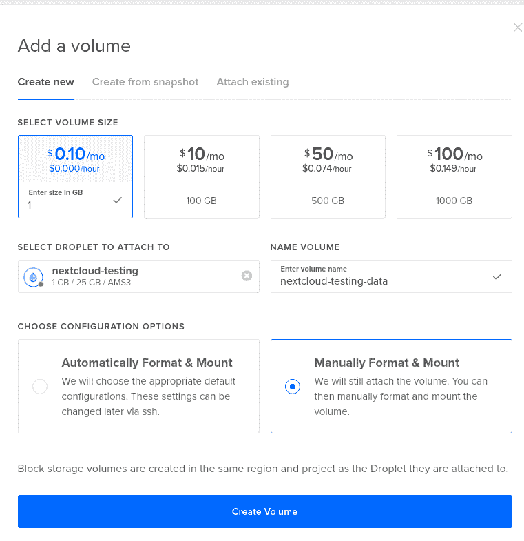](https://rtfm.co.ua/wp-content/uploads/2019/03/Screenshot_20190317_134628.png)

连接到它:

```
ssh root@174.138.14.155 -i do-rtfm-dev-droplet 
```

检查磁盘:

```
root@nextcloud-testing:~# lsblk
NAME   MAJ:MIN RM  SIZE RO TYPE MOUNTPOINT
sda      8:0    0    1G  0 disk
vda    254:0    0   25G  0 disk
└─vda1 254:1    0   25G  0 part /
vdb    254:16   0  434K  1 disk 
```

将成为下一代云的存储。

创建新目录:

```
root@nextcloud-testing:~# mkdir -p /data/nextcloud 
```

在`/dev/sda` :
上创建一个新分区

```
root@nextcloud-testing:~# fdisk /dev/sda
...
Device does not contain a recognized partition table.
Created a new DOS disklabel with disk identifier 0xc5322339.

Command (m for help): n

Partition type
p   primary (0 primary, 0 extended, 4 free)
e   extended (container for logical partitions)
Select (default p):

Using default response p.

Partition number (1-4, default 1):
First sector (2048-2097151, default 2048):
Last sector, +sectors or +size{K,M,G,T,P} (2048-2097151, default 2097151):

Created a new partition 1 of type 'Linux' and of size 1023 MiB.

Command (m for help): w

The partition table has been altered.
Calling ioctl() to re-read partition table.
Syncing disks. 
```

格式`/dev/sda1`至`ext4` :

```
root@nextcloud-testing:~# mkfs.ext4 /dev/sda1 
```

将其安装到`/data/nextcloud/` :

```
root@nextcloud-testing:~# mount /dev/sda1  /data/nextcloud/ 
```

获取分区的 UUID:

```
root@nextcloud-testing:~# blkid /dev/sda1
/dev/sda1: UUID="37e8697e-e51e-4a91-83d5-79efe61fe91b" TYPE="ext4" PARTUUID="c5322339-01" 
```

用 [`nofail`](https://wiki.archlinux.org/index.php/fstab#External_devices) 选项将其添加到`/etc/fstab`:

```
UUID="37e8697e-e51e-4a91-83d5-79efe61fe91b" /data/nextcloud/ ext4 nofail 0 0 
```

立即卸载:

```
root@nextcloud-testing:~# umount /data/nextcloud 
```

并通过`/etc/fstab`挂载以确保其正确:

```
root@nextcloud-testing:~# mount -a
root@nextcloud-testing:~# lsblk /dev/sda
NAME   MAJ:MIN RM  SIZE RO TYPE MOUNTPOINT
sda      8:0    0    1G  0 disk
└─sda1   8:1    0 1023M  0 part /data/nextcloud 
```

目前就这些。

您也可以重新启动您的服务器，以确保所有工作在这里。

### NGINX 和 PHP

安装 NGINX:

```
root@nextcloud-testing:~# apt update && apt -y upgrade && apt -y install nginx 
```

安装 PHP 和 PHP-FPM:

```
root@nextcloud-testing:~# apt install php php-xml php-curl php-gd php-zip php-mysql php-mbstring php-fpm wget unzip -y 
```

创建虚拟主机的配置。

这里我将使用*nextcloud-testing.setevoy.org.ua*域。

现在，由于这是测试设置，我们不使用 SSL/TLS，配置如下:

```
server {
    listen 80;
    listen [::]:80;
    server_name nextcloud-testing.setevoy.org.ua;
    root /var/www/html/nextcloud-testing.setevoy.org.ua;
    add_header X-Content-Type-Options nosniff;
    add_header X-XSS-Protection "1; mode=block";
    add_header X-Robots-Tag none;
    add_header X-Download-Options noopen;
    add_header X-Permitted-Cross-Domain-Policies none;
    location / {
        rewrite ^ /index.php$uri;
    }
    location ~ ^/(?:build|tests|config|lib|3rdparty|templates|data)/ {
        deny all;
    }
    location ~ ^/(?:\.|autotest|occ|issue|indie|db_|console) {
        deny all;
    }
    location ~ ^/(?:index|remote|public|cron|core/ajax/update|status|ocs/v[12]|updater/.+|ocs-provider/.+)\.php(?:$|/) {
        fastcgi_split_path_info ^(.+\.php)(/.*)$;
        include fastcgi_params;
        fastcgi_param SCRIPT_FILENAME $document_root$fastcgi_script_name;
        fastcgi_param PATH_INFO $fastcgi_path_info;
        #fastcgi_param HTTPS on;
        #Avoid sending the security headers twice
        fastcgi_param modHeadersAvailable true;
        fastcgi_param front_controller_active true;
        fastcgi_pass unix:/run/php/php7.0-fpm.sock;
        fastcgi_intercept_errors on;
        fastcgi_request_buffering off;
    }
    location ~ ^/(?:updater|ocs-provider)(?:$|/) {
        try_files $uri/ =404;
        index index.php;
    }
    location ~ \.(?:css|js|woff|svg|gif)$ {
        try_files $uri /index.php$uri$is_args$args;
        add_header Cache-Control "public, max-age=15778463";
        add_header X-Content-Type-Options nosniff;
        add_header X-XSS-Protection "1; mode=block";
        add_header X-Robots-Tag none;
        add_header X-Download-Options noopen;
        add_header X-Permitted-Cross-Domain-Policies none;
    }
    location ~ \.(?:png|html|ttf|ico|jpg|jpeg)$ {
        try_files $uri /index.php$uri$is_args$args;
        access_log off;
    }
} 
```

NextCloud 文档可以在[这里找到> > >](https://docs.nextcloud.com/server/stable/admin_manual/installation/nginx.html) 。

检查并重新加载 NGINX:

```
root@nextcloud-testing:~# nginx -t && service nginx reload
nginx: the configuration file /etc/nginx/nginx.conf syntax is ok
nginx: configuration file /etc/nginx/nginx.conf test is successful 
```

对于测试–使用`phpinfo()` :
创建一个文件

```
root@nextcloud-testing:~# mkdir /var/www/html/nextcloud-testing.setevoy.org.ua/
root@nextcloud-testing:~# echo "<?php phpinfo(); ?>" > /var/www/html/nextcloud-testing.setevoy.org.ua/phptest.php 
```

检查 PHP 现在是否工作:

[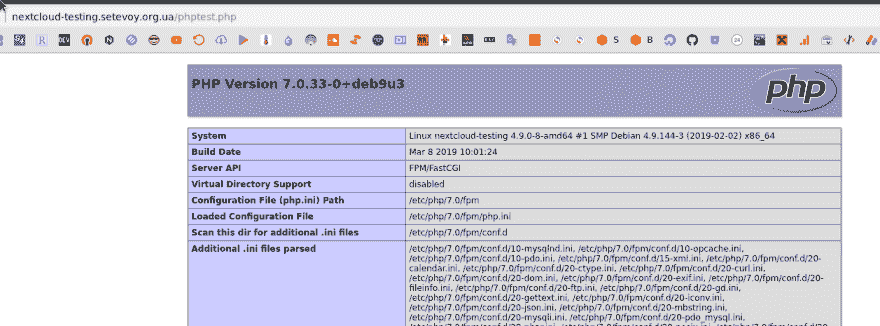](https://rtfm.co.ua/wp-content/uploads/2019/03/Screenshot_20190317_142931.png)

更改目录所有者:

```
root@nextcloud-testing:~# chown -R www-data:www-data /var/www/html/
root@nextcloud-testing:~# chown -R www-data:www-data /data/nextcloud 
```

### MariaDB

安装 MariaDB 服务器:

```
root@nextcloud-testing:~# apt install -y mariadb-server 
```

同样——因为这是测试安装——您可以跳过下一步，但在实际安装中——执行`mysql_secure_installation` :

```
root@nextcloud-testing:~# mysql_secure_installation 
```

现在，只需连接到 MySQL 并为其设置和用户创建 NextCloud 的数据库:

```
root@nextcloud-testing:~# mysql
...
MariaDB [(none)]> 
```

创建数据库:

```
MariaDB [(none)]> create database nextcloud;
Query OK, 1 row affected (0.00 sec) 
```

此数据库的用户和权限:

```
MariaDB [(none)]> grant all privileges on nextcloud.* to 'nextcloud'@'localhost' identified by 'password';
Query OK, 0 rows affected (0.00 sec) 
```

退出并检查用户是否可以访问数据库:

```
root@nextcloud-testing:~# mysql -u nextcloud -ppassword -e 'show databases'
+--------------------+
| Database           |
+--------------------+
| information_schema |
| nextcloud          |
+--------------------+ 
```

### NextCloud 安装

下载安装程序:

```
root@nextcloud-testing:~# cd  /var/www/html/nextcloud-testing.setevoy.org.ua/
root@nextcloud-testing:/var/www/html/nextcloud-testing.setevoy.org.ua# wget https://download.nextcloud.com/server/installer/setup-nextcloud.php
--2019-03-17 12:36:14--  https://download.nextcloud.com/server/installer/setup-nextcloud.php
...
2019-03-17 12:36:14 (4.90 MB/s) - ‘setup-nextcloud.php’ saved [148203/148203] 
```

在浏览器中打开`setup-nextcloud.php`文件:

[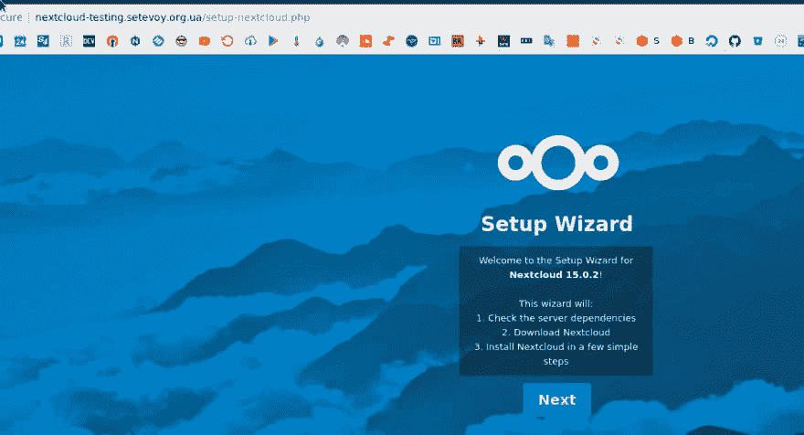](https://rtfm.co.ua/wp-content/uploads/2019/03/Screenshot_20190317_143711.png)

并开始安装过程——这里只需将安装点设置到`/var/www/html/nextcloud-testing.setevoy.org.ua/`目录:

[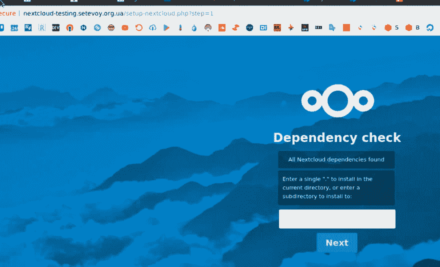](https://rtfm.co.ua/wp-content/uploads/2019/03/Screenshot_20190317_144049.png)

[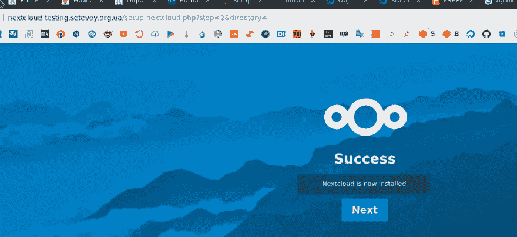](https://rtfm.co.ua/wp-content/uploads/2019/03/Screenshot_20190317_144111.png)

检查文件:

```
root@nextcloud-testing:/var/www/html/nextcloud-testing.setevoy.org.ua# ls -l
total 444
drwxr-xr-x 32 www-data www-data   4096 Mar 17 12:41 3rdparty
drwxr-xr-x 38 www-data www-data   4096 Mar 17 12:41 apps
-rw-r--r--  1 www-data www-data  12063 Mar 17 12:41 AUTHORS
...
drwxr-xr-x  2 www-data www-data   4096 Mar 17 12:41 updater
-rw-r--r--  1 www-data www-data    362 Mar 17 12:41 version.php 
```

添加新用户，设置数据目录(`/data/nextcloud`)，以及 MySQL 连接详情:

[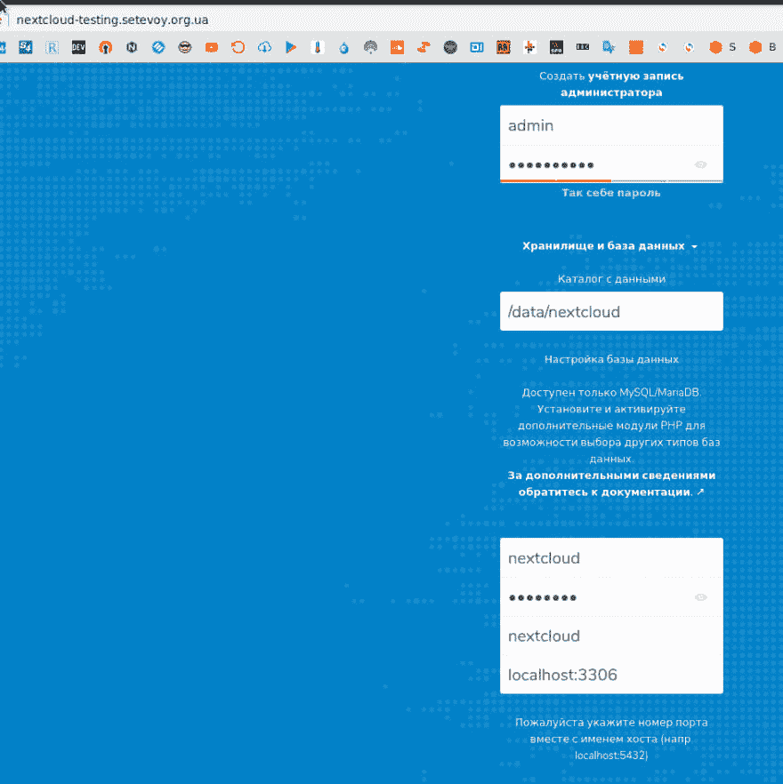](https://rtfm.co.ua/wp-content/uploads/2019/03/Screenshot_20190317_144940.png)

就绪:

[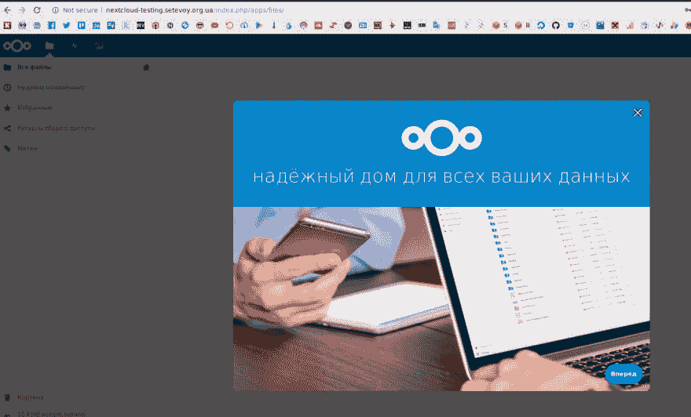](https://rtfm.co.ua/wp-content/uploads/2019/03/Screenshot_20190317_145204.png)

### Arch Linux 上的 NextCloud 客户端

安装客户端:

```
$ sudo pacman -S nextcloud-client 
```

或者来自 AUR 的另一个版本(没注意到任何不同)

```
$ yay -S nextcloud-client-git 
```

运行它-`nextcloud`:

[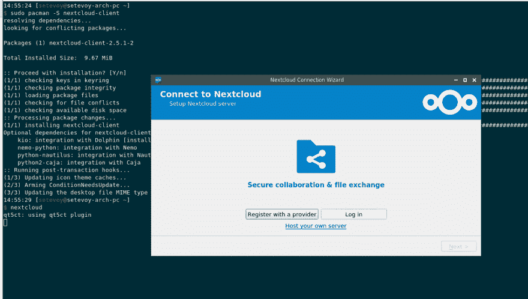](https://rtfm.co.ua/wp-content/uploads/2019/03/Screenshot_20190317_145603.png)

连接并登录:

[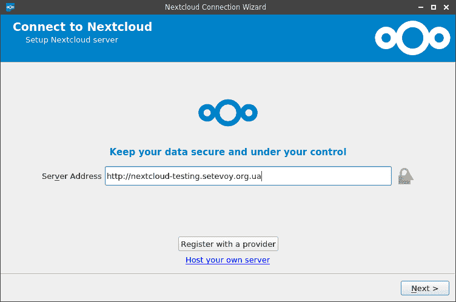](https://rtfm.co.ua/wp-content/uploads/2019/03/Screenshot_20190317_145654.png)

[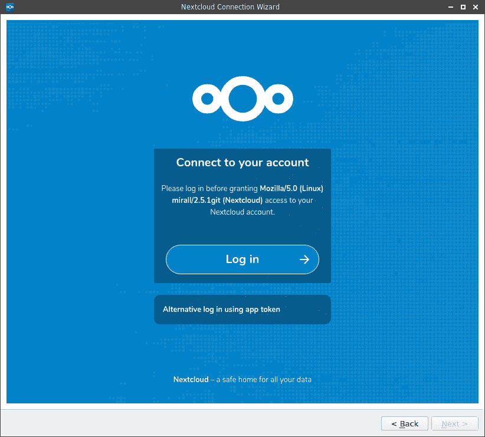](https://rtfm.co.ua/wp-content/uploads/2019/03/Screenshot_20190317_145714.png)

[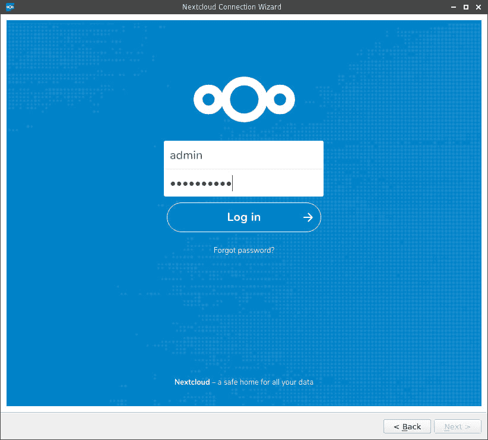](https://rtfm.co.ua/wp-content/uploads/2019/03/Screenshot_20190317_145732.png)

[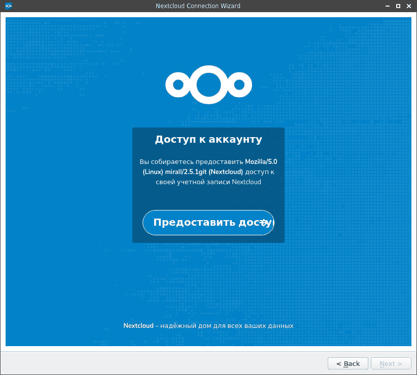](https://rtfm.co.ua/wp-content/uploads/2019/03/Screenshot_20190317_145743.png)

设置连接和同步设置(可以保留默认值):

[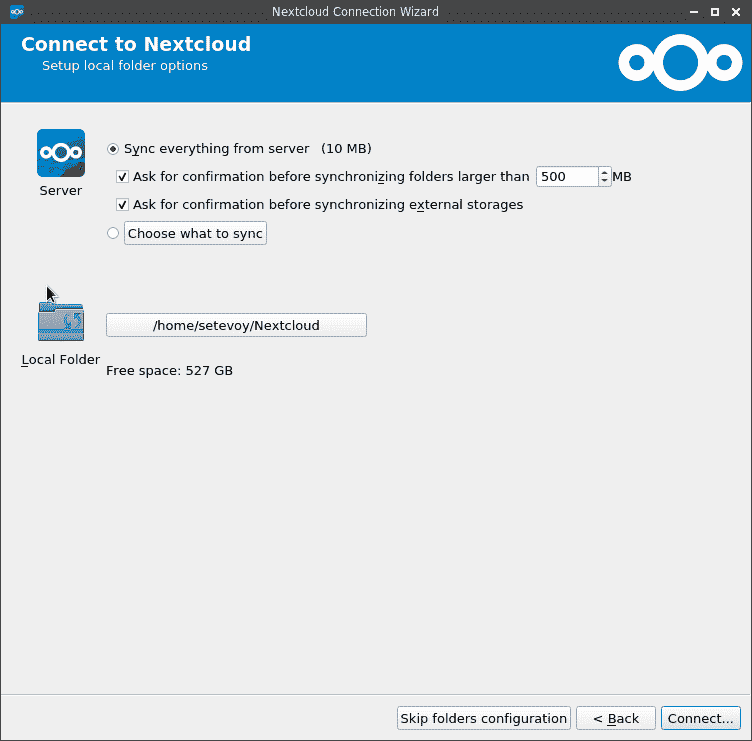](https://rtfm.co.ua/wp-content/uploads/2019/03/Screenshot_20190317_152609.png)

按下*连接*:

[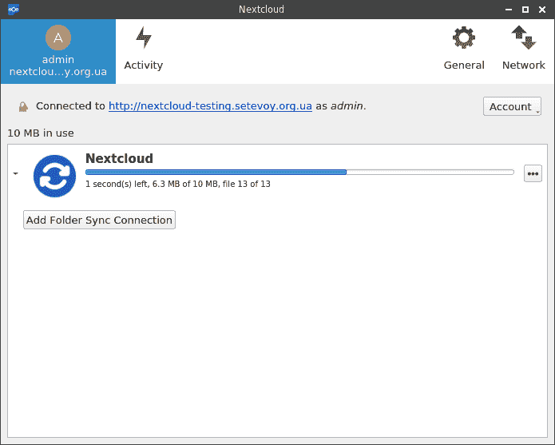](https://rtfm.co.ua/wp-content/uploads/2019/03/Screenshot_20190317_152651.png)

[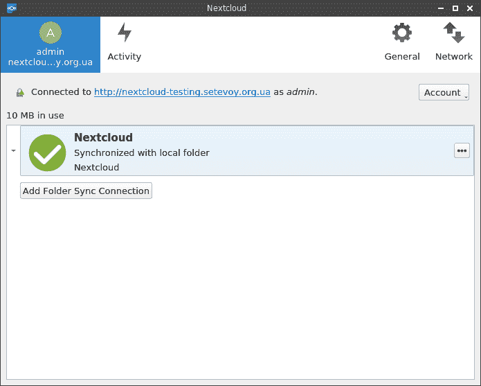](https://rtfm.co.ua/wp-content/uploads/2019/03/Screenshot_20190317_152712.png)

这是您的主目录中的`Nextcloud`目录:

[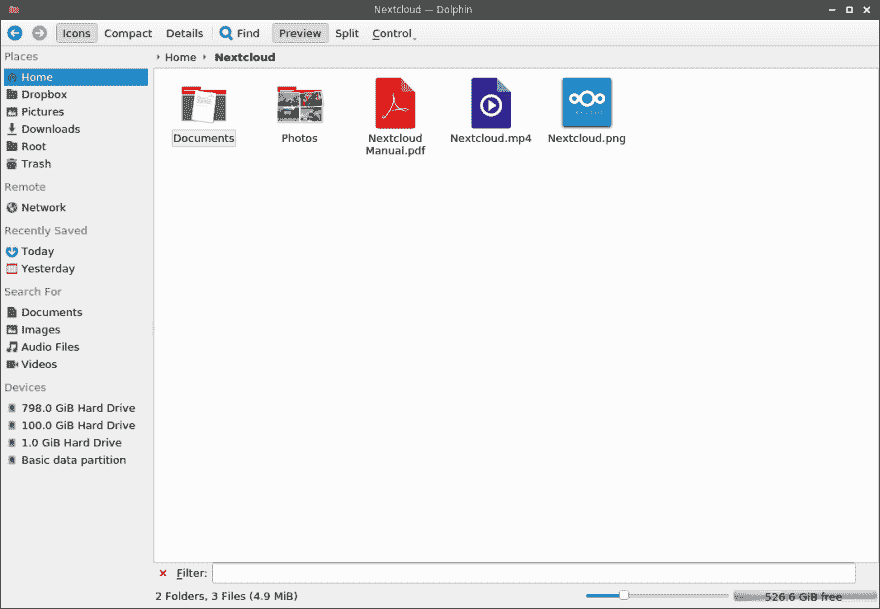](https://rtfm.co.ua/wp-content/uploads/2019/03/Screenshot_20190317_152727.png)

通过 WebUI 的数据:

[](https://rtfm.co.ua/wp-content/uploads/2019/03/Screenshot_20190317_152827.png)

### NextCloud 手机客户端

对于使用 Google Play 的 Android 安装:

[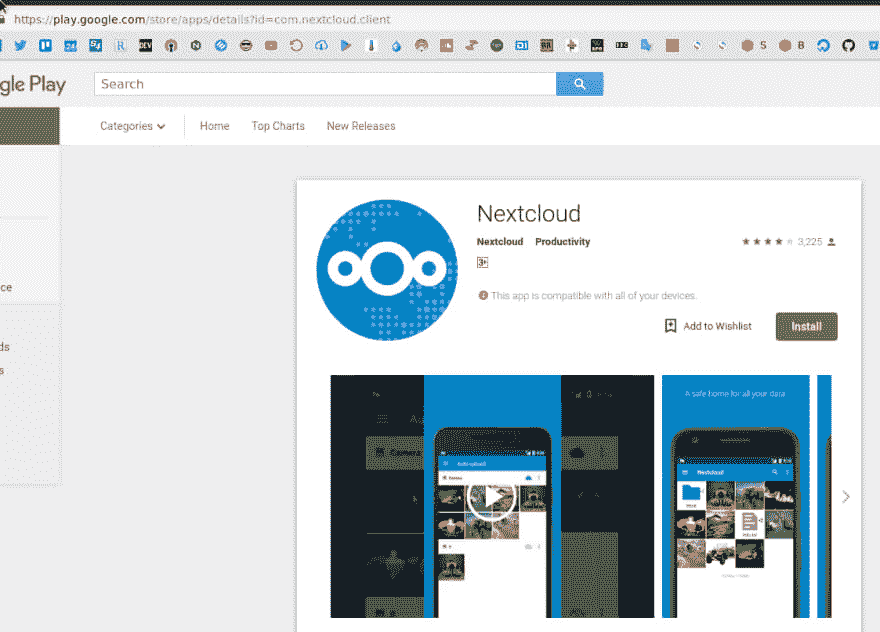](https://rtfm.co.ua/wp-content/uploads/2019/03/Screenshot_20190317_153837.png)

以及相同的连接和登录步骤:

[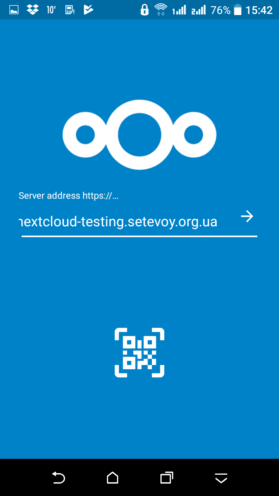](https://rtfm.co.ua/wp-content/uploads/2019/03/Screenshot_20190317-154241.png)

[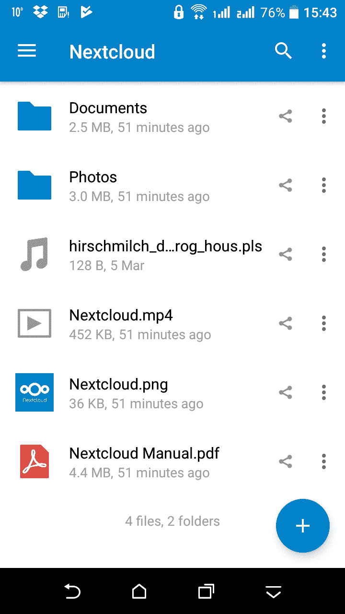](https://rtfm.co.ua/wp-content/uploads/2019/03/Screenshot_20190317-154348.png)

我不会使用日历和其他 NextCloud 的功能，只是数据同步。

数据将存储在`/data/nextcloud/%USERNAME%/files` :
中

```
root@nextcloud-testing:~# find /data/ -name Nextcloud.png
/data/nextcloud/admin/files/Nextcloud.png 
```

完成了。

### 类似的帖子

([【https://rtfm.co.ua/nginx-dinamicheskij-upstream/】](https://rtfm.co.ua/nginx-dinamicheskij-upstream/))<small>(0)</small>

*   <small>02/15/2016</small>[Debian:установкаLEMP–NGINX+PHP-FPM+Maria db](https://rtfm.co.ua/debian-ustanovka-lamp-nginx-php-fpm-mariadb/)<small>(0)</small>
*   T005/16/2018 t1t2aws:在本地和不同主机上测试 NGINX、PHP-FMP 和 MariaDB 性能
*   <small>03/23/2017</small>[engine:用户代理](https://rtfm.co.ua/draft-nginx-ban-user-agent/)<small>【0】</small>