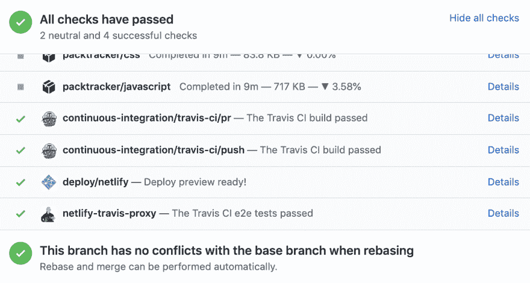

# e2e 测试网络部署预览

> 原文：<https://dev.to/kontrollanten/e2e-testing-previews-with-netlify-travis-integration-3jop>

当在我的副业项目中工作时，我发现获得一个直接的测试过程非常重要；由于项目可以几个月不动，我想确保当我推出新代码时一切正常。通常我使用网络来部署我的站点；它是免费的(开源计划)，很容易与 GitHub 集成，它给我[部署预览](https://www.netlify.com/blog/2016/07/20/introducing-deploy-previews-in-netlify/)每个拉请求。

由于 e2e 测试是关于尽可能接近“真实”环境，我希望我的测试在 Netlifys 部署预览上运行，而不是在 [serve](https://www.npmjs.com/package/serve) 或其他本地服务器设置上运行(实际上我已经发现了只在 Netlifys 产品中产生的错误)。

Netlify 正在通过监听新的 PR 来创建部署预览。我认为可以从 CLI 部署预览，然后等待响应来运行我的 e2e 测试。大概是:

```
yarn netlify deploy && yarn e2e 
```

但是似乎没有办法从 [Netlifys REST API](https://www.netlify.com/docs/api/) 部署预览，用他们的[传入 webhooks](https://www.netlify.com/docs/webhooks/#incoming-webhooks) 也是不可能的，所以我必须想出一个替代的方法。

## 借助 AWS Lambda 在网络和 CI 环境之间架起桥梁

为了解决我的问题，我添加了一个[出站 webhook](https://www.netlify.com/docs/webhooks/#outgoing-webhooks-and-notifications) ，它在部署成功时调用一个 URL。我将 webhook 指向一个自定义的 AWS Lambda 函数，我称之为[netlify-Travis-integration](https://github.com/kontrollanten/netlify-travis-integration)。netlify-travis-integration 从有效负载中读取部署预览 URL，并触发一个 travis 作业来运行 e2e 测试。

### 特拉维斯配置

由于我无法找到运行特定 Travis 作业的方法，我不得不通过检查构建是否由 API 触发来区分我的非净需求作业和净需求作业:

```
jobs:
  include:
    - stage: lint
      if: type != api
      script: yarn lint
    - stage: test
      if: type != api
      script: yarn test:ci && codecov
    - stage: packtracker
      if: type != api
      script: yarn build
    - stage: lighthouse
      if: type = api
      script: yarn lh -- --perf=96 --bp=96 --no-comment $SITE_URL
    - stage: e2e
      if: type = api
      script: yarn e2e 
```

这有点难看，但是我在使用 Travis 的时候找不到更好的解决方法。我认为用 CircleCI 更容易解决这个问题，所以我更愿意在我的下一个项目中选择它。

### GitHub 状态

为了跟踪我的 e2e 测试，我在 Travis 配置中添加了一个 webhook，让它调用另一个 AWS Lambda 函数。该函数检查 Travis 作业是否由 API 触发，然后创建一个拉请求状态。

[](https://res.cloudinary.com/practicaldev/image/fetch/s--f84yt7ou--/c_limit%2Cf_auto%2Cfl_progressive%2Cq_auto%2Cw_880/https://thepracticaldev.s3.amazonaws.com/i/bswhhh9zgj43zphlwdu3.png)

## 结论

一年后，我收到了 100 个拉取请求，我对这个解决方案很满意，它捕获了很多我错过的错误。特别是当使用[revenue](https://renovatebot.com)创建依赖关系更新的 PR 时，会很舒服，然后很容易发现是否有东西坏了。

## 前进的道路

我创建 netlify-travis-integration 只是为了解决我遇到的一个问题，但如果有其他人想解决同样的问题，那么设置起来就不那么容易了；您需要创建一个 AWS 帐户，设置 AWS 权限，配置 Travis 和 Netlify，还需要创建一个 GitHub API 令牌。它应被视为概念证明。也许我会采取下一步措施，让它更容易与新项目集成。

你是如何解决这个问题的？您只是在本地 web 服务器上运行 e2e 测试吗？

[netlify-Travis-integration](https://github.com/kontrollanten/netlify-travis-integration)