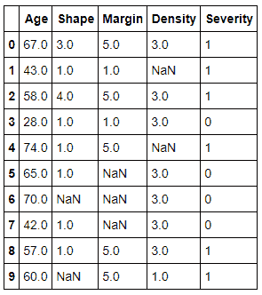
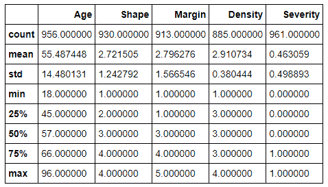
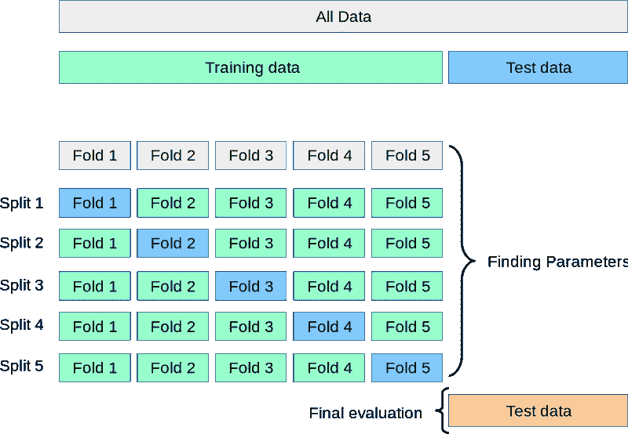

# 从零开始分类——乳腺 x 线肿块分类

> 原文：<https://dev.to/apoorvadave/classification-from-scratchmammographic-mass-classification-3dg7>

在我们的上一篇文章中，我们从理论上讨论了分类技术。是时候玩代码了😉在我们开始编码之前，需要在我们的系统中安装以下库:

1.  熊猫:pip 安装熊猫
2.  Numpy: pip 安装 Numpy
3.  scikit-learn: pip 安装 scikit-learn

这里的任务是使用不同的分类算法，包括 SVM、逻辑回归和决策树，将乳房 x 线照相肿块分类为良性或恶性。良性肿瘤是指肿瘤没有侵犯其他组织，而恶性肿瘤会扩散。乳房 x 线照相术是目前乳腺癌筛查最有效的方法。

# 数据集

本项目中使用的数据集是“乳房 x 线检查肿块”,这是来自 https://archive.ics.uci.edu/ml/datasets/Mammographic+Mass UCI 存储库的公共数据集

它可用于根据 BI-RADS 属性和患者年龄来预测乳房造影肿块的严重程度(良性或恶性)。属性数量:6 (1 个目标域:严重性，1 个非预测性:BI-RADS，4 个预测性属性)

属性信息:

1.  BI-RADS 评估:1 到 5(顺序)
2.  年龄:患者的年龄(整数)
3.  形状(块状):圆形=1，椭圆形=2，小叶形=3，不规则形=4(标称)
4.  边缘(质量边缘):限定=1，微叶状=2，模糊=3，模糊=4，针状=5(名义)
5.  密度(质量密度):高=1，iso=2，低=3，含脂肪=4(序数)
6.  严重性:良性=0 或恶性=1(二项式)

[](https://res.cloudinary.com/practicaldev/image/fetch/s--4FNkydqW--/c_limit%2Cf_auto%2Cfl_progressive%2Cq_auto%2Cw_880/https://thepracticaldev.s3.amazonaws.com/i/cn6amlps6lidookm48eq.png) 

<figure>

<figcaption>数据集前 10 行截图</figcaption>

</figure>

所以我们谈了很多背后的理论。建立分类模型相当简单。按照下面的步骤，在一个小时内得到你自己的模型😃所以让我们开始吧！

# 接近

创建一个新的 IPython 笔记本，插入下面的代码来导入必要的模块。如果您遇到任何错误，请使用 pip 安装必要的软件包。

```
import numpy as np
import pandas as pd
from sklearn import model_selection
from sklearn.preprocessing import StandardScaler
from sklearn import tree
from sklearn import svm
from sklearn import linear_model 
```

Enter fullscreen mode Exit fullscreen mode

使用 pandas 将数据读入数据帧。要检查数据集的前 5 行，使用`df.head()`。如果您想检查不同的行数，可以将行数指定为该函数的一个参数。BI-RADS 属性在数据集中被指定为非预测属性，因此不会被考虑在内。

```
input_file = 'mammographic_masses.data.txt'
masses_data = pd.read_csv(input_file,names =['BI-RADS','Age','Shape','Margin','Density','Severity'],usecols = ['Age','Shape','Margin','Density','Severity'],na_values='?')
masses_data.head(10) 
```

Enter fullscreen mode Exit fullscreen mode

您可以获得数据的描述，如计数值、平均值、标准偏差等，如`masses_data.describe()`

[](https://res.cloudinary.com/practicaldev/image/fetch/s--G6TmJubL--/c_limit%2Cf_auto%2Cfl_progressive%2Cq_auto%2Cw_880/https://thepracticaldev.s3.amazonaws.com/i/qr6b8ntw2ebstb03e5fz.png)

正如您可能已经观察到的，数据集中有丢失的值。处理缺失数据是数据预处理中非常重要的事情。我们根据数据分析使用列的平均值或模式来填充空值。为了简单起见，到目前为止，您可以从数据中删除空值。

```
masses_data = masses_data.dropna()
features = list(masses_data.columns[:4])
X = masses_data[features].values
print(X)
labels = list(masses_data.columns[4:])
y = masses_data[labels].values
y = y.ravel()
print(y) 
```

Enter fullscreen mode Exit fullscreen mode

向量`X`包含除目标变量之外的第 1 至第 4 列的输入特征。他们的值将用于培训。目标变量即严重性存储在向量`y`中。

缩放输入要素以在特定范围内归一化数据。这里我们使用的是`StandardScaler()`，它将数据转换为平均值 0 和标准偏差 1。

```
scaler  = StandardScaler()
X = scaler.fit_transform(X)
print(X) 
```

Enter fullscreen mode Exit fullscreen mode

使用`train_test_split`创建训练和测试集。25%的数据用于测试，75%用于训练。

```
X_train, X_test, y_train, y_test = model_selection.train_test_split(X, y, test_size=0.25, random_state=0) 
```

Enter fullscreen mode Exit fullscreen mode

为了从训练集构建决策树分类器，我们只需要使用函数`DecisionTreeClassifier()`,它有一定数量的参数，您可以在 scikit-learn 文档中找到这些参数。现在，我们将只使用每个参数的默认值。使用测试输入特性`X_test`上的`predict()`获得预测值`y_pred`。函数`score()`可直接用于计算测试样本的预测精度。

```
clf = tree.DecisionTreeClassifier(random_state=0)
clf = clf.fit(X_train,y_train)
y_pred = clf.predict(X_test)
print(y_pred)
clf.score(X_test, y_test) 
```

Enter fullscreen mode Exit fullscreen mode

没有任何调整的`DecisionTreeClassifier()`给出了大约 77%的结果，我们可以说这不是最差的。

为了构建 SVM 分类器，scikit-learn 提供的类包括 SVC、NuSVC 和 LinearSVC。我们将使用 SVC 类和线性核构建一个分类器。(要了解带线性内核的 SVC 和 LinearSVC 的区别，可以去链接—[https://stack overflow . com/questions/45384185/what-is-the-difference-between-linear SVC-and-svckernel-linear/45390526](https://stackoverflow.com/questions/45384185/what-is-the-difference-between-linearsvc-and-svckernel-linear/45390526))

```
svc = svm.SVC(kernel='linear', C=1)
scores = model_selection.cross_val_score(svc,X,y,cv=10)
print(scores)
print(scores.mean()) 
```

Enter fullscreen mode Exit fullscreen mode

在这一节中，我试图向您展示一种创建分类器的不同方法。使用训练集上的 SVC 类创建了`svc`分类器对象。`cross_val_score()`函数使用交叉验证方法评估分数。交叉验证用于避免任何类型的过度拟合。k 倍交叉验证意味着 k-1 倍的数据用于训练，1 倍用于测试。使用该方法获得的分数约为 79.5%

[](https://res.cloudinary.com/practicaldev/image/fetch/s--WM9hTfuv--/c_limit%2Cf_auto%2Cfl_progressive%2Cq_auto%2Cw_880/https://thepracticaldev.s3.amazonaws.com/i/t5dc1k361cgf6zm18kh0.png) 

<figure>

<figcaption>交叉验证(来源:[https://sci kit-learn . org/stable/modules/Cross _ Validation . html](https://scikit-learn.org/stable/modules/cross_validation.html))</figcaption>

</figure>

类似于决策树分类器，我们也可以创建逻辑回归分类器。使用功能`LogisticRegression()`。分类器适用于训练集，并类似地用于预测测试集的目标值。它给出了 80.5%的平均分数

```
clf = linear_model.LogisticRegression(C=1e5)
clf = clf.fit(X_train, y_train)
y_pred = clf.predict(X_test)
scores = model_selection.cross_val_score(clf,X,y,cv=10)
print(scores)
print(scores.mean()) 
```

Enter fullscreen mode Exit fullscreen mode

因此，如果我们想构建一个单一的分类器，我们可以只用 10 行代码就可以完成😄。不费吹灰之力，我们就达到了 80%的准确率。您可以创建自己的分类模型(有很多选项)或对其中任何一个进行微调。如果你感兴趣，你也可以尝试一下人工神经网络😍。对我来说，我用人工神经网络得到了 84%的最佳准确率。要获得完整的代码，请使用这个[链接](https://github.com/apoorva-dave/MammographicMassClassification)

如果你喜欢这篇文章，一定要展示一些❤，请继续关注！在那之前，祝你学习愉快😸