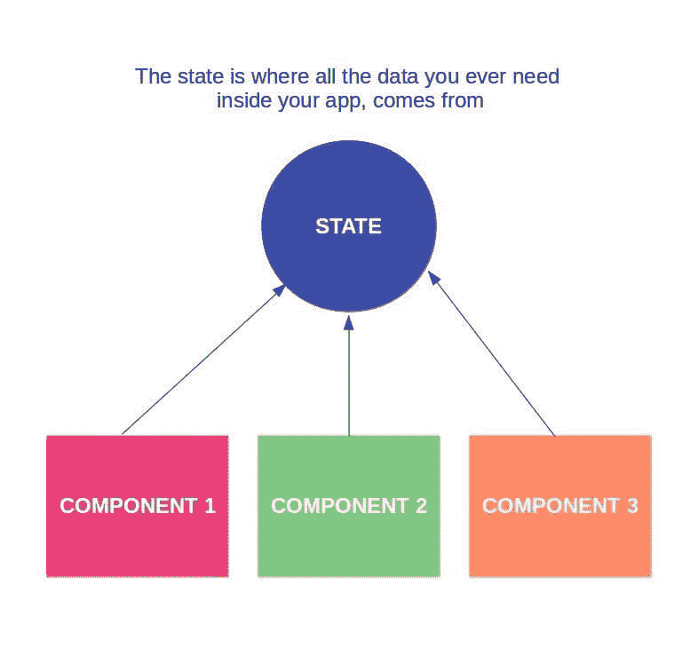
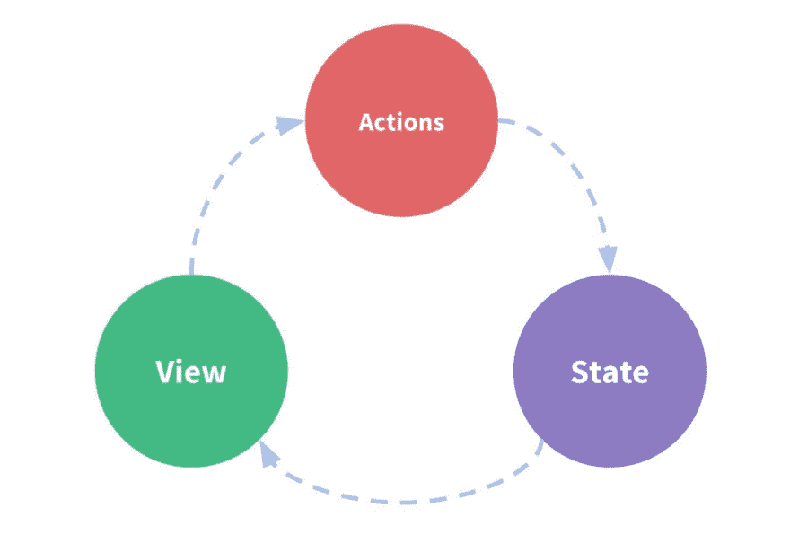

# Vuex 快速指南

> 原文：<https://dev.to/iamhabbeboy/quick-guide-to-vuex-201e>

[](https://res.cloudinary.com/practicaldev/image/fetch/s---kKf1JnT--/c_limit%2Cf_auto%2Cfl_progressive%2Cq_auto%2Cw_880/https://thepracticaldev.s3.amazonaws.com/i/eaq24yis2zpben743veo.png)

Vuex 是一个开发用来管理 Vue app 中数据状态的包。换句话说，Vuex 管理我们在应用程序中需要的所有数据。

## 先决条件

*   对 Vue 的基本了解
*   对 REST API 的基本理解

## vuex 是什么？

> Vuex 是 Vue.js 应用程序的状态管理模式+库。它充当应用程序中所有组件的集中存储，规则确保状态只能以可预测的方式变化。

## 为什么要用？

*   最佳实践
*   单一数据集中化
*   干(不重复)
*   更容易维护和修改现有代码

[](https://res.cloudinary.com/practicaldev/image/fetch/s--Da2guPVr--/c_limit%2Cf_auto%2Cfl_progressive%2Cq_auto%2Cw_880/https://thepracticaldev.s3.amazonaws.com/i/8awcjj907dalay1uw4er.jpeg)

## 如何？

这个简单的插图会让你想到 Vuex。

假设你有一个调用端点进行 CRUD(创建、读取、更新、删除)操作的应用程序，记住传统的方法是用 **axios** 或 **fetch** 直接在你的应用程序中使用端点，然后你得到一个响应并继续前进，

但是，如果我们需要在另一个页面上调用同一个端点，这就是 Vuex 的用武之地，传统的方法会发出两次请求，但是用 Vuex；数据将从第一个实例开始存储，以后可以在其他视图或组件上多次使用。

## Vuex 常用术语

Vuex 包含一些容易混淆的术语；它们包括:

[](https://res.cloudinary.com/practicaldev/image/fetch/s--cwUfOvjN--/c_limit%2Cf_auto%2Cfl_progressive%2Cq_auto%2Cw_880/https://thepracticaldev.s3.amazonaws.com/i/l769al4al16dq4mq5oth.jpeg)

*   吸气剂
*   变化
*   行动
*   状态
*   地图状态

**状态:**这是一个 JavaScript 对象，包含一个变量列表，用于处理来自突变
的响应

```
 state: {
  users: [],
  blogs: [],
} 
```

Enter fullscreen mode Exit fullscreen mode

**Getters:** 用于过滤特定状态下的数据

```
 findBlogById: (state, getters) => (id) => {
  return state.blogs.find(blog => blog.id == id);
} 
```

Enter fullscreen mode Exit fullscreen mode

**动作:**这用于使用 axios 或 fetch 发出请求，就像常规方法一样。

```
 axios.get('/api/blog')
.then(res => {
   commit("LOAD_BLOGS", res.data)
}) 
```

Enter fullscreen mode Exit fullscreen mode

**MapState:** 这在 Vue 计算属性中使用，以便可以在模板/视图中访问所需的状态。

```
 computed: {
  ...mapState(['blogs']),
}

//OR 

computed: mapState(['blogs']), 
```

Enter fullscreen mode Exit fullscreen mode

```
<div v-if="blogs">
   <div v-for="(value, index) of blogs">
      <h1> {{value.title}} </h1>
      <p> {{value.body}} </p>
   </div>
</div> 
```

Enter fullscreen mode Exit fullscreen mode

**突变:**这些与事件非常相似，它们允许状态被动作的响应所修改。

```
//fetching blogs

LOAD_BLOGS(state, blogFromAction) {
   state.blogs = blogFromAction
} 
```

Enter fullscreen mode Exit fullscreen mode

```
//adding new blog

ADD_BLOG(state, payloadFromForm) {
    state.blogs.unshift(payloadFromForm);
} 
```

Enter fullscreen mode Exit fullscreen mode

[](https://res.cloudinary.com/practicaldev/image/fetch/s--Ay5GJZ6S--/c_limit%2Cf_auto%2Cfl_progressive%2Cq_auto%2Cw_880/https://thepracticaldev.s3.amazonaws.com/i/3voad8jzvq3xbeigwncs.jpeg)

## 但我还是不明白

如果你仍然不明白，这里有一个[链接](https://github.com/iamhabbeboy/quick-guide-to-vuex)到一个简单的博客，它使用【https://jsonplaceholder.typicode.com】[作为端点。](https://jsonplaceholder.typicode.com)

### 谢谢