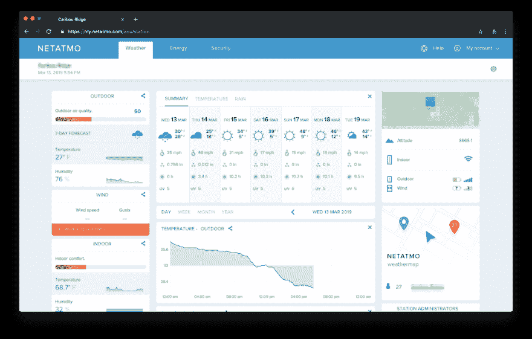
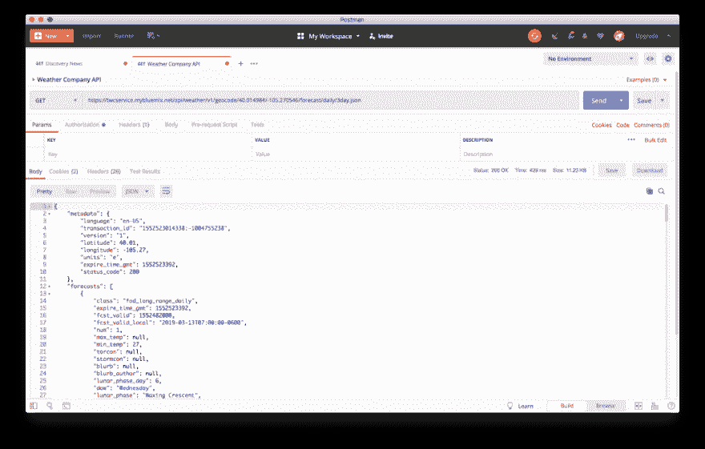
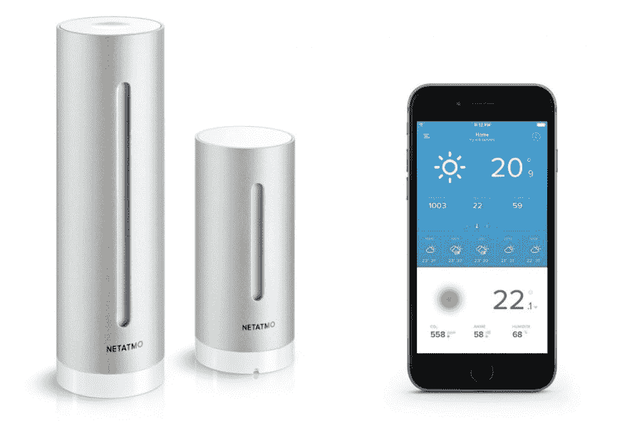
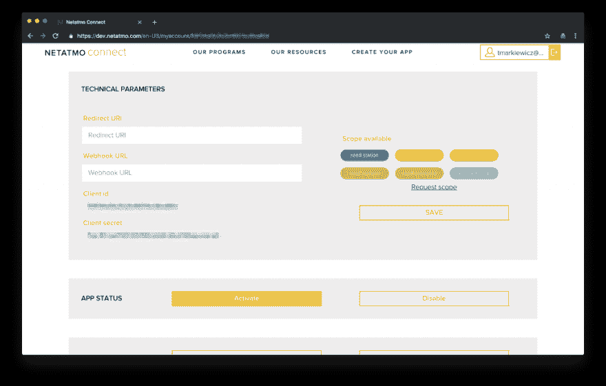

# 如何在 Ruby 上使用气象公司数据和 Netatmo

> 原文：<https://dev.to/ibmdeveloper/how-to-use-weather-company-data-and-netatmo-with-ruby-2igj>

虽然天气信息对许多企业来说至关重要，但更个人化、更实用的当地天气数据也同样重要。自从我最近搬到一个有着相当极端天气的地区，我发现自己比以前更多地监测和测量当地的条件。冬天的阵风经常超过每小时 50 英里，这不仅仅是一个学术兴趣。安全(人身和财产)是一个重要问题。

除了风，我还是个滑雪爱好者，所以我总是对天气预报中的降雪量感兴趣。出于某种原因，这并不经常在大多数流行的天气应用程序中一目了然地显示出来，所以我对构建一些简单的东西来跟踪我的当地天气以及根据我的兴趣定制的预报感兴趣。

为了监测天气，我家最近增加了一个 [Netatmo 智能家庭气象站](https://www.netatmo.com/en-us/weather)，它带有一个[测风模块](https://www.netatmo.com/en-us/weather/weatherstation/accessories#windgauge)。虽然 Netatmo 提供了一个应用程序和 web 仪表板来查看您的所有数据，但有时这有点多，尤其是当我只对几个测量值感兴趣时。你可以在这里看到他们仪表板[的演示应用。此外，它们还提供了与 Alexa 和 IFTTT 的完美集成，这样你就可以将天气监测整合到家庭自动化系统中。](https://my.netatmo.com/app/station?demomode=true)

[](https://res.cloudinary.com/practicaldev/image/fetch/s--TqUgzge5--/c_limit%2Cf_auto%2Cfl_progressive%2Cq_auto%2Cw_880/https://tmarkiewicz.com/wp-content/uploads/2019/03/netatmo-dashboard-1024x653.png)

因为我的邻居经常发短信给我，问我气象站在特别糟糕的夜晚测得的阵风是多少(嘿，自己去买吧！)，我认为使用 [Netatmo API](https://dev.netatmo.com/en-US/resources/technical/reference/weatherapi) 来探索我记录的数据以及检查它如何与带有预报的精确天气 API 相对应会很有趣。

有许多流行的免费或低价天气数据 API，但由于 IBM 拥有[天气公司](https://www.ibm.com/weather)，我认为这将是一个合理的起点，也是一种有趣的实验天气数据的方式。

IBM 在 2016 年收购了 Weather Company，并通过 IBM Cloud 提供其天气数据作为 API。来自 IBM:

> 气象公司是 IBM 的一项业务，通过将世界上最准确的天气数据与行业领先的人工智能、物联网(IoT)和分析技术相结合，为全球消费者和企业提供个性化的可操作见解。
> 
> 我们的解决方案为新闻播音员、飞行员、能源交易员、保险代理人、政府雇员、零售经理等提供了天气对其业务影响的洞察力，帮助他们做出更明智的决策，以提高安全性、降低成本和增加收入。

[气象公司 API](https://twcservice.mybluemix.net/rest-api/) 提供大量数据，包括每小时预报、每日预报、当天预报、当前状况、历史数据、天气警报、位置服务和年历服务。

[](https://res.cloudinary.com/practicaldev/image/fetch/s--Nus6Cqc_--/c_limit%2Cf_auto%2Cfl_progressive%2Cq_auto%2Cw_880/https://tmarkiewicz.com/wp-content/uploads/2019/03/IBM-Weather-Company.jpg)

这里，我将只使用 3 天的预报，但是 API 提供了从当天开始的未来 3、5、7 或 10 天的每日预报，包括白天和夜间时段的预报。

至于[定价](https://cloud.ibm.com/catalog/services/weather-company-data)，在一个免费计划中，你每分钟可以获得 10 个 API 调用，然后每个账户总共有 10，000 个调用。因此，免费计划不是永远免费的，一旦你达到 10，000 次通话的上限，你就必须开始付费。但是这对于测试、原型和爱好项目来说已经足够了。

在本文中，我将展示如何使用 [Ruby](https://www.ruby-lang.org/en/) 来访问和解析来自两个 API 的数据。在以后的文章中，我将研究如何构建一个基本的仪表板来监控您在 web 上感兴趣的数据(在我的例子中，阻止我的邻居问我！).

不过，要完成整个演示，你需要一个真实的 Netatmo 设备和帐户，因为它们不提供任何[演示密钥、产品或沙盒](https://dev.netatmo.com/resources/technical/support/helpcenter)。

完整的教程演练和回购可以在 Github 上找到这里:[https://github.com/tmarkiewicz/weather-ruby](https://github.com/tmarkiewicz/weather-ruby)我会强调下面的一些关键步骤。

### 初始设置

从教程 repo 可以看出，我在 Mac 上用的是 Ruby。OS X 安装了 Ruby，但是你可以使用这个命令来检查你的版本:

```
ruby -v 
```

如果你想升级(或者安装多个版本的 Ruby)，我推荐使用 [Ruby 版本管理器(RVM)](https://rvm.io/) 。

下一步是从 Github 克隆 repo，然后运行 bundler:

```
$ git clone https://github.com/tmarkiewicz/weather-ruby
$ cd weather-ruby 
```

然后你需要使用[捆绑器](https://bundler.io/)红宝石:
安装所需的红宝石

```
$ gem install bundler
$ bundle install 
```

Ruby 中的教程代码示例可以通过以下语法从命令行运行:

```
$ ruby filename.rb 
```

接下来的两节概述了如何将本教程用于天气公司数据和 Netatmo。

### 天气公司

要访问气象公司数据 API，您需要一个 IBM Cloud 帐户。我的[教程](https://github.com/tmarkiewicz/weather-ruby)详细概述了这个过程，但是必要的步骤是:

*   注册 [IBM 云](https://cloud.ibm.com)
*   添加[气象公司数据](https://cloud.ibm.com/catalog/services/weather-company-data)作为新服务
*   选择免费计划
*   选择添加凭据，然后查看凭据的 JSON
*   将这些凭据添加到 app 目录下的. env 文件中

顺便提一下，这里有一个很好的使用 Ruby 环境变量的指南。在教程里，我也用这个红宝石宝石:【https://github.com/bkeepers/dotenv

下一步是进行测试 API 调用。我喜欢总是从 curl 或 [Postman](https://www.getpostman.com/) 应用程序开始测试任何 API 凭证、API 端点的构造，当然还有结果:

[](https://res.cloudinary.com/practicaldev/image/fetch/s--oxTgIKcZ--/c_limit%2Cf_auto%2Cfl_progressive%2Cq_auto%2Cw_880/https://tmarkiewicz.com/wp-content/uploads/2019/03/postman-weather-company-data-api-1024x653.png) 从[天气公司数据 API 文档](https://twcservice.mybluemix.net/rest-api/)中，我们可以构建 URL 来请求检索特定纬度和经度的 3 天天气预报，如下所示:

`https://twcservice.mybluemix.net/api/weather/v1/geocode/40.014984/-105.270546/forecast/daily/3day.json`

在上面的 URL 中，将纬度/经度替换为您想要检索天气数据的位置的纬度/经度。在[LatLong.net](https://www.latlong.net/)可以找到一个查找您的纬度和经度的绝佳地点。

现在我们有了所有的需求，我们可以从命令行运行主文件:

```
$ ruby weather-company.rb 
```

输出会是这样的:

```
Forecast for Friday, February 22, 2019:
Periods of snow. Lows overnight in the upper teens.
1 to 3 inches of snow expected.
Snow this evening will give way to lingering snow showers late. Low 19F. Winds light and variable. Chance of snow 80%. Snow accumulating 1 to 3 inches. 
```

### Netatmo

正如我上面提到的，这部分教程只有在您已经有一个或多个 Netatmo 设备的情况下才可用。如果你正在寻找一个具有 API 访问的全功能气象站，我强烈推荐他们的系统，因为它提供的所有功能都很实惠。

<figure>[](https://res.cloudinary.com/practicaldev/image/fetch/s--FEMCaHP5--/c_limit%2Cf_auto%2Cfl_progressive%2Cq_auto%2Cw_880/https://tmarkiewicz.com/wp-content/uploads/2019/03/Weather_Station_iPhone_6-FR_WEB-1-1024x691.jpg) 

<figcaption>图片来源:奥村正树、马里恩·勒弗劳尔和弗雷德·雷诺</figcaption>

</figure>

也就是说，您仍然可以继续完成本演示的剩余部分，如果/当您获得一台 Netatmo 设备时，您将知道去哪里获得一些分步说明。

关于来自 Netatmo 设备的数据，有一点需要注意:不幸的是，它们每十分钟才向服务器[发送测量值。从 Netatmo API 文档中:](https://dev.netatmo.com/resources/technical/guides/ratelimits)

> 不要试图每分钟都提取数据。Netatmo 气象站每十分钟向服务器发送一次测量数据。使用 Getstationsdata 方法从一个用户的所有设备中获取最近的测量值。

因此，虽然我更希望更频繁地获得一些数据(想到风速和阵风)，但在这种情况下，我们必须利用公司给我们的数据。不方便建立一个天气应用程序，但不是一个交易破坏者。

与天气公司部分一样，设置 Netatmo API 的完整步骤在 Github repo 中，但基本步骤如下:

*   如果您还没有，请创建一个 Netatmo 用户帐户
*   注册一个开发者账户
*   创建新的应用程序
*   复制新应用程序的凭据

[](https://res.cloudinary.com/practicaldev/image/fetch/s--r1swyoOs--/c_limit%2Cf_auto%2Cfl_progressive%2Cq_auto%2Cw_880/https://tmarkiewicz.com/wp-content/uploads/2019/03/netatmo-connect-dashboard-3-1024x653.png)

将客户端 id 和客户端机密凭据添加到。env 文件，然后可以从命令行运行 Netatmo 文件:

```
$ ruby netatmo.rb 
```

输出如下所示:

```
Time: 2019-03-12 14:19:50 -0600
Temperature: 50 deg F
Humidity: 45% 
```

就是这样！获取当地天气数据和预报的快捷方式。

### 总结

虽然这是一个关于如何通过 Weather Company 和 Netatmo 访问天气数据的介绍性教程，但在您的机器上本地运行之外是无法访问的。在以后的文章中，我将展示如何快速获取这些数据并将其部署到实际的应用程序中。一旦这样做了，我的邻居会很高兴，可能会停止给我发短信了解最新的风况！

如果你对在移动应用程序中使用天气数据感兴趣，看看这篇教程，教你如何[创建一个带有天气预报](https://ibm.biz/BdzFna)的移动应用程序。此外，看一看使用[无服务器方法气象地下](https://ibm.biz/BdzFnL)数据。